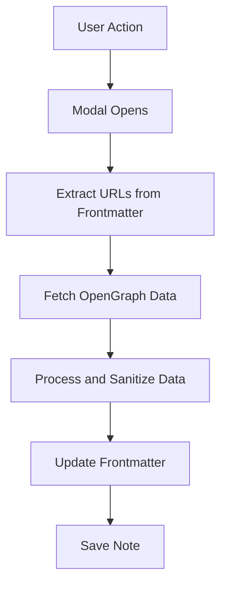

# Open Graph Fetcher Plugin Release "0.1.2"

## Overview
The Open Graph Fetcher is an Obsidian plugin that automatically fetches and embeds Open Graph metadata from URLs found in your notes. It enhances your note-taking workflow by automatically populating frontmatter with rich metadata, including titles, descriptions, and images from linked web pages.

## Why Care

We manage our site-wide content with Obsidian for ease of use and speed of development. We have a "toolkit" section (and subsections, as well as tag filters) for reviewing applications and web services. To make it more visually compelling, we use Open Graph data to display images and titles in our notes. 


We have been using scripts, and then filesystem observers, to try to fill Open Graph Data into the YAML of our files that are dedicated to a single website, media source, or service. It's been a pain, and we've gone in circles trying to get it right. 

This is a much better way to do it. It's more maintainable, and it's more reliable, and it has instant gratification to boot. 

In addition, we can give this Open Graph Fetcher plugin to the Obsidian community, and hopefully attract more developers with similar interests and goals. 

We will now use this plugin to fetch Open Graph data from a URL using OpenGraph.io.


***

## Key Features

### 1. Single File Processing
- Fetch Open Graph data for the current active note
- Configurable field name mappings
- Option to overwrite existing data
- Visual feedback during fetch operations

### 2. Batch Processing
- Process multiple files in a directory
- Filter files by modification date
- Skip files with existing Open Graph data
- Progress tracking and error reporting

### 3. Customizable Settings
- Configurable field names (e.g., `og_title` vs `title`)
- API key management for OpenGraph.io
- Adjustable timeouts and retry logic
- User interface theming options

## Architecture

### Data Flow


### Core Components
1. **Main Plugin** (`main.ts`)
   - Manages plugin lifecycle
   - Registers commands and settings
   - Handles API key management

2. **Modals**
   - `OpenGraphFetcherModal.ts`: Single file processing
   - `BatchOpenGraphFetcherModal.ts`: Batch processing interface

3. **Services**
   - `openGraphService.ts`: Handles API communication
   - `fileProcessor.ts`: Manages file operations
   - `settings.ts`: Manages plugin configuration

4. **Utilitiess**
   - `yamlFrontmatter.ts`: Handles YAML frontmatter operations, avoids needing to use standardized YAML libraries which may not use Obsidian nuanced frontmatter standards. 
   - `fileProcessor.ts`: Manages file operations
   - `settings.ts`: Manages plugin configuration

## Implementation Highlights

### Frontmatter Processing
```typescript
// Example of processing frontmatter with configurable field names
const processMetadata = (data: any, settings: PluginSettings) => {
  return {
    [settings.titleFieldName || 'og_title']: data.title,
    [settings.descriptionFieldName || 'og_description']: data.description,
    [settings.imageFieldName || 'og_image']: data.image,
    [settings.fetchDateFieldName || 'og_last_fetched']: new Date().toISOString()
  };
};
```

### Error Handling
```typescript
// Robust error handling with retry logic
async function fetchWithRetry(
  url: string, 
  options: RequestInit, 
  retries = 3, 
  delay = 1000
): Promise<Response> {
  try {
    const response = await fetch(url, options);
    if (!response.ok) throw new Error(`HTTP error! status: ${response.status}`);
    return response;
  } catch (error) {
    if (retries === 0) throw error;
    await new Promise(resolve => setTimeout(resolve, delay));
    return fetchWithRetry(url, options, retries - 1, delay * 2);
  }
}
```

## Usage Examples

### Basic Usage
1. Open a note containing a URL in its frontmatter
2. Run the command "Fetch Open Graph Data for Current File"
3. The plugin will fetch and inject metadata automatically

### Batch Processing
1. Run the command "Batch Process Directory for Open Graph Data"
2. Select target directory and processing options
3. Monitor progress in the status bar

## Configuration

### Available Settings
```typescript
interface PluginSettings {
  apiKey: string;
  titleFieldName: string;
  descriptionFieldName: string;
  imageFieldName: string;
  fetchDateFieldName: string;
  overwriteExisting: boolean;
  batchSize: number;
  requestDelay: number;
  maxRetries: number;
}
```

## Future Enhancements
- Support for additional metadata providers
- Custom field mapping UI
- Scheduled batch processing
- Enhanced error reporting and logging
- Support for additional image hosting services

## Dependencies
- OpenGraph.io API
- Obsidian API v1.8.10+
- TypeScript 4.9.5+
- Node.js 16.0.0+