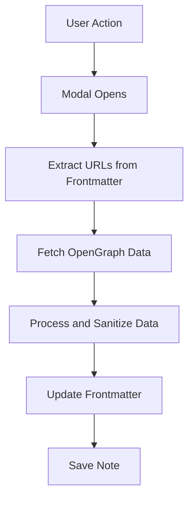

# Image Gin Obsidian Plugin Initialization
## Overview
Implemented the core settings infrastructure for the Image Gin Obsidian plugin, establishing a solid foundation for AI-powered image generation capabilities within Obsidian.

## Why Care
- Enables secure configuration of Recraft.ai API credentials
- Provides a user-friendly interface for managing image generation settings
- Sets the stage for future image generation features

## Key Features
- **Settings Management**
  - Added secure storage for Recraft API key and base URL
  - Implemented settings persistence using Obsidian's plugin API
  - Created a responsive settings UI with proper input validation
  - Added styles configuration with JSON editor for customizing image generation


- **Type Safety**
  - Defined TypeScript interfaces for plugin settings
  - Added proper type checking for image dimensions and configurations
  - Implemented default settings with type safety

- **Developer Experience**
  - Organized code with clear separation of concerns
  - Added comprehensive error handling
  - Set up proper module exports and imports

## Technical Details
- **Settings Interface**
  ```typescript
  interface ImageGinSettings {
      recraftApiKey: string;
      recraftBaseUrl: string;
      imagePromptKey: string;
      imageSizes: ImageSize[];
      defaultBannerSize: ImageSize;
      defaultPortraitSize: ImageSize;
      retries: number;
      rateLimit: number;
  }
  ```

- **Dependencies**
  - Obsidian Plugin API
  - TypeScript for type safety

## Next Steps
- Implement image generation functionality
- Add image preview capabilities
- Create batch processing for multiple images
- Add support for custom image styles and presets
- Implement API integration with Recraft.ai using configured styles


## Architecture

### Data Flow


### Core Components
1. **Main Plugin** (`main.ts`)


2. **Modals**
 - `CurrentFileModal.ts` - Main UI modal for image generation

3. **Services**
 - `RecraftImageService.ts` - API service handling image generation and file saving
 - `ImageKitService.ts` - API service handling uploading local image files to a remote image service.

4. **Utilities**
   - `yamlFrontmatter.ts`: Handles YAML frontmatter operations, avoids needing to use standardized YAML libraries which may not use Obsidian nuanced frontmatter standards. 
   - `fileProcessor.ts`: Manages file operations
   - `settings.ts`: Manages plugin configuration

5. **Settings**
 - `settings.ts` - Manages plugin configuration

## Implementation Highlights

## Image Gin Obsidian Plugin Development

### Major Milestones Achieved

**API Integration & Custom Styles**
- ✅ Successfully integrated Recraft API with custom branded image styles
- ✅ Implemented proper `style_id` parameter passing from `imageStylesJSON` configuration
- ✅ Fixed API request format to use `size: "2048x1024"` instead of separate width/height parameters
- ✅ Custom style ID (`73a249b2-879e-4240-9973-c6fb1715a882`) now properly applied to all generated images

**File System & Path Resolution**
- ✅ Implemented absolute path support for image output folders
- ✅ Added intelligent path detection (absolute vs relative) in `RecraftImageService`
- ✅ Fixed symlink path duplication issues by using Node.js `fs` operations for absolute paths
- ✅ Created user-configurable output folder setting in Obsidian settings UI
- ✅ Default path set to `assets/ImageGin` with support for custom absolute paths like `/Users/mpstaton/code/lossless-monorepo/content/visuals/ContentDisplays`

**Modal UI & User Experience**
- ✅ Simplified `CurrentFileModal` implementation with clean separation of concerns
- ✅ Delegated all image generation logic to `RecraftImageService`
- ✅ Added proper error handling with user-friendly notifications
- ✅ Implemented progress indicators for image generation process
- ✅ Added frontmatter integration for `image_prompt` and generated image paths

**Settings & Configuration**
- ✅ Added comprehensive settings UI with API key, base URL, and model selection
- ✅ Implemented configurable image output folder with absolute path support
- ✅ Added style configuration display showing active custom/preset styles
- ✅ Created proper settings persistence and loading

### Current Development Focus

**ImageKit CDN Integration Completed (2025-07-21)**
- ✅ **ImageKitService.ts** - Complete service for uploading images to ImageKit CDN
- ✅ **ConvertLocalImagesForCurrentFile.ts** - New modal for converting local images to CDN URLs
- ✅ **Settings reorganization** - Clear separation between Recraft and ImageKit settings
- ✅ **Command registration** - Added "Convert Local Images to Remote Images" command
- ✅ **YAML frontmatter fixes** - Resolved double-quoting issues in array handling

**Size Toggle Investigation (Resolved)**
- ✅ Fixed size selection toggles in modal UI
- ✅ Resolved `selectedSizes` Set state tracking
- ✅ All three sizes (Banner, Portrait, Square) now respect toggle state correctly
- ✅ Debug logging confirmed proper size filtering logic

### Technical Architecture

**Core Components**
- `CurrentFileModal.ts` - Main UI modal for image generation via Recraft API
- `ConvertLocalImagesForCurrentFile.ts` - Modal for converting local images to CDN URLs
- `RecraftImageService.ts` - API service handling image generation and file saving
- `ImageKitService.ts` - CDN service for uploading images to ImageKit
- `settings.ts` - Plugin settings management with organized UI sections
- `yamlFrontmatter.ts` - Utilities for frontmatter manipulation

**Key Features**
- **Dual Modal Workflow**: Generate new images OR convert existing local images
- **Recraft Integration**: Custom branded image styles via Recraft API
- **ImageKit CDN**: Upload and host images on ImageKit with WebP conversion
- **Three image formats**: Banner (2048x1024), Portrait (1024x1820), Square (1024x1024)
- **Flexible storage**: Absolute and relative path support for image storage
- **Smart frontmatter**: Integration for prompt and image path tracking
- **User experience**: Progress indicators, error handling, and organized settings
- **Command palette**: Two distinct commands for different workflows

### Next Steps
- ✅ **Phase 4 Complete**: ImageKit integration and settings UI
- 🔄 **Testing**: End-to-end workflow testing (Generate → Upload → Convert)
- 📝 **Documentation**: Complete README with usage examples
- 🚀 **Release**: Prepare for Obsidian Community Plugin submission
- 🔧 **Optimization**: Performance improvements and error handling refinement

## Code Samples

### ImageKit Service Implementation

```typescript
// ImageKitService.ts - Core upload functionality
export class ImageKitService {
    async uploadFile(
        fileBuffer: ArrayBuffer,
        fileName: string,
        folder?: string,
        tags?: string[]
    ): Promise<ImageKitUploadResult> {
        if (!this.settings.imageKit.enabled) {
            throw new Error('ImageKit is not enabled in settings');
        }

        // Manual multipart form data construction for Obsidian compatibility
        const boundary = '----formdata-obsidian-' + Math.random().toString(36);
        const formData = this.buildMultipartFormData({
            file: { buffer: fileBuffer, filename: finalFileName },
            folder: uploadFolder,
            tags: tags?.join(','),
            transformation: this.settings.imageKit.convertToWebp ? 'webp' : undefined
        }, boundary);

        const response = await requestUrl({
            url: this.settings.imageKit.uploadEndpoint,
            method: 'POST',
            headers: {
                'Authorization': `Basic ${btoa(this.settings.imageKit.privateKey + ':')}`,
                'Content-Type': `multipart/form-data; boundary=${boundary}`
            },
            body: formData.buffer
        });

        return response.json as ImageKitUploadResult;
    }
}
```

### Convert Local Images Modal

```typescript
// ConvertLocalImagesForCurrentFile.ts - Main conversion logic
export class ConvertLocalImagesForCurrentFile extends Modal {
    private readonly IMAGE_PROPERTIES = [
        'banner_image', 'portrait_image', 'square_image',
        'og_image', 'featured_image', 'thumbnail'
    ];

    private async handleConvert(): Promise<void> {
        const imagekitService = new ImageKitService(this.plugin.settings);
        const content = await this.app.vault.read(this.currentFile);
        const frontmatter = extractFrontmatter(content) || {};

        for (const propertyKey of this.selectedProperties) {
            const property = this.imageProperties.find(p => p.key === propertyKey);
            if (!property?.isLocalFile) continue;

            try {
                // Read local file and upload to ImageKit
                const localPath = this.resolveLocalPath(property.value);
                const fileBuffer = readFileSync(localPath);
                const tags = imagekitService.extractTagsFromFrontmatter(frontmatter);
                
                const uploadResult = await imagekitService.uploadFile(
                    fileBuffer.buffer,
                    this.generateFileName(property.key, localPath),
                    undefined, // Use default folder
                    tags
                );

                // Update frontmatter with ImageKit URL
                frontmatter[property.key] = uploadResult.url;
                
            } catch (error) {
                console.error(`Error converting ${property.key}:`, error);
            }
        }

        // Save updated frontmatter
        const formattedFrontmatter = formatFrontmatter(frontmatter);
        await updateFileFrontmatter(this.currentFile, formattedFrontmatter);
    }
}
```

### Organized Settings UI

```typescript
// settings.ts - Reorganized settings with clear sections
display(): void {
    const { containerEl } = this;
    containerEl.empty();

    containerEl.createEl('h1', { text: 'Image Gin Settings' });

    // === RECRAFT IMAGE GENERATION SETTINGS ===
    containerEl.createEl('h2', { text: '🎨 Recraft Image Generation' });
    
    // Recraft API settings
    new Setting(containerEl)
        .setName('Recraft API Key')
        .setDesc('Your Recraft.ai API key for image generation')
        .addText(text => text
            .setValue(this.plugin.settings.recraftApiKey)
            .onChange(async (value) => {
                this.plugin.settings.recraftApiKey = value;
                await this.plugin.saveSettings();
            }));

    // Image size presets and style configurations
    this.renderImageSizeSettings(containerEl);

    // === IMAGEKIT CDN SETTINGS ===
    containerEl.createEl('h2', { text: '☁️ ImageKit CDN Upload & Hosting' });
    
    // ImageKit settings
    new Setting(containerEl)
        .setName('Enable ImageKit CDN')
        .setDesc('Upload generated images to ImageKit CDN for optimized delivery')
        .addToggle(toggle => toggle
            .setValue(this.plugin.settings.imageKit.enabled)
            .onChange(async (value) => {
                this.plugin.settings.imageKit.enabled = value;
                await this.plugin.saveSettings();
            }));
}
```

## Usage Examples

### Workflow 1: Generate New Images
1. Open a note with an `image_prompt` in frontmatter
2. Run command: "Generate Images for Current File"
3. Select desired image sizes (Banner, Portrait, Square)
4. Images are generated via Recraft API and saved locally
5. Frontmatter is updated with image paths

### Workflow 2: Convert Local Images to CDN
1. Open a note with local image paths in frontmatter
2. Run command: "Convert Local Images to Remote Images"
3. Select which image properties to convert
4. Images are uploaded to ImageKit CDN
5. Frontmatter is updated with ImageKit URLs
6. Optionally remove local files after successful upload

## Configuration

### Recraft Setup
1. Get API key from [Recraft.ai](https://recraft.ai)
2. Configure in plugin settings under "🎨 Recraft Image Generation"
3. Set image output folder and size presets
4. Customize style configurations via JSON

### ImageKit Setup
1. Get API keys from [ImageKit.io](https://imagekit.io)
2. Configure in plugin settings under "☁️ ImageKit CDN Upload & Hosting"
3. Set upload folder structure and optimization preferences
4. Enable/disable local file cleanup after upload

### Available Settings
```typescript
interface ImageGinSettings {
    recraftApiKey: string;
    recraftBaseUrl: string;
    imagePromptKey: string;
    imageSizes: ImageSize[];
    defaultBannerSize: string;
    defaultPortraitSize: string;
    retries: number;
    rateLimit: number;
    imageStylesJSON: string; // JSON string of style configurations
}
```

### Style Configuration Example
```json
{
    "creation_time": "2025-04-15T02:24:01.574783871Z",
    "credits": 40,
    "id": "<your_style_id>",
    "is_private": true,
    "style": "digital_illustration"
}
```

## Future Enhancements

## Dependencies
