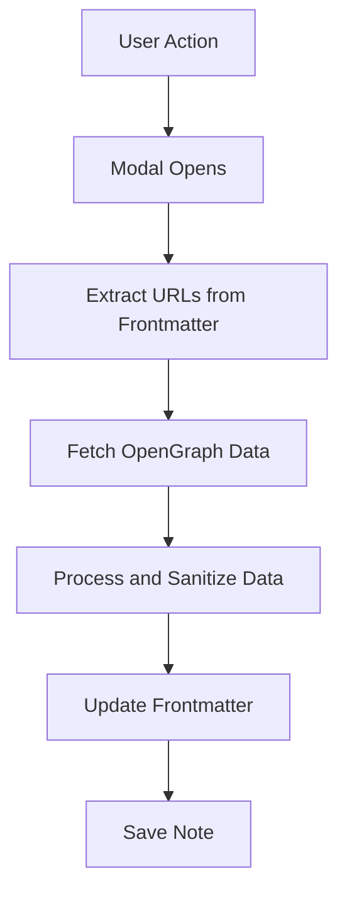

# Image Gin Obsidian Plugin Initialization
## Overview
Implemented the core settings infrastructure for the Image Gin Obsidian plugin, establishing a solid foundation for AI-powered image generation capabilities within Obsidian.

## Why Care
- Enables secure configuration of Recraft.ai API credentials
- Provides a user-friendly interface for managing image generation settings
- Sets the stage for future image generation features

## Key Features
- **Settings Management**
  - Added secure storage for Recraft API key and base URL
  - Implemented settings persistence using Obsidian's plugin API
  - Created a responsive settings UI with proper input validation
  - Added styles configuration with JSON editor for customizing image generation


- **Type Safety**
  - Defined TypeScript interfaces for plugin settings
  - Added proper type checking for image dimensions and configurations
  - Implemented default settings with type safety

- **Developer Experience**
  - Organized code with clear separation of concerns
  - Added comprehensive error handling
  - Set up proper module exports and imports

## Technical Details
- **Settings Interface**
  ```typescript
  interface ImageGinSettings {
      recraftApiKey: string;
      recraftBaseUrl: string;
      imagePromptKey: string;
      imageSizes: ImageSize[];
      defaultBannerSize: ImageSize;
      defaultPortraitSize: ImageSize;
      retries: number;
      rateLimit: number;
  }
  ```

- **Dependencies**
  - Obsidian Plugin API
  - TypeScript for type safety

## Next Steps
- Implement image generation functionality
- Add image preview capabilities
- Create batch processing for multiple images
- Add support for custom image styles and presets
- Implement API integration with Recraft.ai using configured styles


## Architecture

### Data Flow


### Core Components
1. **Main Plugin** (`main.ts`)


2. **Modals**
 

3. **Services**


4. **Utilities**
   - `yamlFrontmatter.ts`: Handles YAML frontmatter operations, avoids needing to use standardized YAML libraries which may not use Obsidian nuanced frontmatter standards. 
   - `fileProcessor.ts`: Manages file operations
   - `settings.ts`: Manages plugin configuration

## Implementation Highlights

### Frontmatter Processing
```typescript
// Example of processing frontmatter with configurable field names
const processMetadata = (data: any, settings: PluginSettings) => {
  return {
    [settings.titleFieldName || 'og_title']: data.title,
    [settings.descriptionFieldName || 'og_description']: data.description,
    [settings.imageFieldName || 'og_image']: data.image,
    [settings.fetchDateFieldName || 'og_last_fetched']: new Date().toISOString()
  };
};
```

### Error Handling
```typescript
// Robust error handling with retry logic
async function fetchWithRetry(
  url: string, 
  options: RequestInit, 
  retries = 3, 
  delay = 1000
): Promise<Response> {
  try {
    const response = await fetch(url, options);
    if (!response.ok) throw new Error(`HTTP error! status: ${response.status}`);
    return response;
  } catch (error) {
    if (retries === 0) throw error;
    await new Promise(resolve => setTimeout(resolve, delay));
    return fetchWithRetry(url, options, retries - 1, delay * 2);
  }
}
```

## Usage Examples

### Basic Usage
1. 

## Configuration

### Available Settings
```typescript
interface ImageGinSettings {
    recraftApiKey: string;
    recraftBaseUrl: string;
    imagePromptKey: string;
    imageSizes: ImageSize[];
    defaultBannerSize: string;
    defaultPortraitSize: string;
    retries: number;
    rateLimit: number;
    imageStylesJSON: string; // JSON string of style configurations
}
```

### Style Configuration Example
```json
{
    "creation_time": "2025-04-15T02:24:01.574783871Z",
    "credits": 40,
    "id": "<your_style_id>",
    "is_private": true,
    "style": "digital_illustration"
}
```

## Future Enhancements

## Dependencies
