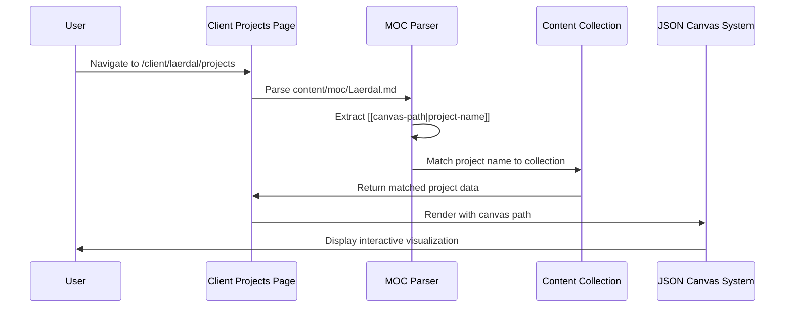

***

# Summary

Initiated the Projects Pages and JSON Canvas documents now render as Svelte components.

***

## Why Care

Communicating the state, status, thinking, and work behind our projects has been elusive.  JSON Canvas visualizations of content are helpful, and JSON Canvas is an open standard created by and supported trough Obsidian. 

# Implementation

## Changes Made

### Client Projects Routing System (Commits: 2a5447f, a1a59d4, e521a37)

**1. Dynamic Client Projects Index Page**
- Created `/client/[client]/projects/index.astro` with MOC (Map of Contents) system integration
- Implemented dynamic project listing based on client-specific markdown files (`content/moc/{Client}.md`)
- Added support for canvas path specification using syntax: `[[canvas/path.canvas|Project Name]]`
- Enhanced MOC parsing with regex pattern `/^[-*]\s*\[\[([^|\]]+)(?:\|([^\]]+))?\]\]/` for proper extraction

**2. JSON Canvas Integration**
- Integrated `Section__Project_Container.astro` component for consistent project display
- Fixed canvas path resolution relative to content base directory
- Resolved routing conflicts by updating `clientPortalCards.json` to point to new canonical routes
- Added proper project matching logic to connect MOC entries with projects collection

**3. Content Configuration Optimization**
- Removed excessive debug logging from projects collection `generateId` function
- Cleaned up terminal output by eliminating "[PROJECTS] Processing entry" spam
- Maintained slug generation functionality while improving development experience

**4. MOC System Enhancement**
- Fixed MOC parsing to correctly handle `[[canvas-path|project-name]]` syntax
- Updated Laerdal MOC file with proper project and canvas path specification
- Implemented project matching between MOC entries and content collection entries

### Technical Architecture

#### Component Flow Diagram

```mermaid
graph TD
    A[Client Portal Navigation] --> B[/client/laerdal/projects]
    B --> C[MOC System]
    C --> D[content/moc/Laerdal.md]
    D --> E[MOC Parser]
    E --> F[Project Matching]
    F --> G[Section__Project_Container]
    G --> H[ProjectShowcase]
    H --> I[JSONCanvasIsland]
    I --> J[JSONCanvasRenderer]
    J --> K[Interactive Canvas Display]
    
    style B fill:#e1f5fe
    style G fill:#f3e5f5
    style I fill:#e8f5e8
    style J fill:#fff3e0
```

#### Data Flow Architecture



#### Key Components Implementation

**1. MOC Parsing Logic**
```typescript
const mocProjectEntries = projectLines
  .map(line => {
    // Handle [[canvas/path.canvas|Project Name]] syntax
    const linkMatch = line.match(/^[-*]\s*\[\[([^|\]]+)(?:\|([^\]]+))?\]\]/);
    if (linkMatch) {
      return {
        name: linkMatch[2] ? linkMatch[2].trim() : linkMatch[1].trim(),
        canvasPath: linkMatch[2] ? linkMatch[1].trim() : null
      };
    }
    return null;
  })
  .filter(Boolean);
```

**2. Project Matching Algorithm**
```typescript
const clientProjects = mocProjectEntries
  .map(entry => {
    const matchedProject = allProjects.find(project => {
      const projectTitle = project.data.title?.toLowerCase().replace(/[^a-z0-9]/g, '');
      const entryName = entry.name.toLowerCase().replace(/[^a-z0-9]/g, '');
      return projectTitle === entryName || project.id.includes(entry.name.toLowerCase());
    });
    
    return matchedProject ? { ...matchedProject, canvasPath: entry.canvasPath } : null;
  })
  .filter(Boolean);
```

**3. Component Integration Pattern**
```astro
<!-- Client Projects Index -->
{hasProjects ? (
  <Section__Project_Container title={`${properClient} Projects`} />
) : (
  <NoProjectsMessage client={properClient} />
)}

<!-- ProjectShowcase Component -->
<ProjectShowcase 
  title={project.data.title}
  description={project.data.description}
  canvasPath={project.canvasPath}
/>

<!-- JSONCanvasIsland Integration -->
<JSONCanvasIsland canvasPath={canvasPath} />
```

#### File System Architecture

```mermaid
graph LR
    A[content/moc/] --> B[Laerdal.md]
    B --> C[":::projects<br/>- [[canvas-path|name]]<br/>:::"]
    
    D[content/projects/] --> E[Augment-It/]
    E --> F[Specs/]
    F --> G[Augment-It.canvas]
    
    H[site/src/pages/] --> I[client/[client]/projects/]
    I --> J[index.astro]
    
    J --> K[MOC Parser]
    K --> C
    K --> G
    
    style A fill:#e3f2fd
    style D fill:#e8f5e8
    style H fill:#fff3e0
```

### JSON Canvas UI Enhancement

**5. Enhanced Zoom Controls and Fullscreen Experience**
- Implemented interactive zoom controls with up/down arrow buttons for 5% increments
- Added editable zoom percentage input field with keyboard navigation support
- Enhanced keyboard controls: Arrow keys (5% zoom) and Shift+Arrow (10% zoom) when input focused
- Reduced mouse wheel zoom sensitivity from 10% to 2% per step for precise control
- Created reusable `frontmatter-indicator.svg` asset for consistent iconography
- Added comprehensive zoom control styling with hover states and smooth transitions

**6. True Fullscreen Toggle Integration**
- Integrated existing `arrows-maximize.svg` and `arrows-minimize.svg` icons for fullscreen controls
- Implemented browser Fullscreen API for immersive YouTube-like fullscreen experience
- Added dynamic icon switching based on fullscreen state with proper accessibility
- Enhanced UI with tooltips ("Enter Fullscreen" / "Exit Fullscreen") and ARIA labels
- Automatic state synchronization with browser fullscreen events and Escape key support

**Key Features Delivered:**
- Client-specific project pages with dynamic content loading via MOC system
- Interactive JSON Canvas visualization with enhanced pan/zoom capabilities  
- Professional fullscreen experience using existing design system icons
- Precise zoom control with multiple interaction methods (wheel, arrows, keyboard, direct input)
- Regex-based MOC parsing supporting `[[canvas-path|project-name]]` syntax
- Seamless integration with Astro content collections and routing
- Clean development experience with optimized logging and error handling
