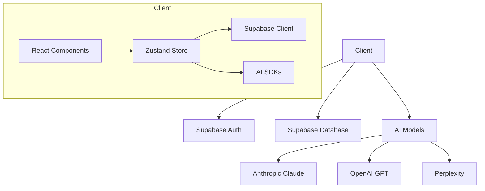
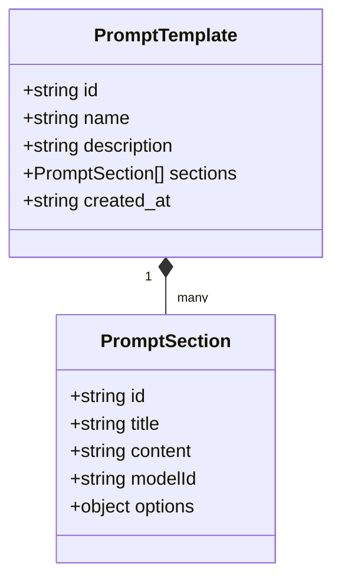

# Augment-It Version 2.0.0 with Bolt.new

## Overview
This document provides a comprehensive analysis of the Augment-It codebase, which is a customer data management application with AI capabilities. The application is built using React, TypeScript, Vite, Zustand, and Supabase.

## Why Care?

This application provides a complete workflow to augment data records with AI, albiet limited services available to start. The functionality make it suitable for iterating a data augmentation workflow on a long list of customer records, individually or in batches.

## Architecture

The application follows a client-server architecture with the following key components:



## Core Technologies

- **Frontend**: React 18 with TypeScript
- **Build Tool**: Vite
- **Styling**: TailwindCSS with Typography plugin
- **State Management**: Zustand
- **Authentication**: Supabase Auth
- **Database**: Supabase PostgreSQL
- **AI Integration**: 
  - Anthropic Claude SDK
  - OpenAI GPT
  - Perplexity
- **UI Components**: 
  - CodeMirror for code editing
  - Lucide React for icons
  - MDX for rich text editing

## Project Structure

```
src/
├── assets/           # Static assets (icons, images)
├── components/       # Reusable React components
├── lib/              # Utility functions and API clients
├── store/            # Zustand state management
├── types/            # TypeScript type definitions
└── App.tsx          # Root component
```

## Key Components

### 1. App.tsx

The root component that handles:
- Authentication flows (login, signup, password reset)
- Initial data loading
- Routing (implicit based on auth state)

### 2. Core UI Components

#### DataModelModal
- **Purpose**: Modal for viewing and editing data models
- **Key Features**:
  - Form for creating/editing data models
  - Field type definitions
  - Validation rules

#### EditQueryOptions
- **Purpose**: Interface for configuring query parameters
- **Key Features**:
  - Model selection
  - Temperature and other AI parameters
  - Prompt customization

#### HighlightsContextWrapper
- **Purpose**: Context provider for managing highlighted content
- **Key Features**:
  - Manages highlight state
  - Coordinates between different highlightable components

#### MDXEditor
- **Purpose**: Rich text editor for prompt content
- **Key Features**:
  - Markdown support
  - Code block highlighting
  - Inline formatting

#### MainLayout
- **Purpose**: Main application layout component
- **Key Features**:
  - Navigation sidebar
  - Responsive design
  - User menu and settings

#### PromptList
- **Purpose**: Displays list of available prompt templates
- **Key Features**:
  - Search and filter functionality
  - Template preview
  - Selection handling

#### PromptSection
- **Purpose**: Individual section within a prompt template
- **Key Features**:
  - Toggle between edit and preview modes
  - Model-specific configuration
  - Content validation

#### QueryResponse
- **Purpose**: Displays AI model responses
- **Key Features**:
  - Syntax highlighting
  - Response actions (copy, regenerate, etc.)
  - Error handling

#### RecordList
- **Purpose**: Displays data records
- **Key Features**:
  - Pagination
  - Sorting and filtering
  - Selection management

#### PasswordReset
- **Purpose**: Handles password reset flow
- **Key Features**:
  - Email validation
  - Error handling
  - Success feedback

#### PromptSectionEdit
- **Purpose**: Edit interface for prompt sections
- **Key Features**:
  - Rich text editing
  - Model configuration
  - Preview toggle

#### PromptSectionPreview
- **Purpose**: Read-only view of prompt sections
- **Key Features**:
  - Rendered markdown
  - Section actions (edit, delete)
  - Model badge display

#### QueryOptionsIconSet
- **Purpose**: Visual indicators for query options
- **Key Features**:
  - Model type icons
  - Parameter indicators
  - Interactive tooltips

#### QueryResponseList
- **Purpose**: Manages multiple query responses
- **Key Features**:
  - Response grouping
  - Version comparison
  - Batch actions

#### RecordHighlightsWrapper
- **Purpose**: Context for record highlighting
- **Key Features**:
  - Highlight management
  - Cross-component synchronization
  - Persistence

#### RequestEditor
- **Purpose**: Interface for crafting API requests
- **Key Features**:
  - Parameter editing
  - Request preview
  - History tracking

#### ResponseHighlight
- **Purpose**: Highlights specific response sections
- **Key Features**:
  - Custom highlight colors
  - Note attachment
  - Shareable links

#### ResponseObjectContextWrapper
- **Purpose**: Manages response object state
- **Key Features**:
  - Context provider
  - State persistence
  - Event handling

#### ResponseObjectHighlighter
- **Purpose**: Interactive response highlighting
- **Key Features**:
  - Text selection
  - Color coding
  - Annotation

#### ResponseObjectReviewer
- **Purpose**: Interface for reviewing responses
- **Key Features**:
  - Side-by-side comparison
  - Commenting
  - Approval workflow

#### UpdatePassword
- **Purpose**: Password update interface
- **Key Features**:
  - Current password verification
  - New password validation
  - Strength indicator

#### UserProfile
- **Purpose**: User account management
- **Key Features**:
  - Profile editing
  - API key management
  - Account settings

### 3. State Management (store/index.ts)

The application uses Zustand for state management with the following key state:

```typescript
interface AppState {
  // Data
  records: Record[];
  selectedRecord: Record | null;
  promptTemplates: PromptTemplate[];
  selectedTemplate: PromptTemplate | null;
  aiModels: AIModel[];
  user: User | null;
  profile: UserProfile | null;
  computedProperties: ComputedProperty[];
  aiModelConfigs: AIModelConfig[];
  queryResponses: QueryResponse[];
  highlights: Highlight[];
  
  // Actions
  setSelectedRecord: (record: Record | null) => void;
  setSelectedTemplate: (template: PromptTemplate | null) => void;
  addPromptTemplate: (template: PromptTemplate) => Promise<void>;
  // ... other actions
}
```

### 3. Prompt Management

The application allows creating and managing AI prompt templates with multiple sections:



### 4. AI Integration

The application integrates with multiple AI models through a unified interface:

```typescript
// Example of generating AI response
const generateAIResponse = async (sectionId: string, modelId: string, prompt: string) => {
  // Implementation handles different AI providers
  const model = getAIModel(modelId);
  const response = await model.generate(prompt);
  // Process and store response
};
```

## Data Model

### Records
Customer data records that can be processed by AI models.

### Prompt Templates
Reusable templates for generating AI prompts with configurable sections.

### AI Models
Configuration for different AI models and providers.

### Query Responses
Stores AI model responses for later reference.

## Key Features

1. **Template-Based AI Prompting**
   - Create and manage prompt templates with multiple sections
   - Each section can use different AI models
   - Preview and edit capabilities

2. **AI Model Integration**
   - Support for multiple AI providers (Claude, GPT, Perplexity)
   - Configurable model parameters
   - Response highlighting and annotation

3. **Data Management**
   - CRUD operations for customer records
   - Bulk import/export functionality
   - Data validation and transformation

4. **User Management**
   - Authentication and authorization
   - User profiles and preferences
   - API key management

## Code Examples

### Example Component: PromptSection

```tsx
interface PromptSectionProps {
  section: PromptSectionType;
  templateId: string;
}

export const PromptSection: React.FC<PromptSectionProps> = ({ section, templateId }) => {
  const [isEditing, setIsEditing] = React.useState(false);
  const selectedTemplate = useStore(state => state.selectedTemplate);
  
  // Get the current section from the selected template
  const currentSection = selectedTemplate?.sections.find(s => s.id === section.id);
  const sectionToRender = currentSection || section;

  return (
    <div id={`section-${section.id}`}>
      {isEditing ? (
        <PromptSectionEdit
          section={sectionToRender}
          templateId={templateId}
          onCancel={() => setIsEditing(false)}
          onSave={() => setIsEditing(false)}
        />
      ) : (
        <PromptSectionPreview
          section={sectionToRender}
          templateId={templateId}
          onEdit={() => setIsEditing(true)}
        />
      )}
    </div>
  );
};
```

### Example Store Action: generateAIResponse

```typescript
generateAIResponse: async (sectionId, modelId, prompt, sectionTitle) => {
  const { user } = get();
  if (!user) return;

  try {
    // Get model configuration
    const model = get().aiModels.find(m => m.id === modelId);
    if (!model) throw new Error('Model not found');

    // Generate response using appropriate handler
    let response;
    switch (model.provider) {
      case 'anthropic':
        response = await generateClaudeResponse(prompt, model);
        break;
      case 'openai':
        response = await generateGPTResponse(prompt, model);
        break;
      case 'perplexity':
        response = await generatePerplexityResponse(prompt, model);
        break;
      default:
        throw new Error(`Unsupported model provider: ${model.provider}`);
    }

    // Save response to store and database
    // ...
  } catch (error) {
    console.error('Error generating AI response:', error);
    throw error;
  }
}
```
# Next Steps

## Migration to Microservices and Microfrontends Architecture

When migrating to a microservices architecture, consider the following:

1. **Service Decomposition**
   - Auth Service: Handle authentication and user management
   - Template Service: Manage prompt templates and sections
   - AI Service: Handle AI model integration and response generation
   - Data Service: Manage customer records and query results

2. **API Gateway**
   - Implement an API gateway to route requests to appropriate services
   - Handle authentication and rate limiting

3. **Event-Driven Architecture**
   - Use message queues for async processing
   - Implement event sourcing for auditability

4. **Data Management**
   - Each service should have its own database
   - Implement data consistency patterns (Saga, CQRS)

## Conclusion

The current codebase provides a solid foundation with clear separation of concerns. The migration to microservices should focus on:

