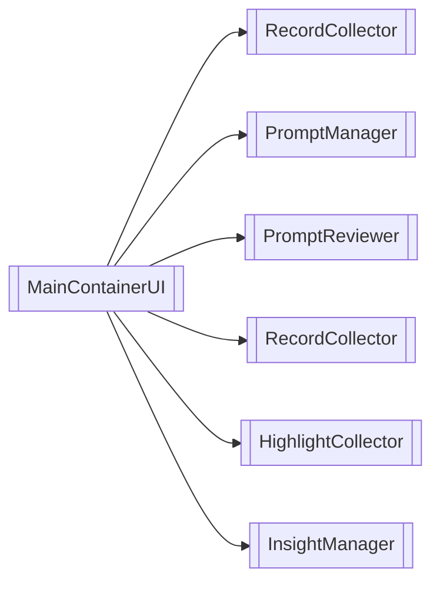
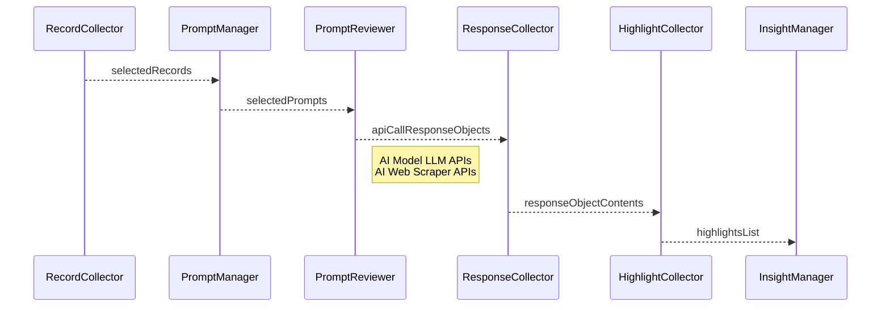

## Purpose
The [[client-content/Laerdal/Projects/Laugment/Data-Augmenter-Specification/MainContainerUI|MainContainerUI]] dynamically loads [[Microfrontend Architecture|Microfrontends]] in a columnar layout. Each column functions as a Window, and the root directory uses a [[Module Federation]] library to load the Microfrontend "Apps" within these Windows. 

## Components
[[AppWindow]]

### Custom Components
[[OptionsBar]]

### Shared Components

