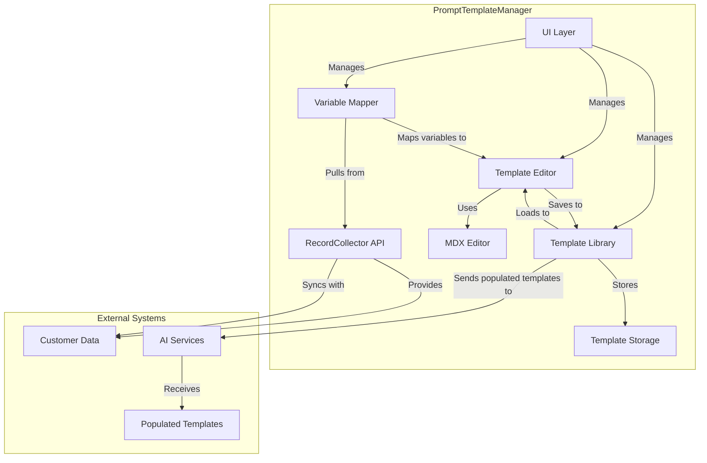
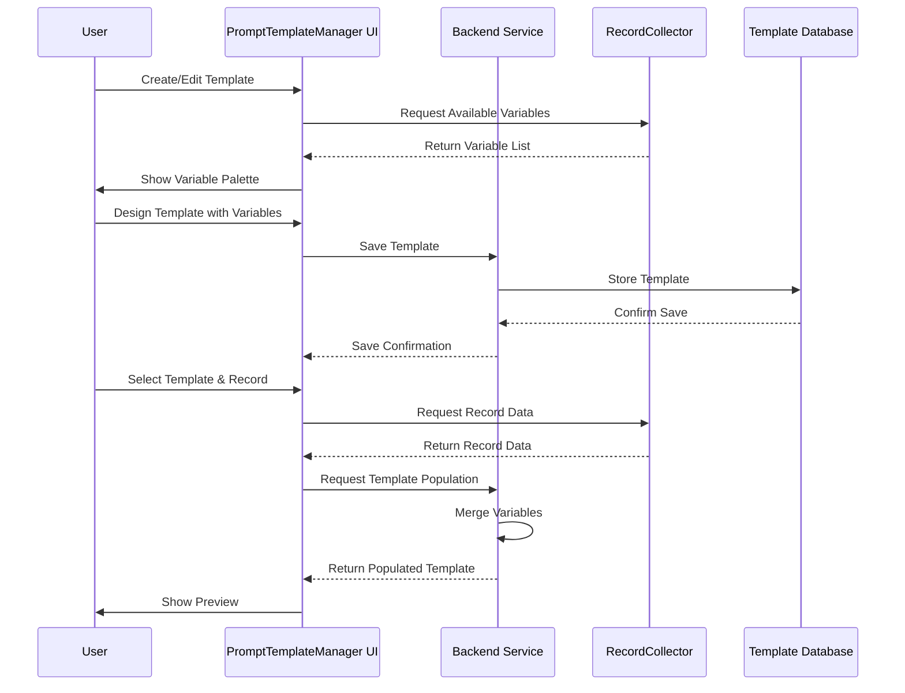

# Purpose

## Context in Monorepo

The [[client-content/Laerdal/Projects/Laugment/Data-Augmenter-Specification/PromptTemplateManager|PromptTemplateManager]] will be the second available module in the set and sequence of [[client-content/Laerdal/Projects/Laugment/Data-Augmenter-Specification/Data Augmentation Microfrontends|Data Augmentation Microfrontends]]. The goal of the [[client-content/Laerdal/Projects/Laugment/Data-Augmenter-Specification/Laugment Monorepo Vision Specification|Laugment Monorepo]] is to transform and augment a set of records by using various AI services.  For instance, [[concepts/Explainers for AI/AI-Powered Search|AI-Powered Search]] models, [[concepts/Explainers for AI/AI Powered Data Capture|AI Powered Data Capture]] techniques, such as [[AI Web Crawlers]] and [[Vocabulary/Web Scraping|Web Scrapers]] through their respective APIs. By properly integrating the [[client-content/Laerdal/Projects/Laugment/Data-Augmenter-Specification/PromptTemplateManager|PromptTemplateManager]] with the [[client-content/Laerdal/Projects/Laugment/Data-Augmenter-Specification/RecordCollector|RecordCollector]], we better ensure prompts well leverage AI capabilities and augment specific customer data effectively.

## Functionality of PromptManager

The [[client-content/Laerdal/Projects/Laugment/Data-Augmenter-Specification/PromptTemplateManager|PromptTemplateManager]] will provide functionalities to allow users to upload prompts, author new ones, and insert _managed variables_ called from the records made available from the [[client-content/Laerdal/Projects/Laugment/Data-Augmenter-Specification/RecordCollector|RecordCollector]]. 

> The **_initial use case_** is using the [[client-content/Laerdal/Projects/Laugment/Data-Augmenter-Specification/RecordCollector|RecordCollector]] to pull records from the CRM system about customers.  

This data may be mediated through [[Tooling/Data Utilities/DataBricks|DataBricks]] (or another data aggregator service).

The [[client-content/Laerdal/Projects/Laugment/Data-Augmenter-Specification/PromptTemplateManager|PromptTemplateManager]] shall be the tool that empowers users to select,  generate, and iterate on _meaningful_ prompts likely to have the best results.  These prompts will specifically make easy the addition of  _fields as variables_ to allow the generation of customer specific prompts from a template. 

The [[client-content/Laerdal/Projects/Laugment/Data-Augmenter-Specification/PromptTemplateManager|PromptTemplateManager]] will enable the users to select the most appropriate prompt to send to the [[client-content/Laerdal/Projects/Laugment/Data-Augmenter-Specification/RequestReviewer|RequestReviewer]], which may or may not be the one they were just creating, working on, or saved to disk. 

**APIs:**
        - AI Search Model: An API endpoint (REST or WebSocket) to send prompts and receive search results.
        - Web Crawler Service: An API endpoint for triggering web crawls based on provided parameters (e.g., target URLs, variables).

The [[client-content/Laerdal/Projects/Laugment/Data-Augmenter-Specification/PromptTemplateManager|PromptTemplateManager]] gives users the tools to 
1) Create prompts templates _with variables_ from the current set of records loaded in the [[client-content/Laerdal/Projects/Laugment/Data-Augmenter-Specification/RecordCollector|RecordCollector]] through **Variable Mapping:** mapping variables from current systems into the prompt templates before execution.
	1) See available variables from the [[client-content/Laerdal/Projects/Laugment/Data-Augmenter-Specification/RecordCollector|RecordCollector]], available via API.  
	2) Enter a [[Vocabulary/WYSIWYG]] editor for crafting custom prompts with syntax highlighting and auto-completion for supported languages (like Python, JavaScript). a [[Tooling/Software Development/Frameworks/Web Frameworks/MDX|MDX]] editor to write prompts. 
		1) Variable Management: Interface to map variables from records available from the [[client-content/Laerdal/Projects/Laugment/Data-Augmenter-Specification/RecordCollector|RecordCollector]] into the prompt template, possibly using a _drag-and-drop_ or _input field-based_ system.
	3) Upload markdown or mdx files.
	4) Save prompt templates that have valid variable syntax. 
2) Search, filter, and select saved prompts. 
3) **Prompt Validation:** Ensure prompts are syntactically correct and adhere to security guidelines.

# 3. Goals & Non-Goals  
### Goals  
- PromptTemplateManager uses a standard templating syntax to apply data from the [[client-content/Laerdal/Projects/Laugment/Data-Augmenter-Specification/RecordCollector|RecordCollector]] to a PromptTemplate, resulting in a filled out template on a per-record basis. 
- Users can create, delete, and update PromptTemplates
  
### Non-Goals  
- Does not send to AI Model APIs, nor evaluate responses. 

# Technical Design
 
Front-end Framework: [[Tooling/Software Development/Frameworks/Web Frameworks/React|React]]
Back-end Framework: [[Tooling/Software Development/Frameworks/Web Frameworks/NEXT.js|NEXT.js]]
Container system: [[Tooling/Software Development/Developer Experience/DevOps/Docker|Docker]]

Pulls data from: [[client-content/Laerdal/Projects/Laugment/Data-Augmenter-Specification/RecordCollector|RecordCollector]]
Makes prompts available for [[client-content/Laerdal/Projects/Laugment/Data-Augmenter-Specification/RequestReviewer|RequestReviewer]]

Window to [[client-content/Laerdal/Projects/Laugment/Data-Augmenter-Specification/PromptTemplateManager|PromptTemplateManager]] available in [[client-content/Laerdal/Projects/Laugment/Data-Augmenter-Specification/MainContainerUI|MainContainerUI]]

## Components
[[client-content/Laerdal/Projects/Laugment/Data-Augmenter-Specification/PromptManagerSrc/ListColumn--Prompts|ListColumn--Prompts]]
[[client-content/Laerdal/Projects/Laugment/Data-Augmenter-Specification/PromptManagerSrc/ListItem--Prompt|ListItem--Prompt]]

### Shared Components
[[SharedSearchContainer]]
[[SharedFilterContainer]]
[[SharedFilterDropdown]]
[[SharedPromptEditor]]
	[[SharedMdxEditor]]
	[[SharedJsonEditor]]
[[client-content/Laerdal/Projects/Laugment/Data-Augmenter-Specification/shared-ui-elements/SharedListColumn|SharedListColumn]]
[[client-content/Laerdal/Projects/Laugment/Data-Augmenter-Specification/shared-ui-elements/SharedListRow|SharedListRow]]

# Open Questions
How will we handle saving? 

# Comprehensive Wish List

Attribution of prompts to User Accounts.  Filter prompts by team.  Limit prompts to being visible and usable by team, lists of other users, and the organization (verified by email).

[[Source Control Management]], [[concepts/Version Control|Version Control]]

**Error Collection:** Collects errors associated with a specific prompt. 

