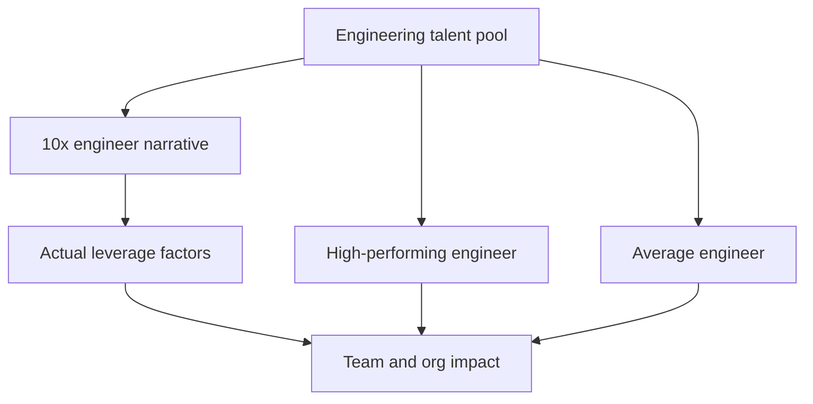

# Defining and Describing 10x Engineering

_“10x engineering” is the idea that some software engineers are so effective that they deliver roughly an order of magnitude more value than an average peer, not just more lines of code._

In practice, **10x engineering** is a contested term used in software and startup culture to describe unusually high-impact engineers whose output, problem‑solving, and leverage seem dramatically higher than the norm. It is invoked both admiringly (to describe rare, transformative contributors) and critically (to question the myth of lone hero programmers and the toxicity that can follow). The concept matters because it influences hiring practices, compensation, team design, and how organizations think about talent, productivity, and culture.

# Uses in Context

- In **startup and hiring discourse**, founders and investors talk about “10x engineers” as a small group who “are the ones who actually build and scale your product” and whose impact is “orders of magnitude” beyond others, often framed as the key early hires that make or break a startup.  
- In **Twitter/X and blog debates**, the phrase is used both aspirationally and sarcastically; for example, one viral thread described a 10x engineer as someone who “hates meetings,” “codes at night,” and prefers to work alone, prompting widespread criticism that this glorifies antisocial behavior and bad team dynamics.  
- In **engineering‑management writing**, leaders use the term as a hook to argue that what looks like “10x output” usually comes from better systems, tooling, and collaboration rather than innate genius, emphasizing that “great engineers make the whole team better, not just their own code.”  
- In **productivity and tooling discussions**, “10x engineer” is increasingly tied to *leverage through tools* (e.g., code search, automation, AI assistants), with writers arguing that “10x comes from compounding small productivity gains and removing friction,” not heroic overwork. [^t1z4a5]  
- In **critical essays about tech culture**, the phrase is invoked as a “myth” or “archetype” that can justify toxic behavior, underinvestment in mentoring, and neglect of documentation, using the supposedly irreplaceable 10x engineer as a reason to tolerate “brilliant jerk” dynamics.  

# History of Use

## Origins

- The *underlying idea* of “orders of magnitude programmers” has roots in early software engineering research: for example, Sackman, Erikson, and Grant’s 1968 study reported large differences in programmer performance (often cited later as evidence that some programmers are many times more productive than others), which later authors paraphrased in popular form as “10x programmers,” even if the exact label wasn’t used in the original paper.  
- The **explicit phrase “10x programmer/10x engineer”** became common in industry writing and talks in the 1990s–2000s as practitioners and authors summarized earlier results by saying that top developers can be “10 times more productive than average.” Popular programming books, blog posts, and conference talks helped crystallize “10x engineer” as a shorthand label rather than a formal scientific term.  
- By the **2010s**, the phrase was firmly embedded in startup and tech‑blog culture, frequently appearing in hiring posts, founder advice, and social‑media threads as a way to describe rare, high‑leverage engineers who supposedly “do the work of ten people.”  

## Evolution

- **2010s – Hero programmer ideal**: As high‑growth startups and FAANG‑scale companies competed for talent, the “10x engineer” became a popular recruiting trope and aspirational identity, often associated with long hours, deep system expertise, and preference for autonomy over process.  
- **Late 2010s – Backlash and critique**: High‑profile online debates, including widely shared Twitter threads defining 10x engineers by behaviors like avoiding meetings and documentation, triggered strong pushback from engineers and managers who argued that this caricature glorified unhealthy and exclusionary norms.  
- **2020s – Reframing around leverage and teams**: Recent essays and newsletters emphasize that what people call “10x” typically comes from *systems thinking*—choosing the right problems, improving architecture, mentoring others, and using tools (including AI) to amplify the whole team—rather than raw output alone. [^t1z4a5] This reframing shifts focus from lone heroes to *10x environments* and *10x teams*. [^t1z4a5]  

# Best Real-World Examples

- [Stripe](https://stripe.com) is frequently cited in engineering blogs as an example of concentrating very strong early engineers whose focus on infrastructure, developer experience, and internal tools created “outsized leverage,” making small teams deliver at a “10x” level compared with typical financial‑services software organizations.  
- [Basecamp](https://basecamp.com) (formerly 37signals) is often referenced for how a very small engineering team produced and operated widely used products for years, supported by strong opinionated design and tooling—offered in writing as a counterexample to the idea that you need huge headcount rather than high‑leverage engineers.  
- [GitHub](https://github.com), especially in its early days, is pointed to as a case where a handful of engineers, leveraging Git and social coding concepts, created infrastructure that massively amplified other developers’ productivity, a canonical form of “10x impact” through platform and ecosystem.  
- [Linear](https://linear.app), a startup focused on issue tracking and product workflow, is held up in modern engineering blogs as an example of a small, senior‑heavy engineering team using strong product sense and tooling to ship at a pace and quality often described as “10x” relative to incumbents in project‑management software.  
- [Open‑source projects like Linux](https://kernel.org) are frequently analyzed through a “10x” lens, with core maintainers and a small group of top contributors providing an outsized share of architectural decisions, reviews, and critical code relative to the broader contributor base.  
- [Figma](https://www.figma.com), particularly in its early years, is often cited in product‑engineering essays as an example of a small team building extremely complex, real‑time collaborative graphics software in the browser, demonstrating the kind of high‑leverage engineering and tooling often labeled “10x.”  

# Case Studies

## Case Study 1: High-Leverage Infrastructure at a Payments Startup

In profiles of early‑stage fintech and payments companies, commentators repeatedly point to organizations like Stripe as examples where a small number of very strong engineers built foundational infrastructure that unlocked rapid product growth. Instead of measuring “10x” purely by lines of code, these engineers focused on stable APIs, strong abstractions, and developer experience, which reduced friction for every subsequent product and integration. Blog essays describe how internal tooling—automated testing, deployment pipelines, and robust observability—allowed a relatively small engineering team to operate a complex global system, leading observers to describe the group as delivering “orders of magnitude” more than typical teams at legacy financial institutions. This case shows that what gets called “10x engineering” often emerges from *building leverage into the system* (platforms, tools, abstractions) rather than simply working harder or being individually “brilliant.”  

## Case Study 2: The “10x Engineer” Backlash and Culture Change

A widely discussed Twitter thread in the late 2010s tried to define “10x engineers” through behaviors like avoiding meetings, working alone, disliking documentation, and hoarding knowledge, prompting intense backlash from engineers, managers, and D&I advocates. Critics argued in blogs and responses that such a definition valorized antisocial traits, undermined collaboration, and excused “brilliant jerk” behavior in the name of productivity, noting that teams built around such individuals often suffer from brittle systems, onboarding difficulties, and burnout. In response, many engineering‑leadership articles began explicitly redefining “10x” to emphasize people who *multiply others*: mentoring, documenting, simplifying systems, and improving processes, with some leaders rejecting the “10x engineer” label entirely in favor of “10x teams” or “high‑leverage engineers.” This episode illustrates how the same phrase can encode very different models of excellence, and how community backlash can push the industry toward healthier, more systemic definitions of high impact.  

## Case Study 3: AI-Enabled “10x” Workflows

Recent essays about AI coding assistants describe how tools like large language models can act as “force multipliers,” enabling individual engineers to handle broader scopes—rapid prototyping, refactoring, and documentation—that previously required entire teams. [^t1z4a5] For example, one practitioner describes a workflow using an AI pair programmer for brainstorming, spec generation, and implementation planning that “makes engineers 10x as productive” by reducing time spent on mechanical coding and boilerplate. [^t1z4a5] Rather than claiming that AI magically turns everyone into a genius, these essays frame AI as **infrastructure for leverage**, echoing the modern interpretation of 10x engineering as a property of *environment and tools* as much as individuals. [^t1z4a5] This case underscores the ongoing shift from viewing “10x” as an innate trait to seeing it as the result of combining strong engineers with high‑leverage systems—now increasingly including AI. [^t1z4a5]  

***

# Sources

[^t1z4a5]: [Requiem for a 10x Engineer Dream - by Oskar Dudycz](https://www.architecture-weekly.com/p/requiem-for-a-10x-engineer-dream)
