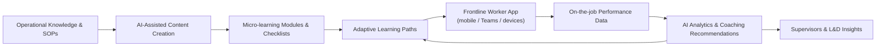

# Defining and Describing AI-Powered Front-Line Training

_AI-powered front-line training is about putting the “right next step” in a worker’s hand at the moment of need, not just giving them a thick manual on day one.[1][3][5]_

AI-powered front-line training refers to training and performance support for **frontline workers** (retail associates, manufacturing operators, field service, hospitality, etc.) that is created, personalized, delivered, and continuously adapted using artificial intelligence.[1][3][5] It typically combines AI-assisted content creation, adaptive learning paths, microlearning, and real-time performance support accessible on mobile devices or within tools frontline staff already use.[3][5][7] This approach matters because frontline roles often face high turnover, limited classroom time, and rapidly changing procedures, so AI is used to accelerate onboarding, keep skills current, and provide just‑in‑time guidance while work is happening.[1][3][5][6] Vendors position AI-powered frontline training as a way to improve safety, quality, productivity, and retention in distributed, deskless workforces.[1][2][3][5][6]  

# Uses in Context

- Vendors use the phrase **“AI-powered frontline training”** to describe platforms that combine “AI-assisted content creation, adaptive learning paths, micro-learning” to keep distributed teams “trained and operationally consistent.”[5]  
- Frontline learning providers describe using AI to “analyze individual employee skill gaps, career goals, learning preferences and past performance to create tailored, personalized learning journeys,” especially during onboarding of frontline staff.[3]  
- In manufacturing, AI is framed as **agentic** support that “gives workers access to familiar technology” and “the right answers instantly” while also translating work instructions and training into multiple languages in real time for a diverse frontline workforce.[2]  
- Operations platforms emphasize that AI “makes work safer, training better, and team talk easier” by using live task assignment and data-driven recommendations to transform frontline operational efficiency.[6]  
- Case material on “AI-powered frontline training with Microsoft Teams” shows AI being invoked to describe scalable, embedded training for tour operators working across 19 countries, integrated into the collaboration tools they already use daily.[7]  
- Broader discussions of frontline AI highlight AI tools that support faster decision-making, reduce friction in daily workflows, and give frontline workers “back time for what matters most: human connection,” linking training to real-time assistance and workflow optimization.[1][4]  

# History of Use

## Origins

- The phrase **“AI-Powered Frontline Training”** appears as the title of an Instruo blog describing how the company “helps distributed teams stay trained and operationally consistent with AI-assisted content creation, adaptive learning paths, micro-learning.”[5] While the exact first use of the term is not authoritatively documented, Instruo’s positioning suggests early startup usage oriented around deskless and distributed workforces rather than traditional e-learning.[5]  
- Around the same period, frontline learning and operations vendors such as Axonify and Disprz were independently describing AI-enhanced learning for frontline employees—focusing on personalized learning journeys, adaptive content, and mobile delivery—without always using the exact three-word phrase but clearly describing the same concept.[3][8]  

## Evolution

- **2010s–early 2020s – From mobile frontline training to AI-personalized learning**: Mobile learning platforms for frontline workers emerged first, then began incorporating AI for personalization, with providers explaining that AI can “dynamically adjust difficulty, format, and pace in real-time based on a learner’s performance.”[3][8]  
- **Early–mid 2020s – Shift to workflow-integrated, AI-powered support**: Vendors like Strivr and iTacit started positioning AI not just as a way to deliver training modules but as “AI-optimized workflows” and “live task assignment” that provide context-aware guidance and improve training and safety during live operations for frontline staff.[1][6]  
- **Mid 2020s – Agentic and embedded frontline AI**: Redzone and others introduced “agentic AI” for frontline manufacturing, emphasizing real-time problem-solving, translation, and coaching, while deployments like NexusTours’ “AI-powered frontline training with Microsoft Teams” illustrated embedding training experiences within collaboration tools already used on the front line.[2][7]  

# Best Real-World Examples

- [Instruo](https://instruo.co/blog) – A startup platform explicitly branded around **AI-powered frontline training**, offering AI-assisted content creation, adaptive learning paths, and microlearning for distributed teams.[5]  
- [Axonify](https://axonify.com/blog/accelerate-onboarding-with-ai/) – A frontline learning platform using AI to build personalized learning journeys, adaptive content, and real-time coaching to accelerate onboarding and ongoing training for frontline employees.[3]  
- [Redzone by QAD](https://www.rzsoftware.com/blog/how-agentic-ai-is-transforming-frontline-manufacturing-operations) – Uses “agentic AI” to deliver real-time, AI-driven guidance, problem prevention, and coaching on manufacturing floors, effectively serving as AI-powered training and assistance for operators and supervisors.[2]  
- [iTacit](https://itacit.com/blog/how-ai-changes-the-frontline-operational-efficiency/) – Focuses on how AI-driven live task assignment and communication improve frontline operational efficiency, safety, and training quality.[6]  
- [Strivr](https://www.strivr.com/blog/ai-powered-workflow-frontline-support) – A VR and immersive learning company that extends into AI-powered workflows for frontline job support, replacing static SOPs with AI-optimized, just-in-time guidance and training.[1]  
- [NexusTours – AI-powered Frontline Training with Microsoft Teams](https://www.youtube.com/watch?v=Iz28OBLvdrc) – A tourism and destination management company using AI and Teams to scale frontline training across 19 countries, showcasing embedded and language-diverse training at scale.[7]  
- [Disprz](https://disprz.ai/blog/frontline-training-with-mobile-learning) – A learning platform emphasizing mobile frontline training and highlighting how AI and mobile delivery turn frontline workers’ downtime into productive learning time.[8]  

# Case Studies

## Instruo: AI-Powered Frontline Training for Distributed Teams

Instruo positions itself directly around the idea of **AI-powered frontline training**, describing how it “helps distributed teams stay trained and operationally consistent with AI-assisted content creation, adaptive learning paths, micro-learning.”[5] For organizations with geographically dispersed, deskless workforces, traditional classroom or desktop-based training is difficult to schedule and keep current, especially when procedures change rapidly.[5] By using AI to assist content creation, Instruo enables subject matter experts to generate and update training material quickly, while adaptive learning paths and microlearning segments let frontline workers consume targeted lessons in short bursts during their shifts.[5] This case illustrates how a smaller specialist vendor can build an entire product thesis around AI-powered frontline training, prioritizing continual, in-the-flow learning over occasional, centralized training events.[5]  

## Axonify: Accelerating Frontline Onboarding with AI

Axonify focuses on frontline employees in industries such as retail, logistics, and contact centers, and it has documented how AI can “accelerate new hire readiness, boost retention and improve frontline productivity.”[3] Its AI capabilities analyze “individual employee skill gaps, career goals, learning preferences and past performance” to create personalized learning journeys that recommend specific courses and resources to each frontline worker.[3] The platform’s adaptive content “dynamically adjust[s] difficulty, format, and pace in real-time based on a learner’s performance,” while AI-powered tools provide “real-time feedback and coaching,” allowing new hires to quickly correct mistakes and build confidence.[3] By automating content creation and translation/localization of training materials, Axonify also supports large, diverse frontline workforces, showing how AI-powered frontline training can reduce time-to-productivity and support multi-language operations without proportionally expanding L&D teams.[3]  

## NexusTours and Microsoft Teams: Scaling Embedded Frontline Training

NexusTours, a destination management company operating across 19 countries, has been showcased for its use of **AI-powered frontline training with Microsoft Teams**.[7] As a company responsible for delivering consistent guest experiences from airport arrival through multiple touchpoints, NexusTours must train and support frontline staff spread across regions and languages.[7] By embedding AI-driven training and support within Microsoft Teams—the collaboration platform already used by employees—the company can deliver scalable, in-context learning and communication to staff in real time.[7] This deployment demonstrates how AI-powered frontline training can be integrated into everyday communication tools, enabling rapid rollout across many locations while minimizing friction in adoption and keeping training tightly coupled to frontline workflows.[4][7]  

***

# Sources

[1]: [AI-Powered Workflows For Frontline Job Support | STRIVR](https://www.strivr.com/blog/ai-powered-workflow-frontline-support)
[2]: [How Agentic AI Is Transforming Frontline Manufacturing - Redzone](https://www.rzsoftware.com/blog/how-agentic-ai-is-transforming-frontline-manufacturing-operations)
[3]: [How to accelerate onboarding with AI - Axonify](https://axonify.com/blog/accelerate-onboarding-with-ai/)
[4]: [Frontline AI in action: How AI-powered tools are reshaping work ...](https://www.microsoft.com/en-us/industry/microsoft-in-business/era-of-ai/2026/02/19/frontline-ai-in-action-how-ai-powered-tools-are-reshaping-work-where-it-matters-most/)
[5]: [AI-Powered Frontline Training - Instruo](https://instruo.co/blog)
[6]: [How AI Changes the Frontline Operational Efficiency - iTacit](https://itacit.com/blog/how-ai-changes-the-frontline-operational-efficiency/)
[7]: [Scaling AI-Powered Frontline Training with Microsoft Teams](https://www.youtube.com/watch?v=Iz28OBLvdrc)
[8]: [Boost Adoption Of Frontline Training With Mobile Learning - Disprz](https://disprz.ai/blog/frontline-training-with-mobile-learning)
