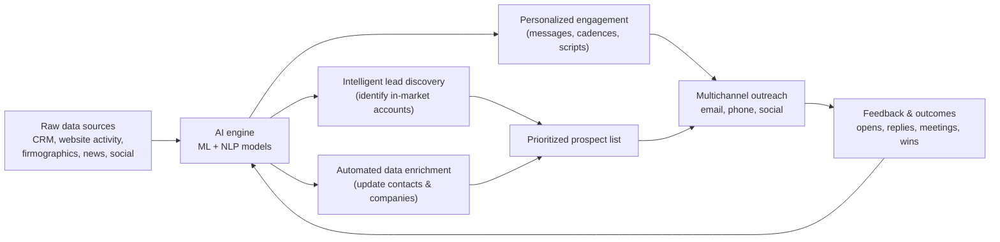

# Defining and Describing AI-Powered Prospecting

_“AI‑powered prospecting” uses machine learning and large language models to decide **who** sales teams should contact next, **with what message**, and **when**, based on signals across many data sources._  

AI‑powered prospecting is the application of **AI techniques such as machine learning and natural language processing to automate and optimize sales prospecting tasks like lead identification, research, scoring, and outreach personalization**.[1][4][5] It typically ingests CRM data, firmographic and technographic data, buyer‑intent signals (e.g., website visits, content downloads, funding events), and communication history to surface high‑intent accounts and contacts.[1][2][4] The approach matters because it helps sales teams focus on the **small subset of accounts most likely to buy**, maintain accurate data via enrichment, and send contextually relevant outreach at scale without fully templated “spray and pray” campaigns.[1][2][5][8] Modern systems also embed conversational assistants (LLM “copilots”) directly into CRMs so reps can query their data in natural language and generate tailored sequences faster.[2][8]  

# Uses in Context

- Vendors define it as using AI to “**automate lead identification, research, personalization, and outreach**,” where models analyze large datasets to surface high‑intent prospects and generate contextually relevant messaging.[1][4][5]  
- In sales‑ops and revenue‑tech writing, AI‑powered prospecting is positioned as a way to “**identify high-value leads with AI-powered research**,” “**prioritize outreach using predictive insights**,” and “**test and optimize outbound campaigns automatically**.”[8]  
- CRM platforms describe “AI-powered prospecting” features where assistants like HubSpot’s **Breeze** let reps “ask questions from anywhere in your HubSpot account and receive answers based on data in your CRM,” then use that context to research accounts, enrich records, and trigger outreach.[2]  
- Outbound thought leaders talk about an “AI-powered prospecting routine” in which reps use custom GPTs and other tools to compress research, identify trigger events, and craft a multi‑touch “story” for one high‑value account in roughly 30 minutes per day.[3]  
- GTM and [[Revenue Operations]] RevOps blogs describe AI‑powered prospecting tools that “surface in‑market accounts, automate research, and draft personalized outreach,” integrating buyer‑intent feeds, firmographic data, and engagement signals into a single workflow.[4][6][7]  
- AI sales‑enablement platforms frame it as a way to both “**spot winning behaviors in each rep**” and turn those into scalable, AI‑driven playbooks and coaching that guide prospecting activity in real time.[5]  

# History of Use

## Origins

- The underlying practice—using algorithms to score and prioritize leads—emerged from **predictive lead scoring** and marketing automation in the early–mid 2010s, where vendors applied machine learning to historical CRM and marketing data to predict which leads would convert.[4][6][8] These systems analyzed attributes such as company size, industry, and behavioral engagement to generate a likelihood‑to‑buy score, essentially an early, narrow form of AI‑driven prospect selection.[4][8]  
- The explicit phrase **“AI-powered prospecting”** gained traction in sales‑technology marketing and documentation around the early 2020s, as generative models and more accessible ML tooling allowed smaller vendors and practitioners to talk about “AI-powered research,” “AI-powered outreach,” and “AI-powered prospecting agents” in blogs, knowledge‑base articles, and product pages rather than in academic papers.[2][4][5][6]  
- Practitioner‑driven content (e.g., YouTube playbooks on “AI‑powered prospecting routines” and blogs about using custom GPTs for account research) illustrates that individual sales trainers and indie consultants were early adopters of the term in hands‑on workflows, showing specific 4–5 step routines for targeting, timed AI‑assisted research, story creation, and message drafting.[3]  

## Evolution

- **c. 2014–2018 – From predictive lead scoring to intent‑driven prospecting.** Predictive lead‑scoring vendors and B2B data providers began combining firmographic data with digital exhaust (site visits, email engagement, content downloads) to recommend which accounts to prioritize, laying the groundwork for “AI-powered” prospect selection.[4][6][8]  
- **c. 2019–2022 – Multi‑function “AI for sales prospecting” platforms.** Tools evolved from scoring engines into platforms that combine **intelligent lead discovery, automated enrichment, and personalized engagement at scale**, using ML and NLP to analyze buyer‑intent signals, keep contact data current, and draft tailored messages.[1][4][5][9]  
- **c. 2023–present – LLM‑integrated prospecting assistants and agents.** With the rise of large language models, CRMs and specialized startups introduced **prospecting assistants** (e.g., Breeze Assistant) and **AI agents** that can answer natural‑language questions about CRM data, auto‑generate “smart properties,” suggest in‑market companies, and “automate the creation and execution of your outreach” while following persona‑specific guardrails.[2][7][8]  

# Best Real-World Examples

- **[Apollo.io](https://www.apollo.io/insights/ai-for-sales-prospecting)** – Combines a large B2B contact database with AI for “intelligent lead discovery,” automated enrichment, and AI‑generated, context‑aware outreach sequences.[1]  
- **[SalesAi](https://www.salesai.com/blog/ai-prospecting-tools-best)** – Provides AI agents designed to qualify leads, book meetings, and support customers, effectively acting as autonomous SDRs that handle early‑stage prospecting conversations.[7]  
- **[Crono One](https://www.crono.one/academy/ai-tools-for-sales-prospecting/)** – Curates and explains a stack of “best AI tools for sales prospecting,” highlighting how specialized tools can automate prospect research and personalization for smaller teams.[6]  
- **[HubSpot AI-Powered Prospecting](https://knowledge.hubspot.com/get-started-with-ai-powered-prospecting)** – A CRM‑embedded assistant (Breeze) plus “prospecting agent” that uses CRM and intent data to suggest companies, enrich records, and orchestrate personalized outreach with custom selling profiles.[2]  
- **[ZoomInfo AI Outbound Prospecting](https://pipeline.zoominfo.com/sales/ai-outbound-prospecting)** – Uses B2B data and intent signals to “surface in‑market accounts, automate research, and draft personalized outreach,” plugging into outbound cadences.[4]  
- **[Highspot AI for Sales Prospecting](https://www.highspot.com/ai-for-sales/ai-for-sales-prospecting/)** – Applies AI to analyze sales behaviors and content usage, turning “winning behaviors” and successful messaging into prospecting guidance and recommendations for reps.[5]  
- **[Superhuman Prospecting – AI Personalization at Scale](https://superhumanprospecting.com/using-ai-for-sales-prospecting-personalization-at-scale/)** – An agency that combines human SDRs with AI models to “surface high-intent accounts” and power dynamic, account‑based personalization across email and other channels.[9]  

# Case Studies

## 1. Apollo.io – From Static Lists to Dynamic AI Prospect Discovery

Apollo.io illustrates how AI‑powered prospecting moves beyond static purchased lists to continuously updated, signal‑driven targeting.[1] The platform ingests data such as website visits, content downloads, job changes, and funding announcements to perform **“intelligent lead discovery”** that surfaces prospects “actively researching solutions.”[1] It then applies **automated enrichment** to keep contact records current with verified email addresses, phone numbers, and company details, reducing manual data entry and bounce‑prone lists.[1]  

On top of this data layer, Apollo uses natural‑language models to generate customized emails, messages, and call scripts that take into account the prospect’s role, company context, and recent activity, enabling **personalized engagement at scale**.[1] For many smaller sales teams, this changes prospecting from a manual CSV‑driven process to a workflow where reps start their day with a prioritized, AI‑curated list and AI‑drafted outreach they can quickly edit, showing how AI‑powered prospecting shifts human effort toward judgment and relationship‑building rather than research and typing.[1][6]  

## 2. HubSpot – Embedding AI Prospecting Directly in the CRM

HubSpot’s roll‑out of “AI-powered prospecting” tools demonstrates how LLM‑based assistants can be embedded into everyday CRM workflows rather than living in separate point tools.[2] Its **Breeze Assistant** lets reps “ask questions from anywhere in your HubSpot account and receive answers based on data in your CRM,” for example to understand which accounts show recent buying signals or to summarize a company’s history before outreach.[2] Users can connect external LLMs like ChatGPT, Claude, or Gemini and “conduct deep research using your HubSpot data as additional context,” effectively turning the CRM into an AI‑augmented research corpus.[2]  

HubSpot also provides **research intent** and **intent signals** features that automatically suggest companies that match a defined target market and are “actively researching topics relevant to your business,” and lets teams track high‑value actions and news updates for chosen accounts.[2] **Data enrichment** keeps contact and company records up to date with details like job titles, LinkedIn URLs, industry, and revenue, while **smart properties** use prompts plus specified data sources to auto‑populate custom CRM fields that matter to a given sales team.[2] Finally, a **prospecting agent** can “automate the creation and execution of your outreach, while still personalizing your approach to each prospect’s needs,” with separate selling profiles and guardrails for different personas or segments.[2] This case shows AI‑powered prospecting evolving from a standalone tool into a full CRM‑native workflow, where the system not only finds and scores prospects but also shapes how reps talk to them.  

## 3. Practitioner Playbook – The 30‑Minute AI‑Powered Prospecting Routine

A widely viewed practitioner video on “The AI-Powered Prospecting Routine That Prints Me Money” shows how an individual seller can build a high‑yield, low‑volume routine around AI rather than relying entirely on platform automation.[3] The trainer describes a daily process: **Step one** is picking “one account and one contact that fits my [[concepts/Ideal Customer Profile]] (ICP).”[3] **Step two** is time‑boxing “five minutes of research using AI and my custom GPTs to help me find relevant insights, information and trigger events,” while deliberately avoiding getting lost in endless research.[3]  

In **step three**, he “build[s] a story from that research and create[s] a contact strategy around it, also using custom GPTs,” emphasizing that prospecting is about a narrative and multi‑touch strategy rather than a single email or voicemail.[3] **Step four** uses AI to help with messaging—drafting emails and call scripts—followed by a “last mile” human edit to ensure tone and specificity before sending.[3] The full routine takes about **30 minutes per day for one high‑value account**, focusing on quality over volume.[3] This case illustrates AI‑powered prospecting not as full automation, but as a force multiplier: AI compresses research and drafting time, while the human controls targeting, story, and judgment about which insights will resonate.

***

# Sources

[1]: [What Is AI for Sales Prospecting? Tools, Strategies, ROI (2026)](https://www.apollo.io/insights/ai-for-sales-prospecting)
[2]: [Get started with AI-powered prospecting - HubSpot Knowledge Base](https://knowledge.hubspot.com/get-started-with-ai-powered-prospecting)
[3]: [The AI-Powered Prospecting Routine That Prints Me Money - YouTube](https://www.youtube.com/watch?v=GZNVjn7tZCs)
[4]: [AI for Outbound Prospecting: Best Tools and Tips for 2026](https://pipeline.zoominfo.com/sales/ai-outbound-prospecting)
[5]: [AI for sales prospecting: A transformative difference-maker - Highspot](https://www.highspot.com/ai-for-sales/ai-for-sales-prospecting/)
[6]: [9 Best AI Tools for Sales Prospecting: In-depth Review - Crono](https://www.crono.one/academy/ai-tools-for-sales-prospecting/)
[7]: [7 Best AI Prospecting Tools to Empower Your Sales Team - SalesAi](https://www.salesai.com/blog/ai-prospecting-tools-best)
[8]: [AI for sales prospecting: 7 top tools and winning strategies](https://monday.com/blog/crm-and-sales/ai-for-sales-prospecting/)
[9]: [Using AI for Sales Prospecting: Personalization at Scale](https://superhumanprospecting.com/using-ai-for-sales-prospecting-personalization-at-scale/)
