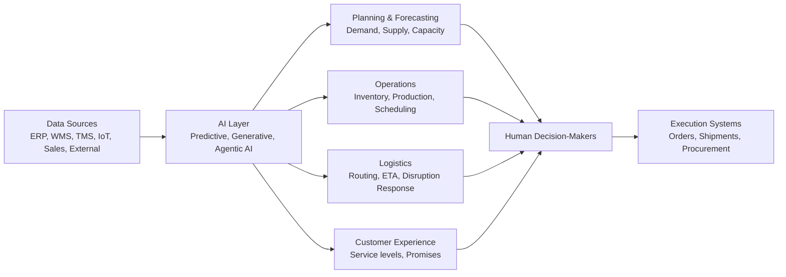

---
aliases:
  - Supply Chain AI
date_created: 2026-05-06
date_modified: 2026-05-27
tags: [Supply-Chain-AI, Enterprise-AI]
cf_last_run: "2026-05-27T01:20:59.654Z"
cf_last_run_model: "Perplexity sonar-pro"
site_uuid: 453b2ba0-2550-4a4b-affd-1eacfdf50d69
publish: true
title: "AI-Powered Supply Chains"
slug: ai-powered-supply-chains
at_semantic_version: 0.0.1.1
---
[[concepts/AI-Powered Supply Chains|Supply Chain AI]]

# Defining and Describing AI-Powered Supply Chains

_*AI-powered supply chains use machine learning and other AI techniques to continuously sense, decide, and act across the end‑to‑end supply network, turning noisy data into faster, more resilient decisions.*_

An **AI-powered supply chain** is a supply chain in which key management processes—such as forecasting, inventory optimization, production planning, and logistics—are supported or automated by AI models that learn from large volumes of internal and external data. [^cigsb5] [^i3w8cn] [^xm4dgu] It applies wherever organizations need to manage complex, global flows of materials and products under uncertainty, from consumer retail to industrial manufacturing and logistics. [^0x9tbf] [^99zoc3] This matters because AI enables **predictive analytics**, real‑time monitoring, and automated decision intelligence that “reduce risks, operational errors, delays and waste, while simultaneously improving the customer journey” and resilience. [^cigsb5] [^0x9tbf] [^i3w8cn] Emerging forms such as **predictive, generative, and agentic AI** are expanding these capabilities from forecasting toward autonomous agents that can simulate scenarios, recommend or execute actions, and interact with humans in natural language. [^cigsb5] [^99zoc3] [^i3w8cn]

# Uses in Context

- Consultants and analysts use the term to describe **resilient operations**, arguing that “AI-powered decision intelligence is a fundamental requirement for resilience,” enabling supply chains to anticipate disruptions and optimize performance. [^cigsb5] [^0x9tbf]  
- Policy and globalization discussions invoke AI-powered supply chains as drivers of new trade patterns, with the World Economic Forum noting that **AI enables supply chains to “simulate alternative sourcing strategies, anticipate logistics bottlenecks and orchestrate responses.”**[^99zoc3]  
- Technology vendors describe **AI-powered supply chain management** as combining “predictive, generative, and agentic capabilities to help organizations sense disruptions, predict outcomes, prescribe actions, and automate decisions.”[^i3w8cn]  
- Logistics and procurement content uses “modern AI supply chains” to mean blueprints where AI is embedded in planning, buying, and logistics to “build, measure, and scale AI-powered supply chains to accelerate business outcomes.”[^bhm006]  
- Implementation guides frame AI-powered supply chains around concrete use cases such as “forecasting demand, optimizing inventory, or anticipating disruptions,” presenting AI as a way to act “faster, smarter, and with more confidence.”[^b8qt3n]  

# History of Use

## Origins

- The underlying idea of using AI techniques (especially machine learning) in supply chains appears in academic work from the 1990s and 2000s on **AI for logistics and demand forecasting**, but the explicit phrase **“AI-powered supply chains”** is largely a 2010s–2020s industry and consulting coinage used in blogs, trade press, and vendor content. [^cigsb5] [^0x9tbf] [^bhm006] [^i3w8cn]  
- Thought‑leadership articles such as *“AI-Powered Supply Chains: Building Resilience in a Complicated World”* on SupplyChainBrain and similar pieces in supply-chain management reviews popularize the term in the context of post‑COVID resilience and digital transformation. [^cigsb5] [^0x9tbf]  

*(The exact first printed use of the literal phrase “AI-powered supply chains” is not clearly documented in accessible sources; it appears to have emerged organically across trade and vendor writings rather than from a single seminal paper or book.)[^cigsb5] [^0x9tbf] [^bhm006]*

## Evolution

- **c. 2015–2019 – From advanced analytics to “AI in supply chain.”** As cloud computing and machine learning matured, supply chain discussions shifted from generic “advanced analytics” to “AI in supply chain management,” focusing on demand forecasting and inventory optimization use cases. [^i3w8cn] [^b8qt3n] [^xm4dgu]  
- **2020–2022 – Resilience and disruption focus.** After COVID‑19 and geopolitical disruptions, industry reports framed “AI-powered supply chains” as tools to “fortify supply chains against uncertainty” using predictive analytics, IoT-enabled real‑time monitoring, and digital twins. [^0x9tbf] [^xm4dgu]  
- **2023–2026 – Generative, agentic, and decision intelligence.** Vendors and experts began emphasizing **generative**, **agentic**, and **decision intelligence** approaches, where AI “creates ‘agents’ that are capable of independently handling a variety of individual tasks” and supports natural‑language interactions and autonomous decision support across planning and logistics. [^cigsb5] [^99zoc3] [^i3w8cn]  

# Best Real-World Examples

- [Kinaxis RapidResponse](https://www.kinaxis.com/) – A supply-chain planning platform explicitly positioning its **AI in supply chain management** as a mix of predictive, generative, and agentic capabilities to sense disruptions and prescribe or automate actions. [^i3w8cn]  
- [JD.com AI-Driven Supply Chain](https://www.youtube.com/watch?v=xmrbjb209XU) – JD.com’s in‑house AI system that uses advanced forecasting, operations research, and an AI chatbot interface to optimize inventory, replenishment, and order fulfillment across hundreds of millions of SKUs. [^h02cjx]  
- [NetSuite AI in Supply Chain Management](https://www.netsuite.com/) – ERP vendor example where embedded AI is used to “tame disruptions, cut costs, and build a more resilient, agile, and competitive operation” through better predictions and automation. [^xm4dgu]  
- [Centric Consulting AI Supply Chain Optimization](https://centricconsulting.com/) – Consulting practice showcasing practical AI deployments for “forecasting demand, optimizing inventory, or anticipating disruptions,” illustrating how mid‑market companies adopt AI-powered supply chains. [^b8qt3n]  
- [World Economic Forum – AI-powered supply chains and regional ecosystems](https://www.weforum.org/) – Policy‑oriented framing of AI-enabled supply chains that can simulate sourcing strategies and orchestrate global and regional flows. [^99zoc3]  
- [Amazon Business – Modern AI supply chains blueprint](https://business.amazon.com/) – A large adopter’s blueprint for “AI-powered supply chains” focused on how buyers can embed AI into procurement and logistics processes. [^bhm006]  

# Case Studies

**Case Study 1: JD.com’s AI-Driven Supply Chain Optimization**

JD.com, a major Chinese e‑commerce company, has built an AI-driven supply chain system that integrates forecasting, replenishment, and order fulfillment into a single optimization engine. [^h02cjx] In a public technical talk, JD.com’s team describes an “AI-based system that leverages artificial intelligence” for planning, replenishment, and fulfillment, with the key advantage that it can “dynamically combine these capabilities” to achieve global optimization across the entire supply chain when adjusting inventory, fulfilling orders, or optimizing the flow of goods. [^h02cjx] The system learns from past transactions, using AI tools that “pick up what we learned from historical data” to do self‑learning, and this led to “almost 15% increase in prediction accuracy.”[^h02cjx] JD.com also adds an AI chatbot interface so that planners can simply ask in natural language about inventory levels or future sales and have the system translate these requests into mathematical models, automatically generate code, pull relevant data, and solve optimization problems, even supporting what‑if analysis such as changing warehouse capacity or dealing with truck breakdowns. [^h02cjx] This case shows how an AI-powered supply chain can connect machine learning, operations research, and conversational interfaces to both automate and *explain* decisions, changing “the structure of the entire organization” toward people working with AI on decisions that were previously made manually. [^h02cjx]  

**Case Study 2: Resilient, AI-Powered Supply Chains in a Volatile World**

Industry analyses argue that organizations facing global volatility are moving from traditional planning to **AI-powered decision intelligence** across their supply chains. [^cigsb5] [^0x9tbf] [[SupplyChainBrain]] describes that AI “reduces risks, operational errors, delays and waste, while simultaneously improving the customer journey,” and that “the data unequivocally points to a future where AI-powered decision intelligence is a fundamental requirement for resilience.”[^cigsb5] Complementary articles in supply chain management reviews highlight that companies are investing in AI-driven predictive analytics, [[Vocabulary/Internet of Things|IoT]] IoT-enabled real-time monitoring, digital twins, and automation “to fortify supply chains against uncertainty.”[^0x9tbf] In practice, this means mapping the supply chain to identify where AI can most impact resiliency and productivity, gathering data from sales to logistics, and then deploying predictive and agentic AI to sense disruptions, simulate scenarios, and automate or recommend responses. [^cigsb5] [^0x9tbf] The resulting AI-powered supply chains can anticipate issues such as demand spikes or logistics bottlenecks, re‑optimize sourcing and routing, and maintain service levels, illustrating how AI shifts supply chains from reactive to proactive and adaptive systems. [^cigsb5] [^0x9tbf] [^99zoc3]  

**Case Study 3: Vendor-Led AI in Supply Chain Management**

Specialist planning vendors have begun to productize AI-powered supply chains as end‑to‑end offerings that smaller firms can adopt. [[Kinaxis]], for example, defines **AI in supply chain management** as combining “predictive, generative, and agentic capabilities to help organizations sense disruptions, predict outcomes, prescribe actions, and automate decisions,” positioning these as core to concurrent planning across functions. [^i3w8cn] Implementation guides from consulting firms show that organizations adopt such platforms to address concrete problems—“forecasting demand, optimizing inventory, or anticipating disruptions”—using AI to act “faster, smarter, and with more confidence.”[^b8qt3n] [[Vocabulary/Enterprise Resource Planning|ERP]] providers similarly embed AI into supply chain workflows, with [[Tooling/Enterprise Jobs-to-be-Done/NetSuite|NetSuite]] emphasizing that AI in supply chain management can “tame disruptions, cut costs, and build a more resilient, agile, and competitive operation,” particularly by improving visibility and decision speed. [^xm4dgu] This case illustrates how AI-powered supply chains are diffusing beyond early innovators like large e‑commerce platforms, as packaged tools allow mid‑sized manufacturers, distributors, and retailers to access predictive, generative, and agentic capabilities without building their own AI stacks from scratch. [^i3w8cn] [^b8qt3n] [^xm4dgu]

***

# Sources

[^cigsb5]: [AI-Powered Supply Chains: Building Resilience in a Complicated ...](https://www.supplychainbrain.com/blogs/1-think-tank/post/42079-ai-powered-supply-chains-building-resilience-in-a-complicated-world)
[^0x9tbf]: [Building resilient supply chains: How AI, automation, and emerging…](https://www.scmr.com/article/building-resilient-supply-chains-how-ai-automation-and-emerging-technologies-are-shaping-the-future-of-global-trade)
[^99zoc3]: [How globalization is being shaped by AI and regionalized supply ...](https://www.weforum.org/stories/2026/02/ai-powered-supply-chains-and-regional-ecosystems-shaping-globalization/)
[^h02cjx]: [AI-Driven Supply Chain Optimization at JD.com - YouTube](https://www.youtube.com/watch?v=xmrbjb209XU)
[^bhm006]: [Modern AI supply chains: A blueprint for business buyers](https://business.amazon.com/en/blog/ai-supply-chain)
[^i3w8cn]: [What is AI in supply chain management? - Kinaxis](https://www.kinaxis.com/en/what-ai-supply-chain-management)
[^b8qt3n]: [7 Ways AI Helps With Supply Chain Optimization - Centric Consulting](https://centricconsulting.com/blog/7-ways-ai-helps-with-supply-chain-optimization/)
[^xm4dgu]: [AI in Supply Chain Management - NetSuite](https://www.netsuite.com/portal/resource/articles/erp/ai-supply-chain-management.shtml)
