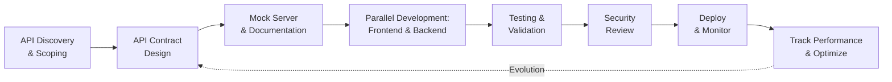

# Defining and Describing API First Development

_API-first development reverses traditional software engineering by designing how systems communicate before building the systems themselves, transforming disjointed development teams into coordinated parallel forces._

API-first development represents a fundamental shift in how engineering organizations approach building digital products and services. Rather than constructing application logic first and then exposing an API as an afterthought, **API-first development treats the Application Programming Interface as the primary architectural artifact from day one**. [^o2hnew] [^o2hnew] In practice, this means that software teams design and agree upon the interface contract—the formal specification defining exactly what data flows between systems and how—before writing any implementation code. [^tzq8xg] [^tzq8xg] This strategy has achieved remarkable penetration in the industry, with 74% of developers now claiming to practice API-first development as of 2024, representing a substantial increase from 66% just one year earlier. [^o2hnew] [^hd9sao] The approach applies across multiple domains: microservices architecture, platform products, headless commerce, AI system integration, and internal developer platforms all benefit from centering API design as the organizing principle for development work.

---

## Defining and Describing API First Development

### Core Concept and Scope

API-first development is best understood as a working principle rather than a rigid methodology. **API-first is a software development strategy where engineering teams center the API and start there before building any other part of the product**. [^o2hnew] [^o2hnew] When organizations adopt this approach, they enable frontend, backend, quality assurance, and infrastructure teams to work simultaneously without creating integration bottlenecks—each team can build against the same formal API contract in parallel. [^o2hnew] The most common instantiation, known as design-first API development, **structures the entire development lifecycle around the API contract, which becomes a single, shared blueprint**. [^o2hnew] [^o2hnew] This contract typically takes the form of a machine-readable specification such as OpenAPI (formerly Swagger), GraphQL Schema Definition Language (SDL), or AsyncAPI, depending on the communication patterns and audiences involved. [^o2hnew] [^tzq8xg]

The increased adoption of API-first methodology reflects deeper shifts in software architecture. **This switch is necessitated by the increased complexity of software systems, which require a structured approach that may not be possible with code-first software development**. [^o2hnew] [^o2hnew] Traditional code-first teams prioritize getting a working product to market quickly, often building application features first and then retrofitting an API layer once the core functionality stabilizes. This approach worked adequately when products targeted single platforms and integration scenarios were limited, but modern digital ecosystems demand fundamentally different engineering patterns. Products now need to serve web applications, native mobile applications, third-party partner integrations, and increasingly, autonomous AI agents, all consuming the same business logic through different interfaces. The code-first model creates brittle integrations, duplicated logic across codebases, and coordination delays whenever system boundaries need to evolve.

By contrast, **API-first development emphasizes planning how systems will interact before writing production code, often taking a design-first form where the API contract comes before any implementation**. [^o2hnew] [^o2hnew] Once stakeholders agree on the initial scope and requirements, teams begin drafting specifications like an OpenAPI spec that define endpoints, request and response schemas, error handling, and authentication requirements. [^o2hnew] **The contract informs each team what they must do and allows them to work in parallel**. [^o2hnew] Frontend developers can immediately begin building user interfaces against mock servers that simulate the API, generating realistic test data according to the specification. [^o2hnew] Backend engineers build actual implementations against the same contract. QA engineers write automated tests before any code exists. This parallelization dramatically accelerates delivery while reducing integration surprises that plague code-first projects.

### The Contract as Single Source of Truth

The defining characteristic of API-first development is the elevation of the API contract to become the **single source of truth** across all development teams and stages. [^tzq8xg] [^tzq8xg] [^tzq8xg] **Contract-first development means designing your interface specification before writing any implementation code—you define endpoints, payloads, and error handling in a specification like OpenAPI, get stakeholder agreement, and version-control it**. [^tzq8xg] [^tzq8xg] [^tzq8xg] This contract then governs every downstream activity: it determines what the backend engineers implement, what data flows the frontend engineers consume, what test scenarios QA engineers validate, and how external partners or AI agents interact with the system.

The discipline this introduces fundamentally changes development culture. **Without formal contracts, API-first development often fails because teams work from different assumptions about data structures, authentication, and error handling**. [^tzq8xg] [^tzq8xg] [^tzq8xg] Many organizations attempt to adopt API-first principles without fully committing to contract-first methodology, leading to situations where multiple teams still maintain conflicting mental models of what the API should be. These efforts typically collapse into the same integration chaos that code-first teams experience. Successful API-first organizations treat their API specifications with the same rigor as version-controlled source code, running linting checks in continuous integration pipelines, requiring peer review before contract changes, and maintaining clear deprecation timelines when APIs evolve. [^o2hnew] [^og3peq] [^h1tz6n]

---

## Uses in Context

### Platform and Ecosystem Development

The first and most prominent use case for API-first development appears in organizations building platform products—systems designed to serve multiple consumers with diverse needs through standardized interfaces. **An API-first approach treats APIs as primary citizens in product development, and rather than bolting APIs on after the product is built, teams define and design APIs before writing any business logic or user interface code**. [^ns1ruw] [^ns1ruw] This pattern particularly benefits companies serving enterprise customers, partners, and third-party developers simultaneously. Platform teams recognize that **API-first architecture includes modularity**, enabling different components to scale independently as system load and feature sets grow. [^gbhji9] Consider a payment processing platform: rather than building a web-based merchant dashboard and then exposing transaction data through an API, an API-first platform team would first design the complete set of resources, operations, and data structures needed across all consumer scenarios—merchant dashboards, mobile applications, partner systems, and financial reporting tools. The platform then exposes these capabilities uniformly through well-designed APIs, with the web dashboard becoming just another consumer of the same API layer.

### Microservices and Distributed System Coordination

API-first development has become nearly synonymous with microservices architecture in enterprise settings, where organizations decompose monolithic applications into independently deployable services communicating through APIs. **API-first and microservices go hand in hand as both are concerned with the concept of product-linking design within the context of an application**. [^gbhji9] In microservices environments, API contracts between services function as formal agreements about data interchange, preventing hidden dependencies that would otherwise couple services tightly together. Each microservice team can own and evolve their API surface independently if they maintain backward compatibility, allowing organizations to parallelize development across dozens or hundreds of autonomous teams. **This approach enables business leaders to align technology with strategic goals, reduce integration complexity, and build scalable systems that can evolve with market demands from day one**. [^og3peq] Companies like Netflix, Google, and Uber have built extensive microservices networks where thousands of internal services communicate through APIs, with each service team responsible for designing, versioning, and documenting their API surface according to platform standards. [^d9sjkp] [^5fgu5o] [^1k6ht7]

### Legacy System Modernization and Strangler Fig Pattern

An increasingly important use case involves API-first strategies for modernizing aging monolithic applications without the risk of disruptive full rewrites. **Platform engineering supports the gradual modernization of legacy systems by creating the infrastructure and tooling that make incremental change safe, fast and repeatable**. [^fkb5pk] Organizations adopt the Strangler Fig Pattern, where new API-driven microservices are built alongside legacy systems, with external requests gradually migrated from the old monolith to new services. **At the core of this approach are secure, well-governed APIs that expose legacy functions behind stable, decoupled interfaces, helping define clear service boundaries, enforce explicit contracts and reduce hidden dependencies during the breakup process**. [^fkb5pk] This strategy allows enterprises to modernize without shutdown windows or massive coordination overhead. Rather than replacing entire systems in one move, API-first modernization creates a transition period where both old and new systems operate in parallel, with the API layer acting as the integration point.

### AI Agent Integration and Autonomous Systems

A rapidly emerging use case for API-first development involves integrating autonomous AI agents directly into business workflows and customer-facing systems. **APIs already account for 71% of all internet traffic, but here's what most companies are missing: AI is about to become the biggest API consumer ever**. [^2ky25p] This perspective requires rethinking API design fundamentally. Traditional APIs prioritized human developers as consumers; modern API-first platforms must be designed for AI systems. **An API-first AI company designs its platform so that it's built for AI systems, not just humans, with the API serving as the primary interface through which intelligence is built, deployed, and operated, instead of a secondary integration layer released after the fact**. [^sk5uq6] In such architectures, **every capability available in the product is exposed programmatically, allowing teams to build custom AI agents that understand their domain, customers, and edge cases while operating directly inside of production systems**. [^sk5uq6] Companies like PTV Logistics have built AI agents powered by their API infrastructure, enabling customers to ask natural language questions and receive instant, data-backed answers powered by real optimization engines. [^5fgu5o] Similarly, **Plain demonstrates how full API exposure supports customized AI agent development**, [^1k6ht7] treating AI agents as first-class consumers alongside human teams and external partners.

### Developer Experience and Velocity Acceleration

API-first development has become recognized as a critical lever for improving developer experience—the collective ease with which engineers can understand, build on, and integrate systems. **Prioritizing the API can bring many benefits, like better cohesion between different engineering teams and a consistent experience across platforms**. [^o2hnew] [^o2hnew] When API contracts are designed thoughtfully with developer needs in mind, implementation becomes straightforward; when contracts are poorly designed, even simple tasks become frustrating for consumers. API-first organizations report measurably faster delivery: **63% of developers can now produce an API in under one week**, demonstrating how standardized API-first approaches streamline development workflows and reduce time-to-market. [^hd9sao] Furthermore, **a Forrester-modeled study examining Azure API Management found that organizations achieved 50% faster time-to-market for new services and products**, [^hd9sao] with substantial cost savings from retiring legacy infrastructure and significant productivity improvements across API development and policy configuration processes. [^hd9sao]

### Financial Services and Embedded Finance

In fintech and banking, API-first development enables the rapid emergence of embedded finance—financial services integrated seamlessly into non-financial applications. **In fintech and banking, API is used as a method of communication between third parties and online banking systems, allowing banking services to be embedded into various platforms and applications, providing customers with a seamless and convenient experience**. [^cax7sv] **Banks can offer new products and services without having to develop them themselves through APIs**, [^cax7sv] and **financial institutions can also monetize their APIs, opening up new revenue streams by enabling third-party developers to access and utilize these APIs**. [^cax7sv] The history of banking APIs reflects this evolution: Salesforce pioneered SaaS APIs in 1999, but banking followed its own path. Modern API-first banks expose hundreds of carefully designed endpoints managing accounts, payments, card integrations, onboarding, and compliance workflows, enabling fintech partners to build applications that would be impossible without this programmatic access. [^cax7sv]

---

## History of Use

### Origins

The term "API" itself dates back much further than the modern API-first movement. **The term API is not new and dates back to the 1960s, with the first formal mention found in a 1968 article entitled 'Data structures and techniques for remote computer graphics' by Wilkes and Needham**. [^h64g4s] In those early decades, APIs were internal libraries allowing applications to communicate with operating systems within single machines, not public interfaces for external consumption. [^h64g4s] The concept remained largely internal to organizations through the 1970s and 1980s. **In the 1970s, with the rise of mainframes, IBM and other companies were already talking about programming interfaces, but the focus was purely internal: optimising how programmes were built within an organisation**. [^h64g4s]

The shift toward public APIs emerged in the 1990s as the internet became commercially viable and software companies recognized business value in enabling external developers. **In the 1990s, giants such as Microsoft began releasing APIs so that external developers could build Windows-compatible applications**. [^h64g4s] This represented a crucial inflection point: companies began viewing their APIs as products for external consumption, not merely internal technical details. However, the truly transformative moment came in 1999 when Salesforce revolutionized the business model by becoming one of the first SaaS services to offer a public API, laying the foundation for the modern concept of a platform. [^h64g4s] Amazon and eBay followed in 2002, launching their first public APIs and demonstrating that external developers could access catalogs, place orders, and manage payments automatically through programmatic interfaces. [^h64g4s]

The API-first *development methodology* as a strategic approach—rather than APIs as technology—emerged later in response to increasing software complexity. The modern API-first movement crystallized in the 2010s, particularly as REST (Representational State Transfer) architecture became the dominant paradigm. **In 2004, Roy Fielding, co-author of HTTP, defined REST, an architecture that dramatically simplified the creation of web APIs, using the same principles as web browsing: URLs, HTTP methods (GET, POST, PUT, DELETE) and responses in JSON**. [^h64g4s] REST provided a standard vocabulary and mental model that made it practical for large teams to design APIs consistently. Organizations then began asking: if REST APIs are so important, and we need so many of them, shouldn't we design them *first* rather than last?

### Evolution

The evolution of API-first development as a formal methodology shows three major inflection points where the concept was adapted, redefined, or expanded:

**2015: GraphQL and the Expansion of API Design Paradigms.** While REST remained dominant, the introduction of GraphQL represented a significant expansion in how teams could think about API design and consumer needs. **Facebook launched GraphQL, an alternative to REST that allows clients to define exactly what data they want to receive, reducing the volume of data transmitted and improving performance**. [^h64g4s] This innovation forced API-first thinking beyond the REST/RPC dichotomy. Teams now had to consider whether their APIs should follow RESTful resource patterns, GraphQL's flexible query language, gRPC's high-performance protobuf-based communication, or other emerging patterns. API-first development matured into a more nuanced discipline where the choice of API style itself became part of the upfront design conversation. [^h64g4s]

**2018-2020: Microservices at Scale and Enterprise Adoption.** As organizations deployed microservices architectures across hundreds of teams, API-first development transitioned from an optional best practice to an operational necessity. **Today, multiple API styles coexist (REST, GraphQL, gRPC, SOAP), but the core concept is the same: opening your software to the world to connect, collaborate, and innovate, and since then, talking about 'API-first' means talking about a strategic approach where you build the API first, then everything else (web, apps, etc.)**. [^h64g4s] Enterprise platform teams realized they could not coordinate work across scores of microservice teams without formal API contracts and governance. API management platforms matured, specification tools like Swagger/OpenAPI became industry standards, and CI/CD pipelines incorporated API contract validation as a fundamental quality gate.

**2023-2026: AI Integration and the Emergence of API-First as Business Strategy.** The explosion of AI capabilities fundamentally redefined how organizations think about API-first development. **The shift toward API-first development has moved from a technical trend to a business imperative, with recent industry research revealing compelling evidence that organizations adopting API-first strategies are not only accelerating their development cycles but also achieving measurable competitive advantages in the marketplace**. [^hd9sao] **Organizations showing 12.7% higher market capitalization growth compared to competitors are those who recognize API-first as a strategic architectural choice, not merely a technical practice**. [^hd9sao] AI agents consuming APIs directly—without human intermediaries—created entirely new design considerations. Teams began building APIs not just for other developers but explicitly for autonomous systems, requiring new thinking about error handling, pagination, and state management. By 2024-2025, API-first had crystallized as table stakes rather than differentiation: **74% of developers claimed to be API-first in 2024**, representing mainstream adoption that would have seemed remarkable just five years prior. [^o2hnew] [^hd9sao]

---

## Best Real-World Examples

**Stripe** stands as perhaps the canonical example of API-first development in fintech. **When Patrick Collison launched the first version, the product was seven lines of code a developer could paste into a checkout**, establishing Stripe as fundamentally API-first from inception. [^za6bdr] This obsession with API simplicity and developer experience has defined Stripe's entire evolution. **Stripe's evolution from seven lines of code to a sophisticated global payments API demonstrates that simplicity and power are not opposing goals; the challenge is creating abstractions that handle complexity internally while presenting a predictable, consistent interface to developers**. [^2f8gkb]

**Twilio** built an entire communications platform on API-first principles, recognizing that **through APIs, many manual tasks can be automated, allowing for seamless transitions between linked applications**. [^3il4p3] Twilio's APIs for making calls, sending messages, and taking videos in the cloud enabled thousands of developers to build communications capabilities into applications that never would have invested in building these systems themselves. [^gbhji9]

**Netflix** employs API-first architecture throughout its recommendation and ranking systems, where thousands of internal services communicate through APIs. [^d9sjkp] The company's architecture follows a **three-stage pipeline that progressively narrows the candidate set, with multiple generators running in parallel and results merged together**, all coordinated through APIs and a centralized feature store ensuring consistent computation during both training and serving. [^d9sjkp]

**PTV Logistics** recently launched an interactive AI agent built on its API-first, AI-powered platform, enabling users to interact with real logistics intelligence through natural language questions powered by real optimization. [^5fgu5o] This exemplifies how API-first infrastructure enables AI agents as first-class consumers. [^sk5uq6]

**Plain** demonstrates how **full API exposure supports customized AI agent development**, with Plain's GraphQL API providing complete feature parity with its user interface, meaning anything a human can do, an agent can do through the API. [^1k6ht7]

**Salesforce** pioneered the SaaS API model in 1999, **revolutionizing the business model by becoming one of the first SaaS services to offer a public API, allowing developers to integrate their own apps directly with Salesforce, laying the foundation for the modern concept of a platform**. [^h64g4s]

**Amazon and eBay** demonstrated the business case for public APIs at massive scale, **launching their first public APIs in 2002, allowing other websites to consult their catalogues, place orders and manage payments automatically**. [^h64g4s]

---

## Case Studies

### Stripe: From Seven Lines of Code to Global Payments Infrastructure

Stripe represents the most celebrated example of API-first development philosophy executed at scale across an entire company. When Patrick Collison and John Collison founded Stripe in 2010, they rejected the prevailing payment processing model where integrating payments required extensive documentation, support tickets, and complex server-to-server negotiations. Instead, they designed Stripe's API from scratch to be consumable by developers with minimal friction—**the product was seven lines of code a developer could paste into a checkout**. [^za6bdr] This singular focus on API simplicity and developer experience became Stripe's organizing principle.

Over fifteen years, Stripe has evolved from a simple charge API to a comprehensive global payments platform handling complex requirements like subscription billing, merchant underwriting, fraud detection, and multi-currency settlement. Yet throughout this evolution, Stripe maintained its commitment to API-first design. **Stripe's challenge has been creating abstractions that handle complexity internally while presenting a predictable, consistent interface to developers**. [^2f8gkb] As Stripe added capabilities—tokenization, sources, webhooks, Connect for marketplace payments—each addition required careful API design to maintain consistency and predictability. The company made deliberate architectural decisions, such as combining tokens and bitcoin receivers into a unified state machine called a Source, demonstrating how **when created, a Source could be immediately chargeable, like credit cards, or pending, like payment methods requiring customer action**. [^2f8gkb]

The results speak to the business impact of API-first development. Stripe became the dominant payments processor for internet businesses because developers preferred building with Stripe's clean, well-documented APIs over competitors' offerings. The company's ability to scale internationally, add new payment methods, and evolve its platform while maintaining backward compatibility reflects API-first discipline. Today, Stripe's infrastructure processes trillions of dollars annually through the same API abstraction layers. This case demonstrates a critical insight: **API-first development is not a technical optimization—it's a business strategy that aligns product vision with developer needs, enabling exponential growth through viral adoption among a global developer community**.

### Netflix: Scaling Recommendations Through API-First Microservices

Netflix demonstrates how API-first architecture enables operational complexity at unprecedented scale. The company serves hundreds of millions of subscribers globally, each experiencing personalized recommendations. Netflix's architecture for this consists of thousands of internal microservices coordinating through APIs to rank millions of content items for billions of user sessions. **Netflix's architecture follows a three-stage pipeline that progressively narrows the candidate set: Stage 1 Candidate Generation narrows tens of thousands of titles to roughly 10,000 per user, with multiple generators running in parallel (collaborative filtering, content-based filtering, trending signals, new release injection), and their results are merged**. [^d9sjkp]

**Stage 2 Ranking scores those 10,000 candidates using deep neural networks fed by a centralized feature store, including user history, item metadata, context (time of day, device), and interaction data**. [^d9sjkp] This centralized feature store represents a critical API-first design pattern: by treating features as a service with a well-defined API contract, Netflix ensures that training pipelines and real-time serving use identical computations, preventing the silent performance degradation that plagues machine learning systems when train-serve skew occurs. [^d9sjkp]

**Stage 3 Re-Ranking applies diversity injection to prevent genre domination, explore-vs-exploit balancing to prevent filter bubbles, freshness boosting, and business constraints like regional licensing**. [^d9sjkp] Each stage interacts with others through APIs, allowing Netflix to parallelize development across autonomous teams. Different teams own candidate generation, ranking algorithms, the feature store, serving infrastructure, and experimentation platforms, yet they collaborate seamlessly through formal API contracts.

The business impact compounds across dimensions. **Netflix runs thousands of concurrent A/B experiments, with every pipeline component from candidate generation to artwork selection testable independently**. [^d9sjkp] This experimental infrastructure exists as an API-first platform itself, with teams able to define experiments through APIs without requiring central infrastructure team involvement. The company's ability to iterate rapidly on recommendations while maintaining infrastructure stability reflects foundational API-first design decisions made long before the company achieved its current scale.

### Plain: Building Customer Infrastructure as API-First Platform for AI Agents

Plain exemplifies the emerging pattern of API-first architecture specifically designed for AI agent consumption. Founded with the recognition that traditional customer support software treats APIs as secondary integration layers, Plain positioned APIs as the foundational architectural layer. **Customer Infrastructure is the foundational layer that enables all customer-facing interactions—support, success, and engagement—to operate through a unified, programmable system**. [^1k6ht7] Unlike legacy support platforms like Zendesk that were built around human workflows and later retrofitted with APIs, **Plain consolidates Slack, Teams, Discord, email, and in-app support into one programmable workspace**. [^1k6ht7]

The critical distinction is philosophical and technical. Traditional support tools require humans or custom integrations to move between channels and resolve issues. Plain's API-first architecture means **every interaction is treated as data that informs product, revenue, and relationship decisions, with the API serving as the primary interface, not a secondary integration layer**. [^1k6ht7] More significantly, **Plain's GraphQL API provides complete feature parity with the UI—anything a human can do, an agent can do**. [^1k6ht7] This design choice was intentional and forward-looking: rather than anticipating what AI agents would need and restricting agent capabilities to a subset of operations, Plain exposed the complete API surface to agents.

The practical impact manifests immediately. Support teams can build custom AI agents using Plain's API that understand their specific domain, customer base, and business rules. An agent can create support tickets, merge conversations across channels, collect information from customers, escalate complex issues to humans, and perform other support operations, all programmatically. The infrastructure treats AI agents as first-class citizens alongside human support agents and external integrations.

This case illustrates a broader principle: **API-first architecture determines whether an organization can adapt to new consumer types (in this case, AI agents) as a native capability or must retrofit support through workarounds**. Plain's founding commitment to API-first design positioned the company to capitalize on the AI agent era without fundamental architectural changes. This forward-looking architectural decision represents the emerging best practice for platform companies anticipating their users will include autonomous systems. [^sk5uq6] [^1k6ht7]

---

## Strategic Value and Business Impact

### Quantified Competitive Advantages

The business case for API-first development has moved beyond theoretical benefits to documented financial impact. **According to Postman's 2024 State of the API Report, 74% of respondents now describe their development approach as API-first, representing a significant jump from 66% in 2023**. [^o2hnew] [^hd9sao] This rapid adoption reflects recognition of concrete competitive advantages. **A Forrester-modeled study examining Azure API Management found that organizations achieved 50% faster time-to-market for new services and products, with substantial cost savings from retiring legacy infrastructure and significant productivity improvements in both API development and policy configuration processes**. [^hd9sao]

More striking: **organizations showing 12.7% higher market capitalization growth compared to competitors are those recognizing API-first as strategic architectural choice**. [^hd9sao] This metric suggests that API-first development advantages compound over years—reduced time-to-market compounds into faster innovation cycles; reduced integration costs compound into improved margins; improved developer velocity compounds into larger feature backlogs. The most disciplined API-first organizations achieve:

**70% fewer integration failures** compared to code-first approaches, since teams validate API contracts before implementation rather than discovering mismatches during integration. [^i6wqpf] **3.2x faster parallel team development** because frontend and backend teams work independently against mock APIs rather than sequentially. [^i6wqpf] **63% of developers can now produce an API in under one week**, indicating that API-first practices have become standardized enough to streamline development. [^hd9sao] These efficiency gains translate directly into business results: faster market entry, reduced defect rates, and improved developer retention through better engineering experiences.

### The API-First Microservices Foundation

API-first development serves as the foundational principle for modern microservices architectures at scale. **API-first microservices architecture delivers its full value when every principle works in concert: contracts defined before code, gateways handling cross-cutting concerns, versioning protecting existing consumers, security enforced at every layer, and testing validating contracts continuously**. [^i6wqpf] Organizations structured around microservices recognize that the only thing between autonomous teams is the API contract. Without formal, well-designed contracts, microservices become tightly coupled through implicit dependencies and informal coordination.

The implementation pattern has crystallized into industry standard practices. **Design contracts first: API-first means writing the OpenAPI specification before writing a single line of implementation code, enabling parallel frontend and backend development and reducing integration failures by up to 70%**. [^i6wqpf] **Choose protocols strategically: REST dominates public APIs, GraphQL excels for complex client-driven queries, and gRPC delivers peak performance for internal service-to-service communication**. [^i6wqpf] **An API Gateway is non-negotiable: A centralized gateway handles cross-cutting concerns—authentication, rate limiting, logging, routing—so individual microservices stay focused on business logic**. [^i6wqpf] **Version early, version semantically: URL path versioning remains the most explicit and widely supported approach, with the clear rule that you never make breaking changes without incrementing the major version**. [^i6wqpf]

Organizations that fail to treat API-first design with discipline typically suffer from microservices chaos, where hundreds of internal services have inconsistent authentication schemes, undocumented contracts, hidden interdependencies, and fragile integrations. By contrast, **organizations adopting API-first discipline report fewer incidents, improved developer experience, and faster time to market as the systematic benefits accumulate**. [^i6wqpf]

### Enabling Platform Products and Ecosystems

API-first development has become the technical prerequisite for building modern platform products—products designed to serve multiple consumer types (web users, mobile users, partners, AI agents) simultaneously through standardized interfaces. **An API-first approach treats APIs as primary citizens in product development, ensuring consistency across services and accelerating delivery across platforms—web, mobile, partner systems, and more**. [^ns1ruw] [^ns1ruw]

The business logic for platforms requires this architecture. A single payment processing platform needs to serve merchant dashboards, mobile applications, partner integrations, and internal reporting systems. Code-first approaches require building separate implementations for each channel, duplicating business logic and creating maintenance nightmares. API-first development builds a single backend implementing complete business logic behind a well-designed API, with frontend and partner integrations consuming the same interface. **A well-documented API might support a mobile app, a customer dashboard, a partner integration, and internal analytics—without rewriting logic**. [^ns1ruw] [^ns1ruw]

**Scalability advantages emerge naturally: API-first platforms are easier to scale horizontally, as you can expose functionality independently and let internal teams or external partners consume services without dependencies on a single UI or stack**. [^ns1ruw] [^ns1ruw] When a specific feature experiences high demand, the backend team can scale that particular service without redeploying entire applications or breaking client integrations. This architectural property reflects the economic advantage of platforms: the unit cost of serving additional consumers decreases as the platform matures.

### Developer Experience as Competitive Differentiator

Modern software companies increasingly recognize that developer experience rivals product user experience as a competitive differentiator. **APIs are independently deployable and customizable, like a box of Legos—a variety of building blocks that can be assembled to create virtually anything—meaning a platform built with an API-first approach can be configured to create solutions for nearly anything**. [^3il4p3] This flexibility directly translates to developer satisfaction and adoption velocity.

**Specific benefits of an API-first approach include easy integrations, where applications and platforms designed with API-first approaches can easily integrate with any API-enabled system, technology stack, or workflow and leverage distinct services to rapidly enhance feature sets**. [^3il4p3] When external developers or partners can build on your API rapidly and reliably, they adopt your platform faster and build more innovative solutions on top. The most successful API platforms (AWS, Stripe, Twilio, Salesforce) have achieved their market dominance partly through superior developer experience—making it trivial for developers to get value from the platform accelerates viral adoption.

API-first development also improves developer experience within organizations through **better cohesion between different engineering teams and a consistent experience across platforms**. [^o2hnew] [^o2hnew] When frontend and backend teams work against a shared contract, they align naturally. When designers implement features using the same API that mobile teams use, they understand mobile constraints. Reduced integration friction means reduced frustration and higher morale across technical teams.

---

## Implementation Considerations and Emerging Challenges

### The Discipline Required for Success

While API-first development offers substantial benefits, realizing these benefits requires sustained organizational discipline. **This strategy has risen in popularity over the years, but this requires additional time and discipline upfront for design and team alignment**. [^o2hnew] [^o2hnew] Many organizations find it tempting to skip the design phase, viewing it as overhead. Teams eager to "get moving" might treat the API contract specification as a checkbox rather than a foundational artifact deserving deep thought.

Organizations must establish clear processes for API governance, version management, and documentation maintenance. **Define your users (whether internal teams, partners, or third parties), design clear, consistent, and versionable contracts, prioritize the developer experience through comprehensive documentation and real-world examples, establish metrics for adoption, performance, and usage, and manage the API's lifecycle (versioning, deprecation, and evolutionary roadmap)**. [^gf54v5] This governance layer requires investment: dedicated roles for API architecture, platforms for specification management, policies for backward compatibility, and standards for authentication and security across all APIs. [^gf54v5]

### Complexity of Legacy System Integration

Organizations attempting to adopt API-first development while maintaining existing monolithic systems face significant integration challenges. **While the API-first approach offers many benefits for integrating AI models with existing systems, there are several challenges that organizations must address**. [^0ig8ke] **Data Compatibility represents a major obstacle: Legacy systems typically store data in outdated formats that may not align with the structured data required by modern API consumers, creating significant barriers when trying to make legacy data accessible**. [^0ig8ke]

**Versioning Complexity emerges as APIs evolve: As APIs evolve, businesses may end up with multiple versions of the same API, with managing these versions and ensuring that each one is functioning as expected becoming time-consuming and complex**. [^0ig8ke] **Backward Compatibility becomes critical: New API versions must be backward compatible with older versions to avoid disruptions, as if a business updates its API but doesn't properly manage versions, it could break communication between systems and other applications**. [^0ig8ke]

Platform engineering approaches have emerged specifically to address these challenges, using the Strangler Fig Pattern to gradually transition from monolithic systems to API-driven architectures. **Platform engineering supports the gradual modernization of legacy systems by creating infrastructure and tooling that make incremental change safe, fast and repeatable**. [^fkb5pk] Rather than attempting a disruptive rewrite, organizations build new API-first services alongside existing systems, incrementally replacing the monolith piece by piece. [^fkb5pk]

### Emerging Challenges from AI Integration

The integration of AI agents as first-class API consumers creates new challenges for API design. **An API-first AI company designs its platform so that it's built for AI systems, not just humans, with the API as the primary interface through which intelligence is built, deployed, and operated**. [^sk5uq6] This requirement demands new thinking about error handling, retry logic, pagination, and state management. Traditional APIs designed for human interaction often assume synchronous request-response patterns and human-readable error messages. AI agents require different guarantees about error recovery, long-running operations, and state consistency.

Additionally, **authorization and security emerge as crucial concerns: APIs can be a target for hackers or unauthorized users, and if not properly secured, they can give access to sensitive data or allow attackers to manipulate AI models, particularly in industries like finance and healthcare, where personal, financial, or medical data is involved**. [^0ig8ke]

### The Role of AI in API Development

Interestingly, AI tools are beginning to transform how teams develop APIs themselves. **92.6% of developers now use AI coding assistants at least once a month, and roughly 75% use one weekly, with roughly 25% of production code now written by AI**. [^adc65z] While this adoption has been rapid, productivity gains remain modest at approximately 10% overall. [^adc65z] This pattern reflects that AI excels at generating boilerplate code and straightforward implementations, but API design—the crucial strategic layer—still requires human judgment about consumer needs, domain modeling, and interface consistency.

The research suggests that **AI succeeds when factors like fast Continuous Integration, clear documentation, and well-defined services are in place**, indicating that API-first discipline (with its emphasis on clear contracts and specifications) may actually improve AI-assisted development by providing clear guardrails. [^adc65z]

---

## Future Directions and Emerging Trends

### API-First and Headless Architecture

API-first development has become foundational to headless commerce and similar architectures where presentation layers decouple completely from business logic layers. **API-first means designing APIs before building frontend or backend systems, making APIs the foundation of your commerce platform**. [^g95dgm] [^g95dgm] In headless commerce, retailers can support web storefronts, mobile applications, in-store kiosks, and third-party integrations from a single commerce backend through carefully designed APIs. This architectural pattern has expanded beyond commerce to content management, customer relationship management, and other domains.

### Specialized API Design Patterns

The industry continues developing specialized patterns for different use cases. **REST dominates public APIs, GraphQL excels for complex client-driven queries, and gRPC delivers peak performance for internal service-to-service communication, with the right choice depending on your consumers**. [^17o18w] Organizations increasingly select from a polyglot API portfolio rather than standardizing on a single style. The Patterns for API Design community has documented dozens of recurring patterns for addressing common challenges like pagination, versioning, rate limiting, and asynchronous operations. [^mjrip0]

### API Monetization as Business Strategy

Organizations increasingly recognize APIs not merely as technical infrastructure but as distinct products with monetization potential. **API monetization is the process of generating direct or indirect revenue from APIs, which could include charging consumers per request, offering premium access tiers, or enabling partners to embed services via APIs**. [^1mxydz] Financial institutions, communications providers, and data companies have pioneered API monetization models. **An API gateway acts as the control layer between consumers and services, playing a vital role in enforcing monetization policies, managing traffic, and collecting usage metrics**. [^1mxydz]

### Market Expansion

The overall API management market reflects the industry-wide shift toward API-first development. **The Global API Management Market is witnessing a robust CAGR of 18.2%, valued at $5.6 billion in 2024, and is expected to appreciate and reach $15.1 billion by 2030**. [^38bj8v] This expansion reflects both the growing number of APIs enterprises need to manage and the increasing sophistication of API management platforms. Tools have evolved from simple testing clients (like the original Postman) to comprehensive lifecycle platforms supporting design, mocking, documentation, testing, security scanning, and governance. [^8y4m8i]

---

## Conclusion

API-first development has evolved from an emerging best practice used by innovative companies like Stripe and Salesforce into mainstream industry standard, with 74% of developers adopting it by 2024. [^o2hnew] [^hd9sao] This transformation reflects recognition that modern software architecture demands formal contracts between system components before implementation begins, enabling parallel development, reducing integration failures, and accelerating time-to-market.

The strategic value extends beyond engineering efficiency. Organizations adopting API-first discipline report 50% faster time-to-market, 70% fewer integration failures, 3.2x faster parallel development, and 12.7% higher market capitalization growth compared to competitors. [^hd9sao] [^i6wqpf] These advantages compound as organizations mature—the discipline required upfront pays continuous dividends through improved agility and reduced technical debt. [^o2hnew] [^o2hnew]

Looking forward, API-first development continues adapting to new consumption patterns. AI agents consuming APIs directly represent a significant expansion of API-first principles; the architecture that enables human developers to build applications can enable autonomous systems to operate within business processes. Organizations building platforms for AI agents must now think carefully about how to design APIs not just for human understanding but for machine interpretation and autonomous decision-making. [^2ky25p] [^sk5uq6]

The most successful organizations recognize that API-first is not merely a technical practice but a strategic commitment that shapes culture, governance, and product direction. When done with discipline—treating API contracts as first-class artifacts, maintaining strict versioning discipline, and investing in comprehensive documentation—API-first development becomes a competitive advantage that compounds over years.

***

# Sources

[^o2hnew]: [API-First Development: Top Tools, Advantages, & Challenges](https://getstream.io/blog/api-first-development/)
[^2ky25p]: [What is an API First Approach? - YouTube](https://www.youtube.com/shorts/5AbeDEmqL_0)
[^gbhji9]: [What Is API-First Development? OpenAPI Specification](https://payproglobal.com/answers/what-is-api-first-development/)
[^u4up8i]: [When To Use an API-First Strategy | SS&C Blue Prism](https://www.blueprism.com/resources/blog/api-first/)
[^ns1ruw]: [Developing Platform Products with API-First Strategy - Agile Seekers](https://agileseekers.com/blog/developing-platform-products-with-api-first-strategy)
[^h64g4s]: [The History of APIs: What was the first API? - YusApi S.L.](https://yusapi.com/blog-english/the-history-of-apis-what-was-the-first-api/)
[^ehav56]: [Why API-first is the key to fast development and scalable AI ...](https://www.contentful.com/blog/what-is-api-first/)
[^fkb5pk]: [Inside the API-First Shift: How Platform Engineering Enables ...](https://platformengineering.com/features/inside-the-api-first-shift-how-platform-engineering-enables-incremental-legacy-breakup/)
[^og3peq]: [API-first development: 2026 guide - N-iX](https://www.n-ix.com/api-first-development/)
[^za6bdr]: [Why API-First SaaS Companies Are Winning in 2026](https://www.saasmag.com/api-first-saas-winning/)
[^3il4p3]: [API-First: Your Program Optimized - Nelnet Inc](https://nelnet.com/insights/api-first-your-program-optimized/)
[^hd9sao]: [What Industry Research Reveals About APIs | Sep 23, 2025 - Inlayer](https://www.inlayer.com/resources/post/what-industry-research-reveals-about-apis)
[^sk5uq6]: [5 Examples of API-First AI Agents](https://nordicapis.com/5-examples-of-api-first-ai-agents/)
[^2f8gkb]: [The First 10-Year Evolution of Stripe's Payments API](https://blog.bytebytego.com/p/the-first-10-year-evolution-of-stripes)
[15]: [Build your next project with Twilio](https://www.twilio.com/en-us/lp/dv-startbuilding)
[^g95dgm]: [What Is API-First Architecture in Headless Commerce?](https://builder.aws.com/content/38epsPCCWMGI84oSPsOb6qq1hiy/what-is-api-first-architecture-in-headless-commerce)
[^xd6uiy]: [GraphQL | The query language for modern APIs](https://graphql.org)
[^tzq8xg]: [API-First Development: Building for Flexibility and Scale - Strapi](https://strapi.io/blog/api-first-development-guide)
[^cz03ic]: [API management ROI: A complete guide for beginners - DigitalAPI](https://www.digitalapi.ai/blogs/api-management-roi)
[^i6wqpf]: [API-First Development: Microservices Architecture - Digital Applied](https://www.digitalapplied.com/blog/api-first-development-microservices-architecture-guide)
[^h1tz6n]: [Implementing API Design First in .NET - DZone](https://dzone.com/articles/implementing-api-design-first-ci-cd-testing)
[^0ig8ke]: [API-First AI Integration: Connecting Custom AI Models to Existing ...](https://smartdev.com/api-first-ai-integration-to-existing-systems-without-disruption/)
[^lc9ldr]: [Why APIs Are Becoming Obsolete for Data Access - ScrapeGraphAI](https://scrapegraphai.com/blog/why-apis-are-becoming-obsolete)
[^adc65z]: [This CTO Says 93% of Developers Use AI, but Productivity Is Still 10%](https://shiftmag.dev/this-cto-says-93-of-developers-use-ai-but-productivity-is-still-10-8013/)
[^gf54v5]: [API-First: what it is, benefits, and step-by-step implementation](https://chakray.com/api-first-strategy-real-world-implementation-to-optimize-performance-security-and-scalability/)
[^8y4m8i]: [Swagger vs. Postman: Which Is Best for Enterprise API Development?](https://swagger.io/blog/swagger-vs-postman-enterprise-api-development/)
[^gua3gq]: [What is Stoplight Prism Mock and How to Use it? - Apidog](https://apidog.com/blog/prism-mock/)
[^pic8re]: [PACT Contract Testing - Because Not Everything Needs Full ...](https://devblogs.microsoft.com/ise/pact-contract-testing-because-not-everything-needs-full-integration-tests/)
[^mb1z4b]: [CI/CD API Security: A Complete Automation Guide | APIsec](https://www.apisec.ai/blog/api-security-testing-automation-in-ci-cd-pipelines-complete-setup-guide)
[^u0mqlq]: [API Observability: Tools and Best Practices for Developers - Zuplo](https://zuplo.com/learning-center/api-observability-tools-and-best-practices)
[^cax7sv]: [API Banking: The Power, Definitions, Types, and Benefits - SDK.finance](https://sdk.finance/blog/api-in-banking-types-and-benefits/)
[^d9sjkp]: [How Netflix, Uber, and Google Build AI Systems: Architecture Deep ...](https://dev.to/matt_frank_usa/how-netflix-uber-and-google-build-ai-systems-architecture-deep-dive-17g5)
[33]: [B2B Ecommerce: What it is and 10 Case Study Examples](https://business.adobe.com/blog/perspectives/b2b-ecommerce-10-case-studies-inspire-you)
[^5fgu5o]: [PTV Logistics launches an interactive AI Agent bringing logistics ...](https://www.ptvlogistics.com/en/resources/news/company/ptv-logistics-launches-interactive-ai-agent-bringing-logistics-intelligence)
[^1k6ht7]: [Why API-First Infrastructure wins in an Agent-driven world - Plain](https://www.plain.com/blog/api-first-support-ai-agents)
[36]: [API-First Development: The Unspoken Trend that Drives Modern ...](https://www.konceptconference.com/knowledge-center/api-first-development-the-unspoken-trend-driving-future-technology)
[^1mxydz]: [API Monetization: Bridging Technology and Revenue Generation](https://api7.ai/blog/api-monetization-bridges-technology-and-revenue)
[^38bj8v]: [Api Management Market 2026: Expert-Crafted Insights You Can Trust](https://www.strategicmarketresearch.com/market-report/api-management-market)
[^17o18w]: [REST vs GraphQL vs tRPC vs gRPC in 2026: The Definitive Guide ...](https://dev.to/pockit_tools/rest-vs-graphql-vs-trpc-vs-grpc-in-2026-the-definitive-guide-to-choosing-your-api-layer-1j8m)
[^mjrip0]: [[PDF] API First with "Patterns for API Design"](https://microservice-api-patterns.org/resources/2025-APIFirstWithPatternsForAPIDesign-NL.pdf)
[41]: [Just say no - to versioning APIs - Reda](https://www.hmeid.com/blog/just-say-no-to-versioning)
[^ho5052]: [What Is API Authentication? | IBM](https://www.ibm.com/think/topics/api-authentication)
