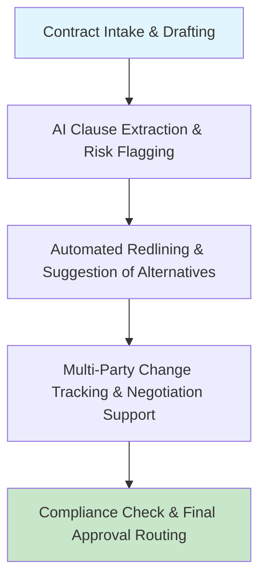

[[Tooling/AI-Toolkit/Agentic AI/Lindy.ai|Lindy.ai]]

[[client-content/Hypernova/Files/Portfolio/Ontra|Ontra]], [[concepts/Explainers for Tooling/Contract Automation|Contract Automation]]

# Defining and Describing Automated Contract Negotiations with AI Agents

*_AI agents autonomously negotiate contracts by scanning clauses, flagging risks, suggesting edits, and coordinating multi-party changes, slashing review times from days to hours while enhancing compliance and strategic focus._* [^6rgff4] [^e04uji]

*Automated Contract Negotiations with AI Agents* refers to the deployment of machine learning, natural language processing, and agentic AI systems that analyze contract language, detect deviations from standards, recommend playbook-aligned alternatives, and facilitate back-and-forth negotiations without full human intervention. [^6rgff4] [^o9qyhm] It applies primarily in high-volume legal, procurement, and sales environments where manual reviews bottleneck deals, such as supplier agreements or enterprise sales contracts. [^e04uji] [^l9i6ro] This matters because it shifts teams from repetitive clause combing to high-value strategy, reducing cycle times by up to 40% and minimizing overlooked risks across portfolios. [^6rgff4] [^l9i6ro]

# Uses in Context
- In procurement, AI agents perform "negotiation steps with suppliers in real time," automating RFQ generation, bid evaluations, and compliance checks to shorten cycles. [^l9i6ro]
- Legal teams use it for "scans the entire contract to identify and extract key clauses," comparing against templates and flagging deviations like payment schedules or liability limits. [^6rgff4]
- Sales leverages "real-time intelligence during the deal cycle," surfacing clauses, fallback positions, and optimal terms from historical deals to negotiate stronger contracts. [^o9qyhm]
- In multi-party scenarios, agentic AI "orchestrates multi-step negotiation processes by coordinating document exchanges, highlighting risk areas, and summarizing key discussion points."[^eod0sb]
- Procurement automation employs agents for "autonomous negotiation platform to manage supplier contract negotiations on a scale impractical for human negotiators."[^e04uji]
- CLM systems deploy "AI contract agents automate time-intensive administrative work," like turning requests into forms and providing negotiation summaries. [^2hc162]

# History of Use

## Origins
The concept traces to early 2025 academic work on "autonomous negotiation agents powered by artificial intelligence (AI)" that negotiate independently on behalf of principals, with foundational evidence from large-scale experiments demonstrating their ability to implement sophisticated strategies. [^e04uji] This built on prior AI-for-legal tools but specifically advanced "AI agents have begun negotiating with each other over legal contracts," laying groundwork via protocols like Agent2Agent. [^e04uji]

## Evolution
- **2025**: Research establishes theory for autonomous agents transforming agreements, with Walmart operationalizing platforms for supplier negotiations at scale. [^e04uji]
- **2026**: Agentic AI expands to "handle complex negotiations across multiple parties" by orchestrating exchanges and risk highlights, per industry analyses. [^eod0sb]
- **2026**: Procurement integrations enable "AI-powered Legal Agents in Contract Lifecycle Management" for redlines, metadata extraction, and supplier onboarding via autonomous email communication. [^l9i6ro]

# Best Real-World Examples
- [NegotiateAI](https://www.icertis.com/learn/ai-contract-negotiation/) from Icertis suggests clause alternatives, applies playbooks, and redlines for compliant negotiations. [^6rgff4]
- [Agentic AI](https://www.sirion.ai/library/contract-ai/agentic-ai-in-contract-management/) in Sirion orchestrates multi-party negotiations by coordinating documents and summarizing risks. [^eod0sb]
- [AI Agents](https://www.ivalua.com/blog/ai-agents-in-procurement/) in Ivalua perform real-time supplier negotiations, compliance checks, and autonomous onboarding. [^l9i6ro]
- [Docusign IAM Agents](https://www.docusign.com/blog/create-negotiate-agreeements-faster-automation-agents) (beta 2026) automate intake, redlining, and summaries to accelerate from request to signature. [^2hc162]
- [JAGGAER AI](https://www.jaggaer.com/blog/ai-automation-in-contract-lifecycle-management) provides real-time clause intelligence and optimal terms during sales negotiations. [^o9qyhm]
- Walmart's [autonomous negotiation platform](https://arxiv.org/html/2503.06416v2) manages supplier contracts at human-impractical scale. [^e04uji]
- [[concepts/Agentic Contract Negotiations#Intelligent Agreement Management|IAM]]  by [[Docusign]]. [^1v78de] Applies [[Knowledge Augmented Generation|KAG]] models to contractual agreements archived in [[Docusign]]. 

# Case Studies

Icertis's [[NegotiateAI]], launched as part of their [[concepts/Contract Intelligence]] platform, empowers legal and procurement teams by scanning contracts to "identify and extract key clauses, obligations, and variables" like IP rights and termination provisions, then comparing against templates to flag deviations. [^6rgff4] In practice, it tracks multi-party changes, suggests playbook-aligned redlines, and ensures final compliance before routing—reducing review from days to hours and variance across deals. [^6rgff4] Teams using it report proactive risk management, with AI surfacing overlooked commitments, enabling faster closes without added headcount; this exemplifies how AI agents maintain institutional knowledge consistently. [^6rgff4]

Ivalua's AI agents in procurement, integrated into their platform by early 2026, autonomously handle "negotiation steps with suppliers in real time," including [[RFQ]] automation, bid analysis, and contract reviews via NLP to flag risks or compliance issues. [^l9i6ro] A Supplier Onboarding Agent communicates via email to validate documents, while Legal Agents extract metadata and propose redlines from approved precedents—shortening cycles by up to 40% per McKinsey data on AI procurement tools. [^l9i6ro] This shifted users from reactive fraud detection to proactive optimization, demonstrating agentic AI's role in scaling complex, multi-step procurement negotiations beyond human capacity. [^l9i6ro]

Stanford HAI's 2026 study on "The Art of the Automated Negotiation" tested AI agents in imbalanced games, revealing "wildly different negotiation skills" among models, while arXiv research showed autonomous agents negotiating legal contracts peer-to-peer via protocols like Agent2Agent. [^e04uji] [^9welbu] Walmart adopted similar tech for supplier platforms, proving scalability for multinationals. [^e04uji] These efforts highlight AI agents' evolution from assistive tools to independent negotiators, reducing costs and enabling strategies unattainable manually, though agent performance varies widely. [^e04uji] [^9welbu]

***

# Sources

[^6rgff4]: [Streamline Contract Negotiation with AI - Icertis](https://www.icertis.com/learn/ai-contract-negotiation/)
[^e04uji]: [Advancing AI Negotiations: New Theory and Evidence from a Large ...](https://arxiv.org/html/2503.06416v2)
[^o9qyhm]: [AI & Automation in CLM: Transforming Contract Management - jaggaer](https://www.jaggaer.com/blog/ai-automation-in-contract-lifecycle-management)
[^l9i6ro]: [AI Agents in Procurement: The Ultimate Guide - Ivalua](https://www.ivalua.com/blog/ai-agents-in-procurement/)
[^2hc162]: [Create and Negotiate Agreements Faster with Automation and Agents](https://www.docusign.com/blog/create-negotiate-agreeements-faster-automation-agents)
[^eod0sb]: [Agentic AI in Contract Management: Benefits & Use Cases - Sirion](https://www.sirion.ai/library/contract-ai/agentic-ai-in-contract-management/)
[7]: [AI in Procurement Automation: Use Cases for Negotiation - HBS Online](https://online.hbs.edu/blog/post/ai-in-procurement)
[^9welbu]: [The Art of the Automated Negotiation | Stanford HAI](https://hai.stanford.edu/news/the-art-of-the-automated-negotiation)
[^1v78de]: 2025, Dec 10. [Capture the critical business value that’s hidden in your agreements](https://www.docusign.com/releases/docusign-r3-2024). [[Docusign]]
