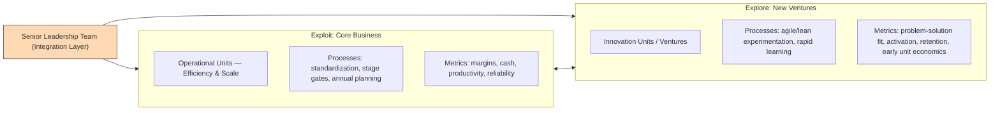

# Defining and Describing Ambidextrous Organizations

_An ambidextrous organization is designed to run today’s business efficiently while simultaneously building tomorrow’s business under different rules of the game._  

An ambidextrous organization deliberately separates “exploit” work (optimizing the current business for efficiency and scale) from “explore” work (creating new businesses, technologies, or business models), then links them through a senior‑level integration mechanism so they reinforce rather than undermine each other. [^9sw81w] [^mwht05] It “creates distinct environments for ‘exploit’ and ‘explore’ work and links them through a senior‑level integration mechanism,” often summarized as “separating today’s factory from tomorrow’s lab” while orchestrating resource allocation and strategy at the top. [^9sw81w] [^mwht05] The concept matters most in environments facing technological disruption or business‑model shifts, where companies must avoid letting the logic of the core either crush innovation or become disconnected from it. [^9sw81w] [^mwht05] [^euvcy4]

# Uses in Context

- As an **organization‑design and operating‑model framework**: consultants and executives use the “Ambidextrous Organization Model” to “pursue two imperatives at once: exploit the current business for efficiency and scale, while exploring new businesses, technologies, or business models for future growth.”[^9sw81w] [^mwht05]  
- In **innovation strategy discussions**, the term describes a structural answer to the “core challenge: exploration vs. exploitation,” where exploitation focuses on “today’s business (efficiency, control, incremental improvement)” and exploration on “tomorrow’s opportunities (experimentation, discovery, radical innovation).”[^mwht05]  
- In **leadership and management education**, it underpins ideas like “ambidextrous leadership,” defined as the ability to balance or switch between leading exploration (experimenting, learning, innovating) and exploitation (optimizing, standardizing, scaling). [^4umg18]  
- In **corporate transformation and strategic pivots**, it is invoked when companies must shift, for example, “product → platform” or “license → subscription” while maintaining performance of the existing business model, using separate explore units plus top‑team integration. [^9sw81w] [^mwht05] [^euvcy4]  
- In **post‑merger integration and acquisitions**, the model is used to preserve the acquired firm’s “explore DNA” while leveraging the parent’s scale, often by keeping exploratory units structurally independent but linked at the senior‑leadership level. [^9sw81w] [^mwht05]  

# History of Use

## Origins

- Early theoretical roots trace to Robert Duncan’s 1976 work on designing dual structures for innovation, which anticipated the need for organizations to host both routine operations and innovative projects simultaneously. [^9sw81w]  
- James G. March’s 1991 paper on “[exploration and exploitation in organizational learning](http://www.iot.ntnu.no/innovation/norsi-pims-courses/Levinthal/March%20(1991).pdf” provided the foundational conceptual distinction between exploration (search, variation, experimentation) and exploitation (refinement, efficiency, implementation) that later ambidextrous‑organization designs operationalized. [^9sw81w] [^mwht05]  
- Michael L. Tushman and Charles A. O’Reilly III developed and popularized the *ambidextrous organization* as an actionable organization‑design approach in the mid‑1990s and 2000s, notably in work such as “[[Sources/Books/Ambidextrous Organizations - Managing Evolutionary and Revolutionary Change]]” and the HBR article “The Ambidextrous Organization.”[^9sw81w] [^712ltg] They later elaborated these ideas in the book *Lead and Disrupt*, framing ambidexterity as a practical solution to the recurring failure of firms that tried to apply the same operating logic to both radical innovation and the core business. [^9sw81w]  

## Evolution

- **Mid‑1990s–2000s – Structural ambidexterity formalized:** Tushman and O’Reilly’s work crystallized *structural ambidexterity*—creating “structurally independent units” for exploration and exploitation, “integrate[d]…tightly at the senior leadership level”—as the “classic design.”[^9sw81w] [^mwht05] [^712ltg]  
- **2000s–2010s – Contextual and sequential ambidexterity:** Building on structural designs, later work and practice introduced *contextual ambidexterity* (systems and culture allowing individuals and teams to switch between explore and exploit tasks within one unit) and *sequential ambidexterity* (time‑bound shifts where organizations alternate focus), particularly in knowledge‑work and resource‑constrained settings. [^9sw81w]  
- **2010s–2020s – Operational playbooks and diagnostics:** Practitioner frameworks emerged detailing stepwise approaches such as “Step 1: Diagnose Your Innovation Type” and guidance on when structural ambidexterity is necessary versus when cross‑functional teams suffice, reflecting broader application of the concept across industries and firm sizes. [^mwht05] [^euvcy4]  

# Best Real-World Examples

- [Accept Mission innovation platform](https://www.acceptmission.com/blog/ambidextrous-organization/) – Uses and advocates the ambidextrous‑organization framework to help clients “increase innovation engagement” while running “structured open innovation programs,” embodying exploration alongside exploitation processes. [^mwht05]  
- [Umbrex organizational‑design practice](https://umbrex.com/resources/frameworks/organization-frameworks/ambidextrous-organization-model-oreilly-tushman/) – Applies the Ambidextrous Organization Model in consulting engagements to support “transformations, strategic pivots … and corporate innovation programs” that must maintain core performance while building new growth engines. [^9sw81w]  
- [Strategic Management Society SIF Webinar Series](https://www.strategicmanagement.net/event/sif-webinar-series-strategy-meets-growth-making-the-ambidextrous-organization-work-in-the-real-world/) – Provides a practitioner forum on “making the ambidextrous organization work in the real world,” highlighting applied examples of firms managing today’s business while exploring tomorrow’s opportunities. [^euvcy4]  
- [Tomorrow University leadership programs](https://www.tomorrow.university/blog/what-is-ambidextrous-leadership) – Teach “ambidextrous leadership” as a capability for leaders in organizations that must “keep the core business running smoothly” while exploring new models, products, and technologies (including AI), reflecting the leadership dimension of organizational ambidexterity. [^4umg18]  
- [Harvard Business School executive programs with Michael Tushman](https://www.youtube.com/watch?v=mJv_tMTjJds) – Feature ambidextrous‑organization design as a core module, with Tushman emphasizing that “organizations that can both exploit their existing strategy … and explore into new spaces simultaneously” require specific structures and senior‑team capabilities. [^712ltg]  

# Case Studies

### 1. A mid‑sized firm structuring for exploration and exploitation

Accept Mission describes how many companies “focus on one and fail at the other” when trying to both exploit today’s business and explore tomorrow’s opportunities, often because “the organizational alignments required for exploitation and exploration are completely opposed.”[^mwht05] In a typical mid‑sized firm case they outline, the core organization is optimized around Six Sigma‑style efficiency, hierarchical structures, and quarterly results, which “is hostile to rapid prototyping and learning from failure.”[^mwht05] By adopting an ambidextrous design, the firm sets up “structurally independent units” for exploration—with adaptive, flat structures, experimental culture, and learning‑oriented metrics—while keeping the exploit unit focused on cost, reliability, and controlled processes. [^mwht05] The senior leadership team acts as the “integration layer that holds everything together,” formulating a common vision that covers both core and exploratory units and arbitrating conflicts, especially around cannibalization and resource allocation. [^mwht05] This case illustrates how structural separation plus top‑level integration can convert a previously innovation‑averse organization into one that systematically manages both incremental improvement and radical innovation.

### 2. Applying the Ambidextrous Organization Model in strategic pivots

Umbrex highlights how the Ambidextrous Organization Model is used in real transformations such as shifting from “product → platform” or “license → subscription,” where the legacy business must keep generating cash while the company experiments with new business models under uncertainty. [^9sw81w] In these scenarios, consultants help clients “stand up dedicated explore units (or ventures) with distinct leadership, culture, incentives, and operating mechanisms,” while ensuring that the exploit business remains optimized for efficiency and scale. [^9sw81w] The CEO and top team “own the combined agenda,” providing senior‑team integration through a shared vision, explicit rules around cannibalization, and governance over resource allocation, rather than forcing core and venture teams to use the same processes and metrics. [^9sw81w] Integration is deliberately placed at the top so that explore and exploit units do not have to compromise their operating logics, yet still share critical assets such as platforms, channels, or brand via defined interfaces and service‑level agreements. [^9sw81w] This pattern demonstrates how ambidextrous design can de‑risk major strategic shifts by protecting both the performance of the legacy business and the integrity of the new model’s exploration process.

### 3. Senior‑team capability as a make‑or‑break factor

In a recorded talk, Michael Tushman notes that “oftentimes the reason that ambidextrous structures fail is that the senior team cannot deal with the paradox and tensions and contradictions associated with both exploiting and exploring simultaneously.”[^712ltg] Even when a firm has formally created separate units for the past (core) and the future (innovation), success hinges on whether the top team can manage the associated trade‑offs—balancing short‑term financial metrics against long‑term options, resolving channel conflicts, and handling internal cannibalization. [^9sw81w] [^712ltg] [^euvcy4] Executive‑education and practitioner sessions, such as those run through the [[Strategic Management Society]]’s webinar series on “making the ambidextrous organization work in the real world,” therefore emphasize not just structural design but also leadership behaviors and governance mechanisms that support both operational excellence and strategic exploration. [^712ltg] [^euvcy4] This case perspective underscores that ambidexterity is as much a senior‑team and culture challenge as it is an organizational‑chart problem.

***

# Sources

[^9sw81w]: [Ambidextrous Organization Model | Org Design - Umbrex](https://umbrex.com/resources/frameworks/organization-frameworks/ambidextrous-organization-model-oreilly-tushman/)
[^4umg18]: [What Is Ambidextrous Leadership? | Tomorrow University](https://www.tomorrow.university/blog/what-is-ambidextrous-leadership)
[^mwht05]: [The Ambidextrous Organization: How to Manage Today's Business ...](https://www.acceptmission.com/blog/ambidextrous-organization/)
[^712ltg]: [27—Michael Tushman: Why Ambidextrous Organizations ... - YouTube](https://www.youtube.com/watch?v=mJv_tMTjJds)
[^euvcy4]: [SIF Webinar Series: Strategy Meets Growth: Making the ...](https://www.strategicmanagement.net/event/sif-webinar-series-strategy-meets-growth-making-the-ambidextrous-organization-work-in-the-real-world/)
