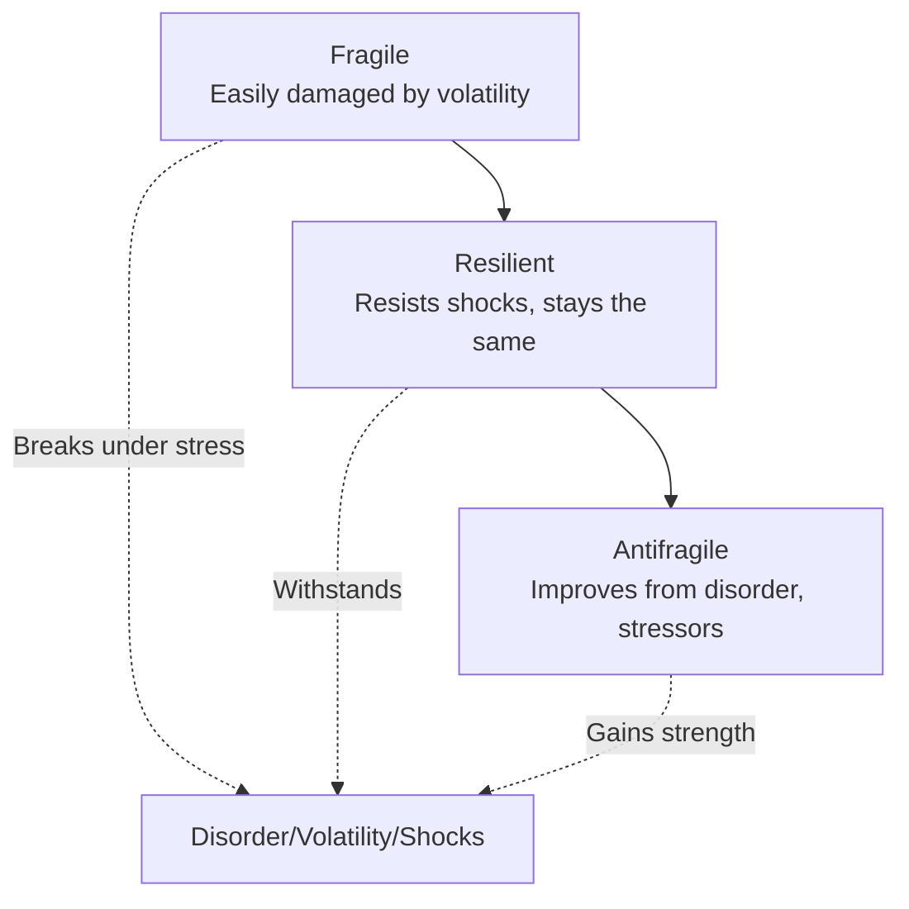

# Defining and Describing Antifragility

*_Antifragility describes systems that don't just survive chaos—they grow stronger from it, turning volatility into an advantage.*_ [^cc11si] [^rcmji7]

Antifragility, as conceptualized by Nassim Nicholas Taleb, refers to entities or systems that "benefit and grow stronger from disorder, volatility, and stressors," unlike fragile things that break or resilient ones that merely endure. [^rcmji7] [^cc11si] It applies in unpredictable environments like supply chains, psychology, and personal development, where exposure to shocks fosters improvement rather than mere recovery. [^rjm9cd] [^trnl8e] This matters because traditional risk management focuses on prediction and efficiency, while antifragility embraces redundancy and learning from disorder to thrive amid uncertainty. [^rjm9cd]

_Source: https://hrmhandbook.com/terms/antifragility/_
# Uses in Context
- In supply chains, antifragility means "systems or entities that improve and adapt in response to stress, disorder, or uncertainty," prioritizing flexibility over rigid optimization. [^rjm9cd]
- Beyond resilience, "the resilient resists shocks and stays the same; the antifragile gets better," as applied to infrastructure and investments. [^cc11si]
- In coaching and psychology, antifragility theorizes personal growth through stressors, where systems "strengthen and flourish as a consequence of exposure to stressors, disorder and volatility."[^trnl8e]
- Supply chain experts advocate antifragile systems with "redundancy, rather than crazily trying to be always efficient," using scenario planning to handle disruptions like vaccines build immunity. [^rjm9cd]
- In mental frameworks, "antifragile grandiosity" builds psychological resilience by validating from within, contrasting fragile egos that collapse under stress. [^8aypmz]

# History of Use

## Origins
Antifragility was coined by [[Sources/People/Nassim Nicholas Taleb|Nassim Nicholas Taleb]] in his 2012 book *Antifragile: Things That Gain from Disorder*, where he defines it as the opposite of fragility: "something that actively benefits from encountering turbulence and requires exposure to a certain amount of stress in order to thrive."[^cc11si] [^rcmji7] [^trnl8e] Taleb introduced the term to describe systems that improve from randomness and shocks, contrasting it with fragility (easily broken) and positioning resilience/robustness as intermediates. [^trnl8e]

## Evolution
- **2012**: Taleb's book establishes the core triad—fragile, resilient, antifragile—and frames it as a "countermeasure to extreme and unpredictable events" in a world where prediction fails. [^trnl8e]
- **2018**: Early psychological adaptation by Markey-Towler links antifragility to individual cognition, manifesting through "personal knowledge as shaped through their cognitive structures."[^trnl8e]
- **2020s**: Expanded to supply chains post-disruptions, with calls for "antifragile supply chains" via information, engagement, and resolution systems to learn from shocks without starting over. [^rjm9cd]

# Best Real-World Examples
- [Shippeo](https://www.shippeo.com) builds antifragile supply chains with redundancy, scenario planning, and systems for information, engagement, and resolution to handle disruptions proactively. [^rjm9cd]
- [Taleb's Antifragile Framework](https://www.ubs.com/us/en/assetmanagement/insights/asset-class-perspectives/infrastructure/articles/antifragile.html) in infrastructure, where systems "thrive and grow stronger when subjected to volatility."[^cc11si]
- [Antifragile Coaching Models](https://philosophyofcoaching.org/v10i2/04.pdf) apply the concept to personal development, strengthening individuals via exposure to volatility. [^trnl8e]
- [Antifragile Grandiosity](https://thepowermoves.com/antifragile-grandiosity/) by Lucio Buffalmano at The Power Moves, fostering self-sufficient mental resilience over fragile ego defenses. [^8aypmz]
- Biological immune systems, analogous to antifragility as they "know how to deal with the next 10, 15 or 20 disruptions considerably more easily, without having to start from scratch," per supply chain experts. [^rjm9cd]
- Redundant supply chain designs with alternative sources and routes, enhancing adaptability beyond mere resilience. [^rjm9cd]

# Case Studies

Shippeo, a supply chain visibility platform, has prioritized antifragility since around 2023, shifting from traditional risk management to proactive systems that treat disruptions like vaccines building immunity. [^rjm9cd] They implemented three core systems: a "system of information" for early visibility, a "system of engagement" to prioritize critical issues among potential failures, and a "system of resolution" with pre-planned scenarios to respond without reinventing responses. [^rjm9cd] This allowed clients to build "blanket redundancies" over obsessive forecasting, fostering continuous improvement from real shocks like geopolitical events or delays. [^rjm9cd] The result demonstrates antifragility's power: supply chains that not only resist but "actively learn from uncertainty, becoming more capable with each shock," outpacing fragile just-in-time models. [^rjm9cd]

In psychological applications, Lucio Buffalmano's "Antifragile Grandiosity" framework at The Power Moves (developed post-2012) reengineers narcissistic traits for mental strength. [^8aypmz] Launched as a TPM-exclusive model, it replaces fragile grandiosity—needy for validation and defensive—with an antifragile version: self-validating, psychologically resilient, and thriving under stress via an "antifragile ego."[^8aypmz] Users report sustained confidence through adversity, as the model has "no image to defend," turning criticism into growth. [^8aypmz] This indie practitioner innovation shows antifragility scaling to personal agency, fixing maladaptive ego patterns while preserving visionary drive, influencing self-improvement communities beyond Taleb's original scope. [^8aypmz]

Taleb's foundational application in *[[Sources/Books/Antifragile|Antifragile]]* (2012) evolved through UBS's 2020s infrastructure analysis, where antifragile assets "improve because of stress" via volatility exposure. [^cc11si] UBS adapted it for investments, citing Taleb directly: systems that "thrive and grow stronger" from randomness, not just robustness. [^cc11si] Post-2020 market shocks validated this, with antifragile portfolios gaining from disorder while fragile ones broke. [^cc11si] It illustrates the concept's expansion from theory to finance, proving popularizers like UBS learn from Taleb's indie-academic origins to counter prediction failures. [^cc11si]

***

# Sources

[^rjm9cd]: [Antifragility - Beyond the buzzword, what it really means for supply ...](https://www.shippeo.com/resources/explore/blog-newsletter/antifragility---beyond-the-buzzword-what-it-really-means-for-supply-chains)
[^cc11si]: [Antifragile? | UBS United States of America](https://www.ubs.com/us/en/assetmanagement/insights/asset-class-perspectives/infrastructure/articles/antifragile.html)
[^rcmji7]: [Antifragile: Significance and symbolism](https://www.wisdomlib.org/concept/antifragile)
[^trnl8e]: [[PDF] How can Antifragility Help Theorize Coaching in a Volatile and ...](https://philosophyofcoaching.org/v10i2/04.pdf)
[^8aypmz]: [Antifragile Grandiosity: The Right Way to Build Mental Power](https://thepowermoves.com/antifragile-grandiosity/)
