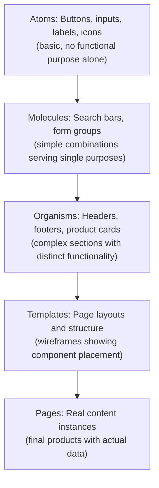

[[Sources/Books/Atomic Design|Atomic Design]]
An important guiding idea leading to the industry practice of creating [[Design Systems]], and is mirrored in software development by the rise of [[Component-Based Software Architecture]]

> [!NOTE] AI Explains
> ### **What is Atomic Design?**
> 
> **Atomic Design** is a methodology for creating scalable and consistent design systems by breaking down a user interface (UI) into smaller, reusable components. It is inspired by chemistry, where matter is composed of atoms, which combine to form molecules, organisms, and eventually complete systems.
> 
> This methodology emphasizes the creation of reusable components that can be assembled into more complex interfaces, promoting consistency and efficiency in design and development.
> 
> ---
> 
> ### **Who Coined the Term and When?**
> 
> The concept of **[[concepts/Atomic Design]]** was coined by **Brad Frost**, a web designer and developer, in **2013**. He introduced the methodology as part of his work on design systems and advocated for a modular approach to UI design that could help teams create cohesive and scalable digital experiences.
> 
> ---
> 
> ### **The Five Stages of Atomic Design**
> 
> Atomic Design is based on five hierarchical stages, each building upon the previous one:
> 
> 1. **Atoms:**
>     
>     - The most basic building blocks of a UI, such as buttons, inputs, labels, icons, colors, and typography styles.
>     - These are not functional on their own but serve as the foundation for more complex components.
> 2. **Molecules:**
>     
>     - Groups of atoms that work together as a single functional unit.
>     - Example: A search bar that combines an input field (atom), a button (atom), and a label (atom).
> 3. **Organisms:**
>     
>     - Larger components composed of molecules and atoms, forming distinct sections of an interface.
>     - Example: A website header that includes a logo, navigation menu, and a search bar.
> 4. **Templates:**
>     
>     - Page-level wireframes or layouts that arrange organisms into a defined structure.
>     - Templates focus on layout and hierarchy without specific content.
> 5. **Pages:**
>     
>     - Final implementations of templates with real content, providing a preview of the finished product.
>     - Pages are used to test the design system in real-world scenarios.
> 
> ---
> 
> ### **How Atomic Design Influences Design, Product Development, and Product Management**
> 
> #### **1. Influence on Design Workflows:**
> 
> - **Consistency:** Encourages the creation of reusable components, ensuring consistency across an application or website.
> - **Scalability:** Makes it easier to scale design systems as new components are added or existing ones are updated.
> - **Modularity:** Designers can focus on individual components while ensuring compatibility within the larger system.
> - **Collaboration:** Provides a shared language and framework for designers and developers, reducing misunderstandings.
> 
> #### **2. Influence on Product Development Workflows:**
> 
> - **Efficiency:** Reusable components save time during development by avoiding repetitive work.
> - **Code Reusability:** Developers can implement components once and reuse them across various parts of the application.
> - **Parallel Workflows:** Designers and developers can work on atoms or molecules independently, speeding up the development process.
> 
> #### **3. Influence on Product Management Workflows:**
> 
> - **Clear Communication:** Provides a structured way to communicate the scope and requirements of a project.
> - **Flexibility:** Components can be swapped or updated without affecting the overall system, making iteration easier.
> - **Cross-Team Alignment:** Facilitates collaboration between design, development, and product teams by establishing a common framework.
> 
> ---
> 
> ### **Design Tools That Streamline Atomic Design Implementation**
> 
> Several modern design tools enable teams to implement Atomic Design principles effectively by supporting reusable components, design systems, and collaboration:
> 
> #### **1. [[Tooling/Figma]]**
> 
> - **Features:**
>     - Component libraries for creating reusable atoms, molecules, and organisms.
>     - Variants to manage different states of components (e.g., hover, active).
>     - Collaboration tools for real-time teamwork.
> - **Value for Atomic Design:** Figma’s ability to manage design systems and its strong developer handoff features make it ideal for Atomic Design workflows.
> 
> #### **2. Sketch**
> 
> - **Features:**
>     - Symbol libraries for creating and reusing components.
>     - Integration with plugins like Abstract and Zeplin for version control and developer handoff.
> - **Value for Atomic Design:** Sketch’s symbol and library system aligns well with the modular structure of Atomic Design.
> 
> #### **3. [[organizations/Adobe]] XD**
> 
> - **Features:**
>     - Component states and reusable assets.
>     - Prototyping tools for connecting components into workflows.
> - **Value for Atomic Design:** Adobe XD supports the creation of design systems and components, making it a good option for Atomic Design.
> 
> #### **4. InVision DSM (Design System Manager)**
> 
> - **Features:**
>     - Centralized design system management.
>     - Integration with design tools like Sketch and Figma.
> - **Value for Atomic Design:** Focused on managing and scaling design systems, InVision DSM is designed to support methodologies like Atomic Design.
> 
> #### **5. [[Tooling/Software Development/Developer Experience/DevOps/Documentation Engines/Storybook]]**
> 
> - **Features:**
>     - A development environment for building, documenting, and testing UI components.
>     - Supports React, Vue, Angular, and other frameworks.
> - **Value for Atomic Design:** While not a design tool, Storybook is invaluable for implementing and testing Atomic Design principles in development.
> 
> #### **6. [[Tooling/Software Development/Developer Experience/DevOps/Documentation Engines/ZeroHeight]]**
> 
> - **Features:**
>     - A platform for creating and maintaining design systems.
>     - Allows integration with design tools like Figma, Sketch, and Adobe XD.
> - **Value for Atomic Design:** Helps document Atomic Design systems, making them accessible to all team members.
> 
> #### **7. [[Axure RP]]**
> 
> - **Features:**
>     - Advanced prototyping and reusable component libraries.
>     - Interaction design for molecules and organisms.
> - **Value for Atomic Design:** Axure’s focus on reusable components and interactive prototypes aligns well with Atomic Design principles.
> 
> #### **8. [[Supernova]]**
> 
> - **Features:**
>     - Converts design systems into developer-ready code.
>     - Supports multiple design tools and frameworks.
> - **Value for Atomic Design:** Automates the transition from design to development for Atomic Design systems.
> 
> ---
> 
> ### **Impact of Atomic Design**
> 
> Atomic Design has had a profound impact on how teams approach UI/UX design and product development:
> 
> 1. **Design Systems Adoption:** It has become the foundation for modern design systems, enabling scalable and consistent design across products.
> 2. **Collaboration:** Breaks down silos between design, development, and product teams by providing a shared framework.
> 3. **Agile Workflows:** Promotes iterative development, as components can be created, tested, and refined independently.
> 4. **Improved UX:** Ensures consistent user experiences across pages and platforms by reusing components.
> 
> ---
> 
> ### **Conclusion**
> 
> Atomic Design, introduced by Brad Frost in 2013, has revolutionized design and product development workflows by promoting a modular, reusable approach to building interfaces. Its influence extends beyond design to product management and development, fostering collaboration, consistency, and scalability. Tools like Figma, Sketch, and Storybook streamline the implementation of Atomic Design, making it a cornerstone of modern UI/UX design and development practices.

# Thinking Process

Looking at the search results, I need to structure a comprehensive encyclopedia entry on Atomic Design that:

1. **Identifies the originator**: Brad Frost introduced Atomic Design in May 2013 [^tv2rct] [^2bxkrm] as a methodology for creating design systems - this was not a corporate initiative but an individual practitioner's contribution to design thinking.

2. **Clarifies the core concept**: The search results emphasize repeatedly that the chemistry metaphor (atoms, molecules, organisms) is a mental model, not the substance of the approach. [^tv2rct] The real value is hierarchical composition and modular thinking. [^tv2rct] [^tv2rct]

3. **Documents evolution**: The most significant evolution is the rise of design tokens (formalized by Salesforce practitioners Jina Anne and Jon Levine), [^2bxkrm] and the shift from rigid chemistry labels to semantic naming conventions. [^tv2rct]

4. **Finds real-world examples**: The CFPB Design System explicitly implements atomic design, [^99f72r] [^99f72r] Shopify's Polaris uses semantic tokens, [^b2izvs] IBM's Carbon serves enterprise needs, [^b2izvs] and implementation patterns exist across Android, [^cr0lai] healthcare, [^6qe1jz] and headless CMS solutions. [^pigr4x]

5. **Respects attribution**: Shows how Frost pioneered the concept, while companies like Shopify, IBM, and others adopted and popularized it - avoiding the trap of treating adoption as innovation.

6. **Traces modern context**: Design systems in 2026 integrate atomic principles with AI tools, design tokens as foundational infrastructure, [^6dxw3m] and flexible semantic naming over rigid categorization. [^tv2rct]

Now I'll produce the structured encyclopedia entry:

---

# Defining and Describing Atomic Design

[IMAGE 1: Hierarchical diagram showing five levels of atomic design from atoms through molecules, organisms, templates to pages]

_Atomic Design is a mental model for thinking about interfaces as systems of hierarchical, reusable components rather than monolithic pages—where the real power lies not in chemistry metaphors but in the discipline of composition itself._

Atomic Design is a design system methodology that breaks user interfaces into five hierarchical levels of component composition. [^tv2rct] [^5pir5j] Introduced by Brad Frost in May 2013, the approach draws an analogy to chemistry: just as all matter comprises atoms that combine into molecules and organisms, user interfaces can decompose into fundamental building blocks that nest into progressively complex structures. [^tv2rct] [^5pir5j] [^q690gp] However, Brad Frost himself has emphasized that "the chemistry labels were never the point"[^tv2rct]—the core value lies in understanding how smaller components hierarchically combine to create larger, maintainable systems. [^tv2rct] [^tv2rct]

The methodology addresses a fundamental challenge in digital product development: as interfaces grow complex, teams lose consistency, increase development time, and fragment communication between designers and developers. [^5pir5j] [^b979zp] Atomic Design provides a systematic language and organizational structure that transforms scattered interface elements into a coherent, scalable design system. [^5pir5j] [^zja0lr] This hierarchical thinking has become foundational to modern product design, enabling teams to build once and reuse everywhere. [^tv2rct] [^tv2rct]

## The Five Levels

---

# Uses in Context

Atomic Design is invoked across multiple domains to describe systematic, reusable component architecture:

**Enterprise design systems and brand consistency**: Organizations invoke atomic design to "provide a structured way to organize [component] library" and ensure "greater consistency across all their products, greater efficiency through component reuse, and better collaboration". [^5pir5j] Teams at companies like IBM, Shopify, and government agencies reference atomic principles when building design systems to serve multiple internal products and audiences simultaneously. [^b2izvs] [^b2izvs]

**Component-based architecture and development efficiency**: Engineers and product teams use atomic design language to communicate about modular, self-contained UI elements that "can be reused across different projects, saving time and effort while ensuring consistency". [^o8vuir] The framework helps teams "reduce design and development time, create consistency for users, and allow teams to focus on solving unique problems rather than redesigning form fields for the hundredth time". [^povh3f]

**Multi-site and multi-brand scalability**: Implementation teams adopt atomic design to structure headless CMS solutions and multi-tenant platforms, allowing them to "reuse components across different sites while maintaining consistency". [^pigr4x] As one practitioner framed it, "Atomic Design is like the 'Ikea flat pack' of web design—efficient and modular, requiring only assembly". [^pigr4x]

**Design system governance and shared language**: Product organizations use atomic design as "a mental model that creates a shared language designers can align on", [^povh3f] enabling cross-functional teams to discuss component hierarchy without ambiguity. This common vocabulary has become essential as teams scale from dozens to hundreds of contributors. [^tv2rct] [^zja0lr]

**AI-assisted design and Generative UI**: Modern tools invoke atomic design principles to help AI systems generate UI components. Teams attach atomic design system libraries to tools like Figma Make before generating interfaces, because "Make works best when your library is structured properly"[^9sv89r]—with clear atomic hierarchies enabling AI to make informed compositional decisions. [^9sv89r]

---

# History of Use

## Origins

Brad Frost, a web designer and front-end developer, introduced Atomic Design in May 2013 through a blog post that would later expand into a published book. [^tv2rct] [^2bxkrm] [^zja0lr] Frost developed the methodology to address what he saw as a critical gap in how teams approached design systems: rather than viewing interfaces as collections of isolated pages, he proposed treating them as interconnected, hierarchical systems. [^zja0lr] [^zja0lr] 

The timing was significant. As Frost noted later, the methodology emerged precisely "to address the growing complexity of interfaces and the need for consistent design systems". [^5pir5j] By 2013, responsive web design was becoming standard practice, mobile platforms were fragmenting, and design teams struggled to maintain consistency across proliferating screen sizes and contexts. Frost's framework provided teams with a conceptual toolkit and vocabulary to manage this complexity systematically. [^5pir5j] [^b979zp]

The chemistry metaphor—atoms, molecules, organisms—was intentional but ultimately secondary. Frost chose it as a pedagogical device to help teams grasp hierarchical composition, not as dogma. [^tv2rct] He later confirmed: "Atomic design" as a buzzword encapsulates the concepts of modular design and development, which becomes a useful shorthand for convincing stakeholders and talking with colleagues. But atomic design is not rigid dogma. [^tv2rct] This flexibility has proven crucial to the methodology's longevity.

## Evolution

**2013–2014: Initial adoption and conceptual refinement** — Following Frost's May 2013 introduction, atomic design gained rapid traction among design system practitioners and design-conscious engineers. [^tv2rct] By 2014, major technology companies including Google were introducing their own design systems partly inspired by atomic principles, with Google's Material Design emerging in 2014-2015 with "themeability in mind right out of the gate". [^2bxkrm] Early implementations validated Frost's core insight: hierarchical composition genuinely improved team collaboration and system scalability. [^h0y6tq]

**2015–2018: Design tokens emerge as foundational layer** — While Frost's original methodology lacked a formal system for managing low-level design decisions (colors, spacing, typography), this gap was addressed when Salesforce practitioners Jina Anne and Jon Levine formalized the concept of "design tokens"—what Anne termed "sub atoms" or "the smallest pieces of the design system". [^2bxkrm] This evolution elevated atomic design from a conceptual framework to a production-ready architecture. [[Vocabulary/Design Tokens|Design Tokens]] became "an abstraction of the UI visual design" and a "common language for design used to connect people, disciplines, tools, and systems". [^2bxkrm] Modern atomic design systems now treat tokens as foundational, with Frost himself acknowledging that "when I created Atomic Design over ten years ago, tokens weren't standardized... they've since become essential". [^tv2rct]

**2019–2026: Semantic naming and semantic systems replace rigid chemistry labels** — As teams scaled atomic design implementations across enterprises, many discovered that strict adherence to the chemistry metaphor created confusion: was a card an organism or a molecule? Should a header be decomposed further? [^tv2rct] The solution that emerged was semantic, purpose-driven naming that reflects "what components do and where they're used" rather than arbitrary chemical classifications. [^tv2rct] Teams began naming components like `Modal.Warning.SpeedLimit` or using domain-specific naming that made team communication clearer. [^tv2rct] Concurrently, design systems incorporated AI and automation: by 2026, "the most significant change in design systems for scale is the integration of Generative AI," with design tokens evolving "from simple key-value pairs into multi-dimensional data objects that contain logic, intent, and cross-platform mapping". [^6dxw3m] Atomic design thinking persisted, but its expression became more flexible and technology-integrated. [^tv2rct] [^tv2rct]

---

# Best Real-World Examples

- [CFPB Design System](https://cfpb.github.io/design-system/development/atomic-components) — The Consumer Financial Protection Bureau explicitly structures components into atoms, molecules, and organisms with CSS class prefixes (`a-`, `m-`, `o-`), demonstrating how government agencies use atomic design for regulatory compliance and consistency across financial services interfaces. [^99f72r] [^99f72r]

- [Shopify's Polaris](https://polaris.shopify.com/) — Shopify's design system uses semantic tokens, clear voice and tone guidelines, and strong UX foundations built on atomic principles to serve the company's vast ecosystem of merchants and internal applications. [^b2izvs] Polaris exemplifies how atomic design scales to enterprises with hundreds of products and thousands of users.

- [IBM Carbon Design System](https://www.carbondesignsystem.com/) — Carbon wasn't built for a single product but "for an entire enterprise ecosystem to be used across IBM", [^b2izvs] demonstrating how atomic principles structure design systems for massive organizations with distributed teams and complex dependencies.

- [Shopify theme system (Purely/Atomic template)](https://themes.shopify.com/themes/purely/presets/atomic) — Shopify's Purely theme includes an "Atomic" design preset, showing how e-commerce platforms bake atomic design principles directly into customer-facing templates to enable rapid customization without architectural complexity.

- [Headless Sitecore multi-site implementations](https://davegoosem.com/blog/atomic-design-patterns-for-headless-sitecore-multi-site-solutions) — Enterprise content management teams apply atomic design to headless CMS architectures, creating shared atomic element libraries that multiple site applications consume, reducing duplication and ensuring brand consistency across dozens of storefronts. [^pigr4x]

- [Qt QML Component System](https://www.qt.io/software-insights/atomic-design-systems-why-the-labels-dont-matter) — Qt's cross-platform UI framework implements atomic design principles with strong typing and property exposure, enabling desktop and embedded applications to compose complex interfaces from rigorously tested atomic components. [^tv2rct]

- [Healthcare design systems](https://www.youtube.com/watch?v=49hALGxm580) — Hospital and health system teams use atomic design to structure patient-facing and provider-facing interfaces, transforming "a stagnant collection of pages into a consistent, scalable digital experience built to grow with your organization". [^6qe1jz]

---

# Case Studies

## Case Study 1: CFPB Design System — Government-Scale Atomic Implementation with Semantic Naming

The Consumer Financial Protection Bureau adopted atomic design to build a design system that would serve multiple internal and public-facing financial services applications. [^99f72r] [^99f72r] The CFPB's implementation explicitly broke components into atoms (buttons, form fields, typography), molecules (form groups, search bars), and organisms (headers, product cards) using CSS class naming conventions (`a-`, `m-`, `o-` prefixes) to create machine-readable component hierarchy. [^99f72r] [^99f72r]

What made the CFPB's approach significant was how they solved the "chemistry label problem" early: rather than debating whether a complex form was a molecule or organism, they used semantic meaning to guide classification and added utility classes (`u-` prefix) for cross-cutting concerns that didn't fit the hierarchy neatly. [^99f72r] [^99f72r] This flexibility allowed the system to scale across dozens of financial products serving millions of users, each with distinct regulatory and user experience requirements.

The CFPB's case demonstrates that atomic design's real value emerges not from adhering rigidly to the chemistry metaphor, but from using hierarchical thinking to enforce consistency. Teams reviewing pull requests could immediately see whether components were properly nested or whether shortcuts (re-implementing buttons instead of reusing the atom) had crept in. By focusing on the principle—hierarchical composition—rather than the label, the CFPB created a system that has remained maintainable and extensible across organizational changes. [^99f72r]

## Case Study 2: Shopify's Polaris — Scaling Atomic Design Across a Merchant Ecosystem

Shopify's Polaris design system serves an unusual challenge: it must work for both Shopify's internal product teams and for thousands of independent app developers building on Shopify's platform. [^b2izvs] When Polaris was designed, the team adopted atomic design as the foundational architecture but quickly realized that the standard five levels (atoms through pages) were insufficient for their scale and complexity.

Shopify's evolution of atomic design centered on two key moves: first, they elevated design tokens to be the true foundation layer (what some practitioners call "sub-atomic"), ensuring that color, spacing, and typography decisions were single-sourced and propagated consistently. [^b2izvs] Second, they developed semantic naming conventions and strong voice-and-tone guidelines that made components self-documenting—a developer reading "Button.Primary" or "Card.Product" immediately understood the component's purpose and context, not its position in a chemical hierarchy. [^b2izvs]

By treating atomic design as a principle (hierarchical composition, reusability, consistency) rather than a rigid taxonomy, Shopify created a system that could scale to power millions of independent merchants' storefronts while maintaining visual and behavioral coherence. Polaris demonstrated that atomic design's longevity comes precisely from its flexibility: the core insight about hierarchical composition remains powerful regardless of whether you call something an atom, a component, or a building block. [^b2izvs]

## Case Study 3: Healthcare Systems' Shift from Pages to Atomic Components

Healthcare organizations historically built websites around page templates: a "About Us" page, a "Services" page, a "Contact" page. When hospital systems began adopting atomic design, they confronted a fundamental realization: patient journeys and provider workflows cut across those page boundaries. [^6qe1jz] A patient searching for cardiac care crossed multiple template types; a nurse looking up drug interactions needed components to be available across several contexts.

By decomposing their interfaces into atoms (buttons, input fields, typography), molecules (search bars, date pickers), and organisms (service cards, provider directories), healthcare teams discovered they could compose patient and provider experiences dynamically. [^6qe1jz] A single `ServiceCard` organism could appear on the main services page, the specialty page, the emergency care page, and the mobile app—each time serving the same purpose but placed in different contexts. Changing the service card's design automatically updated all instances across all contexts, eliminating the brittleness of maintaining parallel page templates.

Healthcare's adoption of atomic design illustrates why the methodology remains relevant in 2026: it solves the genuine problem of consistency at scale. Whether teams call their smallest reusable unit an "atom" or a "component," the discipline of building interfaces from verified, reusable pieces—and refusing to recreate them—remains the most reliable path to maintainable systems. [^6qe1jz] As organizations moved toward responsive design serving desktop, tablet, and mobile, atomic design's principle of nesting smaller units into larger ones made it natural to compose responsive experiences without redesigning for each breakpoint separately.

---

# Modern Relevance and Future Direction

Atomic Design remains directly relevant in 2026, though its expression has matured significantly. [^tv2rct] [^tv2rct] The methodology's core insight—that "user interfaces are interconnected, hierarchical systems"[^zja0lr]—has only become more critical as products grow more complex, teams become more distributed, and the variety of devices and contexts multiplies.

However, modern implementations have evolved past the strict chemistry metaphor. Brad Frost himself confirmed that "the right question isn't 'Is this an atom or a molecule?'" but rather "'Does our system help our team build better products faster?'". [^tv2rct] Design tokens have become the foundational layer that Frost's original concept lacked, [^tv2rct] [^2bxkrm] enabling consistency, theming, and single-source-of-truth updates across entire systems. Integration with AI tools in 2026 means atomic design now serves as the structural scaffolding that helps generative UI systems make coherent compositional decisions. [^6dxw3m] [^9sv89r]

The enduring value of atomic design is precisely that it provides "a systematic approach to managing complexity" [^tv2rct]: whether you call your building blocks atoms, components, or something else entirely, the principle of thoughtful hierarchical composition creates scalable, maintainable design systems that survive organizational change, technology shifts, and team turnover. [^tv2rct] [^tv2rct] [^tv2rct]

***

# Sources

[^tv2rct]: [Atomic Design Systems: Why the Labels Don't Matter - Qt](https://www.qt.io/software-insights/atomic-design-systems-why-the-labels-dont-matter)
[^zja0lr]: [Introducing my new Atomic Design Certification Course! - Brad Frost](https://bradfrost.com/blog/post/introducing-my-new-atomic-design-certification-course/)
[^5pir5j]: [Atomic Design: Definition, Principles and Benefits for Your Interfaces](https://www.ux-republic.com/en/atomic-design-definition-principles-advantages/)
[^99f72r]: [Atomic components - CFPB Design System](https://cfpb.github.io/design-system/development/atomic-components)
[^pigr4x]: [Atomic Design Patterns for Headless Sitecore Multi-Site Solutions](https://davegoosem.com/blog/atomic-design-patterns-for-headless-sitecore-multi-site-solutions)
[^b979zp]: [Atomic Design: A Modular Approach | PDF - Scribd](https://www.scribd.com/document/863440824/Atomic-Design-PDF-1)
[^q690gp]: [Unlocking Atomic Design: Simplify UI Creation & Boost Consistency | Sanity](https://www.sanity.io/glossary/atomic-design)
[^cr0lai]: [Mastering Atomic Design in Android: A Complete Guide for Modern App ...](https://www.designsystemscollective.com/mastering-atomic-design-in-android-a-complete-guide-for-modern-app-development-26e21fa91516)
[^6dxw3m]: [Design Systems 2026: How Airbnb & Uber Scale to 100M Users - Presta](https://wearepresta.com/design-systems-for-scale-2026/)
[10]: [Purely - Atomic - Ecommerce website template - Shopify themes](https://themes.shopify.com/themes/purely/presets/atomic)
[^2bxkrm]: [The History of Themeable User Interfaces | Brad Frost](https://bradfrost.com/blog/post/the-history-of-themeable-user-interfaces/)
[12]: [What Are the Chances? The Logic of "Intelligent Design"](https://ehrmanblog.org/what-are-the-chances-the-logic-of-intelligent-design/)
[^b2izvs]: [Lessons From the Greats: How Top Design Systems Actually Scale ...](https://www.designsystemscollective.com/lessons-from-the-greats-how-top-design-systems-actually-scale-and-deliver-240c95eaa37f)
[14]: [Mastering UI Components: Atomic Design & Storybook.js Explained](https://www.youtube.com/watch?v=P1tjC0GAMOs)
[15]: [Atomic Design System Principles | Ramotion Agency](https://www.ramotion.com/blog/atomic-design-system/)
[16]: [Case Study: Building Scalable Design Systems - Michael Histen](https://michaelhisten.com/case-study-design-systems.html)
[^9sv89r]: [Maximising Figma Make with an Atomic Design System | Hatchet™](https://hatchet.com.au/blog/maximising-figma-make-with-a-strong-design-system/)
[18]: [Atomic Design by Brad Frost | Goodreads](https://www.goodreads.com/book/show/35496817-atomic-design)
[19]: [SAGE Design Diary #9: Building SAGE, or “I'm a Game Writer and ...](https://greenronin.com/blog/2026/04/08/sage-design-diary-9-building-sage/)
[^h0y6tq]: [The Evolution of Design Systems: From Bauhaus to the Digital Era](https://www.designsystemscollective.com/the-evolution-of-design-systems-from-bauhaus-to-the-digital-era-c64f68ec47c0)
[21]: [[PDF] proof of concept themable component library - Theseus](https://www.theseus.fi/bitstream/handle/10024/895010/Akerfelt_Felicia_Ostman_Anna.pdf?sequence=2&isAllowed=y)
[22]: [A new approach for the world's climate strategy | Bill Gates](https://www.gatesnotes.com/meet-bill/accelerate-energy-innovation/reader/three-tough-truths-about-climate)
[23]: [From Algorithms to Atoms: Our Investment in CuspAI](https://www.nea.com/blog/algorithms-to-atoms-our-investment-in-cuspai)
[24]: [Chemical looping combustion: Advantages, disadvantages ...](https://www.the-innovation.org/article/doi/10.59717/j.xinn-energy.2025.100118)
[25]: [Custom site development with Netlify and AI](https://www.netlify.com/guides/custom-site-development-with-netlify-ai/)
[26]: [Googie architecture - Wikipedia](https://en.wikipedia.org/wiki/Googie_architecture)
[^povh3f]: [Running UX as a business (like we should have all along)](https://uxdesign.cc/running-user-experience-teams-like-a-business-like-we-should-have-all-along-02085c3667b2)
[^6qe1jz]: [How Atomic Design Creates Scalable Healthcare Websites - YouTube](https://www.youtube.com/watch?v=49hALGxm580)
[^o8vuir]: [What is Component-Based Architecture? | Mendix](https://www.mendix.com/blog/what-is-component-based-architecture/)
[30]: [Build Better UIs: A Practical Guide to Atomic Design - DEV Community](https://dev.to/homayounmmdy/build-better-uis-a-practical-guide-to-atomic-design-389b)
[31]: [Design Netflix - Hello Interview](https://www.hellointerview.com/community/questions/streaming-api-design/cm9imx4mg00zqad08rfxnaho1)
[32]: [Designing for everyone, not just the average | by Danny Baker](https://uxdesign.cc/designing-for-everyone-not-just-the-average-361686c44365)
[33]: [Crafting a resilient design system - Myk Klemme](https://mykklemme.com/blog/crafting-a-design-system)
[34]: [Under the hood: a closer look at the CSS architecture behind the ...](https://utilitybend.com/blog/under-the-hood-a-closer-look-at-the-css-architecture-behind-the-redesign)
[35]: [From Atomic to Subatomic: Brad Frost on Design Systems, Tokens ...](https://www.designsystemscollective.com/from-atomic-to-subatomic-brad-frost-on-design-systems-tokens-and-the-human-side-of-ui-189609dd9ac8)
[36]: [Scale smarter: How Atomic DesignOps helps small teams win](https://zeroheight.com/blog/scale-smarter-how-atomic-designops-helps-small-teams-win/)
[37]: [Vector - Atomic Design](https://www.atomicdesign.tv/modular-systems/catalog/vector/)
[38]: [Five guides to building and scaling production-ready AI agents](https://cloud.google.com/blog/topics/developers-practitioners/five-guides-to-building-and-scaling-production-ready-ai-agents)
[39]: [Measuring Design System Success: KPIs Beyond Adoption Rates](https://www.designsystemscollective.com/measuring-design-system-success-kpis-beyond-adoption-rates-5fa615a8fdc3)
[40]: [Top iOS App UI Design Tools in 2026: Figma, Sketch, and More](https://uistudioz.com/blog/top-ios-app-ui-design-tools/)
