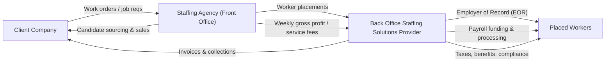

# Defining and Describing Back Office Staffing Solutions

_“Back office staffing solutions” are specialized services that take over the administrative, financial, and compliance burden of running a staffing agency so the agency can focus on selling and recruiting._

In practice, **back office staffing solutions** are most often delivered by [[concepts/Explainers for Tooling/Employer of Record]] (EOR) and payroll funding companies that provide a bundle of services such as payroll processing, tax administration, benefits, HR compliance, and receivables financing to staffing firms. [^ff8u4s] [^m33yh7] [^duy2fr] [^e9og6h] These providers typically act as the legal employer of record for placed workers while the staffing agency handles front‑office functions like sales and recruiting. [^ff8u4s] [^e9og6h] The approach matters because it removes heavy capital and compliance constraints, allowing smaller or growing staffing agencies to expand into new clients, regions, or worker types without building a large internal back office. [^ff8u4s] [^m33yh7] [^duy2fr] [^e9og6h] It is especially relevant in contingent staffing, government contracting, and multi‑state or multi‑jurisdiction placements where regulatory complexity is high. [^hkp5j2] [^ff8u4s] [^duy2fr] [^e9og6h]

# Uses in Context

- **As an Employer of Record and back office bundle for staffing agencies.**  
  Back Office Staffing Solutions describes itself as “**an Employer of Record, EOR, that delivers payroll funding, compliance, and back office solutions for staffing agencies nationwide**.”[^ff8u4s]

- **To shift legal employer status off the agency while preserving client relationships.**  
  BOSS explains that it “becomes the employer of record for your contractors” while the staffing firm “**retains the client relationship, candidate sourcing, and markups**,” illustrating how back office staffing solutions split front‑office and back‑office roles. [^ff8u4s]

- **To enable rapid growth without building internal admin teams.**  
  Madison Resources markets its offering as helping owners “**launch, build and grow a staffing firm**” by combining payroll funding with “back office support and tax services designed to help your firm grow,” a typical way the term is used in growth and scaling contexts. [^m33yh7]

- **To describe integrated funding plus administration in government staffing.**  
  Advance Partners positions its “government payroll funding & back-office solutions” as a way to “boost cash flow & streamline operations” for agencies serving government contracts, highlighting the term’s use where compliance and payment cycles are complex. [^duy2fr]

- **To characterize software‑enabled platforms for staffing operations.**  
  myBasePay advertises “**back office solutions for staffing firms**” including “Payroll funding, EOR, compliance, and VOR network access,” using the phrase to signal a technology‑enabled, service‑plus‑software model. [^e9og6h]

# History of Use

## Origins

- The underlying idea of outsourcing administrative support for staffing dates back to early **professional employer organizations (PEOs)** and **employer of record** services in the 1980s–1990s, when third parties began assuming payroll, benefits, and HR compliance for other employers, including staffing firms. [^duy2fr] [^e9og6h] Although these early providers did not consistently use the exact phrase “back office staffing solutions,” they established the model of separating front‑office recruiting from outsourced back‑office administration. [^duy2fr] [^e9og6h]

- The specific branded phrase **“Back Office Staffing Solutions”** appears in the 2010s as the name and positioning of BOSS (Back Office Staffing Solutions), which presents itself as an EOR and funding provider “for staffing agencies nationwide,” indicating that the term had become recognizable enough within the industry to function as a company name. [^ff8u4s]

Given the available search results, there is no clear single academic paper or book that can be identified as the first use of the precise phrase “back office staffing solutions”; instead, it emerged from industry practice and marketing language around outsourced staffing back offices and EOR services. [^ff8u4s] [^m33yh7] [^duy2fr] [^e9og6h]

## Evolution

- **2000s–early 2010s – From payroll-only to full back-office bundles.**  
  Early funding providers focused primarily on payroll financing for staffing firms, but over time expanded to “payroll funding, back office support, and tax services” as a bundled growth solution for agencies. [^m33yh7] [^duy2fr] This broadened scope is a key evolutionary step from single‑service factoring to integrated back office staffing solutions.

- **Mid–2010s – EOR‑centric back office for multi‑state and complex compliance.**  
  As regulations and worker classifications became more complex, providers increasingly framed themselves as EOR specialists who “handle payroll, benefits, and compliance” across states or contract types while agencies focused on placements. [^ff8u4s] [^duy2fr] [^e9og6h] This shifted the concept from simple administrative help to a risk‑management and compliance play.

- **Late 2010s–2020s – Software platforms as back office infrastructure.**  
  Newer companies emphasize a tech platform—myBasePay, for example, offers “back office solutions for staffing firms” including funding, EOR, and access to a vendor‑of‑record network, with workers able to “start in 48 hours.”[^e9og6h] Industry commentary and tools like Deel’s staffing‑related software similarly highlight centralized systems that “simplify back-office operations” for staffing agencies. [^exis01] [^e9og6h] This reflects a move toward API‑ and SaaS‑driven back office staffing solutions.

# Best Real-World Examples

- **[Back Office Staffing Solutions (BOSS)](https://backofficestaffingsolutions.com)** – An Employer of Record and funding provider that “delivers payroll funding, compliance, and back office solutions for staffing agencies nationwide,” using the term as both its brand and core offering. [^ff8u4s]

- **[Advance Partners – Government Staffing Back‑Office Solutions](https://www.advancepartners.com/payroll-funding/government-staffing/)** – Specializes in “government payroll funding & back-office solutions” to help staffing agencies serving government contracts “boost cash flow & streamline operations.”[^duy2fr]

- **[Madison Resources – Staffing Solutions](https://madisonresources.com/solutions-2/)** – Provides “payroll funding, back office support, and tax services designed to help your firm grow,” exemplifying an integrated back office model for staffing firms. [^m33yh7]

- **[myBasePay – Staffing Agency Solutions](https://mybasepay.com/solutions/staffing)** – A platform that offers “back office solutions for staffing firms” with payroll funding, EOR, compliance, and a vendor‑of‑record network, highlighting the modern, technology‑enabled form of back office staffing solutions. [^e9og6h]

- **[Signature Back Office Solution](https://www.youtube.com/watch?v=odZOvvN3N0M)** – A provider reviewed as offering “100% weekly gross profit advances” plus “full contractor payroll funding” while “handling all back office headaches,” an example of combining aggressive funding with full back office services for staffing agencies. [^hkp5j2]

- **[Deel – Centralized People Platform for Staffing Agencies](https://www.deel.com/blog/best-staffing-agency-software/)** – Although best known for global employment, Deel’s platform is cited as simplifying “back-office operations” for staffing agencies, demonstrating how large platforms adopt and popularize the back office staffing solutions model through software. [^exis01]

# Case Studies

## Case Study 1: BOSS as Employer of Record for Nationwide Staffing Agencies

Back Office Staffing Solutions (BOSS) positions itself as an **Employer of Record (EOR)** that “delivers payroll funding, compliance, and back office solutions for staffing agencies nationwide.”[^ff8u4s] In this model, staffing agencies continue to own the client and candidate relationships, but BOSS “becomes the employer of record for your contractors,” taking on legal and administrative responsibilities such as payroll processing, tax withholdings, benefits administration, and HR compliance. [^ff8u4s] By outsourcing these functions, smaller or growing agencies can rapidly take on new clients and contractor volumes without raising capital for payroll or building a large internal back office team. [^ff8u4s] [^m33yh7]

This arrangement changes the economics and risk profile of the staffing firm: rather than tying up cash in payroll until clients pay, agencies rely on BOSS’s payroll funding and EOR capabilities to bridge the gap and manage compliance. [^ff8u4s] The case illustrates how **back office staffing solutions** effectively unbundle a staffing firm’s operations into front‑office (sales and recruiting) and back‑office (funding, payroll, compliance) components, each handled by a specialized party. [^ff8u4s] [^m33yh7] It also shows why the term is often associated with enabling entrepreneurship in staffing—founders can enter niches without mastering or staffing the full spectrum of back office functions. [^ff8u4s] [^m33yh7]

## Case Study 2: Advance Partners in Government Contract Staffing

Advance Partners targets staffing firms that place workers on **government contracts**, a segment with stringent regulatory requirements and long, sometimes unpredictable payment cycles. [^duy2fr] The company offers “government payroll funding & back-office solutions” designed to “boost cash flow & streamline operations,” including financing payroll against government receivables and providing back office support tailored to public‑sector billing and compliance. [^duy2fr] In practice, this allows agencies to bid on and fulfill government staffing contracts without needing deep internal expertise in government invoicing, audit standards, and compliance reporting. [^duy2fr]

Operationally, Advance Partners’ model illustrates a niche specialization within back office staffing solutions: aligning funding structures and administrative processes with the unique constraints of government buyers. [^duy2fr] Agencies gain the ability to grow in a high‑barrier market, while Advance Partners assumes much of the back office complexity and payment risk. [^duy2fr] This case demonstrates how back office staffing solutions can be tuned to particular sectors—here, government staffing—rather than being generic back office outsourcing.

## Case Study 3: myBasePay’s Platform‑Driven Back Office for Modern Staffing Firms

myBasePay offers “back office solutions for staffing firms” that combine payroll funding, Employer of Record (EOR) services, compliance, and access to a Vendor‑of‑Record (VOR) network, with claims that workers can “start in 48 hours.”[^e9og6h] In this model, staffing agencies plug into a technology platform that handles onboarding, payroll, tax and benefits administration, and regulatory compliance while also providing funding to cover payroll before client payments arrive. [^e9og6h] The VOR network further allows agencies to expand their contingent workforce offerings without directly contracting with every underlying supplier, using myBasePay’s infrastructure instead. [^e9og6h]

By integrating these functions into a single platform, myBasePay exemplifies the current evolution of back office staffing solutions from manual, service‑heavy models to **software‑orchestrated** operations. [^exis01] [^e9og6h] Agencies gain real‑time visibility into their contingent workforce and financials through the platform, while the provider standardizes and automates many back office workflows. [^exis01] [^e9og6h] This case shows how modern back office staffing solutions increasingly depend on SaaS and API‑based systems to manage scale, speed (e.g., 48‑hour worker starts), and compliance in a complex, multi‑jurisdictional environment. [^exis01] [^e9og6h]

***

# Sources

[^hkp5j2]: [Signature Back Office Solution Review: How Do Staffing Agencies ...](https://www.youtube.com/watch?v=odZOvvN3N0M)
[^ff8u4s]: [Back Office Staffing Solutions](https://backofficestaffingsolutions.com)
[^m33yh7]: [Staffing Solutions | Payroll Funding - Madison Resources](https://madisonresources.com/solutions-2/)
[^exis01]: [Best Staffing Agency Software for 2026: Centralize Operations and ...](https://www.deel.com/blog/best-staffing-agency-software/)
[^duy2fr]: [Government Contract Payroll Financing & Funding Company](https://www.advancepartners.com/payroll-funding/government-staffing/)
[^e9og6h]: [Staffing Agency Solutions | Back Office, Funding & EOR - myBasePay](https://mybasepay.com/solutions/staffing)
