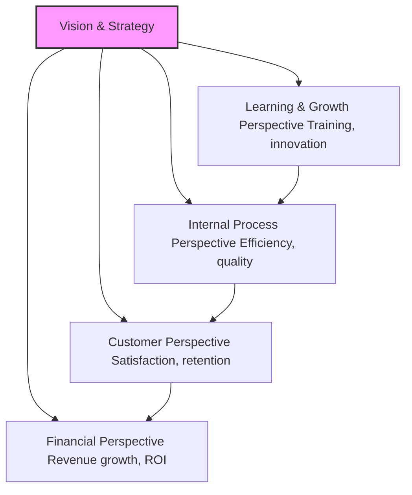

# Defining and Describing Balanced Scorecard

_The Balanced Scorecard transforms abstract strategy into actionable metrics across financial, customer, internal processes, and learning perspectives, ensuring organizations balance short-term results with long-term growth._ [^uu6j9o] [^w4dbgd]

A Balanced Scorecard (BSC) is a strategic performance tool that integrates financial and non-financial measures to align daily operations with long-term objectives, dividing performance into four perspectives for comprehensive organizational health. [^uu6j9o] It applies in strategic planning and management across industries like healthcare, education, government, nonprofits, and corporations to translate vision into measurable objectives, track progress, and foster continuous improvement. [^w4dbgd] This matters because it links strategy to execution, aligns teams, improves decision-making with real-time insights, and supports adaptability beyond traditional financial reporting. [^1m8yrg]

# Uses in Context
- In strategic planning, invoked to "align daily operations with strategic goals" and track progress across four perspectives: financial, customer, internal process, and learning & growth. [^1m8yrg]
- As a performance management framework to "translate their vision and strategy into clear, measurable objectives across multiple perspectives that include more than just financial results."[^w4dbgd]
- For cascading strategy deployment, where scorecards are created for business entities or organized around stakeholders, combining frameworks like K&N Balanced Scorecard or OKRs. [^7kh927]
- In tools like Creately, used to define vision, identify SMART objectives, set KPIs and targets, develop initiatives, and monitor progress in real-time dashboards. [^uu6j9o]
- As a "living framework" for continuous review, root cause analysis, and refinement, with status updates like "On Track" or "At Risk" applied to objectives and initiatives. [^uu6j9o]
- Paired with a Strategy Map to visualize "cause-and-effect relationships (e.g., staff training → better service → higher customer satisfaction → increased revenue)."[^w4dbgd]

# History of Use

## Origins
The Balanced Scorecard was introduced in a 1992 [[Sources/Media/Harvard Business Review|Harvard Business Review]] article by Robert S. Kaplan, a Harvard Business School professor, and David P. Norton, a consultant, as a performance measurement framework to overcome limitations of purely financial metrics by incorporating non-financial perspectives. [^uu6j9o] They proposed it in the context of helping organizations manage in a knowledge-based economy, initially tested with a dozen companies. [^w4dbgd]

## Evolution
- **1996**: Kaplan and Norton published their seminal book *[[Sources/Books/The Balanced Scorecard|The Balanced Scorecard]]*, formalizing the four perspectives and strategy maps to show causal links between objectives. [^w4dbgd]
- **2000s**: Evolved into the "Strategy-Focused Organization" model, emphasizing BSC as a management report for executive teams and cascading through organizations for alignment and execution. [^60blmc]
- **2010s–present**: Adapted for digital tools and AI automation, including modular architectures for cascading scorecards around stakeholders or [[concepts/Objectives & Key Results|OKRs]], with real-time dashboards and AI-generated objectives. [^uu6j9o] [^7kh927]

# Best Real-World Examples
- [3PL Logistics Provider (Mexico)](https://bscdesigner.com/strategy-deployment.htm) used cascaded Balanced Scorecards tailored to stakeholders for strategy implementation. [^7kh927]
- [Creately AI Balanced Scorecard Template](https://creately.com/guides/how-to-create-a-balanced-scorecard/) generates objectives, KPIs, and initiatives from vision inputs for instant strategy alignment. [^uu6j9o]
- [Balanced Scorecard Institute](https://balancedscorecard.org/strategic-planning-basics/) applies BSC for linking strategy to operations in workshops across sectors. [^1m8yrg]
- [BSC Designer](https://bscdesigner.com/strategy-deployment.htm) deploys modular, AI-automated scorecards combining BSC with OKRs for functional teams. [^7kh927]
- Healthcare organizations adapt BSC for patient outcomes, operational efficiency, and staff training across perspectives. [^w4dbgd]
- Nonprofits use BSC to balance mission impact (learning/growth), stakeholder satisfaction (customer), program delivery (processes), and funding (financial). [^w4dbgd]

# Case Studies
In the late 1980s, a U.S. semiconductor manufacturer—analogous to early adopters in Kaplan and Norton's testing—faced profitability declines despite financial focus; they implemented an early Balanced Scorecard with customer and process metrics alongside financials, leading to redesigned products and processes that boosted market share and returns. [^w4dbgd] By 1992, this pilot informed the formal BSC framework, showing how non-financial leading indicators predict financial lags, enabling proactive strategy shifts. This demonstrates BSC's power in revealing hidden drivers of performance in manufacturing, where traditional metrics missed innovation gaps. [^uu6j9o] [^w4dbgd]

A Mexican 3PL logistics provider in the 2020s cascaded Balanced Scorecards following their organizational chart and stakeholder needs, creating dedicated scorecards for entities with KPIs in all four perspectives. [^7kh927] They automated with AI for modular architecture, blending BSC with results-based management, which aligned operations to client value creation and improved efficiency metrics like cycle time. [^uu6j9o] [^7kh927] Outcomes included better resource allocation and adaptability, proving BSC's evolution for supply chain firms where stakeholder-focused cascading outpaces rigid hierarchies. [^7kh927]

Healthcare providers, as noted in cross-industry applications, deployed BSC to track patient satisfaction (customer), treatment quality (processes), staff training (learning/growth), and cost savings (financial), with regular reviews fostering agility during disruptions like pandemics. [^w4dbgd] One adaptation shifted objectives based on real-time data, improving retention and outcomes; this highlights BSC's role in service sectors, where balanced metrics drive holistic improvements beyond profits. [^w4dbgd] [^1m8yrg]

# Images

_Source: https://www.smartsheet.com/all-about-balanced-scorecard_

_Source: https://creately.com/guides/what-is-a-balanced-scorecard/_

_Source: https://www.passionned.com/balanced-scorecard/_

_Source: https://www.youtube.com/watch?v=ODSWPktb110_

_Source: https://www.peoplestrong.com/blog/balanced-scorecards/_

***

# Sources

[^uu6j9o]: [How to Create a Balanced Scorecard in 6 Easy Steps + Free ...](https://creately.com/guides/how-to-create-a-balanced-scorecard/)
[^w4dbgd]: [Balanced Scorecard Strategy: Definition, Benefits, and real-world ...](https://creately.com/guides/balanced-scorecard/)
[^1m8yrg]: [Strategic Planning Basics - Balanced Scorecard Institute](https://balancedscorecard.org/strategic-planning-basics/)
[^7kh927]: [Strategy Implementation System: Cascading Through Balanced ...](https://bscdesigner.com/strategy-deployment.htm)
[^60blmc]: [[PDF] The Strategy Focused Organization How Balanced Scorecard ...](https://lan-portal.uob.edu.ly/mirror/BOOK/96139D634E/the__strategy_focused__organization-how__balanced-scorecard-companies-thrive__in_the-new-business-environment.pdf)
[6]: [Create scorecards and manual goals - Power BI - Microsoft Learn](https://learn.microsoft.com/en-us/power-bi/create-reports/service-goals-create)
