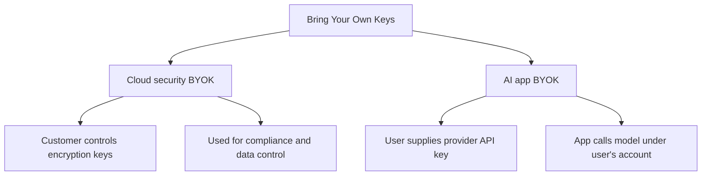

---
aliases:
  - BYOK
date_created: 2026-08-21
date_modified: 2026-08-23
tags:
  - State-of-the-Art
  - AI-SDKs
  - Agentic-AI
  - API-Integrations
  - Agentic-Workflow-Engines
  - AI-Toolkit
  - Platform-AI-Tools
  - Technology-Trends
site_uuid: aee44ded-865f-44f6-af05-a4fa2c5d0d70
publish: true
title: Bring Your Own Keys
slug: bring-your-own-keys
at_semantic_version: 0.0.0.8
cf_last_run: 2026-08-23T03:55:59.450Z
cf_last_run_model: Perplexity sonar-pro
for_clients:
  - Laerdal
---

[[TrustedRouter]]
[[Tooling/AI-Toolkit/AI Interfaces/AI Workspaces/OpenRouter|OpenRouter]]
[[Tooling/AI-Toolkit/Concentrate AI]]
[[Tooling/AI-Toolkit/Requesty]]
[[Vocabulary/Self-Hosting|Self-Hosting]]

_“Bring Your Own Keys” is a flexible control pattern: in security it means customers control encryption keys, while in AI tools it usually means you supply your own model API key instead of using the vendor’s._ [^laktr0] [^zom29a] [^2eymil]

Bring Your Own Keys (BYOK) is used in at least two closely related but distinct ways. In cloud security, it refers to a customer-managed encryption model in which the customer generates, imports, stores, or governs the key material used to protect data. [^zom29a] [^jazxs0] [^c36w17] In AI software, it usually means an application lets you connect your own provider API key, so usage is billed and governed by the provider account you control rather than by the app vendor’s pooled key. [^laktr0] [^2eymil] [^0k2c32]

# Defining and Describing Bring Your Own Keys
- 

## Uses in Context
- In cloud platforms, BYOK describes a setup where “customers of a cloud service provider (CSP) generate and manage their own encryption keys.” [^zom29a]
- Oracle uses the term for environments where users “use and manage your own encryption keys” instead of the service’s default Oracle-managed TDE key. [^jazxs0]
- Salesforce describes BYOK as a way to “bring key material from outside of Salesforce,” with customers generating it via their own crypto libraries, enterprise key management system, or hardware security module. [^d57zvt]
- In JetBrains AI Assistant, BYOK means using “models from a supported AI provider by providing your own API key.” [^laktr0]
- Raycast uses the term for connecting “your own API key from Anthropic, Google, or OpenAI” to its AI features. [^2eymil]
- Cloudflare AI Gateway uses “bring your own keys” to mean securely storing provider API keys in its dashboard and referencing them in gateway configuration. [^0k2c32]

## History of Use

### Origins
Bring Your Own Key first appears as a cloud-security and encryption term, not as an AI product term. [^zom29a] [^jazxs0] [^c36w17] IBM defines it as an encryption key management approach in which cloud customers “generate and manage their own encryption keys,” which reflects the core security meaning now common across enterprise cloud services. [^zom29a] Oracle and Salesforce later use the same acronym for managed-cloud encryption controls, showing that the term spread as a customer-control pattern across SaaS and infrastructure products. [^jazxs0] [^c36w17] [^d57zvt]

### Evolution
- By 2025, JetBrains was using BYOK for AI assistants, defining it as a way to use provider models by “providing your own API key.” [^laktr0]
- By 2026, Raycast, Cloudflare AI Gateway, and other AI tooling had adopted the term for API-key management in AI workflows, extending the phrase from encryption-key governance into model-access and billing control. [^2eymil] [^0k2c32]
- In 2026, BYOK remained a dual-use term across enterprise software: security vendors and cloud providers kept the encryption meaning, while AI tools used it for bring-your-own-provider credentials. [^zom29a] [^2eymil] [^0k2c32]

## Best Real-World Examples
- [JetBrains AI Assistant](https://www.jetbrains.com/help/ai-assistant/bring-your-own-key-byok.html) — supports BYOK by letting users provide their own API key for supported AI providers. [^laktr0]
- [Raycast AI](https://manual.raycast.com/ai/bring-your-own-keys) — lets users connect their own Anthropic, Google, or OpenAI key to AI features. [^2eymil]
- [Cloudflare AI Gateway](https://developers.cloudflare.com/ai-gateway/configuration/bring-your-own-keys/) — stores provider API keys in the dashboard and reuses them in gateway configuration. [^0k2c32]
- [IBM BYOK](https://www.ibm.com/think/topics/byok) — presents BYOK as a customer-managed encryption-key model for cloud services. [^zom29a]
- [Oracle BYOK](https://docs.oracle.com/en/cloud/saas/enterprise-performance-management-common/cgsad/bring_your_own_keys_byok_overview.html) — uses customer-managed keys stored in OCI Vault for Oracle cloud applications. [^jazxs0]
- [Salesforce BYOK](https://help.salesforce.com/s/articleView?id=platform.administration_o_backup_recover_byok_overview.htm&language=en_US&type=5) — gives customers control over encryption keys used for cloud data. [^c36w17]
- [Salesforce Shield BYOK](https://help.salesforce.com/s/articleView?id=xcloud.security_shield_pe_byok.htm&language=de&type=5) — describes customer-generated key material from external crypto tools or an HSM. [^d57zvt]

## Case Studies
JetBrains shows the AI version of BYOK in a concrete workflow: the AI Assistant plugin lets users select a provider, enter a key, and then use models from that provider inside the IDE. [^laktr0] The company’s documentation frames BYOK as a practical configuration choice rather than a new model architecture, which is important because it shows how the term has shifted from security policy into developer-tool UX. [^laktr0]

Cloudflare’s AI Gateway uses BYOK as an operational control layer, where API keys are stored once in the dashboard and then referenced across requests instead of being passed repeatedly. [^0k2c32] That implementation matters because it emphasizes key storage and routing convenience, while still leaving billing and access tied to the user’s provider account. [^0k2c32]

In enterprise security, Oracle and Salesforce illustrate the older, stricter meaning of BYOK: customers manage encryption keys that protect cloud data rather than relying entirely on provider-held keys. [^jazxs0] [^c36w17] [^d57zvt] This version of BYOK is about custody and compliance, and it shows the concept’s roots in cryptographic control before the phrase was repurposed by AI tooling for API-key delegation. [^zom29a] [^jazxs0] [^c36w17] [^d57zvt]

***

# Sources

[^laktr0]: [Bring your own key (BYOK) | AI Assistant](https://www.jetbrains.com/help/ai-assistant/bring-your-own-key-byok.html)
[2]: [Bring Your Own Key (BYOK) Is Now Live in JetBrains IDEs](https://blog.jetbrains.com/ai/2025/12/bring-your-own-key-byok-is-now-live-in-jetbrains-ides/)
[3]: [Bring Your Own Key (BYOK) Explained: Cloud Encryption Guide 2026](https://khimananda.com/blog/bring-your-own-key-byok-explained)
[^zom29a]: [What Is Bring Your Own Key (BYOK)?](https://www.ibm.com/think/topics/byok)
[5]: [CyberSentriq Launches 'Bring Your Own Key' BYOK for ...](https://finance.yahoo.com/technology/ai/articles/cybersentriq-launches-bring-own-key-130500807.html)
[^jazxs0]: [Bring Your Own Key (BYOK) Overview - Oracle Help Center](https://docs.oracle.com/en/cloud/saas/enterprise-performance-management-common/cgsad/bring_your_own_keys_byok_overview.html)
[^c36w17]: [Bring Your Own Key (BYOK) for Recover](https://help.salesforce.com/s/articleView?id=platform.administration_o_backup_recover_byok_overview.htm&language=en_US&type=5)
[^d57zvt]: [Bring Your Own Key (BYOK) Option - Salesforce Help](https://help.salesforce.com/s/articleView?id=xcloud.security_shield_pe_byok.htm&language=de&type=5)
[9]: [What is BYOK (Bring Your Own Key) AI, and why does it matter?](https://calmara.app/blog/what-is-byok-bring-your-own-key-ai)
[10]: [Bring your own key（BYOK）とは](https://www.ibm.com/jp-ja/think/topics/byok)
[^2eymil]: [Bring Your Own Keys](https://manual.raycast.com/ai/bring-your-own-keys)
[12]: [Architecting a BYOK (Bring Your Own Key) Encryption Model](https://www.c-sharpcorner.com/article/architecting-a-byok-bring-your-own-key-encryption-model/)
[^0k2c32]: [BYOK (Store Keys) - AI Gateway](https://developers.cloudflare.com/ai-gateway/configuration/bring-your-own-keys/)
[14]: [BYOK Meaning: What 'Bring Your Own Key' Is and Why It's ...](https://surfmind.ai/blog/byok-bring-your-own-key-future-of-ai-tools)
[15]: [Bring Your Own Key (BYOK): What It Is and How It Works](https://sikkerkey.com/blog/bring-your-own-key)
