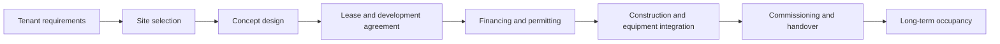

---
aliases:
  - Build-to-Suit
  - build-to-suit
date_created: 2026-10-04
date_modified: 2026-10-06
tags:
  - AI-Infrastructure
  - Cloud-Infrastructure
  - Datacenter-Builders
  - Data-Centers
cf_last_run: 2026-10-06T19:43:15.173Z
cf_last_run_model: Perplexity sonar-pro
---

[[content-areas/AI-Factories-Datacenters/Concepts/Datacenter Builders|Datacenter Builders]]

# Defining and Describing Build-to-Suit Development

- 
- _Build-to-suit development turns a tenant’s operating requirements into a purpose-built facility rather than forcing the tenant into an existing building._[1][2]
- In a typical arrangement, a developer or landlord acquires or controls the site, finances and manages design and construction, and leases the completed property to the identified tenant under a long-term agreement.[1][2][6]
- The model applies when a tenant needs specialized physical, technical, logistical, or utility specifications that conventional inventory cannot adequately provide.[2][7][10]
- The tenant commonly commits to the lease before construction begins, making the project financeable and transferring much of the development execution to the landlord or developer.[9][12]
- Build-to-suit development is especially relevant to industrial facilities, manufacturing plants, logistics warehouses, healthcare buildings, and data centers, where power, equipment integration, loading, security, and operational flows require customization.[5][7][10]

# Uses in Context

- In industrial real estate, the term describes a warehouse or production facility designed around a particular tenant’s dimensions, process flows, clear heights, dock requirements, utilities, and expansion plans.[1][2][7]
- In commercial leasing, “build-to-suit lease” refers to an agreement in which the developer constructs the building to the tenant’s specifications and leases it back after completion.[6][12]
- In finance and corporate real estate, the model is invoked as a way to obtain a customized facility while preserving the tenant’s capital for core operations, because the developer or investor typically funds the land and construction.[4][14]
- In lease accounting and risk allocation, build-to-suit arrangements are distinguished from ordinary leases because the contract governs both pre-construction obligations and the later occupancy period.[9]
- In data-center development, the model is used when a tenant requires a facility tailored to its exact capacity, power, cooling, security, and network requirements.[5]

# History of Use

## Origins

- The available search results do not identify a definitive first academic paper, book, or individual who coined the phrase “build-to-suit development.” They consistently describe it as an industry term for developing a property from scratch for an identified tenant.[7][11][15]
- The underlying practice is defined by a pre-construction commitment: the tenant specifies the facility program, the developer arranges land, financing, design, and construction, and the tenant leases the completed building.[1][6][12]
- The phrase is therefore best treated as a real-estate and development convention that evolved from customized commercial construction and long-term leasing, rather than as a concept attributable to a single documented inventor.[1][7][11]

## Evolution

- **Pre-construction customization:** The model developed around facilities designed for one known occupant, with the tenant and developer agreeing on the building program before construction begins.[7][9]
- **Institutionalized financing structure:** Modern build-to-suit transactions commonly combine a development or construction agreement with a long-term lease, allowing the developer or investor to underwrite construction against the tenant’s commitment.[9][12][14]
- **Expansion into technical infrastructure:** The model has increasingly been applied to specialized facilities such as data centers and industrial plants, where tenant-provided equipment, utility capacity, commissioning, and operational validation must be coordinated during construction.[5][10]

# Best Real-World Examples

- [Oppidan 5MW Data Center](https://gardner-builders.com/work/oppidan-5mw-data-center) — a data-center project in which Oppidan served as landlord and financed and developed a facility tailored to a tenant’s exact requirements.[5]
- [Link Logistics build-to-suit warehouses](https://www.linklogistics.com/news-insights/industrial-real-estate-101/build-to-suit-warehouses-what-they-are-and-how-they-work/) — industrial facilities developed through needs assessment, site evaluation, concept design, permitting, construction, and long-term leasing.[2]
- [Hansen-Rice custom industrial facilities](https://hansen-rice.com/insights/custom-industrial-facilities-zero-capital-burden) — facilities programmed around process flow, utilities, tenant equipment, commissioning, and a tenant-funded operating structure after delivery.[10]
- [AI Real Estate industrial build-to-suit projects](https://hub.airealestate.com.mx/insights/build-suit-mexicos-industrial-real-estate-market-work/) — manufacturer-specific facilities financed, designed, and constructed by a developer-landlord, often inside a serviced industrial park.[3]
- [W. P. Carey developer-led build-to-suit model](https://www.wpcarey.com/blog/why-build-suits-are-gaining-momentum-todays-market) — a capital-partner structure in which a developer handles land and construction while an investor finances or acquires the completed property for long-term tenant occupancy.[14]
- [CoBouw tailor-made warehouses](https://cobouw.pl/en/build-to-suit-or-a-tailor-made-warehouse/) — developments created from land acquisition through design, construction, and handover for the individual requirements of a specific tenant.[11]

# Case Studies

## Oppidan 5MW Data Center

[[Oppidan]] developed a 5-megawatt data center as landlord in partnership with a tenant, using the build-to-suit model to tailor the facility from the ground up to the tenant’s exact needs.[5] The project illustrates how build-to-suit development extends beyond conventional warehouses into digital infrastructure, where capacity, power, cooling, security, and network design can determine whether a facility is operationally viable. It also demonstrates the central economic exchange: the developer assumes responsibility for financing and delivery while the tenant commits to occupying a purpose-built asset.[5]

## Custom Industrial Facility with Integrated Tenant Equipment

The Hansen-Rice model begins by defining process flow, utilities, wastewater, gas, site constraints, and other facility-specific requirements before moving through site selection, conceptual design, budgeting, permitting, detailed design, construction, and commissioning.[10] Tenant-provided equipment can be integrated during construction so that the building is operational at lease commencement.[10] This shows that a build-to-suit is not merely a customized shell: for manufacturing and other technical users, it is a coordinated delivery system linking real-estate development with production readiness.[10]

## Build-to-Suit Warehouse Development

Link Logistics describes a process beginning with an internal needs assessment, followed by broker and developer engagement, site feasibility, concept design, lease proposal, permitting, and construction.[2] The completed facility is then leased to the tenant, often under a triple-net structure in which the tenant pays property taxes, insurance, and maintenance in addition to base rent.[2] The case illustrates the tradeoff at the heart of the model: the tenant receives a facility aligned with its operating requirements, while accepting a long-term commitment and substantial responsibility for occupancy-related costs.[2]

***

# Sources

[1]: [Build-to-Suit vs Lease for Industrial Facilities: A Total Cost Comparison](https://www.bluecapeconomicadvisors.com/post/build-to-suit-vs-lease-for-industrial-facilities-a-total-cost-comparison)
[2]: [Build-to-Suit Warehouses: What They Are and How ...](https://www.linklogistics.com/news-insights/industrial-real-estate-101/build-to-suit-warehouses-what-they-are-and-how-they-work/)
[3]: [Build to Suit Industrial Mexico | Market Guide - AI Real Estate](https://hub.airealestate.com.mx/insights/build-suit-mexicos-industrial-real-estate-market-work/)
[4]: [Understanding Build-to-Suit Leases: Pros & Cons](https://www.modern-cre.com/insights/understanding-build-to-suit-leases-pros-and-cons)
[5]: [Oppidan 5MW Data Center](https://gardner-builders.com/work/oppidan-5mw-data-center)
[6]: [Negotiating a Build-to-Suit Lease - Clark Meyers PC](https://clarkmeyers.com/build-to-suit-lease/)
[7]: [Build-to-Suit: When to Build a Purpose-Designed Industrial ...](https://www.grupocob.com/en/blog/built-to-suit-nave-industrial-medida)
[8]: [What Is Build to Suit: Definition, Process, Benefits - CLIMB](https://climbtheladder.com/what-is-build-to-suit-definition-process-benefits/)
[9]: [Build To Suit Agreement Template (Free Word)](https://www.business-in-a-box.com/template/build-to-suit-agreement-D12990)
[10]: [Custom Industrial Facilities, Zero Capital Burden - Hansen-Rice, Inc.](https://hansen-rice.com/insights/custom-industrial-facilities-zero-capital-burden)
[11]: [Build-to-suit, or a tailor-made warehouse - CoBouw](https://cobouw.pl/en/build-to-suit-or-a-tailor-made-warehouse/)
[12]: [Build-to-Suit Leases: CAM, NNN Exposure, and Audit Rights](https://www.camaudit.io/partners/resources/tenant-reps/build-to-suit)
[13]: [Build-to-Suit (BTS) Industrial Lease](https://www.cubework.com/glossary/build-to-suit-bts-industrial-lease)
[14]: [Why Build-to-Suits Are Gaining Momentum in Today's Market](https://www.wpcarey.com/blog/why-build-suits-are-gaining-momentum-todays-market)
[15]: [Build-to-Suit (BTS) - CubeworkFreight & Logistics Glossary](https://www.cubework.com/glossary/build-to-suit-bts)
