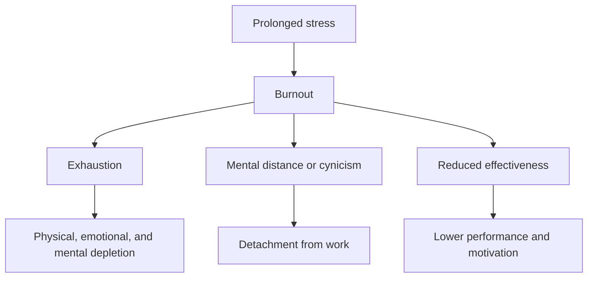

[[concepts/Organization Design|Organizational Design]]
[[concepts/Conway's Law|Conway's Law]]
[[Vocabulary/Venture Capital|Venture Capital]]
[[concepts/Operational Excellence|Operational Excellence]]
[[Vocabulary/Performance Monitors|Performance Monitors]]
[[Vocabulary/Key Performance Indicators|Key Performance Indicators]]
[[concepts/Objectives & Key Results|OKRs]]
[[concepts/Continuous Performance Management|Continuous Performance Management]]

# Defining and Describing Burnout

- _Burnout is the point where prolonged stress stops feeling like “pressure” and starts feeling like depletion._[^9j0c07] [^xkkbl0]

Burnout is commonly defined as a state of emotional, physical, and mental exhaustion caused by excessive or prolonged stress, especially in work-related settings. [^9j0c07] [^xkkbl0] The World Health Organization describes burnout as an *occupational phenomenon* rather than a medical condition, characterized by three dimensions: exhaustion, mental distance or cynicism toward work, and reduced professional effectiveness. [^614p3a] It matters because burnout can lower performance, motivation, and well-being, and because it often reflects problems in work design and culture rather than only individual resilience. [^614p3a] [^fnc9sv]

- 

# Uses in Context

- In workplace and HR writing, burnout is used to describe employees who are “overwhelmed, demotivated, or disconnected” from work. [^614p3a]
- In clinical and counseling contexts, burnout is framed as “emotional, physical, and mental exhaustion” after “excessive and prolonged stress.”[^9j0c07] [^xkkbl0]
- In occupational health discussions, burnout is treated as a systemic problem: “not an individual problem—it’s a systemic design issue.”[^fnc9sv]
- In identity and belonging discussions, burnout describes the emotional cost of constantly managing how one is perceived, where “belonging itself becomes effortful.”[^mr7ebc]
- In recovery-oriented settings, burnout is used to name a warning sign when someone feels pressure to “do the work” but starts “doing the bare minimum to stay afloat.”[^4dd4d9]

# History of Use

## Origins

Burnout entered modern usage through psychological and social-work writing in the 1970s, where it was used to describe the exhaustion of people doing intensive helping work. [^614p3a] [^9j0c07] Contemporary sources summarize the concept as having moved from narrow helping-profession usage to a broader workplace phenomenon affecting many kinds of workers. [^614p3a] The WHO later formalized burnout as an occupational phenomenon with three defining dimensions: exhaustion, mental distancing/cynicism, and reduced efficacy. [^614p3a]

## Evolution

- 1970s: The term was used to describe exhaustion in high-demand caring professions, especially work involving sustained emotional labor. [^614p3a]
- 2019: The World Health Organization classified burnout in ICD-11 as an “occupational phenomenon,” helping distinguish it from a general mental disorder. [^614p3a]
- 2020s: Writing on burnout expanded beyond workload to include organizational design, belonging, identity labor, and uneven effects across the hierarchy. [^mr7ebc] [^fnc9sv] [^oo4zzs]

# Best Real-World Examples

- [World Health Organization](https://www.who.int) — formalized burnout as an “occupational phenomenon” with three core dimensions. [^614p3a]
- [HelpGuide](https://www.helpguide.org) — presents burnout as a common stress state defined by “emotional, physical, and mental exhaustion.”[^9j0c07]
- [Psychology Today](https://www.psychologytoday.com) — defines burnout as “emotional, mental, and often physical exhaustion” from prolonged stress. [^xkkbl0]
- [Harvard Business Review](https://hbr.org) — frames burnout as a “systemic design issue” that varies by organizational level. [^fnc9sv]
- [PubMed study on professional identity and burnout](https://pubmed.ncbi.nlm.nih.gov/40700654/) — reports that higher professional identity is associated with lower burnout in medical students. [^oo4zzs]
- [Alliance for Eating Disorders](https://www.allianceforeatingdisorders.com) — shows burnout-like exhaustion during recovery when people feel pressure to progress too quickly. [^4dd4d9]
- [Evan Curry Counseling](https://www.evancurrycounseling.com) — uses “identity-based burnout” to describe the toll of managing perception and belonging. [^mr7ebc]

# Case Studies

One influential case is the WHO’s occupational framing of burnout. By defining it as a work-related phenomenon rather than a personal weakness, the WHO shifted the conversation toward job design, workload, and organizational responsibility. [^614p3a] The three-part model—exhaustion, mental distance or cynicism, and reduced effectiveness—gave managers and researchers a shared language for identifying burnout across industries. [^614p3a] This case shows that burnout is not just a feeling; it is a category used to diagnose failures in work systems. [^614p3a] [^fnc9sv]

A second case comes from higher education and medicine, where burnout is often discussed alongside identity, training, and professional development. A recent PubMed-indexed study found that medical students with higher professional identity reported significantly fewer mental health issues and less burnout, including lower emotional exhaustion and cynicism. [^oo4zzs] That finding suggests burnout is influenced not only by workload but also by meaning, role clarity, and identification with the profession. [^oo4zzs] In practical terms, this case shows how talent development and belonging can function as protective factors against burnout. [^oo4zzs]

A third case is identity-based burnout in counseling and recovery contexts. Evan Curry Counseling describes it as the exhaustion that comes from “managing how you’re perceived” in environments where identity is misunderstood, marginalized, or invisible. [^mr7ebc] The article’s recovery advice emphasizes naming the problem, validating exhaustion, reclaiming boundaries, and seeking affirming spaces. [^mr7ebc] This example broadens burnout beyond overwork alone and shows how constant self-monitoring and emotional labor can become a drain in their own right. [^mr7ebc]

***

# Sources

[^614p3a]: [Types of burnout: what they are and how to identify them - Hybo](https://hybo.app/en/blog/types-of-burnout/)
[^mr7ebc]: [Identity-Based Burnout: When Belonging Feels Like Work](https://www.evancurrycounseling.com/blog/identity-based-burnout-when-belonging-feels-like-work)
[^fnc9sv]: [Burnout Looks Different Across the Org Chart. Watch for These Signs.](https://hbr.org/2026/04/burnout-looks-different-across-the-org-chart-watch-for-these-signs)
[^oo4zzs]: [Association Among Professional Identity, Burnout, and Mental ...](https://pubmed.ncbi.nlm.nih.gov/40700654/)
[^4dd4d9]: [Understanding Burnout in Eating Disorder Recovery](https://www.allianceforeatingdisorders.com/burnout-eating-disorder-recovery/)
[6]: [Emotional Burnout: A Full Guide from Ambrosia Behavioral Health](https://www.ambrosiatc.com/emotional-burnout-a-full-guide-from-ambrosia-behavioral-health/)
[^9j0c07]: [Burnout: Symptoms and Tips on How to Deal - Stress - HelpGuide.org](https://www.helpguide.org/mental-health/stress/burnout-prevention-and-recovery)
[^xkkbl0]: [Burnout | Psychology Today](https://www.psychologytoday.com/us/basics/burnout)
