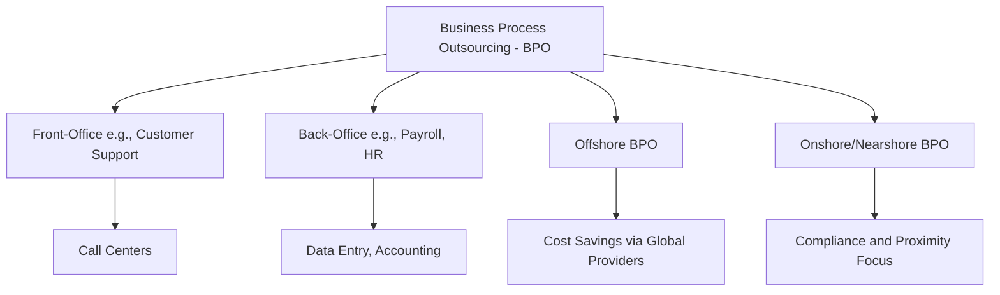

# Defining and Describing Business Process Outsourcing

_Business process outsourcing (BPO) empowers companies to offload non-core operations to specialized third-party providers, converting fixed costs into flexible, expertise-driven variable expenses._ [^ejy2pr] [^f72kgq]

**Business process outsourcing (BPO) is a subset of outsourcing in which a company contracts the operations and responsibilities of a specific business process to a third-party service provider.**[^ejy2pr] It applies to functions like payroll, HR, customer support, and data entry, allowing firms to focus on core competencies while gaining cost efficiency and scalability. [^f72kgq] [^wf7a12] BPO matters because it transforms rigid internal processes into agile, expert-managed services, though it risks dependency and service gaps if contracts falter. [^ejy2pr]

# Uses in Context
- In business strategy, BPO is invoked to delegate "non-core operations, such as payroll and HR," freeing companies for primary functions. [^f72kgq]
- For cost management, it's used to "transform fixed costs into variable costs" and "leverage specialized expertise."[^ejy2pr]
- In customer service, BPO describes "outsourcing some aspect of your business's operations to a third-party vendor," like call centers. [^im0b8c]
- Sector analyses apply it to "pure play BPO services that focus on technology-related functions – e.g. IT, tech."[^1n53x2]
- In operations, firms use BPO for "noncore tasks like payroll, support, and data entry to expert third-party providers."[^wf7a12]
- For back-office efficiency, it's contracting "specific business functions" externally rather than in-house. [^os6tkt]

# History of Use

## Origins
The term Business Process Outsourcing (BPO) emerged as a formalized subset of outsourcing in the late 1990s, building on earlier offshore data processing trends, with widespread documentation appearing in industry analyses around the early 2000s. [^ejy2pr] It was introduced in the context of global service providers handling discrete processes like finance and administration, distinct from full IT outsourcing. [^ejy2pr]

## Evolution
- **Early 2000s**: BPO expanded from basic [[concepts/Explainers for Tooling/Back Office]] tasks (e.g., [[Payroll]]) to include customer-facing front-office services like call centers, driven by telecom and internet growth. [^ejy2pr] [^im0b8c]
- **2010s**: Integration with technology led to "technology business process outsourcing" focusing on IT-related functions, boosting industry indices. [^1n53x2]
- **2020s**: The sector achieved a 2025 index score of 120 (base FY19=100), reflecting post-pandemic resilience and 2-point yearly gains amid digital transformation. [^1n53x2]

# Best Real-World Examples
- [ADP Payroll Outsourcing](https://www.adp.com/resources/articles-and-insights/articles/w/what-is-bpo.aspx) for HR and payroll BPO, handling non-core employer functions. [^f72kgq]
- [Zendesk BPO Call Centers](https://www.zendesk.com/blog/ccaas/call-center/ultimate-guide-call-centers/whats-a-bpo-call-center/) exemplifying customer support operations delegated to third parties. [^im0b8c]
- [Helpware Customer Support BPO](https://helpware.com/blog/advantages-business-process-outsourcing) for back-office and marketing functions outsourced globally. [[Helpware]] [^8cvt7m]
- [Felcorp Back-Office BPO](https://www.felcorp.com/us/learn-bpo/what-is-bpo) contracting accounting and data processes to external providers. [^os6tkt]
- [monday.com Data Entry BPO](https://monday.com/blog/project-management/business-process-outsourcing/) for noncore tasks like support and entry via specialists. [[Tooling/Productivity/Workflow Management/Monday|Monday]] [^wf7a12]
- [PwC Tech BPO Providers](https://www.pwc.com/gx/en/industries/business-services/global-business-services-index/business-process-outsourcing.html) focusing on IT and tech processes. [[Pricewaterhouse Coopers]] [^1n53x2]

# Case Studies

In the HR domain, [[organizations/ADP]] has exemplified BPO by enabling employers to outsource payroll and managed HR services to third-party providers, allowing focus on core business since the early 2000s. [^f72kgq] Companies contract ADP for these non-core operations, which handle compliance, processing, and reporting, reducing internal overhead by up to 40% in some cases through variable costing models. [^ejy2pr] [^f72kgq] This shifted fixed HR staff costs to scalable fees, demonstrating BPO's role in agility; it shows how specialized providers mitigate talent shortages while clients report higher accuracy and compliance, though success hinges on clear service-level agreements. [^ejy2pr] [^f72kgq]

[[Tooling/Enterprise Jobs-to-be-Done/Zendesk]]-powered BPO call centers illustrate front-office outsourcing, where businesses delegate customer interactions to third-party vendors for 24/7 support. [^im0b8c] Starting in the 2010s, firms like e-commerce brands outsourced via BPO providers to manage high-volume queries, integrating tools for faster resolutions and cutting costs by 30-50%. [^ejy2pr] [^im0b8c] What changed was improved customer satisfaction scores and scalability during peaks; this case underscores BPO's value in customer-facing processes but highlights risks like unmet service levels if vendor training lags. [^ejy2pr] [^im0b8c]

The [[Pricewaterhouse Coopers]]-tracked BPO sector's evolution to a 2025 index of 120 reflects tech-focused providers adapting post-2019, with pure-play firms handling IT-BPO amid digital shifts. [^1n53x2] Providers expanded from basic processes to AI-enhanced tech functions, improving scores through efficiency gains. [^1n53x2] This demonstrates BPO's maturation into a resilient industry, teaching that ongoing adaptation counters challenges like changing requirements, with the 2-point annual rise signaling sustained growth. [^ejy2pr] [^1n53x2]

***

# Sources

[^ejy2pr]: [Business process outsourcing - Wikipedia](https://en.wikipedia.org/wiki/Business_process_outsourcing)
[^1n53x2]: [Built processing outsourcing (BPO) industry - PwC](https://www.pwc.com/gx/en/industries/business-services/global-business-services-index/business-process-outsourcing.html)
[^f72kgq]: [What is Business Process Outsourcing (BPO)? | Guide for Employers](https://www.adp.com/resources/articles-and-insights/articles/w/what-is-bpo.aspx)
[^wf7a12]: [Business Process Outsourcing: Definition, Types, Benefits](https://monday.com/blog/project-management/business-process-outsourcing/)
[^im0b8c]: [What's a BPO call center, and what does it do? - Zendesk](https://www.zendesk.com/blog/ccaas/call-center/ultimate-guide-call-centers/whats-a-bpo-call-center/)
[^os6tkt]: [What Is BPO? A Clear, Modern Definition - Felcorp Support](https://www.felcorp.com/us/learn-bpo/what-is-bpo)
[^8cvt7m]: [10 Benefits of Business Process Outsourcing (BPO) - Helpware](https://helpware.com/blog/advantages-business-process-outsourcing)
