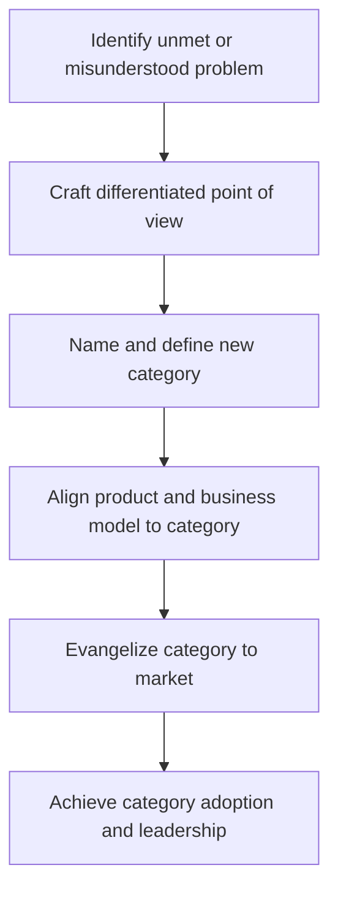

_Category design is the discipline of deliberately creating, defining, and owning a new market category in customers’ minds rather than competing inside someone else’s._

Category design treats markets as *created narratives*—not just discovered segments—where companies craft a “different” problem, language, and frame of reference so that their product becomes the default solution for that new category. It typically applies in venture-backed startups, disruptive business models, and technology markets where competing on features or price is insufficient. The practice matters because true category leaders often capture the majority of a category’s market cap and profit pool once the mental model is established.

## Defining and Describing Category Design

Category design is most commonly defined in the startup and venture literature as the strategic practice of *“proactively designing and dominating a new market category”* rather than fighting for share in an existing one. In their book *[[Sources/Books/Play Bigger]]*, Al Ramadan, Dave Peterson, Christopher Lochhead, and Kevin Maney argue that “great companies don’t just create products, they create categories” and that the winners become “category kings” capturing the vast majority of that category’s market value. Category design involves articulating a new problem (or reframing an old one), naming the category, evangelizing a point of view, and aligning product, company, and ecosystem to that narrative.

At its core, category design rests on the idea that markets are shaped by stories and mental models: whoever defines the problem and the evaluative criteria defines the category. Instead of incremental differentiation, the goal is to make existing alternatives look obsolete by shifting the frame—e.g., moving from “better CRM” to “customer success” as a fundamentally different problem space. In venture settings, investors often look for companies that are “category creators” rather than “category entrants,” expecting that, if the category breaks out, the leader can capture a disproportionate share of long-term value. As a practice, category design blends elements of strategy, marketing, product definition, and narrative design.

## Uses in Context

- Venture strategists and marketers use “category design” to describe deliberately *“creating and developing a new market category, so that customers, analysts, and the media see your offering as the standard”* rather than a feature in an existing bucket.
- Founders and investors talk about “category kings” in boards and pitch decks, drawing directly from *Play Bigger*’s claim that category kings capture *“76% of the total market capitalization of their category”* once it matures.
- Product and brand teams adopt category design when they try to “name the game” (e.g., “product-led growth,” “revenue operations”) so that their company is associated with the category’s origin and core playbook.
- In SaaS and B2B marketing, agencies position themselves as “category design partners,” promising to help companies “define the problem, name the category, and drive a category narrative across PR, content, and sales.”
- Analysts and commentators use the term retrospectively to explain why companies like Salesforce or HubSpot ended up dominating: not just by product advantage, but by “evangelizing and owning a new category idea in the minds of buyers.”

## History of Use

### Origins

- The core ideas behind category design trace back to earlier marketing and positioning theory, particularly Al Ries and Jack Trout’s *[[Sources/Books/Positioning|Positioning]]: The Battle for Your Mind* (1981), which argued that “the basic approach to positioning is not to create something new and different, but to manipulate what’s already in the mind” and that it is often better to create a new category than fight for first place in an existing one.
- The *specific* phrase **“category design”** and the structured discipline under that name are widely attributed to Al Ramadan, Dave Peterson, Christopher Lochhead, and Kevin Maney, who popularized it in the 2016 book *Play Bigger: How Pirates, Dreamers, and Innovators Create and Dominate Markets*. They describe category design as a new management discipline that “discovers, defines and develops new market categories” and positions companies to become category kings.
- Prior to the book, Lochhead and co-authors had experimented with the practice in Silicon Valley startups and wrote about “category design” in talks, blog posts, and consulting work at their firm Play Bigger Advisors, framing it as distinct from traditional brand positioning or product marketing.

### Evolution

- **2016 – Codification in *Play Bigger*.** The publication of *Play Bigger* formalized category design as a named discipline, introducing terms like “category king,” “lightning strike marketing,” and “category blueprint,” and backing them with an analysis of tech IPOs showing that category kings capture the majority of their category’s market cap.
- **Late 2010s – Spread via agencies and practitioners.** After 2016, boutique firms and solo strategists began offering category design services, adapting the Play Bigger ideas into practical frameworks for startups, including workshops on crafting a point of view, category names, and narrative architectures.
- **2020s – Integration with PLG and venture thinking.** Category design concepts have been woven into product-led growth, go-to-market, and venture frameworks, with investors and operators talking about “category creation” as a key source of durable moats and narrative dominance in crowded SaaS and fintech spaces.

## Best Real-World Examples

- [Salesforce](https://www.salesforce.com) is often cited as a **category king** in “cloud-based CRM,” having reframed CRM as a SaaS service with the “No Software” narrative and then dominating the newly defined category.
- [HubSpot](https://www.hubspot.com) helped define and popularize the category of “inbound marketing,” coining and evangelizing the term through a book, blog, and software platform that became synonymous with the category.
- [Gainsight](https://www.gainsight.com) is a classic startup example in “customer success management,” working with early category design advisors to elevate “customer success” from a role/function into a distinct software category.
- [Zendesk](https://www.zendesk.com) is frequently used as an example of designing and leading the “cloud-based customer service” category, reframing help desk software as a modern, easy-to-use SaaS service with a strong narrative and ecosystem.
- [Category Pirates](https://categorypirates.com), an indie newsletter and advisory outfit, extends the practice by teaching founders how to “write category narratives” and “rename markets” as a strategy for growth, effectively acting as contemporary category design evangelists.
- [Peloton](https://www.onepeloton.com) is often analyzed as a consumer example, designing a category around “connected fitness” that blends hardware, subscription content, and community rather than being just an exercise bike maker.

## Case Studies

### Gainsight and the Rise of “Customer Success”

Gainsight, founded in 2009 (originally as Jbara), is widely referenced as a textbook case of early-stage category design around “customer success management.” Under CEO Nick Mehta, the company worked with category design advisors associated with the *Play Bigger* community to intentionally name and evangelize “customer success” not just as a job title but as a strategic function that required a dedicated software platform. They hosted the Pulse conference, produced content defining best practices, and consistently framed their product as the system of record for customer success, helping to create analyst categories and budget lines around the concept. This case shows how a startup can move from being perceived as “account management software” to owning a new executive-level category by designing the narrative, community, and ecosystem around a redefined problem.

### HubSpot and “Inbound Marketing”

HubSpot, founded in 2006 by Brian Halligan and Dharmesh Shah, is another canonical example of category design through the introduction of “inbound marketing.” Rather than positioning themselves as yet another marketing automation vendor, the founders popularized the term “inbound marketing” in their 2010 book and extensive blog content, defining it as a customer-centric alternative to traditional “outbound” tactics like cold calls and ads. HubSpot’s software suite was consistently framed as the enabling platform for inbound marketing, bundling blogging, SEO, email, and analytics under the new category label. Over time, analysts, agencies, and customers adopted the term, and HubSpot became almost synonymous with inbound, illustrating how naming and educating a market around a new category can create strong association and leadership.

### Peloton and “Connected Fitness”

Peloton, launched in 2012, is frequently analyzed as a consumer category design example, framing itself not as a fitness equipment manufacturer but as the leader of a “connected fitness” category combining hardware, live and on-demand classes, and social community. By emphasizing the experience—real-time leaderboards, instructor personalities, and home-based but communal workouts—Peloton shifted the frame away from traditional gym memberships or stand-alone exercise bikes. Its narrative and product choices helped catalyze a broader market conversation around connected fitness platforms, with competitors later adopting similar language and models. This demonstrates how category design in consumer markets hinges on reimagining the problem (lonely, inconvenient workouts) and creating a new hybrid category that blends hardware, software, and content under a compelling story.

***

# Sources

[1]: [How Do I Use Entity Attributes? | Adobe Target](https://experienceleague.adobe.com/en/docs/target/using/recommendations/entities/entity-attributes)
[2]: [Creating Entities - What is Decisions?](https://documentation.decisions.com/docs/creating-using-folder-entities)
[3]: [What is an example of an entity set? - WP SEO AI](https://wpseoai.com/blog/what-is-an-example-of-an-entity-set/)
[4]: [Named entity categories and types - Azure - Microsoft Learn](https://learn.microsoft.com/en-us/azure/ai-services/language-service/named-entity-recognition/concepts/named-entity-categories)
[5]: [Reference Entity Overview - Oracle Help Center](https://docs.oracle.com/en/cloud/saas/public-sector-compliance-regulation-common/26a/permi/reference-entity-overview.html)
[6]: [Ch 6 - Attributes: Describing the Entity - Practical Data Modeling](https://practicaldatamodeling.substack.com/p/ch-6-attributes-describing-the-entity)
[7]: [I need some suggestions for entity designs - Creations Feedback](https://devforum.roblox.com/t/i-need-some-suggestions-for-entity-designs/4433504)
[8]: [Entity SEO Archives - Big Orange Planet | Denver Web Design](http://www.bigorangeplanet.com/category/entity-seo/)
[9]: [Which tiny witch entity design do you like most? - Facebook](https://www.facebook.com/groups/132728896890594/posts/3361647757332009/)
[10]: [Knowledge Graph — Entity Index of Web Design Awards](https://www.webdesignawards.io/knowledge-graph)
