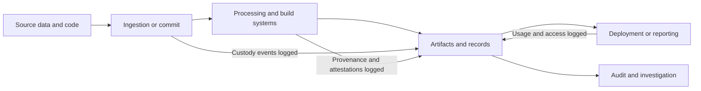

---
tags:
  - Software-Supply-Chain
  - Security-First
  - Data-Reporting
  - Data-Propagation
  - Data-Governance
  - Metadata-Management
  - State-Of-The-Art-Practices
  - Enterprise-AI
  - Enterprise-Jobs-To-Be-Done
date_created: 2026-08-21
date_modified: 2026-08-23
cf_last_run: 2026-08-23T02:19:43.511Z
cf_last_run_model: Perplexity sonar-pro
---

[[concepts/Software Development Lifecycle|Software Development Lifecycle]]
[[concepts/Explainers for AI/Large Codebase AI|Large Codebase AI]]
[[Vocabulary/Data Science|Data Science]]
[[concepts/Provenance|Provenance]]
[[concepts/Provenance|Data Provenance]]
[[concepts/Software Supply Chains|Software Supply Chains]]

# Defining and Describing Chain of Custody (data, code)

_[Chain of custody for data and code is the security-grade paper trail that proves exactly how bits moved, who touched them, and what changed along the way, so you can trust the final result._  

Chain of custody in the data and code context is a **chronological, documented, and tamper‑evident record of custody, control, transfer, analysis, and disposition** of digital artifacts such as datasets, logs, source code, builds, and release binaries. [^xcn5du] [^ti1j8y] [^iw0ajt] [^zfct0p] It extends the classic legal notion of evidentiary chain of custody to digital systems by tracking every handoff and transformation so that a given dataset, model output, or software release can be shown to be the “same item” originally collected or built, with its integrity preserved. [^xcn5du] [^ti1j8y] [^dfmok9] [^zfct0p] [^v8yhh8] This matters in software‑supply‑chain security, AI governance, compliance, and incident response, where organizations must demonstrate not only *what* they run or report on, but *where it came from, how it was handled, and who is accountable*. [^xcn5du] [^dfmok9] [^a5276e] [^3uissi] [^1aechq]  

A concise cross‑cutting definition is:

> **Chain of custody for data or code is a documented, unbroken record of the sequence of entities that have handled a digital artifact, including every transfer, access, and transformation, from its origin to final use, in a way that preserves integrity and enables audit or legal scrutiny.** [^xcn5du] [^ti1j8y] [^dfmok9] [^zfct0p] [^3uissi] [^1aechq]

Key elements that almost all authoritative definitions share are:

- **Chronological record:** Chain of custody is “chronological documentation or paper trail that records the sequence of custody, control, transfer, analysis, and disposition of physical or electronic evidence.” [^ti1j8y] [^iw0ajt]  
- **Unbroken continuity:** It must be “documented and unbroken” or “continuous,” with no unexplained gaps in possession or responsibility. [^dfmok9] [^n4zyre] [^624sct] [^zfct0p] [^v8yhh8]  
- **Named custody and responsibility:** Each step records who had “responsibility for an asset at every stage,” including person or system identity, time, location, and reason for access or transfer. [^n4zyre] [^624sct] [^zfct0p] [^v8yhh8]  
- **Integrity preservation:** Its purpose is to “maintain its integrity,” “preserve authenticity,” and prove the item has not been “tampered with or altered in any way.” [^bbq65r] [^ti1j8y] [^dfmok9] [^iw0ajt] [^zfct0p]  
- **Digital generalization:** In digital environments, the same pattern is applied to data, documents, logs, IT assets, and software artifacts, not only to physical evidence. [^dfmok9] [^l87rv0] [^fbrmo0] [^624sct] [^iw0ajt] [^v8yhh8] [^3uissi]  

In software‑supply‑chain practice, chain of custody is closely tied to **provenance**, defined as verifiable metadata about “where, when, and how a software artifact was produced,” including the source repository and commit, build platform, inputs, parameters, and cryptographic digests. [^wgs2gl] [^3uissi] [^1aechq] Security teams increasingly frame supply‑chain provenance as “a verifiable chain of custody” that links source code, dependencies, build systems, signing events, and release artifacts, allowing a release to be traced back to trusted source material and known build inputs. [^wgs2gl] [^3uissi] [^1aechq]  

In [[Vocabulary/Data Governance|Data Governance]] and analytics, chain of custody complements **data lineage** by focusing on *responsibility and integrity* rather than just technical flow: it shows who accessed or modified data, when, what they did with it, and where it resided at each moment, turning lineage into an auditable evidence trail for compliance and AI governance. [^bbq65r] [^xcn5du] [^dfmok9] [^a5276e] [^l87rv0]  

# Uses in Context

- In **legal and e‑discovery**, teams describe chain of custody as the “chronological, documented record of everyone who has handled, accessed, or stored a piece of evidence,” serving as a “paper trail” from collection to presentation and proving the evidence “has not been tampered with or altered in any way.” [^ti1j8y] [^iw0ajt]  
- In **records management**, organizations use the term for the “continuous, documented trail showing who handled a record, when, where, and under what circumstances, from creation to final disposition,” emphasizing that it “establishes that the record presented today is the same record as when it was created.” [^v8yhh8]  
- In **enterprise data governance**, vendors and practitioners define a *data chain of custody* as “the chronological record documenting the transfer, handling, and storage of information to maintain its integrity,” describing it as a system that “proves who accessed data, when, what they did with it, and where it resided at each moment.” [^bbq65r] [^dfmok9]  
- In **AI governance and automated decision logging**, chain of custody is invoked as “a documented, unbroken record of the sequence of entities that have handled a piece of data or evidence,” and more specifically, as a mechanism that “tracks every transformation, access event, and decision point from data ingestion through model inference to final output” to establish data provenance for audits. [^xcn5du]  
- In **identity and incident response**, security glossaries describe it as “a documented record that preserves the integrity of evidence from the moment an event is detected through investigation and response,” and in network security as “the documented and verifiable control of digital evidence from the point of capture to its presentation in legal, regulatory, or investigative proceedings.” [^a5276e] [^fbrmo0]  
- In **software‑supply‑chain security**, supply‑chain provenance is explicitly framed as “the evidence trail that shows what entered a software build, who or what signed it off, which tools processed it, and what artefacts emerged,” and experts emphasize that effective provenance “links the entire software delivery path into a verifiable chain of custody” involving source control metadata, build attestations, dependency records, signing events, and release approvals. [^wgs2gl] [^3uissi] [^1aechq]  

# History of Use

## Origins

- The **term “chain of custody” originates in forensic and legal practice**, where it denotes the chronological documentation of custody, control, transfer, analysis, and disposition of physical evidence to ensure its admissibility in court. [^ti1j8y] [^iw0ajt] [^zfct0p] Legal guidance and evidentiary standards describe it as a “paper trail that records the sequence of custody, control, transfer, analysis, and disposition of physical or electronic evidence,” with continuity gaps potentially rendering evidence inadmissible. [^ti1j8y] [^iw0ajt]  
- Early digital adaptations in **IT asset disposition and electronic evidence** applied the same structure to hardware and electronic records, defining chain of custody as a “documented chronological trail that records where an asset was, who handled it, and what happened to it from collection through final disposition,” explicitly noting that the goal is to preserve authenticity and integrity of electronic evidence. [^624sct] [^iw0ajt]  
- As enterprises digitized records and operational data, **records‑management and data‑governance practitioners** extended the term from physical evidence to digital records and datasets, defining chain of custody as the continuous, documented trail of handlers and locations from creation to final disposition in order to satisfy regulatory and compliance requirements. [^dfmok9] [^v8yhh8]  

## Evolution

- **1990s–2000s: Digital forensics and e‑discovery.** With the rise of electronic evidence and e‑discovery, the legal definition of chain of custody was explicitly applied to “physical or electronic evidence,” and litigation support tools began implementing detailed logs of collection, transfer, and analysis of digital files as part of standard workflows. [^ti1j8y] [^fbrmo0] [^iw0ajt]  
- **2010s: Enterprise records and IT asset management.** As regulated industries moved to digital records and distributed IT infrastructure, chain of custody practices expanded from evidence to general information assets and IT hardware, with service providers defining chain of custody as a “complete, evidenced process that tracks every device from collection to final certified disposition” and emphasizing clearly identified responsible parties at each point. [^624sct] [^iw0ajt] [^v8yhh8]  
- **Late 2010s–2020s: Data governance and AI auditability.** Data‑governance vendors and AI‑governance practitioners introduced the phrase *data chain of custody*, framing it as a chronological record documenting transfer, handling, and storage of information and events across data pipelines, and as a foundation for automated decision logging and AI audits that track transformations and decision points from ingestion through model inference to outputs. [^bbq65r] [^xcn5du] [^dfmok9] [^a5276e] [^l87rv0]  
- **2020s: [[concepts/Software Supply Chains|Software Supply Chains]] security and provenance.** In response to software‑supply‑chain attacks, security frameworks such as SLSA formalized **provenance** as “verifiable metadata that records where, when, and how a software artifact was produced,” and supply‑chain‑security practitioners started describing robust provenance as a “verifiable chain of custody” for code and build artifacts, linking source repositories, build systems, dependencies, signing events, and release actions into a tamper‑evident evidence trail. [^wgs2gl] [^3uissi] [^1aechq]  

# Best Real-World Examples

- **[SLSA provenance and attestations](https://www.encryptionconsulting.com/slsa-level-3-and-code-signing/)** — Implements tamper‑resistant provenance that records “where, when, and how a software artifact was produced,” including source repository and commit, build platform, inputs, and cryptographic digests, providing a de facto chain of custody for software artifacts. [^wgs2gl]  
- **[Supply‑chain provenance guidance](https://nhimg.org/glossary/supply-chain-provenance/)** — Defines supply‑chain provenance as an evidence trail that “shows what entered a software build, who or what signed it off, which tools processed it, and what artefacts emerged,” explicitly positioning it as a verifiable chain of custody for code and build pipelines. [^3uissi]  
- **[AI decision‑logging and chain of custody in AI governance](https://inferensys.com/glossary/enterprise-artificial-intelligence-governance/automated-decision-logging/chain-of-custody)** — Provides a concrete pattern for AI systems where chain of custody tracks “every transformation, access event, and decision point from data ingestion through model inference to final output” to support audits and regulatory scrutiny. [^xcn5du]  
- **[Enterprise data chain of custody platforms](https://www.flosum.com/blog/data-chain-of-custody)** — Offer solutions that chronologically document the transfer, handling, and storage of information across systems, “proving who accessed data, when, what they did with it, and where it resided at each moment” to meet stringent integrity and compliance requirements. [^bbq65r]  
- **[Records‑management chain of custody services](https://www.grmdocumentmanagement.com/blog/chain-of-custody-in-records-management-why-it-matters-and-how-to-enforce-it/)** — Implement continuous, documented trails for records from creation to final disposition, ensuring that the record presented later can be shown to be the same as when it was created, with every handler and location recorded. [^v8yhh8]  
- **[IT asset disposition chain of custody processes](https://www.restore.co.uk/technology/understanding-the-chain-of-custody-for-it-security/)** — Use detailed custody logs and sign‑offs to track every device “from collection to final certified disposition,” making each person or team responsible at every step, thus extending evidentiary chain‑of‑custody concepts to IT hardware and stored data. [^624sct] [^iw0ajt]  
- **[Security incident and identity‑evidence workflows](https://nhimg.org/glossary/chain-of-custody/)** — Treat chain of custody as the tamper‑evident record tracking evidence “from the moment an event is detected through investigation and response,” associating each event with an actor or session for identity‑centric incident forensics. [^a5276e]  

# Case Studies

## 1. AI decision logging as chain of custody for automated decisions

An AI‑governance practice described in recent glossaries treats each AI‑driven decision as a unit of evidence whose lifecycle must be fully traceable. [^xcn5du] In this approach, organizations implement logging that creates “a documented, unbroken record of the sequence of entities that have handled a piece of data or evidence,” with specific emphasis on AI workflows. [^xcn5du] For every decision, the system logs data ingestion, preprocessing steps, model version, inference call, and downstream actions, effectively “tracking every transformation, access event, and decision point from data ingestion through model inference to final output.” [^xcn5du]  

When regulators or auditors later review a contested automated decision, this chain of custody lets them reconstruct what data was used, which model produced the result, who approved or overrode it, and whether the process followed policy. [^xcn5du] The case illustrates how the classic evidentiary structure of chain of custody can be repurposed to make AI systems auditable, turning otherwise opaque pipelines into accountable, inspectable workflows.  

## 2. Software‑supply‑chain provenance as code chain of custody

Software‑supply‑chain security frameworks like SLSA have popularized provenance as the central organizing concept for securing builds. [^wgs2gl] In these frameworks, provenance is defined as “verifiable metadata that records where, when, and how a software artifact was produced,” listing the source repository and exact commit, the build platform, the inputs and parameters used, and a cryptographic digest of the resulting artifact. [^wgs2gl] Provenance is generated by a trusted build system and signed in a way that the build steps themselves cannot tamper with, making it a **tamper‑evident proof** of how the artifact came to exist. [^wgs2gl]  

Security practitioners and independent glossaries of supply‑chain provenance explicitly interpret this as a **chain of custody for code**, where “the evidence trail … shows what entered a software build, who or what signed it off, which tools processed it, and what artefacts emerged,” and where effective provenance “links the entire software delivery path into a verifiable chain of custody” including source control metadata, build system attestations, dependency records, signing events, and release approvals. [^3uissi] [^1aechq] When organizations adopt this pattern, they can demonstrate that a running binary corresponds to a specific, trusted commit and vetted dependencies, and can rapidly investigate supply‑chain incidents by tracing a compromised artifact back along its custody chain.  

## 3. Data‑governance chain of custody for regulated analytics

In regulated sectors such as finance and healthcare, data‑governance platforms have begun to emphasize a **data chain of custody** as a complement to traditional lineage. [^bbq65r] [^dfmok9] [^v8yhh8] These systems maintain “the chronological record documenting the transfer, handling, and storage of information to maintain its integrity,” explicitly aiming to “prove who accessed data, when, what they did with it, and where it resided at each moment.” [^bbq65r] Records‑management practices add a broader lifecycle perspective, describing chain of custody as the “continuous, documented trail showing who handled a record, when, where, and under what circumstances, from creation to final disposition,” with the goal of ensuring that the record presented during an audit or investigation is demonstrably the same as the one originally created. [^dfmok9] [^v8yhh8]  

When a regulator questions the accuracy of an analytics report, the organization can use its data chain‑of‑custody system to show the path from original data capture through transformations, aggregations, and report generation, including responsible owners and access at each step. [^bbq65r] [^dfmok9] [^v8yhh8] This not only supports compliance but also internal forensics: if a metric is later found to be wrong, the chain of custody helps identify where in the pipeline the error or unauthorized modification occurred, demonstrating the value of treating data pipelines with the same rigor traditionally reserved for legal evidence.

***

# Sources

[^bbq65r]: [What is a Data Chain of Custody? - Flosum](https://www.flosum.com/blog/data-chain-of-custody)
[^xcn5du]: [What is Chain of Custody? Definition & AI Audit Use ...](https://inferensys.com/glossary/enterprise-artificial-intelligence-governance/automated-decision-logging/chain-of-custody)
[^ti1j8y]: [What Is Chain of Custody? A Guide for Ediscovery Teams - Everlaw](https://www.everlaw.com/blog/ediscovery-best-practices/chain-of-custody-guide/)
[^dfmok9]: [Chain of Custody](https://www.solix.com/kb/chain-of-custody/)
[^n4zyre]: [Chain of Custody – Definition, Records & Asset Control | AssetCues](https://www.assetcues.com/glossary/chain-of-custody/)
[^a5276e]: [What Is Chain of custody? Definition & Examples](https://nhimg.org/glossary/chain-of-custody/)
[^l87rv0]: [What is Chain of Custody? Definition, Process & Key Metrics](https://www.hyperbots.com/glossary/chain-of-custody)
[^fbrmo0]: [Chain of Custody | Vehere Glossary](https://vehere.com/glossary/what-is-chain-of-custody/)
[^624sct]: [Understanding the Chain of Custody for IT Security - Restore](https://www.restore.co.uk/technology/understanding-the-chain-of-custody-for-it-security/)
[^iw0ajt]: [What Is Chain of Custody in IT Asset Disposition?](https://www.reworxrecycling.org/what-is-chain-of-custody/)
[^zfct0p]: [What Is Chain of Custody and Why It Matters in 2026](https://dppgrid.com/resources/what-is-chain-of-custody)
[^wgs2gl]: [Strengthening Supply Chain Security with SLSA Level 3 and Code ...](https://www.encryptionconsulting.com/slsa-level-3-and-code-signing/)
[^v8yhh8]: [Chain of Custody in Records Management | GRM](https://www.grmdocumentmanagement.com/blog/chain-of-custody-in-records-management-why-it-matters-and-how-to-enforce-it/)
[^3uissi]: [What Is Supply chain provenance? Definition & Examples](https://nhimg.org/glossary/supply-chain-provenance/)
[^1aechq]: [What do security teams get wrong about provenance in software ...](https://nhimg.org/faq/what-do-security-teams-get-wrong-about-provenance-in-software-delivery/)
