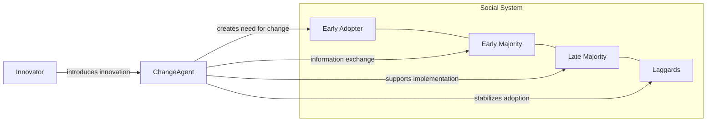

# Defining and Describing Change Agents (Diffusion of Innovations)

_Change agents are the professional go‑betweens who deliberately move innovations into a social system and help people decide to adopt and stick with them._  

In Everett Rogers’ diffusion of innovations theory, change agents are individuals who “aim to affect the innovation adoption decisions of individuals in the system in a direction considered desirable by the agent.” [^o8feip] Outlined in his book entitled [[Sources/Books/Diffusion of Innovations|Diffusion of Innovations]], they often come from outside the community or organization and act as “agents of change” who bring innovations to members of a social system, working through local opinion leaders and gatekeepers. [^x9rdzx] [^r87vwx] 

Rogers identified seven core functions for change agents, from “creating a need for change” and “developing an information exchange relationship” to “stabilising adoption and preventing discontinuance.”[^o8feip] The concept matters because it explains why simply having a good innovation is not enough; skilled intermediaries and their communication strategies often determine whether an innovation diffuses successfully, especially in cultures that rely heavily on social networks or local authorities. [^5bwaia] [^r87vwx]  

# Uses in Context

- In organizational change and consulting, “change agents are usually business professionals (such as lawyers, consultants, bankers, or politicians) who spread new practices or aid in promoting new ideas,” particularly new business models or legal and investment strategies. [^x9rdzx]  
- In diffusion campaigns (e.g., health, agriculture, or technology adoption), researchers emphasize that “the presence of agents of change is essential to influence others to innovate,” with their interpersonal communication remaining key in cultures that rely heavily on social networks or local authorities. [^5bwaia]  
- Communication and innovation‑management literature uses the term to highlight the communicator role, noting that co‑occurrence analyses of diffusion research “place particular emphasis on Change Agents and their influence on the adoption of innovation.”[^5bwaia]  
- Policy and entrepreneurship studies apply the concept to programs where expert advisors or extension workers function as change agents to improve micro, small, and medium enterprises (MSMEs), linking their activity to “sustainable development and the quality of organizational culture and management practices.”[^5bwaia]  
- Media and digital‑strategy discussions invoke change agents when designing “multi‑channel” diffusion campaigns, where agents of change use converged media and social media to create awareness and persuade different adopter groups. [^5bwaia]  

# History of Use

## Origins

- The change‑agent role is most systematically defined in Everett Rogers’ book *Diffusion of Innovations* (notably the 2003 5th edition), where he states that “change agents aim to affect the innovation adoption decisions of individuals in the system in a direction considered desirable by the agent.”[^o8feip]  
- Rogers, drawing on mid‑20th‑century studies such as Ryan and Gross’s 1943 work on hybrid corn adoption, situated change agents within a broader model where diffusion involves an innovation, communication channels, time, and a social system. [^x9rdzx]  

## Evolution

- **1960s–1980s – From agricultural extension to general social systems.** Early applications centered on agricultural extension workers and development projects, then generalized to corporations, health programs, and communities, as diffusion research examined both “internal diffusion” within a network and “external diffusion” from outside actors including mass media and “change agents.”[^x9rdzx]  
- **1980s–2000s – Institutional and networked perspectives.** Neo‑institutional theorists such as DiMaggio and Powell framed external diffusion by change agents as a driver of “normative isomorphism,” where professional advisors spread similar “best‑practice” strategies across firms, leading to convergence in corporate structures. [^x9rdzx]  
- **2010s–2020s – Digital, cultural, and policy emphasis.** Recent work in communication and entrepreneurship emphasizes change agents’ interpersonal and cross‑cultural communication, arguing that in cultures with strong collectivism or reliance on local authorities, agents of change are crucial to adaptation and adoption; diffusion research also ties their activity to media convergence, social media, and governmental priorities in entrepreneurship policy. [^5bwaia]  

# Best Real-World Examples

- [Indonesian MSME digitalization programs](https://www.tandfonline.com/doi/full/10.1080/23311886.2025.2564782) – Researchers describe how advisors acting as agents of change help micro and small enterprises adopt digital tools and new management practices, tailored to local cultural norms. [^5bwaia]  
- [Health communication campaigns in Asia](https://www.tandfonline.com/doi/full/10.1080/23311886.2025.2564782) – Studies linking the keywords “health communication” and “awareness” highlight trained health workers and community leaders as change agents crafting messages to increase adoption of health innovations. [^5bwaia]  
- [Agricultural advisory / extension services](https://open.ncl.ac.uk/theories/8/diffusion-of-innovations/) – Classic diffusion applications where extension officers serve as change agents, performing Rogers’ seven functions to introduce improved seed, techniques, or tools to farmers. [^o8feip]  
- [Professional service firms (law, consulting, banking)](https://en.wikipedia.org/wiki/Diffusion_of_innovations) – In corporate networks, consultants, lawyers, and bankers operate as change agents who diffuse new business practices and financial strategies across firms, contributing to “normative isomorphism.”[^x9rdzx]  
- [Community leadership in culturally embedded innovation projects](https://www.tandfonline.com/doi/full/10.1080/23311886.2025.2564782) – Local opinion leaders and traditional authorities act as change agents, especially in collectivist cultures where social networks and bandwagon effects strongly shape innovation adoption. [^5bwaia]  
- [Public policy diffusion initiatives](https://www.britannica.com/topic/diffusion-of-innovations) – Government programs deploy agents of change within communities to disseminate new practices, with success depending on who is considered influential and trustworthy and who has access to communication channels. [^r87vwx]  

# Case Studies

## Case Study 1: Community Health Workers as Change Agents in Health Communication

In health communication campaigns, especially across Asian contexts such as Indonesia, Korea, and China, researchers note that “the presence of agents of change is essential to influence others to innovate,” with health workers and community leaders functioning as key communicators. [^5bwaia] These change agents rely on interpersonal communication in cultures that place high value on social networks or local authorities, tailoring messages around “health communication” and “awareness” to local norms and concerns. [^5bwaia] Their work often uses multi‑channel strategies—combining face‑to‑face outreach with social media and other converged media—to overcome digital divides and increase exposure to innovations such as new preventive practices or health technologies. [^5bwaia] This case shows how the effectiveness of change agents depends not only on the innovation itself but on their ability to adapt messages to cultural dimensions like collectivism and uncertainty avoidance, and to bridge gaps in media literacy and access. [^5bwaia]  

## Case Study 2: Advisors to Micro and Small Enterprises as Agents of Change

Recent diffusion‑of‑innovation research focused on micro, small, and medium enterprises (MSMEs) emphasizes the critical role of advisors and trainers acting as agents of change in entrepreneurship ecosystems. [^5bwaia] In these studies, change agents help MSMEs recognize a “need for change,” translate abstract innovation concepts into concrete business practices, and guide firms through adoption and implementation, aligning closely with Rogers’ seven change‑agent functions such as “developing an information exchange relationship” and “translating intentions into action.”[^o8feip] [^5bwaia] The research highlights how, in countries with shared cultural backgrounds like Indonesia, Korea, and China, bandwagon effects and cultural norms shape how these agents frame innovation—stressing advantages differently for innovators, early adopters, and later adopter groups. [^5bwaia] This case illustrates that effective change agents in entrepreneurial settings must combine technical knowledge with cultural sensitivity and segmented communication strategies to enhance organizational culture, management quality, and sustainable development outcomes. [^5bwaia]  

## Case Study 3: Professional Advisors Driving Normative Isomorphism in Corporate Strategy

Diffusion theory’s distinction between “internal diffusion” within an industry network and “external diffusion” from outside actors positions professional advisors as archetypal change agents in corporate fields. [^x9rdzx] DiMaggio and Powell’s analysis of institutional isomorphism, cited in diffusion discussions, argues that firms often adopt similar structures and strategies because they “search for the best ideas and practices and mimic new ideas that prove to work,” with external actors like consultants, lawyers, and bankers transmitting and legitimizing these models across organizations. [^x9rdzx] In this context, change agents introduce new business practices or investment techniques into a network, where they are “picked up by several entities within a network and continue to diffuse,” contributing to a pattern of convergence known as “normative isomorphism.”[^x9rdzx] This case underscores how change agents shape not only individual adoption decisions but also the broader institutional landscape, as their professional norms and recommendations standardize what counts as legitimate innovation in an industry. [^x9rdzx]

***

# Sources

[^o8feip]: [Diffusion of Innovations - TheoryHub - Academic theories reviews for ...](https://open.ncl.ac.uk/theories/8/diffusion-of-innovations/)
[^x9rdzx]: [Diffusion of innovations - Wikipedia](https://en.wikipedia.org/wiki/Diffusion_of_innovations)
[^5bwaia]: [Full article: Applying a diffusion innovation theory to identify novelty ...](https://www.tandfonline.com/doi/full/10.1080/23311886.2025.2564782)
[^r87vwx]: [Diffusion of innovations | Adoption Process, Diffusion Theory & Impact](https://www.britannica.com/topic/diffusion-of-innovations)
