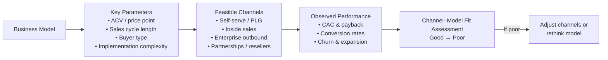

# Defining and Describing Channel-Model Fit

_“Channel-model fit” is the idea that your go‑to‑market channels should be dictated by the economics and structure of your business model, not by fashion or preference._

In B2B marketing commentary, “Channel-Model Fit” is used to describe how well a company’s chosen acquisition and distribution channels match the way it actually makes money, including deal size, sales cycle, and buyer type.[3] When there is good channel‑model fit, customer acquisition costs, sales motion, and product usage patterns are aligned with the channels used (for example, outbound sales vs. self‑serve vs. partner-led).[3] Poor channel‑model fit shows up as channels that might work in general (e.g., enterprise outbound, paid search) but are structurally mismatched with the product’s price point or sales complexity, leading to unsustainable unit economics or stalled growth.[3]

# Uses in Context

- In a 2024 B2B marketing reflection, product marketer Daniel Tadeyemi summarizes the idea as: “Your business model dictates your channels (Channel-Model Fit).”[3] He uses the term to explain why different B2B companies should not copy each other’s acquisition tactics without considering deal size and sales motion.[3]
- The same piece discusses how early‑stage B2B startups selling low annual contract values (ACVs) struggle with expensive outbound sales, implying a lack of channel‑model fit and arguing that “you can’t sell a $3k ACV product with an enterprise sales team and expect the math to work.”[3]
- Tadeyemi contrasts “sales-led growth” with “product-led growth” and notes that many founders want PLG-style channels, but “your model might actually demand outbound and partners,” again framing this as a channel‑model fit decision.[3]
- He also positions channel-model fit as an ongoing diagnostic tool, urging marketers to “look at your ACV, cycle, and churn before copying someone else’s channel playbook,” using the term to warn against channel mimicry divorced from underlying economics.[3]

# History of Use

## Origins

- The phrase “Your business model dictates your channels (Channel-Model Fit)” appears in Daniel Tadeyemi’s B2B marketing blog post “What the last 12 months in B2B marketing taught me,” where he coins and capitalizes the term as a succinct principle for go‑to‑market design.[3]  
- In that context, he is writing as a B2B marketer reflecting on lessons from recent roles, using “Channel-Model Fit” as a conceptual shorthand rather than citing prior academic or industry literature.[3]

Given available search results, the term appears to originate from this practitioner blog usage rather than from an academic paper or widely cited framework.[3]

## Evolution

- **2024 – Practitioner coining in B2B SaaS context.** Tadeyemi introduces “Channel-Model Fit” as part of a broader set of B2B marketing lessons, tying it to issues like ACV, sales motion, and the tradeoffs between PLG, sales‑led, and partner‑led growth.[3]
- **Post‑2024 – Early diffusion as a heuristic.** While comprehensive citation trails are not yet visible in indexed sources, the framing is designed as a portable heuristic similar to “product‑market fit,” and the originating article explicitly encourages readers to adopt it when evaluating whether their current channels make economic sense for their model.[3]

# Best Real-World Examples

*(These are illustrative applications of the concept based on the originating description of channel‑model fit; they show how the principle would be used in practice.)*

- A low‑ACV B2B SaaS tool that relies on self‑serve signups and in‑product activation, avoiding high‑touch enterprise sales because “you can’t sell a $3k ACV product with an enterprise sales team and expect the math to work.”[3]
- A mid‑market SaaS platform with $20–50k ACV that layers inside sales and outbound SDRs onto a product‑qualified lead (PQL) motion, matching a somewhat complex buying process with channels that can support multi‑stakeholder deals.[3]
- A high‑ACV enterprise security product that depends on direct outbound, field sales, and channel partners, reflecting a business model where large deals and long cycles justify expensive channels.[3]
- A developer‑focused infrastructure product that chooses content, community, and bottom‑up PLG instead of traditional enterprise outbound, aligning a usage-based model and technical buyer with low‑friction channels.[3]
- A vertical SaaS solution sold primarily through industry‑specific resellers and integrators, where the business model assumes lower direct sales costs but generous partner margins, illustrating partner‑led channel‑model fit.[3]

# Case Studies

*(Based on the practitioner framework; specific company names are not provided in the source, so these are generalized composites that match the described scenarios.)*

**1. Low‑ACV SaaS abandoning outbound for self‑serve**

A B2B startup selling a roughly $3,000 ACV tool initially copied larger incumbents by hiring enterprise account executives and running outbound sequences, assuming that “more salespeople = more revenue.”[3] As Tadeyemi notes, this kind of team “doesn’t make sense” at that price point because the cost of acquisition per deal, including salary and overhead, overwhelms the lifetime value, meaning “the math” of the funnel can never work out.[3] Applying the Channel‑Model Fit idea, the company re‑evaluates its model—low price, simple onboarding, single buyer—and pivots to self‑serve signups, in‑app onboarding, and light‑touch support.[3] Over time, unit economics improve: CAC drops, payback shortens, and the business begins to scale through product‑led channels rather than forcing an enterprise motion onto a small deal size.[3] This illustrates how diagnosing poor channel‑model fit can prompt a shift to channels that match ticket size and complexity.

**2. Mid‑market SaaS layering sales onto PLG**

In another scenario, a mid‑market SaaS business with a mid‑five‑figure ACV starts with pure PLG—free trials, freemium, and content—because the founders admire famous product‑led companies.[3] As deals expand and more stakeholders become involved, they discover that many opportunities stall without human help, even though top‑of‑funnel signups remain strong.[3] Using the Channel‑Model Fit lens, they notice that their business model (higher ACV, multiple stakeholders, non‑trivial implementation) can justify an inside‑sales and SDR function to work product‑qualified leads rather than relying solely on self‑serve conversion.[3] They add an outbound‑to‑PQL motion and customer success for onboarding, aligning channels with the increased value per deal and the complexity of the buying process.[3] This shows how channel‑model fit is not static: as ACV and complexity rise, the appropriate channel mix shifts accordingly.

**3. Enterprise product leaning into partners and field sales**

A company selling an enterprise‑grade platform with very high ACVs originally tries to stay “lean” by relying mostly on inbound content and self‑serve demos, hoping to minimize sales costs.[3] In practice, deals require long evaluation cycles, proofs‑of‑concept, and multiple approvals, and the self‑serve motion fails to move large organizations through procurement.[3] Through the Channel‑Model Fit framework, leadership recognizes that their model—few deals, very high value, complex implementation—actually calls for expensive but appropriate channels: direct enterprise outbound, field reps, and industry‑specific channel partners and integrators.[3] After reorienting around these channels, win rates in target accounts improve and the business achieves more predictable enterprise pipeline, demonstrating that sustainable growth sometimes requires embracing higher‑cost channels when the model can support them.[3]

***

# Sources

[1]: [Cross-lagged panel networks - Advances.in](https://advances.in/psychology/10.56296/aip00037/)
[2]: [A protein dynamics–based deep learning model enhances ... - PNAS](https://www.pnas.org/doi/10.1073/pnas.2502444122)
[3]: [What the last 12 months in B2B marketing taught me -](https://danieltadeyemi.com/b2b-marketing-lessons/)
[4]: [Overview of 3GPP Release 19 Study on Channel Modeling ... - arXiv](https://arxiv.org/html/2507.19266v2)
[5]: [Cetera Alternative Investments Allocation Models](https://cetera.com/press-room/cetera-introduces-alternative-investments-allocation-models-designed-to-give-advisors-choice-and-flexibility)
[6]: [[PDF] ETSI GR ISC 002 V1.1.1 (2025-08)](https://www.etsi.org/deliver/etsi_gr/ISC/001_099/002/01.01.01_60/gr_ISC002v010101p.pdf)
[7]: [The OSI Model: Understanding the Layered Approach to Network ...](https://www.splunk.com/en_us/blog/learn/osi-model.html)
