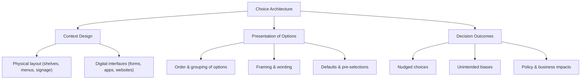

# Defining and Describing Choice Architecture

_Choice architecture is about shaping the “stage” on which people decide, so that the way options are presented nudges what they pick._

**Choice architecture** is the **design of the context in which people make decisions**, including how options are ordered, framed, grouped, and defaulted. [^jn2551] [^x1twyr] It refers to “the way in which people can be influenced to make particular choices by the way that something such as a system is designed.”[^ndsg8j] The term comes from behavioral economics and *nudge* theory, emphasizing that any menu, website, form, shelf layout, or interface necessarily steers behavior, whether intentionally or not. [^jn2551] [^jdb2mb] It matters because seemingly small design decisions—like default settings or option labels—can significantly change outcomes in areas such as health, finance, public policy, and digital product design without restricting freedom of choice. [^jn2551] [^x1twyr]

# Uses in Context

- In behavioral design and [[Vocabulary/User Experience|UX]], practitioners define choice architecture as “**intentionally designing the way you present options to people**” in order to influence decisions while preserving choice. [^jdb2mb]
- In public policy and behavioral economics, it is closely tied to *nudge* theory, where “any aspect of the choice architecture that alters people’s behavior in a predictable way without forbidding any options” is considered a nudge. [^aqu29j]
- Marketing and sales teams discuss using choice architecture to improve conversion by structuring pricing tables, product bundles, and calls‑to‑action so that “every menu, form, shelf layout, website interface or physical space presents a choice architecture.”[^jn2551]
- In digital platforms, “intelligent choice architecture” is described as a **dynamic system** that uses generative and predictive AI to “create, refine, prioritize, and present choices with and for human decision makers,” highlighting a more automated, adaptive layer on top of traditional design. [^zdq1wz]
- In news and media research, scholars refer to the “choice architecture” of news environments as “the design in which choices are presented,” exploring how layout and curation can mitigate *news avoidance* by making news more approachable. [^axvf4p]

# History of Use

## Origins

- The modern use of **choice architecture** is widely attributed to behavioral economists **Richard H. Thaler** and legal scholar **Cass R. Sunstein**, who popularized it in their 2008 book *[[Sources/Books/Nudge|Nudge]]: Improving Decisions About Health, Wealth, and Happiness* as part of their framework for “libertarian paternalism.”[^x1twyr] [^aqu29j]
- Subsequent academic summaries note that Thaler “clearly defined choice architecture as presentation of choices in distinct ways to effect decision‑making,” linking it to insights from psychology about how context and cognitive biases shape behavior. [^x1twyr]
- Early applications emerged in policy and regulatory contexts, where governments experimented with default options and form design (for example, in pensions and organ donation) as practical implementations of the choice architecture concept. [^aqu29j] [^x1twyr]

## Evolution

- **2008–2010s – Integration into behavioral public policy:** After *Nudge* (2008), governments such as the UK’s Behavioural Insights Team and similar “nudge units” in other countries adopted choice architecture as a core toolkit for improving policy outcomes through low‑cost design changes in letters, forms, and online services. [^aqu29j] [^x1twyr]
- **2010s – Expansion into UX, marketing, and service design:** Design and consulting communities generalized the concept beyond government, defining choice architecture as the design of any context—“every menu, form, shelf layout, website interface or physical space”—where people decide, and using behavioral principles in product, retail, and digital experience design. Implementation of [[concepts/Behavioral Design|Behavioral Design]], [[concepts/Persuasive Design|Persuasive Design]], and [[concepts/Product-Led Growth|Product-Led Growth]] [^jn2551] [^jdb2mb]
- **2020s – AI‑mediated and “intelligent” choice architecture:** With advances in machine learning, MIT Sloan and others describe “intelligent choice architecture” as systems that combine generative and predictive AI to dynamically “create, refine, prioritize, and present choices” in real time, blending algorithmic personalization with behavioral design. [^zdq1wz]

# Best Real-World Examples

- **[Thaler & Sunstein’s “Save More Tomorrow” retirement savings program](https://en.wikipedia.org/wiki/Nudge_theory)** – Uses default contribution escalation and payroll design as a choice architecture to increase employee savings participation. [^aqu29j]
- **[Organ donation “opt‑out” systems](https://en.wikipedia.org/wiki/Nudge_theory)** – Many countries’ switch from opt‑in to opt‑out consent models leverages default choice architecture to raise donor registration rates while preserving the option to decline. [^aqu29j]
- **[Behavioral Insights Team (UK “Nudge Unit”)](https://en.wikipedia.org/wiki/Nudge_theory)** – Applies choice architecture to tax letters, court notices, and online forms to improve compliance and reduce administrative burden. [^aqu29j]
- **[FlowState Sales enablement playbooks](https://flowstatesales.com/resource-hub/choice-architecture/)** – A sales consultancy that teaches teams to structure option presentation and proposals so that “choice architecture” nudges customers toward clearer, faster decisions. [^jdb2mb]
- **[SUE Behavioral Design interventions](https://www.suebehaviouraldesign.com/en/blog/choice-architecture-explained/)** – A behavioral design agency that reconfigures “menus, forms, shelf layouts, website interfaces or physical spaces” to make desired behaviors easier and more attractive. [^jn2551]
- **[AI-driven recommendation interfaces described as “intelligent choice architecture”](https://mitsloan.mit.edu/ideas-made-to-matter/working-definitions/what-is-intelligent-choice-architecture)** – Systems that dynamically prioritize and present options (for example, personalized offers or decision paths) based on predictive and generative models. [^zdq1wz]
- **[News platform designs studied in “The Role of Choice Architecture in Mitigating News Avoidance”](https://www.tandfonline.com/doi/full/10.1080/21670811.2025.2562143)** – Research prototypes that adjust how news options are displayed to reduce avoidance and increase constructive engagement. [^axvf4p]

# Case Studies

### **1. Retirement Savings Defaults and the Power of “Opt‑Out”**

In work that later informed *Nudge*, Richard Thaler and collaborators examined employer retirement plans where the enrollment process was redesigned so that employees were **automatically enrolled** by default unless they actively opted out. [^x1twyr] [^aqu29j] The choice architecture changed only the default on the form and payroll system—employees retained full freedom to decline—but this subtle shift dramatically increased participation and contribution rates compared with traditional opt‑in schemes. [^aqu29j] Subsequent policy uptake by entities such as the UK’s Behavioural Insights Team and other “nudge units” embedded this default‑based choice architecture into national auto‑enrollment programs, showcasing how small design moves in paperwork and HR systems can produce large, welfare‑improving behavior changes at scale. [^aqu29j] [^x1twyr]

### **2. Designing Everyday Environments: From Shelves and Menus to Interfaces**

Behavioral design agencies such as **SUE Behavioral Design** emphasize that “choice architecture is the design of the context in which people make decisions,” arguing that *every* touchpoint—from “every menu, form, shelf layout, website interface or physical space”—implicitly steers behavior. [^jn2551] In retail projects, rearranging product shelves, changing which items appear at eye level, or simplifying categories can increase selection of healthier or higher‑priority options without removing alternatives. [^jn2551] In digital products, revising the layout of forms, adjusting option order, and clarifying calls‑to‑action has been used to reduce abandonment and make desired behaviors (such as completing a signup or choosing a recommended plan) easier, illustrating how the same choice‑architecture principles translate from physical to online environments. [^jdb2mb] [^jn2551]

### **3. Intelligent Choice Architecture in AI‑Driven Decision Support**

MIT Sloan describes “intelligent choice architecture” as a **dynamic system** that “combines generative and predictive AI capabilities to create, refine, prioritize, and present choices with and for human decision makers.”[^zdq1wz] In such systems, algorithms continuously learn from user behavior and contextual data to adjust which options are shown, how they are framed, and in what order—turning static choice architecture (like a fixed form or menu) into an adaptive, personalized experience. [^zdq1wz] This approach has been explored in domains like customer decision support and complex enterprise workflows, where AI can surface a narrowed set of high‑quality options while still leaving the final decision to humans, highlighting an emerging frontier where traditional behavioral design meets machine learning. [^zdq1wz]

***

# Sources

[^ndsg8j]: [CHOICE ARCHITECTURE | English meaning - Cambridge Dictionary](https://dictionary.cambridge.org/dictionary/english/choice-architecture)
[^zdq1wz]: [What is intelligent choice architecture? | MIT Sloan](https://mitsloan.mit.edu/ideas-made-to-matter/working-definitions/what-is-intelligent-choice-architecture)
[^jdb2mb]: [How Choice Architecture Influences Decisions | FlowState](https://flowstatesales.com/resource-hub/choice-architecture/)
[^jn2551]: [What is choice architecture? Definition and examples](https://www.suebehaviouraldesign.com/en/blog/choice-architecture-explained/)
[^x1twyr]: [[PDF] A Brief Introduction to Choice Architecture - IJFMR](https://www.ijfmr.com/papers/2025/4/53630.pdf)
[^aqu29j]: [Nudge theory - Wikipedia](https://en.wikipedia.org/wiki/Nudge_theory)
[^axvf4p]: [The Role of Choice Architecture in Mitigating News Avoidance](https://www.tandfonline.com/doi/full/10.1080/21670811.2025.2562143)
