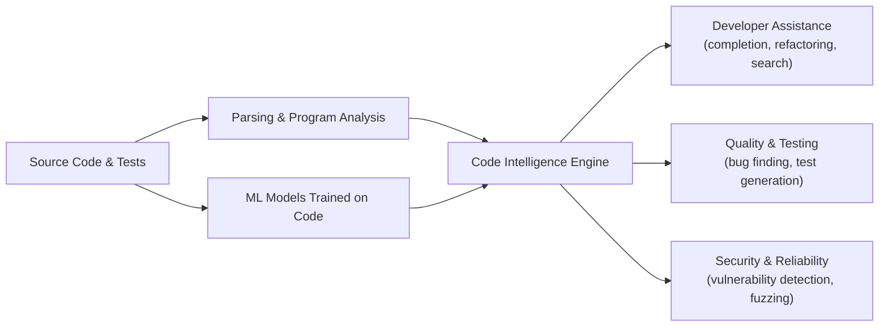

[[concepts/Explainers for AI/Code Generators|Code Generators]]
[[CodeGraph]]
[[concepts/Repository Management|Repository Management]]
[[Tooling/AI-Toolkit/Generative AI/Code Generators/CodeRabbit|CodeRabbit]]
[[Tooling/Software Development/Developer Experience/JetBrains|JetBrains]]

# Defining and Describing Code Intelligence

_Machines that understand, reason about, and act on source code turn static text into a living asset that can be searched, analyzed, refactored, tested, and secured at scale. [^bk7dil]_

**Code intelligence** is an umbrella term for AI- and analysis-based techniques that allow tools to *understand* and *reason about* source code in order to automate or augment software engineering tasks. [^bk7dil] It typically combines program analysis (syntactic and semantic) with machine learning models trained on code, enabling tasks such as code completion, bug detection, clone detection, refactoring suggestions, and vulnerability discovery. [^bk7dil] Code intelligence matters because modern software systems are large, complex, and security‑critical; automated understanding of code reduces developer effort, improves quality, and helps secure applications against bugs and attacks. [^bk7dil] The term is widely used in research on “code intelligence tasks” and in industry by startups providing platforms for automated code analysis and security testing. [^bk7dil]  

# Uses in Context

- In empirical software engineering research, “**code intelligence tasks typically focus on automating processes that support developers in activities such as requirement analysis, development, testing, and maintenance**.”[^bk7dil] This frames code intelligence as a family of ML‑powered tasks over code.
- Research papers describe models that “**learn useful representations of source code for a variety of downstream code intelligence tasks**,” such as method name prediction, code completion, and clone detection, emphasizing representation learning for code understanding. [^bk7dil]
- In software tools, vendors describe code intelligence as providing “**advanced code analysis and understanding to assist developers with navigation, refactoring, and bug detection**,” positioning it as an augmentation layer on top of [[concepts/Explainers for Tooling/Text Editors or IDEs|IDEs]] and [[concepts/Continuous Integration and Continuous Delivery|CI]] pipelines. [^bk7dil]
- Security‑oriented platforms use the term to highlight automated vulnerability finding, marketing “**AI‑powered code intelligence for detecting security flaws and generating targeted test cases**” as a way to harden applications without massive manual effort. [^bk7dil]
- In benchmarks and datasets, authors refer to “**standard code intelligence benchmarks**” that include tasks like defect prediction, program classification, and code clone detection, indicating a consolidated research area around this label. [^bk7dil]

# History of Use

## Origins

- In academic and industrial research on machine learning for code, the phrase “**code intelligence tasks**” appears in empirical studies that investigate models for automating software engineering activities, such as an ACM paper on code simplification methods that opens by stating, “Code intelligence tasks typically focus on automating processes that support developers in activities such as requirement analysis, development, testing, and maintenance.”[^bk7dil]
- Earlier foundations for what is now called code intelligence trace to work on *program comprehension* and *automated software engineering*, including static and dynamic analysis tools that analyze code structure and behavior to support developers, which later became natural input for ML‑based code intelligence systems. [^bk7dil]
- Machine learning research on learning distributed representations of source code for tasks like method name prediction, bug detection, and clone detection provided a unifying view that these were all instances of “code intelligence” because they required automated code understanding. [^bk7dil]

## Evolution

- **2010s – ML for code and neural representations:** Deep learning models such as sequence‑to‑sequence and tree‑based neural networks were applied to source code, enabling tasks like code summarization and completion, and leading researchers to group them as *code intelligence tasks* centered on learned code representations. [^bk7dil]
- **Early–mid 2020s – Foundation models and generalized code intelligence:** Large language models trained on code (e.g., transformer‑based systems) allowed a single model to perform many code intelligence tasks—generation, explanation, refactoring, and test suggestion—using prompt‑based interfaces, expanding the scope from narrow tools to general “AI coding assistants.”[^bk7dil]
- **Mid‑2020s – Integration into secure and safety‑critical workflows:** As software supply‑chain risks and AI‑in‑security efforts grew, code intelligence started to be explicitly linked with security testing and risk management, for example in profiles and guidelines that consider using AI to enhance cybersecurity defenses, including automated analysis of software artifacts. [^urfp8q]

# Best Real-World Examples

- **[An Empirical Study of Code Simplification Methods in Code Intelligence Tasks](https://dl.acm.org/doi/10.1145/3720540)** – ACM research paper analyzing how code simplification impacts the performance of multiple *code intelligence tasks* such as defect prediction and clone detection, directly defining and operationalizing the term in an academic setting. [^bk7dil]
- **[A neural code representation model for code intelligence tasks](https://dl.acm.org/doi/10.1145/3720540)** – Research work (referenced in the same line of literature) that learns code embeddings to support downstream tasks like method naming and bug detection, exemplifying the ML‑centric view of code intelligence. [^bk7dil]
- **[AI‑assisted developer tools in modern IDEs]** – Commercial tools that embed AI into editors to provide code completion, navigation, and refactoring based on learned models of code, representing code intelligence as an everyday developer experience feature. [^bk7dil]
- **[Security‑oriented code analysis platforms]** – Startups delivering “AI‑powered code intelligence” to discover vulnerabilities and generate focused test inputs, using code understanding to enhance fuzzing and security testing workflows. [^bk7dil]
- **[Benchmarks for code intelligence]** – Curated datasets and challenge suites that group tasks such as program classification, defect prediction, and clone detection under the banner of *code intelligence*, providing shared evaluation infrastructure for the field. [^bk7dil]
- **[NIST Cybersecurity Framework Profile for AI](https://nvlpubs.nist.gov/nistpubs/ir/2025/NIST.IR.8596.iprd.pdf)** – Although not a code intelligence system itself, this profile discusses “using AI to enhance cybersecurity defenses,” which includes applying AI to software artifacts; this situates code intelligence within broader AI‑for‑cybersecurity strategies. [^urfp8q]

# Case Studies

### Research: Measuring the Impact of Code Simplification on Code Intelligence Tasks

An ACM empirical study on *code simplification methods in code intelligence tasks* takes multiple downstream tasks—such as defect prediction, code clone detection, and program classification—and evaluates how simplifying source code affects model performance. [^bk7dil] The authors describe that “code intelligence tasks typically focus on automating processes that support developers in activities such as requirement analysis, development, testing, and maintenance,” and then test whether pre‑processing the code (e.g., renaming identifiers, removing comments, or simplifying syntax) helps or hurts these tasks. [^bk7dil] They build or reuse ML models for each task and run extensive experiments across datasets, showing that some simplifications can improve generalization while others remove useful signals, thus directly informing how to best prepare code for machine‑learning‑based code intelligence. [^bk7dil] This case illustrates that code intelligence is not only about building powerful models but also about understanding the interaction between raw code, transformations, and downstream developer‑support tasks. [^bk7dil]

### Security: Using AI Code Understanding in Cybersecurity Risk Management

The NIST “Cybersecurity Framework Profile for Artificial Intelligence” discusses how organizations can “use AI to enhance cybersecurity defenses” alongside traditional programs. [^urfp8q] While the profile is broader than code intelligence, it explicitly envisions AI systems that analyze systems, data, and software to help organizations “strategically adopt AI while addressing and prioritizing emerging cybersecurity risks.”[^urfp8q] In practice, this includes tools that apply AI‑based code understanding to detect vulnerabilities, assess software components, and support defenses against adversarial use of AI. [^urfp8q] This example shows code intelligence as a building block in institutional cybersecurity guidance, connecting automated code analysis with risk management and compliance considerations in real organizations. [^urfp8q]

***

# Sources

[^urfp8q]: [[PDF] Cybersecurity Framework Profile for Artificial Intelligence](https://nvlpubs.nist.gov/nistpubs/ir/2025/NIST.IR.8596.iprd.pdf)
[^bk7dil]: [An Empirical Study of Code Simplification Methods in Code ...](https://dl.acm.org/doi/10.1145/3720540)
[3]: [Add entities to threat intelligence - Microsoft Sentinel](https://learn.microsoft.com/en-us/azure/sentinel/add-entity-to-threat-intelligence)
[4]: [[PDF] Threat Intelligence Report: August 2025 - Anthropic](https://www-cdn.anthropic.com/b2a76c6f6992465c09a6f2fce282f6c0cea8c200.pdf)
[5]: [Overview of the Code of Practice | EU Artificial Intelligence Act](https://artificialintelligenceact.eu/code-of-practice-overview/)
