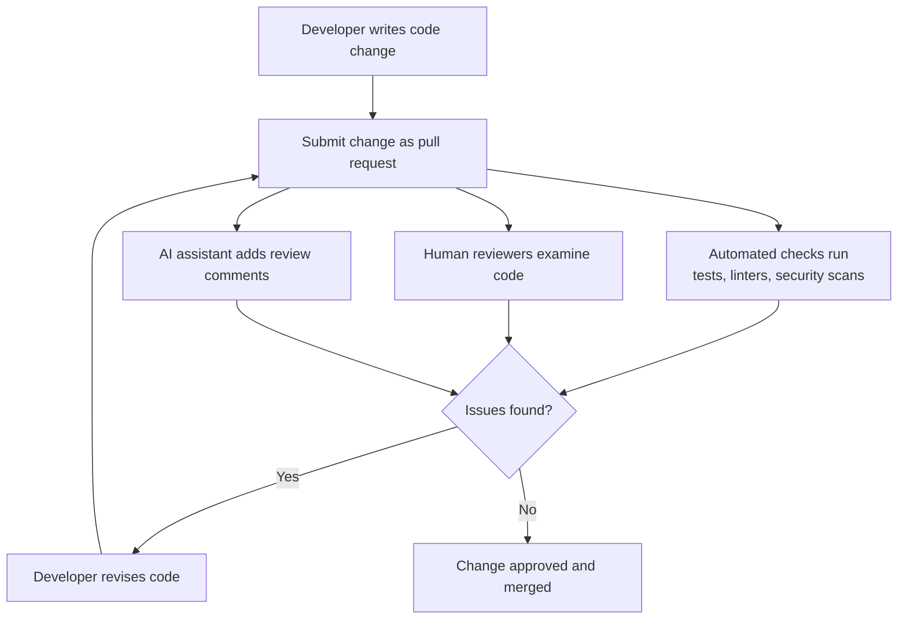

An [[concepts/Explainers for AI/Artificial Intelligence|AI]] tool that helps with this is [[CodeAnt AI]]. 

https://youtu.be/AYUNI2Pm6_w?si=yHlWZNqcBUjrtu9Z

# Defining and Describing Code Review

_At its core, **code review** is humans (and now often AI) systematically reading source code to catch problems, share knowledge, and improve design before that code ships._

In software engineering, **code review** is a structured practice where one or more developers examine code written by peers to identify defects, enforce standards, and improve maintainability before integrating changes (for example, as part of a pull request workflow). [^b3ks7t] [^a75ibw] It typically happens when changes are proposed (e.g., via pull requests in distributed version control systems) and serves both as a **quality assurance** mechanism and as a **collaborative learning process** within a team. [^b3ks7t] [^5a54rj] [^a75ibw] Modern code review blends automated checks, human judgment, and increasingly AI assistance to help catch bugs, security issues, style problems, and architectural concerns earlier and more cheaply than in production. [^b3ks7t] [^uxe9tq] [^atz6s4]

Code reviews can be **formal** (scheduled, structured inspections) or **lightweight** (informal peer review, pull request comments), and can focus on general quality, security (secure code review), or specific concerns like performance or architecture. [^a75ibw] [^atz6s4] Secure code review, for example, explicitly examines the source to identify vulnerabilities such as authorization flaws and broken access control by reading how the application enforces permissions. [^atz6s4]

---

# Uses in Context

- Teams use code review to **“enhance code quality at scale”** by integrating review steps into standard pull request workflows, where every pull request is automatically assigned reviewers and now often an AI assistant that leaves comments like a human reviewer. [^b3ks7t]

- In **secure development**, practitioners talk about *secure code review* as “essential for identifying authorization vulnerabilities by examining application access control logic directly in the source code,” emphasizing its role in finding security flaws early. [^atz6s4]

- AI-tool vendors and practitioners describe **AI code review** as a way to automatically “review the code changes and leave comments just like a human reviewer would,” flagging style issues, potential bugs such as null references, and inefficient algorithms. [^b3ks7t]

- Developers and researchers discuss code review as a **social and accountability mechanism**, with studies examining how “the social aspects of code review affect software engineers’ sense of accountability for code quality.”[^a75ibw]

- Indie practitioners frame AI usage itself as a kind of code review: using AI agents effectively is described as “a process of reviewing code,” and the argument is that if you are good at code review, “you will be good at using tools like Claude Code, Codex” because you must critically evaluate their suggestions. [^5a54rj]

- Conference talks and tools describe **“code health review”** or **code quality profiles** as automated forms of code review that prevent new technical debt from being added to critical parts of a codebase, often by enforcing stricter rules in key areas. [^1k5xtk] [^skz26v]

---

# History of Use

## Origins

- **Early software inspections (1970s–1980s).** The practice underlying modern code review traces back to *formal code inspections* introduced by Michael Fagan at IBM in the 1970s, where peers systematically examined source code to find defects before testing; this work established inspection as a structured quality practice in software engineering (summarized in later secondary literature and teaching materials, which connect Fagan inspections to contemporary code review). [^a75ibw]

- **“Code review” as an explicit term.** By the 1990s and early 2000s, “code review” appears in software engineering textbooks and industrial process documents as an umbrella term for peer examination of source code, encompassing both formal inspections and more informal peer reviews; research and industry surveys treat “code review” as a standard practice within software development lifecycles and version control workflows. [^a75ibw]

- **Open-source workflows.** Contemporary accounts and tools describe code review as a core social process in distributed open-source development (e.g., reviewing patches and pull requests before merging), with research on “Accountability in Code Review” explicitly studying how reviewers and authors interact in code review systems used for large-scale collaborative software. [^a75ibw]

## Evolution

- **2000s – Shift to lightweight reviews and pull requests.** With widespread adoption of distributed version control, teams moved from heavy, meeting-based inspections to *lightweight code reviews* embedded in daily work, typically via web-based review tools and pull requests; studies of modern review processes focus on these asynchronous, tool-mediated practices. [^a75ibw]

- **2010s – Social and organizational lens.** Research such as *“Accountability in Code Review: The Role of Intrinsic Drivers and the …”* (ACM study) examines how social factors, reviewer identity, and organizational context shape developers’ sense of responsibility and behavior during code review, reframing it not just as defect detection but as a mechanism for accountability and knowledge sharing. [^a75ibw]

- **2020s – AI-augmented code review.** Companies and indie developers have begun integrating large language models into review workflows; for example, Microsoft describes an internal **AI-powered code review assistant** that acts as a reviewer on pull requests, automatically leaving comments, suggesting improvements, and generating PR summaries, while independent practitioners discuss using OpenAI Codex and similar models for “code-level feedback” and refactoring suggestions, not as replacements for architectural judgment. [^b3ks7t] [^uxe9tq] [^5a54rj]

---

# Best Real-World Examples

- [CodeRabbit](https://docs.coderabbit.ai/reference/configuration) – An AI-powered code review service that “reviews changed code for reuse, quality, and efficiency,” offering configurable “review profiles” (e.g., *chill* vs *assertive*) to tune how strict and verbose its feedback is. [^skz26v]

- [NetSPI Secure Code Review](https://www.netspi.com/blog/technical-blog/secure-code-review/authorization-flaws-java-spring-via-source-code-review/) – A security consultancy practice that performs secure code reviews to detect authorization flaws in Java Spring applications by analyzing access control logic directly in source code. [^atz6s4]

- [Microsoft AI-powered code review assistant](https://devblogs.microsoft.com/engineering-at-microsoft/enhancing-code-quality-at-scale-with-ai-powered-code-reviews/) – An internal AI reviewer integrated into the pull request workflow that “has scaled to support over 90% of PRs” at Microsoft and leaves automated comments, suggests code fixes, and generates PR summaries. [^b3ks7t]

- [Select Code Quality / “Fully Automated Code Health Review”](https://www.youtube.com/watch?v=hDdZSDw-tgM) – A tool and approach presented in conference talks that performs automated code health reviews using code quality profiles to protect critical parts of a codebase and prevent introduction of new technical debt. [^1k5xtk]

- [OpenAI Codex for Code Review](https://dev.to/incomplete_developer/openai-codex-using-it-for-code-review-3gie) – An indie practitioner’s workflow using OpenAI Codex as a code review assistant focused on “code-level feedback” and cleanup/refactoring suggestions, explicitly noting that it “still reasons locally, not systemically” and should not be used for architectural evaluation. [^uxe9tq]

- [ACM study on Accountability in Code Review](https://dl.acm.org/doi/10.1145/3721127) – A research project analyzing how social aspects of code review affect engineers’ sense of accountability for code quality, using empirical data from industrial review systems to understand real-world review dynamics. [^a75ibw]

- [AI agents and code review practice](https://www.seangoedecke.com/ai-agents-and-code-review/) – An individual engineer’s essay arguing that good code review skills translate directly into effective use of AI code assistants such as Claude Code and Codex, because using these tools is itself a process of reviewing their code suggestions. [^5a54rj]

---

# Case Studies

## 1. Microsoft’s AI-Powered Code Review Assistant at Scale

Microsoft describes an internal **AI-powered code review assistant** that began as an experiment and is now integrated into the company’s standard pull request workflow. [^b3ks7t] The assistant is automatically added as a reviewer whenever a pull request is created, where it “reviews the code changes and leaves comments just like a human reviewer would,” flagging issues ranging from style inconsistencies and minor bugs to potential null references and inefficient algorithms. [^b3ks7t] It also suggests specific improvements—if it identifies a bug or suboptimal pattern, it proposes a corrected snippet or alternative implementation—and generates a PR summary explaining the intent of the change and highlighting key modifications. [^b3ks7t] According to Microsoft, this tool now supports “over 90% of PRs across the company,” impacting more than 600,000 pull requests per month and helping engineers catch issues faster, complete PRs sooner, and enforce consistent best practices, illustrating how code review can be scaled and augmented with AI while remaining integrated into human workflows. [^b3ks7t]

## 2. Secure Code Review to Detect Authorization Flaws in Java Spring

Security firm NetSPI outlines a **secure code review (SCR)** process focused on authorization vulnerabilities in Java Spring applications. [^atz6s4] In this context, secure code review is defined as “essential for identifying authorization vulnerabilities by examining application access control logic directly in the source code,” rather than relying solely on black-box testing. [^atz6s4] Their methodology involves reading controller and service code to see how user roles and permissions are checked, looking for missing or incorrect authorization checks, and tracing request handling paths to detect broken access control where an unauthenticated or low-privilege user could perform restricted actions. [^atz6s4] Through this kind of targeted review, they show how code review can uncover subtle authorization flaws—issues that might not be easily detectable through external penetration testing alone—highlighting the role of code review as a critical security assurance step in modern backend frameworks. [^atz6s4]

## 3. Indie Use of OpenAI Codex for Practical Code Review

An independent developer on DEV Community documents using **OpenAI Codex** as a tool for code review on real-world projects. [^uxe9tq] In their account, AI code review tools are often marketed as near–senior-engineer replacements, but they emphasize that Codex “still reasons locally, not systemically”: it evaluates classes and methods well but struggles to trace dependency flows across projects, identify architectural coupling, or penalize designs that are structurally flawed. [^uxe9tq] Based on this experience, they recommend using AI code review for “code-level feedback” and “cleanup and refactoring suggestions,” explicitly warning against relying on it for “architectural evaluation,” assessing overall system health, or trusting numeric quality scores at face value. [^uxe9tq] This case study illustrates a pragmatic, bottom-up adoption of AI-assisted code review by an individual practitioner: leveraging AI to accelerate low-level review while preserving human responsibility for architecture and broader design decisions—reinforcing the idea that code review is a human judgment activity that AI can support but not replace. [^uxe9tq] [^5a54rj]

***

# Sources

[^b3ks7t]: [Enhancing Code Quality at Scale with AI-Powered Code Reviews](https://devblogs.microsoft.com/engineering-at-microsoft/enhancing-code-quality-at-scale-with-ai-powered-code-reviews/)
[^uxe9tq]: [OpenAI Codex - Using it for Code Review - DEV Community](https://dev.to/incomplete_developer/openai-codex-using-it-for-code-review-3gie)
[3]: [Entities (Profile Access) API Endpoint | Adobe Experience Platform](https://experienceleague.adobe.com/en/docs/experience-platform/profile/api/entities)
[^5a54rj]: [If you are good at code review, you will be good at using AI agents](https://www.seangoedecke.com/ai-agents-and-code-review/)
[^a75ibw]: [Accountability in Code Review: The Role of Intrinsic Drivers and the ...](https://dl.acm.org/doi/10.1145/3721127)
[^1k5xtk]: [Fully Automated Code Health Review | Select Code Quality profiles ...](https://www.youtube.com/watch?v=hDdZSDw-tgM)
[^atz6s4]: [Detecting Authorization Flaws in Java Spring via Source Code Review](https://www.netspi.com/blog/technical-blog/secure-code-review/authorization-flaws-java-spring-via-source-code-review/)
[^skz26v]: [Configuration reference - CodeRabbit Docs](https://docs.coderabbit.ai/reference/configuration)
