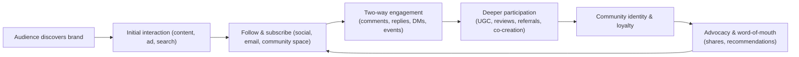

 # Defining and Describing Community Engagement in Digital Marketing

*_Community engagement in digital marketing is about turning audiences from passive viewers into active participants who co-create value, content, and loyalty with a brand._*

In digital marketing, **community engagement** refers to the ongoing, two-way interactions between a brand and a defined group of people (customers, fans, local stakeholders) across online and offline channels, aimed at building relationships, trust, and shared identity.[1][2][5] It moves beyond one-way promotion to focus on conversations, participation, and collaboration—often via social media, forums, events, and user-generated content.[2][3][6] This approach matters because brands that build strong communities see **higher customer loyalty, advocacy, and long‑term growth**, especially in crowded markets where attention is scarce and trust is critical.[1][5][7] Community engagement is especially important for local businesses, creator-led brands, and digital-first startups that rely on word-of-mouth and authentic connections rather than pure advertising spend.[1][2][3]  

# Uses in Context

- Marketers use **“community engagement marketing”** to describe strategies that “**turn one-time buyers into lifelong customers**” by leveraging user-generated content, reviews, and loyalty programs to build ongoing dialogue and connection.[2]  
- Local marketing practitioners frame community engagement as the key to “**stand[ing] out in competitive markets**” by “building trust and creating meaningful relationships with the people who live and work in your area.”[1]  
- Customer experience professionals use “community and social engagement” to explain how **community‑led CX** “drives trust, loyalty, and long-term business value,” emphasizing that engaged communities reduce support costs and increase retention.[7]  
- Digital marketing educators argue brands should “**prioritize community over content**,” contending that fostering community is what helps marketers “cut through the noise and foster real loyalty” in saturated digital environments.[5]  
- Agencies and consultants talk about community engagement in terms of **tactics** such as “host local events,” “leverage social media for local conversations,” and “feature local voices,” where engagement is the mechanism for visibility and loyalty rather than a separate channel.[1][3]  
- Research on platforms like TikTok uses the term to study how digital marketing activities (videos, interactions, campaigns) influence the **engagement and behavior of user communities** around specific products and brands.[4]  

# History of Use

## Origins

- The broader term **“community engagement”** originated in civic, public health, and nonprofit practice, describing efforts to involve community members in decision-making and collective action long before its adoption in digital marketing.[5]  
- In the marketing context, **community-building and community marketing** ideas emerged in the 1990s and early 2000s with online forums, brand fan sites, and early social networks, where brands experimented with customer communities as an alternative to mass advertising.[6][5]  
- As social media matured in the 2010s, practitioners began explicitly combining “community engagement” with **digital marketing**, describing how brands could use platforms like Facebook, Instagram, and later TikTok to create “local conversations” and community-centered campaigns.[1][3][4]  

*(Because much of this development happened in practice, on forums and blogs rather than in a single landmark paper, there is no widely agreed-upon “first use” of the exact phrase “Community Engagement in Digital Marketing”; instead, it evolved as digital marketers applied community-engagement principles to online channels.)*  

## Evolution

- **2000s – Rise of online communities and forums:** Marketers began to see online forums, message boards, and early brand communities as spaces where **ongoing engagement** could deepen loyalty and generate feedback, shifting from one-way campaigns to more relational approaches.[5][6]  
- **2010s – Social media and community marketing:** With platforms like Facebook, Instagram, and later TikTok, “community marketing” was increasingly defined as a strategy that “brings customers, partners, and advocates together around shared interests or challenges to drive ongoing engagement,” formalizing community engagement as a core digital marketing discipline.[6]  
- **Late 2010s–2020s – Community-led growth & CX:** Thought leaders and digital institutes emphasized that brands should “prioritize community over content,” arguing that communities are now central to loyalty, advocacy, and customer experience, and that community and social engagement are “reshaping customer experience.”[5][7]  

# Best Real-World Examples

- [Yotpo](https://www.yotpo.com/blog/community-engagement-marketing-guide/) – E‑commerce marketing platform that advocates “community engagement marketing,” helping brands use reviews, user-generated content, and loyalty programs to build active customer communities.[2]  
- [Digital Marketing Institute](https://digitalmarketinginstitute.com/blog/why-you-should-prioritize-community-over-content) – Education provider promoting frameworks where brands “prioritize community over content,” highlighting community engagement as a central digital marketing strategy.[5]  
- [1Eighty Digital](https://1eightydigital.com/blog/the-power-of-community-engagement-in-local-marketing/) – Local marketing agency specializing in community-focused tactics (local events, partnerships, social conversations) to deepen engagement in specific geographic communities.[1]  
- [12AM Agency](https://12amagency.com/blog/7-community-marketing-ideas/) – Agency sharing “community marketing ideas” like local storytelling and two-way social media communication to boost community engagement.[3]  
- [Beebot Automotive TikTok Community](https://ejournal.unibabwi.ac.id/index.php/sosioedukasi/article/view/6457) – Brand-based community on TikTok studied for how digital marketing content and interactions drive community engagement among product users.[4]  
- [HubSpot Community Marketing](https://blog.hubspot.com/marketing/community-marketing) – Popularizer of community marketing strategies, showing how brands can use communities to “drive customer advocacy and engagement.”[6]  

# Case Studies

## Case Study 1: Local Community Engagement for a Small Business

A local business marketing example described by **1Eighty Digital** illustrates how community engagement can transform local visibility and loyalty.[1] The agency explains that **hosting local events** such as “workshops, charity fundraisers, and networking sessions” brings people together, giving customers chances to “experience your brand in person and form personal connections.”[1] By **partnering with local organizations** like schools and nonprofits, the business expands its reach and “shows that you support causes that matter to the community.”[1]  

The approach also leverages **social media for local conversations**, using platforms like Facebook, Instagram, and Nextdoor to share stories about community members, highlight local achievements, and respond to comments, which “strengthen bonds” between the brand and its audience.[1] Over time, this community-centered digital marketing leads to “stronger customer loyalty, increased visibility, and long-term growth,” demonstrating that sustained engagement can outperform purely promotional tactics in local markets.[1] This case shows how community engagement in digital marketing blends offline events with online storytelling and two-way interactions to build durable relationships.  

## Case Study 2: Community Engagement on TikTok – Beebot Automotive

A study on **Beebot Automotive** users on TikTok examines “the impact of digital marketing on community engagement,” focusing on how short-form video content and interactions affect the behavior of a product-based community.[4] The research analyzes how Beebot’s digital marketing presence—through TikTok videos, comments, and platform features—shapes the engagement levels of its user community.[4] By looking at how users respond, share, and interact around these campaigns, the study links specific digital marketing tactics to measurable community engagement outcomes.[4]  

Findings indicate that TikTok-based digital marketing can significantly influence **community awareness, participation, and loyalty** among Beebot Automotive users, suggesting that platforms with strong social features are powerful tools for cultivating engaged product communities.[4] This case demonstrates how community engagement in digital marketing is not limited to traditional social networks but extends to newer, video-first platforms where creative content and interactive features (comments, duets, stitches) enable brands to actively co-create culture with their communities.[4]  

## Case Study 3: Prioritizing Community over Content for Brand Loyalty

The **Digital Marketing Institute** highlights examples of brands that “prioritize community over content” to build deeper loyalty and advocacy.[5] In these cases, brands shift emphasis from high-volume content production to **facilitating spaces and interactions** where customers can connect with each other and with the brand.[5] The institute notes that fostering community “helps brands cut through the noise and foster real loyalty,” particularly as consumers increasingly seek belonging and meaningful interaction rather than just information.[5]  

Practically, this can include creating branded communities, encouraging user-generated content, and using social platforms to host discussions and collaborative activities rather than broadcasting promotional messages alone.[5] Over time, such community-led strategies drive stronger **customer retention and advocacy**, as engaged community members become informal ambassadors who share experiences and recommendations.[5][7] This case underscores that community engagement is no longer a side effect of digital marketing but a deliberate, central strategy for long-term brand health.  

***

# Sources

[1]: [The Power Of Community Engagement In Local Marketing](https://1eightydigital.com/blog/the-power-of-community-engagement-in-local-marketing/)
[2]: [Community Engagement Marketing: The Ultimate Guide - Yotpo](https://www.yotpo.com/blog/community-engagement-marketing-guide/)
[3]: [7 Community Marketing Ideas to Boost Local Engagement](https://12amagency.com/blog/7-community-marketing-ideas/)
[4]: [THE ROLE OF DIGITAL MARKETING IN COMMUNITY ...](https://ejournal.unibabwi.ac.id/index.php/sosioedukasi/article/view/6457)
[5]: [Why You Should Prioritize Community Over Content](https://digitalmarketinginstitute.com/blog/why-you-should-prioritize-community-over-content)
[6]: [Community marketing: How to use it to drive customer advocacy and ...](https://blog.hubspot.com/marketing/community-marketing)
[7]: [Community & Social Engagement: The Future of Customer Experience](https://www.cxtoday.com/community-social-engagement/community-future-customer-experience/)
