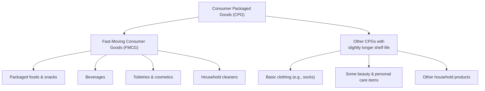

---
aliases:
  - CPG
date_created: 2026-05-06
date_modified: 2026-05-23
cf_last_run: 2026-05-23T21:17:37.670Z
cf_last_run_model: Perplexity sonar-pro
---
[[lost-in-public/market-maps/The Future of CPG|The Future of CPG]]
# Defining and Describing Consumer Packaged Goods

_*Consumer packaged goods are the everyday items you constantly run out of and keep buying again — from toothpaste and snacks to laundry detergent and shampoo.*_

Consumer packaged goods (CPG) are “everyday products that consumers purchase and use regularly, from food and beverages to personal care and household items” that are used and replaced frequently. [^7moia9] [^ykjfw5] They are typically essential products “like food, beverages, hygiene items, and cleaning supplies” that reach millions of people daily and must be “replenished regularly.”[^ujmjz5] CPGs are sold in their final form to consumers, usually through easily accessible channels such as supermarkets, convenience stores, and e‑commerce, and are characterized by high turnover, relatively low margins, and a short purchase or repurchase cycle. [^7moia9] [^ujmjz5] [^ykjfw5] In many business and marketing contexts, the term overlaps with fast‑moving consumer goods (FMCG), which are “a subset of CPGs” sold quickly at relatively low cost. [^b0nfh0]

CPG products include categories such as food and beverages, cosmetics and personal care, household care, and healthcare products. [^3s6hkh] [^1fq935] Market analysts estimate that the global consumer packaged goods market will reach about USD 3,450.12 billion in 2025 and grow to USD 4,235.01 billion by 2030, at a compound annual growth rate (CAGR) of 4.2% from 2025 to 2030, reflecting the scale and importance of this sector. [^3s6hkh]

# Uses in Context

- In marketing and sales, “CPG marketing is the activities and campaigns used to generate awareness, brand affinity, and loyalty for consumer packaged goods,” covering both paid and organic tactics from display ads to billboards and “always on” programs. [^oi0l7t]  
- In industry classification and strategy, companies talk about “the consumer packaged goods (CPG) market” as including products used daily, such as “snacks, toiletries, and cleaning supplies,” and segment it by product type, packaging type, and distribution channel for forecasting and planning. [^3s6hkh]  
- In retail and distribution, CPG is used to emphasize characteristics like “repurchase cycle,” “convenience and accessibility,” and high demand, as these goods are designed for regular repeat purchases and are “typically sold in easily accessible retail locations, such as supermarkets, convenience stores, and online platforms.”[^7moia9]  
- In operations and supply chain discussions, CPGs are described as products with “high turnover, low profit margins, and [that] require very agile logistics,” highlighting the need for efficient production, inventory, and distribution systems. [^ujmjz5]  
- In consumer behavior and economics, analysts often treat fast‑moving consumer goods (FMCG) as “often used interchangeably with the term consumer packaged goods (CPG), but strictly speaking, FMCG is a subset of CPG,” a distinction used when comparing categories with different turnover speeds and price points. [^b0nfh0]  
- In technology and software contexts, vendors describe “CPG software” or “consumer packaged goods software” as tools that help manufacturers and brands manage sales, trade promotion, and retail execution for these everyday products. [^7moia9] [^ykjfw5]  

# History of Use

## Origins

- The underlying business category of mass‑produced branded household goods emerged with the rise of national brands and chain grocery stores in the late 19th and early 20th centuries, when packaged foods, soaps, and household products began to be manufactured at scale and sold in labeled packages, laying the groundwork for what is now called consumer packaged goods. [^b0nfh0] [^f0wk7t]  
- The specific phrase “consumer packaged goods” gained prominence in late‑20th‑century U.S. marketing and retailing as manufacturers, retailers, and consultants needed a term for products that “reach the consumer in their final form and, due to their everyday use, must be replenished regularly,” such as bottled water, detergent, and staple foods. [^ujmjz5] Trade associations and industry analysts adopted the label to distinguish this sector from durable goods and industrial products. [^ujmjz5] [^3s6hkh]  

(Available web sources describe the definition and industry scope of CPG but do not pinpoint a single original paper, book, or named individual who coined the term; it appears to have evolved as an industry descriptor in marketing and retail practice rather than being introduced in a specific academic publication.)[^ujmjz5] [^b0nfh0] [^3s6hkh]  

## Evolution

- **Late 20th century – FMCG vs. CPG distinction.** As global retail expanded, the term fast‑moving consumer goods (FMCG) became common, and later sources explicitly defined FMCG as “often used interchangeably with the term consumer packaged goods (CPG), but strictly speaking, FMCG is a subset of CPG,” clarifying that ultrafast, low‑cost items like beverages and toiletries sit within a broader CPG universe that can also include basics such as clothing. [^b0nfh0]  
- **Early 21st century – Digitalization and omnichannel.** With the growth of e‑commerce, mobile, and data‑driven marketing, industry commentary emphasizes that CPG products are “typically sold in easily accessible retail locations, such as supermarkets, convenience stores, and online platforms,” and that brands must manage both online and offline channels, including digital display ads and “always on” programs. [^oi0l7t] [^7moia9]  
- **2020s – Market sizing and self‑disruption.** Market research reports now treat CPG as a distinct global market, projecting it to reach USD 4,235.01 billion by 2030 and analyzing it by product, packaging, and channel. [^3s6hkh] Consulting analyses of the “state of consumer packaged goods” characterize the sector as facing growth challenges and needing to “self‑disrupt,” for example by adapting to shifting consumer preferences, margin pressure, and new digital competitors. [^zb6we9]  

# Best Real-World Examples

- [Procter & Gamble](https://consumerbrandsassociation.org/proud/)[^f0wk7t] – One of the archetypal CPG manufacturers, producing everyday items like detergents, shampoos, and personal care products that are purchased and replaced frequently.  
- [Unilever](https://consumerbrandsassociation.org/proud/)[^f0wk7t] – Global producer of packaged foods, beverages, and personal care products that fit the CPG profile of high‑turnover, branded household items.  
- [Nestlé](https://consumerbrandsassociation.org/proud/)[^f0wk7t] – Major food and beverage company whose packaged coffee, snacks, and prepared foods exemplify high‑volume consumer packaged goods.  
- [Colgate-Palmolive](https://consumerbrandsassociation.org/proud/)[^f0wk7t] – Producer of toothpaste, soaps, and household cleaners, all classic examples of hygiene and cleaning CPGs.  
- [Clorox](https://consumerbrandsassociation.org/proud/)[^f0wk7t] – Known for cleaning products and disinfectants that are consumed in daily household use and replenished regularly.  
- [General Mills](https://consumerbrandsassociation.org/proud/)[^f0wk7t] – Cereal and snack manufacturer whose packaged foods illustrate the FMCG subset of consumer packaged goods.  
- [PepsiCo](https://consumerbrandsassociation.org/proud/)[^f0wk7t] – Producer of beverages and snack foods, which are central categories in the CPG market like “snacks” and “beverages.”[^3s6hkh] [^1fq935]  

# Case Studies

## A legacy CPG manufacturer navigating self‑disruption

In analyses of the CPG sector, large established manufacturers of packaged foods and household products are described as facing “growth challenges rooted in external forces as well as internal inertia,” prompting calls for self‑disruption. [^zb6we9] These companies historically relied on scale, shelf presence in supermarkets, and mass media advertising to sell products that consumers “use and replace frequently,” such as food, beverages, and personal care items. [^7moia9] [^ykjfw5] As digital channels and direct‑to‑consumer brands grew, incumbents needed to invest in e‑commerce, data analytics, and new product formats while still managing the high‑volume logistics of goods characterized by high turnover and low margins. [^ujmjz5] [^zb6we9] This case shows how the structural features of consumer packaged goods—rapid repurchase cycles, essential everyday use, and reliance on broad distribution—can become both an advantage and a constraint when markets shift. [^7moia9] [^ujmjz5] [^zb6we9]  

## CPG marketing in a world of unlimited choice

Marketing guidance for CPG brands emphasizes that “CPG marketing is defined as the activities and campaigns used to generate awareness, brand affinity, and loyalty for a company’s consumer packaged goods,” using a mix of paid and organic tactics like display advertising and billboard campaigns. [^oi0l7t] Because CPG consumers have “near‑unlimited choice and zero switching costs,” brands in categories such as snacks, beverages, and household cleaners must “constantly invest in staying top of mind and driving purchase consideration.”[^oi0l7t] [^3s6hkh] A typical brand will run ongoing (“always on”) digital campaigns while coordinating in‑store promotions and packaging updates, all to increase the likelihood that its product is chosen during quick, low‑involvement purchase decisions that characterize CPG shopping. [^oi0l7t] [^ujmjz5] This case illustrates how the defining traits of consumer packaged goods—frequent replenishment, low individual price points, and quick purchase cycles—shape marketing strategies toward scale, repetition, and brand recall. [^oi0l7t] [^ujmjz5]  

## Market sizing and category management for CPG

Market research framing the “consumer packaged goods market” segments products into types such as “Food & Beverages, Cosmetics & Personal Care Products, Household Care Products, [and] Healthcare Products,” and further breaks them down by packaging type (rigid vs. flexible), packaging material (plastic, metal, paperboard, glass), and distribution channel (supermarkets, convenience stores, e‑commerce). [^3s6hkh] Analysts estimate that this market will grow from USD 3,450.12 billion in 2025 to USD 4,235.01 billion by 2030 at a 4.2% CAGR, implying large, relatively steady demand for everyday consumables. [^3s6hkh] Within this structure, companies manage assortments of items like “snacks, toiletries, and cleaning supplies” across different retail formats, aligning production and logistics to the high‑turnover, low‑margin nature of these goods. [^ujmjz5] [^3s6hkh] [^1fq935] This case shows how the CPG concept underpins formal category management, investment decisions, and long‑term planning in both manufacturing and retail.

***

# Sources

[^oi0l7t]: [CPG Marketing: Definition, Strategies & Examples (2026) - CDP.com](https://cdp.com/glossary/cpg-marketing/)
[^7moia9]: [What are Consumer Packaged Goods (CPG)? - Salesforce](https://www.salesforce.com/consumer-goods/consumer-packaged-goods-software/guide/)
[^ujmjz5]: [What is CPG? Keys to understanding consumer packaged goods](https://www.delego.ai/en/blog/what-is-cpg-keys-to-understanding-consumer-packaged-goods)
[^b0nfh0]: [Fast-moving consumer goods - Wikipedia](https://en.wikipedia.org/wiki/Fast-moving_consumer_goods)
[^3s6hkh]: [Consumer Packaged Goods Market worth $4,235.01 billion by 2030](https://www.marketsandmarkets.com/PressReleases/consumer-packaged-goods.asp)
[^ykjfw5]: [What Are Consumer Packaged Goods? A Definition - NetSuite](https://www.netsuite.com/portal/resource/articles/erp/consumer-packaged-goods-cpg.shtml)
[7]: [Consumer Packaged Goods 101: Your Essential Guide to ... - Firework](https://firework.com/blog/consumer-packaged-goods-what-cpg)
[^zb6we9]: [The state of consumer packaged goods: Why it's time to self-disrupt](https://www.pwc.com/us/en/industries/consumer-markets/library/cpg-industry-self-disruption.html)
[^f0wk7t]: [Meet the Makers of America's Trusted Household Brands](https://consumerbrandsassociation.org/proud/)
[^1fq935]: [Consumer Packaged Goods (CPG) Market Size, Trends and ...](https://www.towardspackaging.com/insights/consumer-packaged-goods-cpg-market-sizing)
