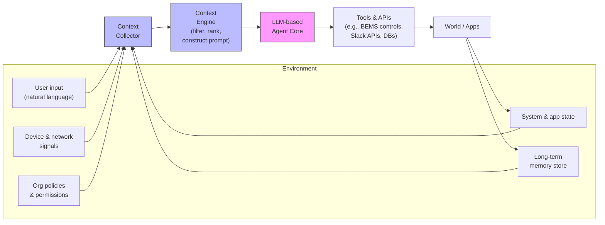

---
aliases:
  - Context Aware
  - Context-Awareness
  - context-aware
date_created: 2026-05-13
date_modified: 2026-05-23
cf_last_run: "2026-05-23T21:50:23.565Z"
cf_last_run_model: "Perplexity sonar-pro"
site_uuid: 1743df60-4570-4729-a77e-e6963ed7434a
publish: true
title: "Context Aware Agents & AI"
slug: context-aware-agents-ai
at_semantic_version: 0.0.0.1
---

[[concepts/Explainers for AI/Context Layers|Context Layer]]
[[concepts/Explainers for AI/Context Window|Context Windows]]

[[ChromaDB]]

# Defining and Describing Context Aware Agents & AI

_*Context-aware agents are AI systems that don’t just respond to a prompt, but continuously interpret surrounding signals—state, history, risk, and environment—before deciding what to say or do.*_

Context Aware Agents & AI refers to AI agents whose behavior is dynamically driven by “context” such as prior interactions, live application state, environmental data, organizational policies, and risk signals, instead of only the current user message or a static role. [^3ecjb1] [^wy5y3y] [^k7g35y] [^ups6z7] These systems typically combine large language models with context engineering, memory, tool use, and access control so each request is evaluated against “live conditions (i.e. device posture, network, behavior) rather than relying only on static roles assigned at login.”[^3ecjb1] [^0lu5dt] [^x500a8] [^ups6z7] The concept matters because real-world agents (for customer support, building energy management, collaboration tools, etc.) must be situationally aware to be safe, efficient, and useful, turning “one-off conversations into continuous, evolving relationships between users and AI agents.”[^wy5y3y] [^ups6z7]  

---

# Uses in Context

- **Security & permissions for [[Vocabulary/Agentic AI|AI Agents]]** – In AI authorization, “context-aware permissions” are positioned as “more of a precaution than a cure,” where each agent decision is “double-checked…to the live state of the request” instead of bound only to a static role. [^3ecjb1] Systems evaluate each request “against signals” such as device posture, network, and behavior, and can perform “mid-session risk re-evaluation” by treating tokens as ephemeral and revoking them when risk changes. [^3ecjb1]

- **Context-aware energy management agents** – In smart buildings, researchers describe “LLM-based Building Energy Management System (BEMS) AI agents” that facilitate “context-aware energy management in smart buildings through natural language interaction,” using a perception–control–action loop to interpret energy data and user queries. [^wy5y3y] The agent aims to provide “context-aware insights into energy consumption, cost prediction, and device scheduling.” [^wy5y3y]

- **Memory-powered conversational agents** – In enterprise agent frameworks, vendors describe memory as a way to “transform one-off conversations into continuous, evolving relationships between users and AI agents,” enabling agents to be context-aware across sessions. [^ups6z7] This includes short-term memory of recent events and long-term memory where a “memory extraction module” consolidates and embeds selected events for future retrieval. [^0lu5dt] [^ups6z7]

- **Context engineering in multi-agent systems** – Engineering blogs and talks frame “context engineering” as “literally designing a system on how this context window should look like given a specific query to the agent,” including how multiple agents share and scope context. [^0lu5dt] [^x500a8] [^drt7fs] This is used to build “efficient context-aware multi-agent framework[s] for production,” with tiered context, multi-agent scoping, and specialized agents like travel and hotel agents that work on separate branches of conversation history. [^0lu5dt] [^x500a8] [^drt7fs]

- **Context-aware AI apps in collaboration platforms** – Collaboration platforms such as Slack describe “context-aware AI apps and agents” that use a “real-time search API and Model Context Protocol server” to give secure access to Slack conversational data so agents can answer questions and take actions grounded in current channel, user, and message context. [^eub27l]

- **Enterprise agent orchestration and risk control** – Security-focused agent architectures use “conditional delegation” and a “policy decision point (PDP)” that issues “downstream credential[s] trimmed to fit” current conditions each time an agent acts, replacing static inheritance with dynamic, context-based delegation. [^3ecjb1] This illustrates context awareness not just in what the agent says but in what it is allowed to do at each moment.

---

# History of Use

## Origins

- The broader notion of “context-aware” behavior originates in context-aware computing and context-aware applications from ubiquitous and mobile computing research in the 1990s and 2000s, where systems adapted to factors like location, time, and nearby devices; this terminology and framing are now being directly reused for AI agents that adapt to environmental and interaction context. [^wy5y3y] [^x500a8]  
- In the current LLM era, explicit discussion of “context-aware AI agents” appears in specialized domains such as building energy management, where a 2020s research paper proposes “LLM-based…AI agents to facilitate context-aware energy management in smart buildings,” defining a perception–control–action loop that captures and interprets building and user context. [^wy5y3y]  
- Independent security and infrastructure startups and practitioners (e.g., Oso for authorization) have introduced and popularized “context-aware permissions for AI agents” as a way to constrain agent action by live signals, adapting ideas from zero-trust and continuous access evaluation to AI tooling. [^3ecjb1]

Given the fragmented and recent nature of LLM-agent practice, much of the actual innovation around context-aware agent behavior is coming from research groups, smaller infrastructure companies, and open developer communities rather than from large incumbent platforms, which tend to adopt and productize these ideas later. [^3ecjb1] [^wy5y3y] [^x500a8] [^ups6z7] [^drt7fs]

## Evolution

- **2020–2023: Domain-specific context-aware agents** – Research on AI agents in verticals such as energy systems and smart buildings began to incorporate LLMs into existing control loops, with BEMS agents designed to “capture, analyze, and interpret energy data” and provide “context-aware insights into energy consumption” via natural language interfaces. [^wy5y3y] This marks an early fusion of classic cyber-physical “context awareness” with LLM-based agents.

- **2023–2024: Context engineering and memory become first-class concerns** – As multi-agent systems and tool-using agents moved into production, engineering groups started talking explicitly about “context engineering” and “architecting efficient context-aware multi-agent framework[s]” with tiered context and scoped sharing. [^0lu5dt] [^x500a8] [^drt7fs] At the same time, frameworks like Bedrock AgentCore made memory a core feature, introducing explicit differentiation between short-term raw events and long-term embedded memories to support context-aware behavior across sessions. [^0lu5dt] [^ups6z7]

- **2024–present: Context-aware permissions and platform integrations** – Security-conscious teams adapted continuous access evaluation and zero-trust concepts to AI, defining “context-aware permissioning” where each agent request is evaluated against live signals such as device posture and network risk, and where “mid-session risk re-evaluation” allows revocation on the fly. [^3ecjb1] Collaboration platforms began exposing “context-aware AI apps and agents” via APIs like real-time search and MCP servers so agents can securely use workspace context in their reasoning. [^k7g35y] [^eub27l]

---

# Best Real-World Examples

- **[Oso – Context-Aware Permissions for AI Agents](https://www.osohq.com/learn/context-aware-permissions-for-ai-agents)** – Demonstrates how AI agents can be constrained by context-aware authorization that evaluates each request against environmental and risk signals and supports conditional delegation and mid-session re-evaluation. [^3ecjb1]

- **[LLM-based BEMS AI Agent for Context-Aware Energy Management](https://arxiv.org/abs/2512.25055)** – Research prototype of a building energy management agent that uses a perception–control–action loop and LLM-based analytics to offer “context-aware insights into energy consumption, cost prediction, and device scheduling.”[^wy5y3y]

- **[Amazon Bedrock AgentCore Memory](https://aws.amazon.com/blogs/machine-learning/amazon-bedrock-agentcore-memory-building-context-aware-agents/)** – A memory subsystem that “transforms one-off conversations into continuous, evolving relationships” via short-term event storage, long-term vectorized memory, and strategies for what context agents should retrieve. [^0lu5dt] [^ups6z7]

- **[Effective Context Engineering for AI Agents (Anthropic)](https://www.anthropic.com/engineering/effective-context-engineering-for-ai-agents)** – An engineering guide describing how to “curate and manage the context that powers” AI agents, focusing on retrieval, filtering, and structuring of context to make agents more reliable and efficient. [^k7g35y]

- **[Architecting Efficient Context-Aware Multi-Agent Framework for Production (ADK blog)](https://developers.googleblog.com/architecting-efficient-context-aware-multi-agent-framework-for-production/)** – Describes a production-oriented “context-aware multi-agent framework” with tiered context, multi-agent context scoping, and a context engineering toolkit to scale agent systems. [^x500a8]

- **[Amazon Bedrock AgentCore: Building Context-Aware AI Agents (talk/blog)](https://aws.amazon.com/blogs/machine-learning/amazon-bedrock-agentcore-memory-building-context-aware-agents/)** – Provides a concrete implementation of context-aware agents with explicit short-term memory, long-term memory extraction, and branching of conversation history for specialized sub-agents such as travel and hotel agents. [^0lu5dt] [^ups6z7]

- **[Slack Context-Aware AI Apps and Agents](https://www.salesforce.com/news/stories/slack-context-aware-ai-apps-agents/)** – Illustrates platform-level integration where a “real-time search API and Model Context Protocol server” give agents secure, flexible access to Slack conversational context so they can answer questions and act in-channel. [^eub27l]

---

# Case Studies

## Context-Aware Permissions for AI Agents in Enterprise Systems

A security-focused authorization startup (Oso) has articulated a detailed model of context-aware permissions tailored to AI agents acting on behalf of users in high-risk enterprise environments. [^3ecjb1] Instead of granting a long-lived role token and trusting it for the entire session, their approach treats context as first-class: “context-aware permissioning evaluates each request against signals” such as device posture, network conditions, and behavioral indicators, which are drawn from “the environment surrounding the request.”[^3ecjb1] A “policy decision point (PDP)” evaluates these signals every time an agent presents a user token and then issues “a downstream credential trimmed to fit these conditions,” enabling “conditional delegation” where the agent’s effective permissions change with context. [^3ecjb1] They also adapt continuous access evaluation (CAE) by modeling tokens as ephemeral and building “revocation channels” that can terminate sessions when risk changes mid-flow, enabling “mid-session risk re-evaluation” for AI agents that operate at machine speed. [^3ecjb1] This case shows how context-aware AI is not only about better answers but about dynamically constraining what agents can do, importing mature ideas from zero-trust security into AI agent design.

## Context-Aware LLM Agent for Smart Building Energy Management

Researchers studying [[concepts/Explainers for AI/Building Energy Management Systems]] (BEMS) have proposed a “conceptual framework and a prototype assessment for Large Language Model (LLM)-based…AI agents to facilitate context-aware energy management in smart buildings through natural language interaction.”[^wy5y3y] Their design uses a closed feedback loop composed of three modules—“perception (sensing), central control (brain), and action (actuation and user interaction)”—allowing the agent to “capture, analyze, and interpret energy data” and respond intelligently to occupants’ queries. [^wy5y3y] The context-aware agent leverages the autonomous data analytics capabilities of LLMs to provide “context-aware insights into energy consumption, cost prediction, and device scheduling,” integrating real-time sensor data, historical usage, and user preferences. [^wy5y3y] This work illustrates how context awareness in agents can extend beyond chat history to include physical sensing and control of devices, blending cyber-physical context with language-based reasoning.

## Memory and Branching for Context-Aware Multi-Agent Experiences

Within Amazon’s Bedrock AgentCore ecosystem, engineers describe how memory mechanics enable context-aware behavior across complex, multi-step agent interactions. [^0lu5dt] [^ups6z7] Short-term memory stores “raw events” such as user messages, AI responses, tool calls, and even “storing a entire agent state in a blob fashion,” giving the orchestrator a detailed view of the current interaction context. [^0lu5dt] When long-term memory is enabled, a “memory extraction module” periodically “extract[s] those events,” consolidates them, embeds them, and stores them in a vector database so agents can later retrieve salient past interactions rather than the entire history. [^0lu5dt] [^ups6z7] They also introduce “branching” as a construct for separation of concerns, where, for example, a travel agent and a hotel agent operate on their own branches of events, and the orchestrator can “retrieve the messages and then use them into the context for the agent to use” per branch. [^0lu5dt] In some designs, “memory as a tool” lets the agent itself decide when to consult long-term memory based on the user’s request, supporting optional and dynamic use of context. [^0lu5dt] [^ups6z7] This case shows how careful structuring of short- and long-term context, plus scoped branches, is crucial for scaling context-aware agents and multi-agent systems.

***

# Sources

[^3ecjb1]: [AI Agents and Context-Aware Permissions - Oso](https://www.osohq.com/learn/context-aware-permissions-for-ai-agents)
[^wy5y3y]: [Context-aware LLM-based AI Agents for Human-centered Energy ...](https://arxiv.org/abs/2512.25055)
[^0lu5dt]: [Building Context-Aware AI Agents with Amazon Bedrock AgentCore ...](https://www.youtube.com/watch?v=kNgVybis1ak)
[^x500a8]: [Architecting efficient context-aware multi-agent framework for ...](https://developers.googleblog.com/architecting-efficient-context-aware-multi-agent-framework-for-production/)
[^k7g35y]: [Effective context engineering for AI agents - Anthropic](https://www.anthropic.com/engineering/effective-context-engineering-for-ai-agents)
[^ups6z7]: [Amazon Bedrock AgentCore Memory: Building context-aware agents](https://aws.amazon.com/blogs/machine-learning/amazon-bedrock-agentcore-memory-building-context-aware-agents/)
[^eub27l]: [Slack Platform Expands with Context-Aware AI Apps and Agents](https://www.salesforce.com/news/stories/slack-context-aware-ai-apps-agents/)
[^drt7fs]: [Architecting Smarter Multi-Agent Systems with Context Engineering](https://onereach.ai/blog/smarter-context-engineering-multi-agent-systems/)
