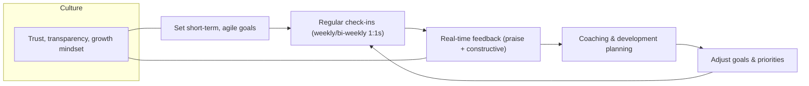

# Defining and Describing Continuous Performance Management

_Continuous Performance Management replaces once‑a‑year appraisals with an ongoing cycle of conversations, feedback, and goal adjustments that happens all year round._[^s01i96] [^772bsh] [^h5lflh]

Continuous performance management (CPM) is described as “a modern approach to employee appraisal and development that focuses on ongoing communication and feedback between managers and employees.” [^s01i96] It is “an ongoing approach to managing employee performance” that aims to improve engagement, development, and alignment with company goals by focusing on “conversations, feedback, and growth.” [^772bsh] Instead of traditional annual reviews, CPM “eschews annual performance reviews in favor of more frequent informal check-ins” that emphasize coaching, a growth mindset, and celebrating positive actions and results. [^zlh644] This matters because it shifts performance management from a backward‑looking, compliance exercise to “a fundamentally different performance management model rooted in agility, trust, and transparency,” prioritizing timely feedback, dynamic goal setting, and real‑time enablement. [^3u71q9]

# Uses in Context

- HR practitioners and people‑ops leaders use CPM to describe a shift “from traditional performance management systems, which often rely on annual performance reviews, toward a system of ongoing, regular feedback that’s instructive, constructive, and celebratory.”[^s01i96]
- In management training, CPM is invoked as “the future of performance management,” which “eschews annual performance reviews in favor of more frequent informal check-ins” and “frequent developmental conversations with all employees.”[^zlh644]
- Learning and development professionals describe CPM as “an ongoing approach to managing employee performance” that aligns employee development goals with broader business objectives through continuous conversations about goals and job performance. [^772bsh]
- Consulting and certification bodies frame CPM as a way to “boost growth” by setting “a consistent cadence for employee‑manager check-ins” (30–45 minutes, structured and conversational) and normalizing feedback through town halls, team debriefs, and one‑on‑ones. [^m2zuri]
- Employee‑experience vendors define CPM as “a modern, human-centered approach to promoting, evaluating, and improving employee performance” that creates “a trusted environment in which employees feel empowered to take control of their own development.”[^qkb8mw]
- Strategy and [[concepts/Objectives & Key Results|OKRs]] specialists use CPM to describe moving from a “backward-looking review cycle to a future-focused, real-time enablement model” rooted in agile goals, timely feedback, and growth‑centered leadership. [^3u71q9] [^h5lflh]

# History of Use

## Origins

- Early 2010s HR thought leadership began criticizing annual appraisals and promoting more continuous, coaching‑oriented conversations; continuous performance management emerged in this context as a label for “a modern approach to employee appraisal and development” based on ongoing communication and feedback. [^s01i96] [^zlh644]
- HR education platforms and blogs, rather than large incumbents, played a key role in naming and defining CPM as “an ongoing approach to managing employee performance” focused on frequent conversations, real‑time feedback, and alignment with company goals. [^772bsh] [^m2zuri]

(Existing public web sources describe what CPM is and why it matters but do not clearly attribute a single, first use of the exact phrase “continuous performance management” to a specific paper, author, or company; it appears to have arisen as a practice term within HR and performance‑management communities rather than via a canonical academic introduction.)[^s01i96] [^zlh644] [^772bsh]

## Evolution

- **Mid‑2010s – From annual reviews to “check‑ins”**: As dissatisfaction with annual reviews grew, HR practitioners promoted CPM as “a departure from traditional performance management systems… toward a system of ongoing, regular feedback,” emphasizing frequent one‑on‑one meetings to discuss progress, challenges, and goals. [^s01i96] [^m2zuri]
- **Late 2010s – Integration with agile goals and OKRs**: Guidance on CPM increasingly tied it to “dynamic, short-term objectives that can adapt to changing business needs,” often using frameworks like SMART goals or OKRs and “agile goals, setting shorter term targets that can adapt to change.”[^m2zuri] [^3u71q9] [^h5lflh]
- **Late 2010s–2020s – Software‑enabled CPM**: Specialized platforms and HR suites added CPM modules, with vendors advising organizations to “use continuous performance management software” and “adopt technology platforms that support continuous performance management” for tracking goals, documenting conversations, and providing real‑time feedback. [^s01i96] [^zlh644] [^3u71q9] [^zo3zd2] [^e6cxfo]
- **2020s – Culture, coaching, and analytics focus**: Recent practice emphasizes developing “managerial coaching skills,” making development “a part of the culture,” and using check‑in and feedback data to “track and respond to trends” for organizational learning, burnout detection, and better leadership decisions. [^m2zuri] [^qkb8mw] [^3u71q9]

# Best Real-World Examples

- [AIHR Continuous Performance Management Guide](https://www.aihr.com/blog/continuous-performance-management/) – An educational resource widely used by HR practitioners to design CPM processes emphasizing ongoing conversations, feedback, and growth. [^772bsh]
- [People Managing People – Perfecting Continuous Performance Management](https://peoplemanagingpeople.com/performance-management/continuous-performance-management/) – A practitioner‑oriented blueprint for defining CPM goals, structuring check‑ins, nurturing a feedback culture, and adopting supporting tools. [^s01i96]
- [GSDC Council – Practical Strategies to Improve Continuous Performance Management](https://www.gsdcouncil.org/blogs/practical-strategies-to-improve-continuous-performance-management) – A certification‑oriented body showcasing concrete CPM routines like 30–45 minute structured check‑ins, quarterly goal‑setting with SMART/OKRs, and trend tracking from feedback data. [^m2zuri]
- [TechClass – Implement Continuous Performance Management Effectively](https://www.techclass.com/resources/learning-and-development-articles/how-to-implement-continuous-performance-management-in-your-company) – A learning provider outlining CPM as ongoing feedback and agile goal‑setting to enhance growth and engagement. [^e6cxfo]
- [Workhuman Continuous Performance Content](https://www.workhuman.com/blog/back-to-basics-what-is-continuous-performance-management/) – An employee‑experience vendor that operationalizes CPM as a “human-centered approach” enabling feedback “up, down, and across an organization” and empowering employees to own development. [^qkb8mw]
- [Betterworks – Drive Growth with Continuous Performance Management](https://www.betterworks.com/magazine/continuous-performance-management-is-essential-to-your-strategic-plan) – A goal‑management platform that embeds CPM as a shift to “real-time enablement” with agile goals, transparent tracking, and growth‑centered leadership. [^3u71q9]
- [SAP SuccessFactors – Continuous Performance Management Configuration](https://learning.sap.com/courses/sap-successfactors-performance-and-goals-academy/introducing-and-configuring-continuous-performance-management_d7fe9cb7-de19-4c37-b00c-ed75a4a98418) – An example of a large HR suite acting as an adopter, offering a configurable CPM module within enterprise performance and goals workflows. [^zo3zd2]

# Case Studies

**1. Implementing structured check‑ins and goal alignment in a mid‑sized organization**

A mid‑sized company adopting CPM might follow the playbook described by People Managing People and [[organizations/Global Skill Development Council]]: leadership first “clearly define what you aim to achieve with CPM” and establish “a framework that outlines how often performance reviews will occur, the format of feedback, and the process for setting and revising goals.”[^s01i96] Managers are trained and required to “schedule regular one-on-one meetings between them and their direct reports,” using a shared template covering wins, challenges, support needed, and goal progress in 30–45 minute, non‑negotiable, conversational check‑ins. [^s01i96] [^m2zuri] The organization then “shift[s] from static annual goals to more dynamic, short-term objectives” and establishes quarterly goal‑setting using [[SMART Goals]] or OKR frameworks so each employee can see how their work supports organizational goals and associated success metrics. [^s01i96] [^m2zuri] Over time, this structure helps normalize feedback through town halls, debriefs, and one‑on‑ones, making performance tracking feel less bureaucratic by focusing documentation on patterns, outcomes, and agreed‑upon action items rather than formal ratings alone. [^m2zuri] This case illustrates how CPM operationalizes culture change: it is not just more meetings, but a disciplined rhythm of coaching‑style conversations anchored in agile goals and transparent documentation. [^s01i96] [^m2zuri]

**2. Technology‑enabled CPM in a growth‑stage company**

A growth‑stage company implementing CPM with software might follow the steps outlined by Business.com and Betterworks: HR first talks to managers “to discover who is already conducting regular performance discussions” and how they organize formal and informal meetings today. [^zlh644] [^3u71q9] They then secure senior‑leadership buy‑in on CPM by “discuss, [ing] using research-based evidence, the business benefits” and explaining how a continuous system will create “a more engaged, motivated and better-performing team.”[^zlh644] In redesigning the process, they “involve employees and managers” and then “invest in technology that drives visibility and action,” selecting continuous performance management software that supports goal tracking, real‑time feedback, and documentation of discussions without adding heavy administrative burden. [^zlh644] [^3u71q9] [^s01i96] Managers and employees receive training and guidance, including how to use the tool for “agile goals,” “real-time feedback,” and growth‑centered performance discussions, while HR continually communicates the change via emails, videos, meetings, webinars, and fact sheets rather than a single announcement. [^zlh644] [^3u71q9] By reinforcing accountability “with culture, not compliance,” the company shifts from a backward‑looking annual review to a “future-focused, real-time enablement model,” showing how CPM plus technology can scale coaching‑oriented management across a fast‑growing workforce. [^3u71q9] [^zlh644] [^s01i96]

**3. Building a development‑centric culture with coaching and trend analysis**

Another organization might lean on the GSDC and Workhuman approach to use CPM to embed development into everyday work and leadership practice. Leaders normalize feedback by encouraging “town hall meetings, regular team debriefs, and one-on-one conversations,” and they equip managers with coaching skills, tools, and templates to lead effective performance conversations. [^m2zuri] Employees are encouraged to pursue development through stretch assignments, mentoring, cross‑functional projects, and internal development plans, with managers asking questions like “What’s one skill you want to develop?” to keep growth central in check‑ins. [^m2zuri] [^qkb8mw] The organization also treats CPM as “organizational learning” by regularly reviewing feedback and check‑in data for patterns—such as recurring skill gaps or signs of burnout—and using those insights to inform training agendas, leadership decisions, and broader organizational changes. [^m2zuri] [^3u71q9] Over 30, 60, and 90‑day cycles, leaders reflect on new behaviors, assess resistance, and revisit what needs to evolve, embedding CPM as an iterative habit rather than a one‑time rollout. [^m2zuri] This case shows CPM as a lever for culture: turning performance management into an ongoing, data‑informed coaching and development system where employees “feel empowered to take control of their own development” and feedback flows up, down, and across the organization. [^qkb8mw] [^m2zuri]

***

# Sources

[^s01i96]: [Perfecting Continuous Performance Management In Your Org](https://peoplemanagingpeople.com/performance-management/continuous-performance-management/)
[^zlh644]: [What Is Continuous Performance Management? - Business.com](https://www.business.com/articles/continuous-performance-management/)
[^772bsh]: [What Is Continuous Performance Management: Your 101 Guide - AIHR](https://www.aihr.com/blog/continuous-performance-management/)
[^m2zuri]: [7 Practical Strategies to Improve Continuous Performance ...](https://www.gsdcouncil.org/blogs/practical-strategies-to-improve-continuous-performance-management)
[^qkb8mw]: [Back to Basics: What Is Continuous Performance Management?](https://www.workhuman.com/blog/back-to-basics-what-is-continuous-performance-management/)
[^3u71q9]: [Drive Growth with Continuous Performance Management](https://www.betterworks.com/magazine/continuous-performance-management-is-essential-to-your-strategic-plan)
[^h5lflh]: [Continuous Performance Management Explained - YouTube](https://www.youtube.com/watch?v=a-b1lMFMBgs)
[^zo3zd2]: [Configuring Continuous Performance Management - SAP Learning](https://learning.sap.com/courses/sap-successfactors-performance-and-goals-academy/introducing-and-configuring-continuous-performance-management_d7fe9cb7-de19-4c37-b00c-ed75a4a98418)
[^e6cxfo]: [Implement Continuous Performance Management Effectively - TechClass](https://www.techclass.com/resources/learning-and-development-articles/how-to-implement-continuous-performance-management-in-your-company)
