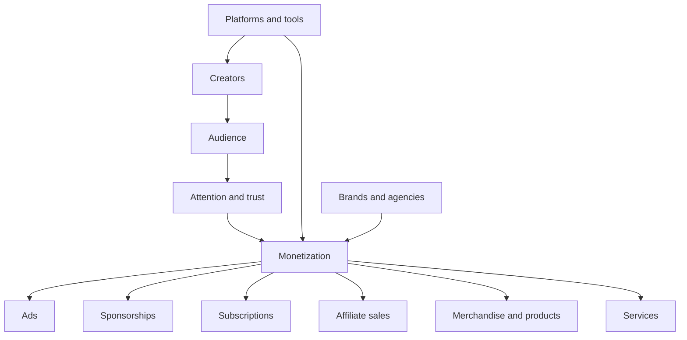

_The **creator economy** is not just “people posting online”; it is a market structure where individuals turn audience attention, creative work, and community into direct income._ [^rv61c8] [^2lcs61] [^04t9ef]

The term is used for the ecosystem of creators, audiences, platforms, brands, and tools that lets individuals monetize content through ads, sponsorships, subscriptions, affiliate links, merchandise, and products or services. [^rv61c8] [^2lcs61] [^r4plum] [^04t9ef] It matters because the model has moved from a niche side hustle to a broader economic system, with corporate and market reports describing it as a durable business category rather than a temporary social-media trend. [^2lcs61] [^w31u76]

# Defining and Describing Creator Economy

- 

- The **creator economy** refers to an economic system in which individual content creators generate income by monetizing creative content and audience relationships. [^rv61c8] [^2lcs61]
- It is commonly described as an ecosystem involving **creators, audiences, digital platforms, marketers, and agencies**. [^04t9ef]
- Typical revenue streams include **advertising revenue, sponsored content, product sales, subscriptions, affiliate marketing, and merchandising**. [^rv61c8]
- In business-language usage, the term often frames creators as **entrepreneurs** who can “generate revenue from their audiences through digital platforms.”[^2lcs61]
- Some marketing explanations emphasize that creators are “not just influencers” and can be anyone sharing useful or entertaining work online on platforms such as YouTube, TikTok, Instagram, Substack, Twitch, and Patreon. [^r4plum]
- Industry coverage also splits the space into multiple business models, including audience-owned media companies and micro-creators with niche followings. [^2xiev7]

# Uses in Context

- In beginner-oriented business writing, the term is used to mean “**individual content creators generate income**” by monetizing creative work. [^rv61c8]
- In market commentary, it is used to describe a “**new method of creating value in the digital age**” that turns creators into entrepreneurs. [^2lcs61]
- In marketing guidance, the creator economy is invoked as a way for businesses to find “**creators who align with your brand values**” rather than chasing raw follower counts. [^r4plum]
- In platform and strategy coverage, it is used to describe different operating models, from “**audience-owned media companies**” to “**micro creators with a niche**.”[^2xiev7]
- In ecosystem descriptions, it is framed as an “**economic ecosystem**” connecting creators, audiences, platforms, marketers, and agencies. [^04t9ef]
- In statistics-oriented coverage, it is treated as a maturing sector in which creators are “**rapidly professionalizing**” and “diversifying income.”[^w31u76]

# History of Use

## Origins

The phrase **creator economy** does not have a single universally agreed inventor in the sources surfaced here, but the modern usage is clearly an industry-era term rather than an academic one. [^rv61c8] [^2lcs61] [^04t9ef] The earliest materials in this search set treat it as an established label for online monetization, with one guide defining it as creators earning money from creative content and another describing it as an ecosystem that turns creators into entrepreneurs. [^rv61c8] [^2lcs61] In the sources reviewed here, the term is used descriptively by business and platform writers rather than attributed to one founding paper or one named originator. [^rv61c8] [^2lcs61] [^04t9ef]

## Evolution

- **2020s:** The term broadened from a description of solo online earners into a full business category that includes platforms, agencies, and brand partnerships, not just creator-side income. [^2lcs61] [^04t9ef]
- **2020s:** Marketing guidance shifted the term away from “influencer” alone and toward a wider class of people who “share something useful or entertaining online,” expanding the concept beyond celebrity-style creators. [^r4plum]
- **2026 reporting:** Statistics coverage describes the sector as “rapidly professionalizing,” with creators diversifying income and operating as solo entrepreneurs, indicating a move from hobbyist framing to business infrastructure. [^w31u76]

# Best Real-World Examples

- [Patreon](https://www.patreon.com) — a subscription platform often used to monetize direct audience support. [^r4plum] [^04t9ef]
- [Substack](https://substack.com) — a newsletter platform commonly associated with creator-led paid subscriptions. [^r4plum]
- [YouTube](https://www.youtube.com) — a major platform for ad-supported and fan-supported creator monetization. [^r4plum]
- [TikTok](https://www.tiktok.com) — a short-form video platform that supports creator audiences and brand partnerships. [^r4plum]
- [Twitch](https://www.twitch.tv) — a live-streaming platform used for direct audience monetization and community building. [^r4plum]
- [Circle](https://circle.so) — a community platform cited in creator-economy statistics and professionalization coverage. [^w31u76]
- [Digiday](https://digiday.com) — an industry publication that breaks down creator business models and use cases. [^2xiev7]

# Case Studies

One useful case is the shift from **creator-as-influencer** to **creator-as-business**. Salesforce’s explanation explicitly says creators are “not just influencers” and points to people who teach, review, bake, design, dance, explain, and build across platforms like YouTube, TikTok, Instagram, Substack, Twitch, and Patreon. [^r4plum] That framing shows how the creator economy now includes many content formats and monetization paths, not just sponsored social posts. [^r4plum]

A second case is the market’s move toward **diversified revenue**. Foundor’s guide lists advertising, sponsored content, product sales, subscriptions, affiliate marketing, and merchandising as standard income streams, which reflects a portfolio model rather than dependence on one platform or one sponsor. [^rv61c8] BNP Paribas similarly describes the creator economy as a system that lets creators generate revenue from audiences through digital platforms and says the model has become a “fully-fledged economic model” rather than a niche side activity. [^2lcs61] Together, these sources show the concept’s practical evolution into a multi-stream business structure. [^rv61c8] [^2lcs61]

A third case is **brand collaboration strategy**. Salesforce recommends that brands “find creators who align with your brand values,” treat creators like collaborators, and prioritize fit over follower count. [^r4plum] That usage shows how the creator economy has changed marketing practice: creators are no longer just distribution channels, but partners whose audience trust and tone are central to campaign performance. [^r4plum]

***

# Sources

[^rv61c8]: [Understanding the Creator Economy: Complete Guide for Beginners ...](https://foundor.ai/en/blog/understanding-creator-economy-guide)
[^2lcs61]: [The Creator Economy is expected to be worth €135 billion in Europe ...](https://group.bnpparibas/en/news/the-creator-economy-is-expected-to-be-worth-eur135-billion-in-europe-by-2032)
[^r4plum]: [The Creator Economy Explained: How to Maximize Your Marketing](https://www.salesforce.com/blog/small-business/the-creator-economy/)
[^2xiev7]: [Not all creators are the same: How the creator economy breaks ...](https://digiday.com/media/not-all-creators-are-the-same-how-the-creator-economy-breaks-down-by-business-model/)
[^04t9ef]: [What is Creator Economy and What's Driving its Growth? - AdPushup](https://www.adpushup.com/blog/creator-economy/)
[^w31u76]: [Creator Economy Statistics for 2026 | Circle Blog](https://circle.so/blog/creator-economy-statistics)
