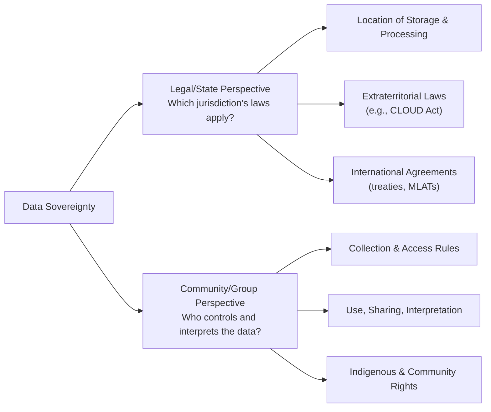

# Defining and Describing Data Sovereignty

_Data sovereignty is about whose laws, rights, and values govern data—not just where the server sits._  

In mainstream IT and cloud governance, **data sovereignty** usually means that digital data is subject to the laws and regulations of the country or jurisdiction in which it is collected, stored, processed, or transmitted. [^qzr0cm] [^34tzk3] [^jfcis6] [^zf7gz9] At the same time, in Indigenous, community, and research contexts, the term also refers to the **right of a group or individual to control, access, and interpret their own data**, including how and by whom it is collected, stored, and used. [^5w91co] These ideas matter because cross‑border cloud services, extraterritorial laws (such as the U.S. CLOUD Act), and historical patterns of data exploitation make it non‑obvious which government—or which community—actually controls a given dataset. [^34tzk3] [^5w91co] As a result, data sovereignty has become a central concept in cloud architecture, compliance strategy, and movements for Indigenous and community control over data. [^qzr0cm] [^34tzk3] [^5w91co] [^4dsj7k]  

When technologists and policymakers advocate for "Data Sovereignty," they're referring to the right of individuals, organizations, or nations to govern their digital data according to their own laws, regulations, and values. This concept encompasses control over how data is collected, stored, processed, shared, and used.

In terms of differences with the status quo (current practices), here are a few key points:

1. **Control and Ownership**: Under current arrangements, large tech companies often have significant control over user data due to their centralized platforms and services. Data Sovereignty shifts this power back towards individuals or nations, giving them more control over their own digital assets.

2. **Data Localization**: The status quo typically involves storing and processing data in the jurisdiction where the tech company is based (often countries with lax privacy laws). Data Sovereignty, on the other hand, often advocates for 'data localization', which means data should be stored within the geographical boundaries of the entity that generates it.

3. **Regulatory Compliance**: Current practices often involve navigating a patchwork of international regulations. With Data Sovereignty, the idea is to have clearer, locally defined rules that entities must adhere to when handling data. This could potentially make compliance simpler and more consistent for organizations operating across borders.

4. **Privacy and Security**: The status quo has often been criticized for prioritizing corporate interests over user privacy and security. Data Sovereignty, especially when implemented by nations, can prioritize these concerns more directly, potentially leading to stronger data protection laws.

5. **Economic Implications**: In the current setup, large tech companies often benefit economically from collecting and using vast amounts of user data. Data Sovereignty could redistribute some of this value by allowing local businesses and nations to leverage their own data, fostering more competitive digital ecosystems.

It's important to note that the implementation of Data Sovereignty can vary widely depending on who is advocating for it (individuals, organizations, or nation-states) and in what context (industry, region, global). It's a complex topic with many facets and potential implications.

# Uses in Context

- **Cloud and jurisdictional compliance:** Security and compliance discussions use *data sovereignty* to describe the need to ensure that “digital data is **subject to the laws of the country where it is located**.”[^jfcis6] Cloud providers frame it as data being “subject to the laws and regulations of its physical location.”[^qzr0cm] [^zf7gz9]  

- **Policy and risk analysis:** Legal and risk guides emphasize that, “although an organization may own the data, its physical storage location determines which nation's legal system has authority over it,” and that sovereignty is “not only about where the data physically resides but about **whose laws govern the data, regardless of location**.”[^34tzk3]  

- **Enterprise governance and architecture:** Corporate governance materials distinguish **data residency** (where data is physically located) from **data sovereignty** (how the laws of that location apply to that data), using the term when discussing architecture choices, regional hosting, encryption key management, and cloud vendor selection. [^qzr0cm] [^34tzk3] [^jfcis6]  

- **Indigenous and community rights:** Libraries, research networks, and Indigenous organizations use *data sovereignty* to mean “a group or individual’s **right to control and maintain their own data**, which includes the collection, storage, and interpretation of data,” with **Indigenous data sovereignty** focusing on the rights of Indigenous peoples over data such as oral traditions, DNA/genomics, and community health data. [^5w91co]  

- **Digital sovereignty and geopolitics:** In broader policy debates, data sovereignty is often treated as one layer of **digital sovereignty**, defined as “the capacity to control your digital destiny: your infrastructure, software, standards and **data, including how they are governed and under which jurisdiction they operate**.”[^4dsj7k] States and regions (notably the EU) invoke data sovereignty when designing regulations that keep critical data under preferred jurisdictions and reduce dependency on foreign cloud providers. [^4dsj7k]  

# History of Use

## Origins

- Early legal and IT usage of *data sovereignty* grew out of concerns about cross‑border data flows and the idea that data should be governed by the **laws of the country where it is collected or stored**, language that now appears in many security and compliance glossaries. [^34tzk3] [^jfcis6] [^zf7gz9] These discussions typically arose in the context of multinational companies, outsourcing, and the rise of data centers in multiple jurisdictions. [^jfcis6] [^zf7gz9]  

- In parallel, research and advocacy networks introduced **Indigenous data sovereignty** as a concept centered on “the ability for Indigenous peoples to control their data” across domains such as oral traditions, genomics, and community health. [^5w91co] This framing situates data sovereignty within wider Indigenous sovereignty and self‑determination movements, emphasizing rights to use and interpret data “in a way that is accurate and appropriate given their circumstances, customs, and communal way of life.”[^5w91co]  

*(Open web sources describe the legal/compliance and Indigenous/community usages clearly but do not pinpoint a single first coining in a specific paper or book; the term appears to have emerged in multiple communities in the 2000s–2010s in response to different but related control and jurisdiction problems. [^34tzk3] [^5w91co] [^jfcis6] [^zf7gz9])*  

## Evolution

- **2010s – Cloud computing and cross‑border regulation:** As public cloud adoption accelerated, organizations began using *data sovereignty* to distinguish between simply knowing where data sits (data residency) and ensuring that operations and legal exposure align with the laws of that place. [^qzr0cm] [^34tzk3] [^jfcis6] [^zf7gz9] Guides from infrastructure providers and security firms in this period frame data sovereignty as a core design constraint for multi‑region architectures and outsourcing contracts. [^qzr0cm] [^34tzk3] [^jfcis6] [^zf7gz9]  

- **2010s–2020s – Indigenous data sovereignty movements:** During the same period, Indigenous and community‑based scholars and activists expanded data sovereignty into a rights‑based framework, arguing that communities represented in data should have authority over its collection, storage, interpretation, and reuse. [^5w91co] This broadened the term from a state‑centered, territorial concept to one that also covers collective and cultural rights, especially in health, genomics, and cultural heritage data. [^5w91co]  

- **Late 2010s–2020s – Integration into digital sovereignty and new regulation:** Policy discussions on **digital sovereignty** in regions like the European Union increasingly treat data sovereignty as one layer of a broader effort to control digital infrastructure, standards, and data flows. [^4dsj7k] Regulatory packages such as the EU’s Data Governance Act and related digital regulations are described as collectively advancing digital and data sovereignty by shaping how data can be stored, shared, and accessed across borders and cloud providers. [^4dsj7k]  

# Best Real-World Examples

- **[Te Mana Raraunga – Māori Data Sovereignty Network](https://www.temanararaunga.maori.nz)** – An Indigenous‑led network advocating that Māori have the right to control Māori data, aligning data governance with Māori values and self‑determination, exemplifying **Indigenous data sovereignty** in practice. [^5w91co]  

- **[Aotearoa / New Zealand Indigenous data guidelines](https://www.nnlm.gov/resources/data/data-glossary/data-sovereignty)** – National and community frameworks that apply Indigenous data sovereignty principles to research, health, and government datasets involving Indigenous peoples, emphasizing community control over collection, storage, and interpretation. [^5w91co]  

- **[Exoscale Sovereign Cloud](https://www.exoscale.com/blog/data-sovereignty/)** – A European cloud provider that positions its infrastructure as supporting data sovereignty by keeping customer data within specific jurisdictions and clarifying how local and foreign laws apply to hosted data. [^rp3l2t]  

- **[Digital Realty colocation and data center services](https://www.digitalrealty.com/resources/blog/what-is-data-sovereignty)** – A global data‑center operator that markets facility location and connectivity choices as tools for customers to meet data sovereignty requirements by selecting where their data is generated, collected, or stored. [^zf7gz9]  

- **[NetApp hybrid multicloud data management](https://www.netapp.com/blog/data-sovereignty-global-compliance-challenges/)** – Storage and data‑management tools used by organizations to separate sensitive “sovereign” data into specific jurisdictions while using multicloud for less regulated workloads, operationalizing data sovereignty through tiered storage and policy‑based automation. [^jfcis6]  

- **[AWS region‑based hosting and governance features](https://aws.amazon.com/what-is/data-sovereignty/)** – Cloud infrastructure offerings where customers can choose storage and processing regions, combined with access controls and encryption mechanisms, to align with the laws and regulations of specific jurisdictions as part of a data sovereignty strategy. [^qzr0cm]  

# Case Studies

**Case Study 1 – Indigenous Data Sovereignty in Research and Health Data**

In Indigenous research and public health projects, communities have documented long histories of external institutions collecting data—such as oral histories, DNA/genomics, and community health statistics—without meaningful control by the people represented. [^5w91co] To address this, Indigenous networks and allied institutions developed **Indigenous data sovereignty** principles stating that Indigenous peoples must be able “to control their data” across “oral traditions, DNA/genomics, community health data, etc.” and maintain rights over “collection, storage, and interpretation of data.”[^5w91co] In practice, this has led to research agreements that vest governance authority in Indigenous bodies, require local review of data use proposals, and restrict secondary use or cross‑border sharing that conflicts with community norms. [^5w91co] This case shows how data sovereignty can be grounded not in state borders but in **collective rights and self‑determination**, redefining who gets to decide how sensitive data is used and interpreted. [^5w91co]  

**Case Study 2 – A Multinational Enterprise Re‑architecting for Jurisdictional Control**

A multinational company operating in both the European Union and the United States discovered that its customer data replicated freely between global cloud regions, exposing EU residents’ data to non‑EU jurisdiction and potential access under foreign laws such as the U.S. CLOUD Act. [^34tzk3] [^jfcis6] Legal and security teams recognized that “digital data is subject to the laws of the country where it is located” and that sovereignty concerns are “not only about where the data physically resides but about whose laws govern the data, regardless of location.”[^34tzk3] [^jfcis6] In response, the firm audited its “data landscape” to map what data it had, where it resided, and how it flowed between regions, then classified datasets by sensitivity to apply differentiated controls. [^jfcis6] It adopted a **hybrid multicloud** model where highly regulated EU personal data is kept in in‑country or EU‑only environments, with policy‑based automation ensuring that data tagged “GDPR” is only transferred to jurisdictions with adequate safeguards. [^jfcis6] This re‑architecture demonstrates how data sovereignty drives concrete design decisions—choosing regions, structuring failover, and managing vendor contracts—to keep sensitive data under a preferred legal regime. [^34tzk3] [^jfcis6] [^zf7gz9]  

**Case Study 3 – A Regional Cloud Provider Competing on Sovereignty Guarantees**

A European cloud provider positions itself explicitly around **sovereign cloud and data sovereignty**, targeting customers who need assurance that their data will remain under European jurisdiction and not be subject to foreign extraterritorial laws. [^rp3l2t] Its services emphasize in‑region data centers, clear statements about where data is stored and processed, and operational controls aligned with local and EU regulatory expectations. [^rp3l2t] Customers use this platform to meet requirements that data “be governed by the rules and regulations in the locale and region where it's generated, collected, or stored,” reducing legal ambiguity compared with using providers whose headquarters or parent companies fall under non‑European laws. [^zf7gz9] [^rp3l2t] This case shows how data sovereignty has become a **market differentiator** where infrastructure design, corporate structure, and transparency around jurisdiction are central to competitive positioning. [^zf7gz9] [^rp3l2t]

***

# Sources

[^qzr0cm]: [What is Data Sovereignty? - AWS](https://aws.amazon.com/what-is/data-sovereignty/)
[^34tzk3]: [What is Data Sovereignty? | Trend Micro](https://www.trendmicro.com/en/what-is/data-sovereignty.html)
[^5w91co]: [Data Sovereignty - NNLM](https://www.nnlm.gov/resources/data/data-glossary/data-sovereignty)
[^4dsj7k]: [What is digital sovereignty and why does it matter? - IE University](https://www.ie.edu/uncover-ie/digital-sovereignty-master-in-public-policy/)
[^jfcis6]: [Data sovereignty: Navigate global compliance challenges - NetApp](https://www.netapp.com/blog/data-sovereignty-global-compliance-challenges/)
[6]: [What Is Data Sovereignty? | Why It Matters More Than Ever in 2025](https://www.youtube.com/watch?v=bFQqTnhJ7UQ)
[^zf7gz9]: [What Is Data Sovereignty? | Digital Realty](https://www.digitalrealty.com/resources/blog/what-is-data-sovereignty)
[^rp3l2t]: [Sovereign Cloud And Data Sovereignty: An Overview – Exoscale Blog](https://www.exoscale.com/blog/data-sovereignty/)
