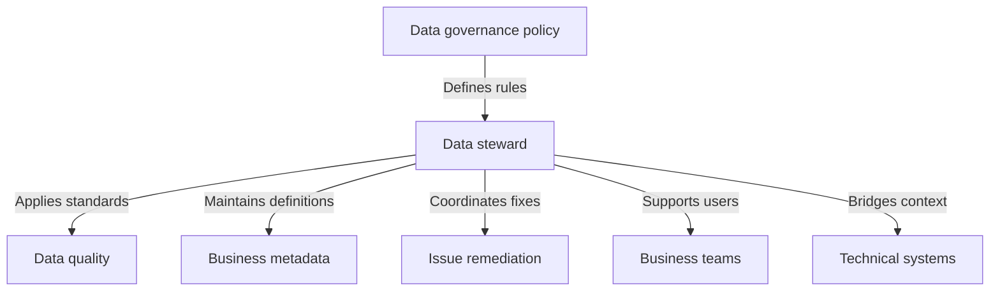

---
aliases:
  - data stewards
date_created: 2025-09-28
date_modified: 2026-08-23
cf_last_run: 2026-08-23T06:49:58.336Z
cf_last_run_model: Perplexity sonar-pro
site_uuid: 0e8ba220-03c7-4649-8160-2d327269bf51
publish: true
title: Data Stewards
slug: data-stewards
at_semantic_version: 0.0.1.1
tags:
  - Lossless-Thinking
  - Lossless-Conventions
  - State-Of-The-Art-Practices
  - Management-Strategies
  - Engineering-Management
  - DataOps
  - Data-Management
  - Enterprise-AI
  - Enterprise-Data-Hubs
  - Data-Governance
---

_“Data stewards” are the people who make data governance real: they translate policy into day-to-day decisions about quality, definitions, access, and accountability._ [^pctww2] [^r6dq6e] [^rkqig6]

Data stewardship is generally described as the operational layer of data governance, with stewards acting as the bridge between business context and technical implementation. [^pctww2] [^r6dq6e] [^rkqig6] In practice, the role matters whenever an organization needs data to be accurate, accessible, consistent, secure, and used responsibly across its lifecycle. [^pctww2] [^r6dq6e] [^yfwa6i]

# Defining and Describing Data Stewards

- 

A data steward is commonly defined as the person, or sometimes a team, accountable for a specific data domain’s quality and governance, often described as the “bridge between business context and technical implementation.” [^r6dq6e] [^8n4lbj] [^l6h5oz] Sources consistently frame stewardship as the tactical or operational execution of governance: governance sets the rules, and stewards implement them in daily work. [^pctww2] [^rkqig6] [^yfwa6i] [^q1rvdw]

# Uses in Context

- In [[Vocabulary/Data Governance|Data Governance]] programs, “data stewardship” refers to the operational work of applying policies, standards, and procedures to real datasets. [^pctww2] [^rkqig6] [^q1rvdw]
- In enterprise data management, a data steward is the “day-to-day custodian” for data quality, definitions, and approved use. [^0qarvi]
- In analytics and reporting, stewards help ensure data is “usable, trusted, and understood” by documenting context such as lineage, ownership, and decision history. [^yfwa6i]
- In compliance and risk management, stewards help enforce access controls, sensitive-data handling, and responsible use. [^r6dq6e] [^rkqig6] [^z43n9n]
- In domain-oriented organizations, stewardship is usually assigned to a specific business area or data domain such as customer, product, or financial data. [^8n4lbj] [^i2mjfr]
- In [[Vocabulary/AI-Ready Data|AI-Ready Data]] governance, stewards are increasingly described as the people who keep data “fit for purpose” for reporting, analytics, and AI. [^t7ih5j] [^z43n9n]

# History of Use

## Origins

The modern term is strongly associated with the rise of data governance and data management as formal enterprise disciplines, where stewardship emerged as the practical role responsible for implementing governance decisions. [^pctww2] [^q1rvdw] Contemporary descriptions do not point to a single originator; instead, they present “data stewardship” as a role that developed within governance frameworks and enterprise data programs. [^pctww2] [^rkqig6] [^q1rvdw]

A recurring formulation in current sources is that stewardship is the “operational arm” of governance or the “tactical execution” layer beneath policy. [^rkqig6] [^yfwa6i] That framing suggests the concept’s earliest widespread use came from practitioners and governance programs rather than from a single inventor or vendor brand. [^pctww2] [^q1rvdw]

## Evolution

- By the mid-2020s, the role had shifted from a narrow data-quality function toward a broader domain role that also covers metadata, lineage, access review, and compliance. [^r6dq6e] [^i2mjfr] [^z43n9n]
- Recent guides increasingly describe stewards as business-facing “bridges” between technical systems and business teams, rather than as purely technical custodians. [^r6dq6e] [^t7ih5j] [^l6h5oz]
- Newer sources also connect stewardship with AI readiness, emphasizing trustworthy, documented, and usable data for downstream automation and model use. [^t7ih5j] [^z43n9n]

# Best Real-World Examples

- [Dawiso](https://www.dawiso.com/glossary/data-stewardship) — presents stewardship as ensuring data is “accurate, accessible, consistent, and used responsibly.” [^r6dq6e]
- [DataVersity](https://www.dataversity.net/data-concepts/what-is-data-stewardship/) — describes stewardship as overseeing data assets so they are “accessible, reliable, and secure.” [^pctww2]
- [Soda](https://soda.io/blog/what-is-data-stewardship) — frames stewardship as the “tactical execution” of governance and emphasizes context, lineage, and ownership. [^yfwa6i]
- [TDWI](https://tdwi.org/blogs/data-101/2026/05/what-is-a-data-steward.aspx) — highlights stewardship as a domain role for customer, product, and financial data. [^i2mjfr]
- [Alation](https://www.alation.com/blog/role-of-data-stewards/) — describes stewards as overseeing subsets of information to ensure quality, integrity, and security. [^l6h5oz]
- [SAP Community](https://community.sap.com/t5/data-professionals-knowledge-base/what-is-a-data-steward/ta-p/14357240) — portrays the steward as a business-facing guardian at the intersection of business and technology. [^t7ih5j]
- [Coursera](https://www.coursera.org/articles/data-stewardship-vs-data-governance) — distinguishes stewardship from governance by defining stewardship as the responsibility for implementing governance procedures. [^q1rvdw]

# Case Studies

One common pattern is the enterprise governance program where policy exists, but no one has clear responsibility for applying it to actual [[Data Domains]]. [^pctww2] [^rkqig6] [^q1rvdw] In that setting, data stewards become the named operators who maintain definitions, monitor quality, and coordinate fixes, turning abstract policy into repeatable daily practice. [^rkqig6] [^0qarvi] [^mfsvj9] This shows the core value of the concept: stewardship closes the gap between governance design and operational reality. [^rkqig6] [^yfwa6i]

A second pattern is the domain-based stewardship model described by TDWI and others, where stewards are assigned to specific business domains such as customer, product, or financial data. [^8n4lbj] [^i2mjfr] That arrangement gives stewards enough subject-matter knowledge to decide what the data means, what “good” looks like, and which issues matter most for the business. [^i2mjfr] [^l6h5oz] This illustrates why the role is usually business-facing rather than purely technical: stewardship depends on context as much as tooling. [^r6dq6e] [^t7ih5j]

A third pattern is the newer AI and analytics context, where sources emphasize trusted, documented, and lineage-aware data as a prerequisite for downstream use. [^yfwa6i] [^t7ih5j] [^z43n9n] In that environment, the steward’s work expands beyond cleaning data to preserving meaning, ensuring traceability, and controlling access so that reporting and AI systems are built on reliable inputs. [^yfwa6i] [^z43n9n] This shows how the role has evolved from basic quality control into a broader trust function for modern data platforms. [^r6dq6e] [^z43n9n]

***

# Sources

[^pctww2]: [What Is Data Stewardship?](https://www.dataversity.net/data-concepts/what-is-data-stewardship/)
[^r6dq6e]: [What Is Data Stewardship?](https://www.dawiso.com/glossary/data-stewardship)
[^rkqig6]: [Data Stewardship in 2026: 5-Part Framework + Roles Guide](https://www.ovaledge.com/blog/data-stewardship-guide)
[^8n4lbj]: [What Is a Data Steward? The Complete Guide for 2026](https://thedatagovernor.com/what-is-a-data-steward-complete-guide-2026/)
[^yfwa6i]: [What is Data Stewardship?](https://soda.io/blog/what-is-data-stewardship)
[^0qarvi]: [What Is Data Steward? Definition & Examples](https://nhimg.org/glossary/data-steward/)
[^i2mjfr]: [What Is a Data Steward? The Role That Makes Data ...](https://tdwi.org/blogs/data-101/2026/05/what-is-a-data-steward.aspx)
[^t7ih5j]: [What is a Data Steward? - SAP Community](https://community.sap.com/t5/data-professionals-knowledge-base/what-is-a-data-steward/ta-p/14357240)
[^mfsvj9]: [What Is a Data Steward? Role, Responsibilities and Stewardship Best Practices | Decube](https://www.decube.io/post/4-best-practices-for-effective-data-stewardship-in-your-organization)
[10]: [Data stewardship: roles, responsibilities, and how to ...](https://mantu.com/blog/data-governance-services/data-stewardship-roles-and-responsibilities)
[^q1rvdw]: [Data Stewardship vs. Data Governance: What's the ...](https://www.coursera.org/articles/data-stewardship-vs-data-governance)
[12]: [Data Stewards: Key to Effective Data Governance](https://www.linkedin.com/posts/egovernancecloud_who-are-data-stewards-and-why-are-they-important-activity-7421932204898918408-FGVj)
[^l6h5oz]: [The Role of Data Stewards Today: Key Responsibilities &](https://www.alation.com/blog/role-of-data-stewards/)
[^z43n9n]: [Data Steward Definition, Role, and Skills Explained](https://www.digna.ai/data-steward-definition)
[15]: [Data Stewardship Roles, Benefits, and Programs](https://www.egnyte.com/guides/governance/data-stewardship-roles-benefits-programs)
