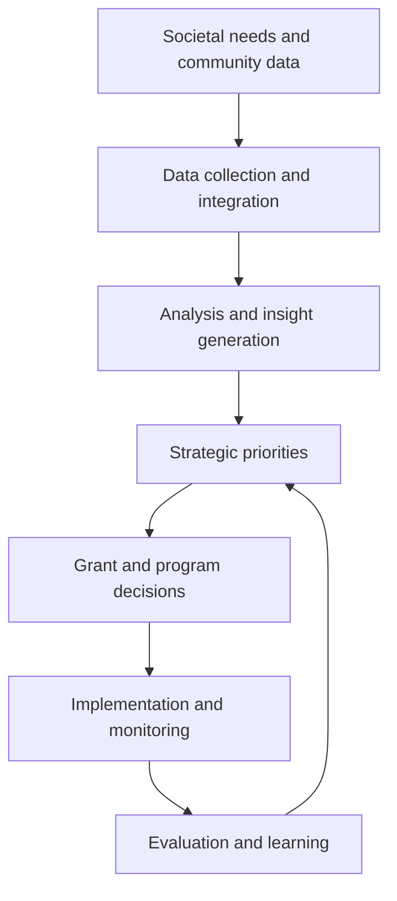

---
for_clients:
  - Reach-U
  - Reach
  - RealSchoolVC
  - The-Water-Foundation
date_created: 2026-06-02
date_modified: 2026-06-13
site_uuid: f9543266-3fc8-4bf5-90c2-69ca340ded24
publish: true
title: Data‑Driven Philanthropy
slug: data-driven-philanthropy
at_semantic_version: 0.0.0.1
cf_last_run: 2026-06-13T01:17:09.512Z
cf_last_run_model: Perplexity sonar-pro
---

[[organizations/Bloomberg Philanthropies|Bloomberg Philanthropies]]
[[organizations/Chan Zuckerberg Initiative|Chan Zuckerberg Initiative]]
[[organizations/Sergey Brin Family Foundation|Sergey Brin Family Foundation]]

# Defining and Describing Data‑Driven Philanthropy

_Data‑driven philanthropy is the practice of using structured evidence—about needs, nonprofits, and outcomes—to decide where, how, and whether to give._

In practice, **data‑driven philanthropy** means foundations, companies, and individual donors rely on systematic data about nonprofits, communities, and program results to guide grantmaking and other forms of giving, rather than relying mainly on intuition, relationships, or tradition.[^33d9bf][^nigj77] It applies wherever philanthropic actors have choices among causes or partners and must allocate limited resources, from corporate giving programs to family foundations to community-based donors.[^nigj77][^2u6x3v] It matters because the nonprofit sector manages billions of philanthropic dollars and operates on thin margins, so better information about “who is doing what, where, and with what results” is a key lever for increasing impact and rebuilding public trust in philanthropy.[^33d9bf][^xga6t4][^2u6x3v]

# Uses in Context

- Practitioners use the term to describe **grantmaking guided by nonprofit and grants databases**—for example, Candid describes its mission as providing “the most comprehensive grants and nonprofit data to help you find funding, research nonprofits, connect with funders, and more,” explicitly positioning better data as the basis for smarter decisions by both funders and nonprofits.[^33d9bf]  
- Policy and sector reports invoke data‑driven philanthropy when discussing **trust and accountability**, noting that only “57% of Americans report high trust in nonprofit organizations,” which prompts calls for more transparent, evidence‑based practice to demonstrate results and steward donor dollars more effectively.[^xga6t4][^2u6x3v]  
- Corporate social responsibility commentators frame “data‑driven corporate philanthropy” as a trend in which companies use employee participation metrics, impact KPIs, and business-aligned outcomes to shape giving strategies, instead of ad‑hoc donations.[^nigj77][^b6nsq1]  
- Technology vendors and industry standards groups talk about it when promoting **shared data schemas** such as the “Common Data Model for Nonprofits,” an open source data model designed to help nonprofits “connect data across fundraising, program delivery, finance, and operations,” thereby enabling more integrated, data‑driven decisions by both nonprofits and their funders.[^7tb646]  
- Large foundations and institutional donors describe their own strategies in these terms when they emphasize **measurement and evaluation**, for example noting commitments to help nonprofits “identify, measure, and scale their impact” as a rationale for building portfolios and partnerships around quantifiable outcomes.[^3eqa9u]  

# History of Use

## Origins

- The underlying idea of using data to improve philanthropy is rooted in early 20th‑century “scientific philanthropy,” when early large foundations sought to apply social science methods and systematic investigation to charitable giving.[^2u6x3v]  
- In the contemporary sector, the modern, infrastructure‑enabled form of data‑driven philanthropy is closely associated with organizations like the Foundation Center and Guidestar—now merged as **Candid**—which provide “grants and nonprofit data” and tools like Foundation Directory to help donors match their giving to documented needs and proven organizations.[^33d9bf][^kpdr3d]  
- These data infrastructure efforts were amplified by specialized research and evaluation groups, which collect comparative information across “350+ funders” and use it to benchmark grantmaking practices and influence the broader field of philanthropy.[^iu4cu9]  

## Evolution

- **1990s–2000s – Emergence of nonprofit and grant data platforms.** The Foundation Center’s databases of foundations and grants and Guidestar’s digitized nonprofit financial filings created, for the first time, widely accessible structured data on U.S. nonprofits, enabling donors to search for grantees by issue, geography, and size.[^33d9bf][^kpdr3d]  
- **2010s – Integration with performance and impact measurement.** Sector commentators and tools began emphasizing not only descriptive data (who and where) but also outcomes and effectiveness, with corporate philanthropy analyses highlighting trends toward “strategic philanthropy” supported by metrics and impact reporting.[^nigj77][^b6nsq1]  
- **2020s – Common data models and trust concerns.** The release and promotion of the **Common Data Model for Nonprofits** by a coalition including Microsoft’s nonprofit initiatives aimed to standardize data across fundraising, programs, and finance, making it easier to share and analyze information across organizations.[^7tb646] At the same time, surveys showing only 57% public trust in nonprofits and ongoing debates about philanthropic legitimacy have intensified calls for data‑driven, transparent practice.[^xga6t4][^2u6x3v]  

# Best Real-World Examples

- [Candid](https://candid.org) — operates extensive databases of nonprofits, funders, and grants that provide the raw material for data‑driven philanthropy, enabling users to “find funding, research nonprofits, [and] connect with funders” using structured data.[^33d9bf][^kpdr3d]  
- [Foundation Directory Online](https://fconline.foundationcenter.org) — a research platform that lets nonprofits and intermediaries analyze historical grantmaking patterns, funder interests, and recipient profiles, turning grant data into actionable intelligence for both grantseekers and donors.[^kpdr3d]  
- [Independent Sector – Trust in Civil Society](https://independentsector.org/resource/trust-in-civil-society/) — produces recurring “Trust in Nonprofits and Philanthropy” reports using survey data (e.g., 57% high trust in nonprofits in 2024–2025) to inform sector strategies and funder communications.[^xga6t4][^2u6x3v]  
- [Common Data Model for Nonprofits](https://learn.microsoft.com/en-us/industry/nonprofit/common-data-model-for-nonprofits) — an open source data schema used by nonprofits and vendors to standardize information about constituents, fundraising, programs, and results, making cross‑system analytics and evidence‑based philanthropy easier.[^7tb646]  
- [Ares Foundation](https://www.ares.com/us/who-we-are/our-impact/philanthropy/foundation) — a corporate foundation that has “committed nearly \$65 million to a global portfolio of organizations” and explicitly supports nonprofits in “identify[ing], measure[ing], and scal[ing] their impact,” illustrating how large donors are adopting measurement‑focused approaches.[^3eqa9u]  
- [Independent Sector / Edelman Data Intelligence – 11 Trends in Philanthropy](https://johnsoncenter.org/wp-content/uploads/2026/01/11-trends-in-philanthropy-for-2026.pdf) — a trend report that uses survey and sector data to highlight how funders are reshaping grantmaking practices, including greater emphasis on impact, trust, and data transparency.[^2u6x3v]  

# Case Studies

## 1. Candid and the Rise of Nonprofit and Grant Data Infrastructure

In the late 20th and early 21st century, nonprofit information in the United States was fragmented across tax filings, printed directories, and individual foundation reports, making it hard for donors to see the big picture of who funded what.[^33d9bf][^kpdr3d] The Foundation Center (focusing on foundations and grants) and Guidestar (focusing on nonprofit organizations and their financial disclosures) each built large digital databases, aggregating and standardizing information about funders, recipients, and grant amounts.[^33d9bf][^kpdr3d] Their merger into **Candid** created a unified platform that “provides the most comprehensive grants and nonprofit data” along with tools like **Foundation Directory**, which lets users search for grants by subject area, geographic focus, and recipient characteristics.[^33d9bf][^kpdr3d] This infrastructure changed philanthropic practice by making it normal for funders and intermediaries to consult systematic data—such as who else funds a given issue, what size grants are typical, and where geographic gaps exist—before allocating resources, a core pattern of data‑driven philanthropy.[^33d9bf][^kpdr3d]  

## 2. Standardizing Nonprofit Data: The Common Data Model for Nonprofits

As nonprofits adopted more digital tools, their data often ended up siloed across separate fundraising, program, and finance systems, limiting their ability to demonstrate impact to donors in a unified way.[^7tb646] In response, sector collaborators including Microsoft’s nonprofit initiatives created the **Common Data Model for Nonprofits**, described as an “open source data schema that includes entities and attributes commonly used by nonprofits,” covering domains such as constituents, fundraising, awards, program delivery, and outcomes.[^7tb646] By giving implementers a shared blueprint for how nonprofit data should be structured, the model enables vendors and organizations to align their systems so that key information—like how funds raised are tied to specific program activities and results—can be analyzed across platforms.[^7tb646] For philanthropic donors, this standardization supports more consistent reporting and cross‑grantee comparisons, making it easier to aggregate evidence about what works and to base grant decisions on comparable data instead of idiosyncratic reports.[^7tb646]  

## 3. Trust, Transparency, and Evidence: Independent Sector’s Trust in Philanthropy Work

Public confidence in philanthropy is a crucial precondition for sustained giving, yet recent survey data from Independent Sector and Edelman Data Intelligence show that only “57% of Americans report high trust in nonprofit organizations,” with similar or lower levels of trust in philanthropy.[^xga6t4][^2u6x3v] Independent Sector’s “Trust in Civil Society” and “11 Trends in Philanthropy for 2026” reports use nationally representative survey data to track changes in trust over time and to identify drivers such as transparency, accountability, and perceived impact.[^xga6t4][^2u6x3v] By quantifying attitudes toward nonprofits and funders—and publishing these findings for sector leaders and donors—the organization encourages philanthropy to respond with more evidence‑based practices, stronger disclosure of results, and clearer explanations of how philanthropic decisions are made.[^xga6t4][^2u6x3v] This relationship between trust data and practice illustrates a feedback loop central to data‑driven philanthropy: measurement (of trust and outcomes) informs strategy, which in turn is evaluated through continued data collection.

***

# Sources

[^3eqa9u]: [Foundation - Ares Management](https://www.ares.com/us/who-we-are/our-impact/philanthropy/foundation)
[^33d9bf]: [Candid: Research nonprofits, funders, and grants](https://candid.org)
[^xga6t4]: [Trust in Nonprofits and Philanthropy 2025 - Independent Sector](https://independentsector.org/resource/trust-in-civil-society/)
[^7tb646]: [Common Data Model for Nonprofits - Microsoft Learn](https://learn.microsoft.com/en-us/industry/nonprofit/common-data-model-for-nonprofits)
[^nigj77]: [10 Trends in Corporate Philanthropy for 2026: How to Tap In](https://doublethedonation.com/trends-in-corporate-philanthropy/)
[^2u6x3v]: [[PDF] 11 Trends in Philanthropy for 2026](https://johnsoncenter.org/wp-content/uploads/2026/01/11-trends-in-philanthropy-for-2026.pdf)
[^iu4cu9]: [️ Fund technical assistance to help nonprofits and ... - Instagram](https://www.instagram.com/p/DY3OiZYEbgA/)
[^b6nsq1]: [How Corporate Philanthropy Shapes Purpose-Driven Businesses](https://www.goodera.com/blog/what-is-corporate-philanthropy)
[^kpdr3d]: [Find Grants for Nonprofits | Foundation Directory | Candid](https://fconline.foundationcenter.org)
