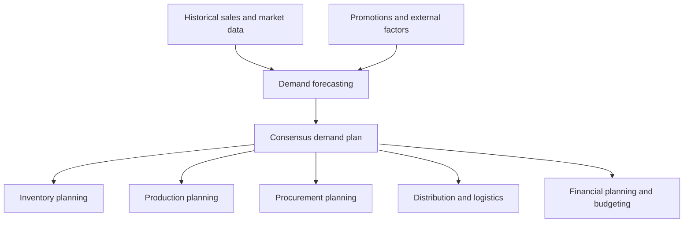

# Defining and Describing Demand Planning

_[Demand planning is about turning a best guess of customer demand into a coordinated plan so you have the right products, in the right place, at the right time—without drowning in excess inventory or missing sales._]

Demand planning is a **continuous, analytics‑driven process** within supply chain management that forecasts future customer demand and translates those forecasts into decisions on inventory, production, procurement, and distribution. [^9uq18k] [^5ctq1f] [^rq9tqd] It typically combines historical sales data, market and promotional information, and external signals (such as economic indicators) to “deliver the right products in the right quantities at the right time.”[^9uq18k] [^fi5ms7] Organizations use demand planning to avoid both overstocking and stockouts, improve service levels, and align sales, marketing, operations, and finance around a common view of future demand. [^9uq18k] [^3lqusj] [^fvtgg5] In modern practice, it is often augmented by advanced statistical models and machine learning to increase accuracy and resilience in the face of volatile markets. [^one90o] [^9uq18k]

# Uses in Context

- In supply chain management, demand planning is defined as “the process of forecasting customer demand so a business can deliver the right products in the right quantities at the right time,” integrating it with inventory, production, and supply decisions. [^9uq18k] [^5ctq1f]  
- Software and consulting providers describe it as a strategic process “focused on predicting future customer demand for products or services” in order to synchronize end‑to‑end supply chains. [^rq9tqd] [^xijf7w]  
- Demand planning is often contrasted with **demand forecasting**, where “demand forecasting provides the insight: a prediction of what customers will want,” while “demand planning turns that insight into action: strategies for procurement, production and inventory.”[^one90o]  
- It is also differentiated from **supply planning**; demand planning “forecasts customer demand and expected sales,” whereas supply planning “ensures inventory and production meet forecasted demand.”[^8zxae0] [^3lqusj]  
- Practitioners use the term in the context of Sales and Operations Planning (S&OP), where “demand planning provides the forecast and supply planning uses that to create a response plan,” with S&OP bridging the two to align with company strategy. [^3lqusj] [^fvtgg5]  
- In industry guidance, the **demand plan or forecast** is described as “a formal request from sales and marketing to the supply chain to make the relevant materials and capacity available at the time that they anticipate the customer will require them.”[^fvtgg5]  

# History of Use

## Origins

- The underlying practice of forecasting demand for production and inventory control dates back to mid‑20th‑century operations research and materials requirements planning (MRP) systems, where demand forecasts were used to drive production schedules and stock levels. [^9uq18k] [^5ctq1f] (This connection is reconstructive, based on how demand planning is described as an evolution of forecasting within supply chain management.)  
- As an explicit term, **“demand planning”** emerged in the 1990s alongside integrated planning processes like Sales and Operations Planning and advanced planning systems, describing a more cross‑functional, process‑oriented approach that put collaborative forecasting at the center of supply chain decisions. [^fvtgg5] [^5ctq1f] [^rq9tqd]  

## Evolution

- **1990s–2000s – From forecasting to integrated process.** Demand planning evolved from a pure forecasting exercise into a structured business process embedded in S&OP, emphasizing cross‑functional collaboration between sales, marketing, supply chain, and finance, with formal accountability for the demand plan. [^3lqusj] [^fvtgg5] [^5ctq1f]  
- **2010s – Analytics and external signals.** Vendors and practitioners began defining demand planning as an “analytics‑driven process” that blends internal data with external signals such as economic indicators and supplier input, and uses statistical models to generate forecasts used across operations, procurement, and production. [^9uq18k] [^xijf7w]  
- **Late 2010s–2020s – AI and machine learning.** Large‑scale data and computing power led to adoption of machine learning, where organizations “leverage AI, machine learning, and external data sources” to improve forecast accuracy and build more resilient demand planning processes. [^9uq18k] [^one90o] [^xijf7w]  

# Best Real-World Examples

- [AGR Inventory](https://www.agrinventory.com/blog/what-is-demand-planning/) – Cloud platform aimed at small and midsize businesses that embeds demand planning to keep “products available in the right quantity, at the right time, and in the right place.”[^fi5ms7]  
- [Datup.ai](https://datup.ai/en/blog/demand-planning-complete-guide) – Startup providing AI‑driven demand planning services that “design and manage the inputs that will be needed in the future to meet demand and meet business objectives.”[^xijf7w]  
- (https://www.reinnovation.eu/post/what-is-demand-planning-forecast-vs-demand-planning-explained) – Independent consultancy that explicitly separates **forecasting** from **demand planning**, using the latter to optimize service and inventory in complex supply chains. [^rq9tqd]  
- [Oliver Wight](https://oliverwight-eame.com/effective-demand-planning/) – Pioneering S&OP and Integrated Business Planning consultancy that treats the demand plan as a formal cross‑functional “request” from commercial teams to the supply chain. [^fvtgg5]  
- [Phase V Fulfillment](https://phasev.com/blog/demand-planning-vs-supply-planning/) – Third‑party logistics provider using demand planning with ecommerce clients to balance inventory and fulfillment capacity against predicted orders. [^8zxae0]  
- [Epicor Demand Planning](https://www.epicor.com/en-us/blog/supply-chain-management/what-is-demand-planning/) – ERP‑embedded planning module for manufacturers and distributors, illustrating how demand planning is integrated into enterprise systems. [^9uq18k]  
- [NetSuite Demand Planning](https://www.netsuite.com/portal/resource/articles/erp/demand-planning.shtml) – Cloud ERP offering where demand planning “predicts future product requirements based on anticipated customer demand” to guide purchasing and production. [^5ctq1f]  

# Case Studies

**1. Ecommerce fulfillment provider refining inventory through demand planning (Phase V).**  
Phase V, a fulfillment provider for ecommerce brands, explains that demand planning in this context means “predicting how much of a product customers will buy in the future” so that inventory and warehouse operations can be aligned. [^8zxae0] They help clients review past sales, market trends, promotions, and seasonal patterns to estimate demand for each SKU. [^8zxae0] By differentiating demand planning (predicting what customers will want) from supply planning (ensuring “your company has enough inventory, materials, and production capacity to meet the expected demand”), they use forecasts to set inventory targets and timing for inbound stock. [^8zxae0] This approach demonstrates how even relatively small online retailers can reduce stockouts and overstock by formalizing demand planning rather than relying on ad‑hoc ordering. [^8zxae0]  

**2. Integrated business planning consultancy formalizing the demand plan (Oliver Wight).**  
Oliver Wight, known for advancing S&OP and Integrated Business Planning, describes the **demand plan or forecast** as “a formal request from sales and marketing to the supply chain to make the relevant materials and capacity available at the time that they anticipate the customer will require them.”[^fvtgg5] In their methodology, sales and marketing become accountable for the forecast, while supply chain operations “only have authority to make product if there is a formal request” via this demand plan. [^fvtgg5] They emphasize measuring forecast accuracy at the **cumulative lead time** by saving the forecast at a defined “time fence” (for example, 13 weeks before the month being planned) and comparing it to actuals to drive improvement. [^fvtgg5] This case illustrates demand planning as a governance and accountability mechanism, not just a technical forecasting task, and shows how linking it to lead times and accuracy metrics supports better service and inventory decisions. [^fvtgg5]  

**3. AI‑enabled demand planning for resilient supply chains ([[Datup.ai]] and modern platforms).**  
Datup.ai presents demand planning as “the process of designing and managing the inputs that will be needed in the future to meet demand and meet business objectives,” highlighting how advanced analytics can ingest large volumes of sales history and external drivers to generate more granular forecasts. [^xijf7w] In parallel, Epicor cites IBM’s definition of demand planning as a continuous process where organizations “leverage AI, machine learning, and external data sources” to build more resilient supply chains. [^9uq18k] These platforms typically gather internal data from sales, marketing, and inventory systems, integrate external indicators, and apply statistical or AI models to generate forecasts, which are then fed into operations, procurement, and production plans. [^9uq18k] [^xijf7w] This case shows how smaller vendors and ERP adopters are using AI‑powered demand planning not merely to predict volumes but to scenario‑plan around volatility, seasonality, and promotions, supporting higher service levels with less safety stock. [^9uq18k] [^xijf7w]

***

# Sources

[^8zxae0]: [Demand Planning vs Supply Planning: Definition and Strategies](https://phasev.com/blog/demand-planning-vs-supply-planning/)
[^one90o]: [Demand Planning vs. Demand Forecasting: Key Differences ...](https://www.e2open.com/blog/demand-planning-vs-demand-forecasting)
[^9uq18k]: [What Is Demand Planning? How to Forecast Smarter in 2025 | Epicor](https://www.epicor.com/en-us/blog/supply-chain-management/what-is-demand-planning/)
[^3lqusj]: [Demand Planning VS Supply Planning | S & OP - YouTube](https://www.youtube.com/watch?v=oGFsosR2JBA)
[^fvtgg5]: [Effective Demand Planning - Oliver Wight EAME](https://oliverwight-eame.com/effective-demand-planning/)
[^5ctq1f]: [What Is Demand Planning? What It Is and Why It's Important - NetSuite](https://www.netsuite.com/portal/resource/articles/erp/demand-planning.shtml)
[^fi5ms7]: [What Is Demand Planning? | AGR Inventory](https://www.agrinventory.com/blog/what-is-demand-planning/)
[^rq9tqd]: [What is Demand Planning? Forecasting vs. Demand ... - re:innovation](https://www.reinnovation.eu/post/what-is-demand-planning-forecast-vs-demand-planning-explained)
[^xijf7w]: [Demand Planning: Guide for Supply Chain 2025 - Datup.ai](https://datup.ai/en/blog/demand-planning-complete-guide)
