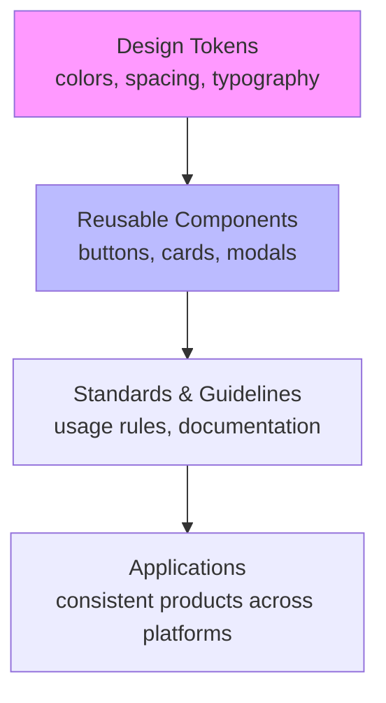

# Defining and Describing Design Systems

*_Design systems are centralized collections of reusable components, design tokens, and guidelines that ensure consistent, scalable design across products and teams.* [^z65dyl] [^t3baak]

A design system is "a collection of reusable components, guided by clear standards, that can be assembled to build applications." [^z65dyl]

Design tokens serve as "the foundational building blocks—the visual design atoms like colors, spacing, and typography that power your design system," enabling platform-agnostic consistency across CSS, iOS, Android, and more. [^z65dyl]
They matter for ensuring consistency, speeding workflows, creating shared design-engineering language, easing updates, and scaling across teams. [^z65dyl] [^t3baak]

# Uses in Context
- In product development, design systems "ensure consistency across products and platforms" by providing reusable UI building blocks. [^z65dyl]
- Teams use them to "speed up design and development workflows" and achieve "135% ROI across design and engineering costs." [^t3baak]
- As a "shared language between design and engineering," they unify brand-approved assets, patterns, and rules across channels. [^z65dyl] [^t3baak]
- In scaling enterprises, they combat "design chaos" like off-brand visuals and inconsistent UX, with designers completing tasks "34% faster." [^t3baak]
- For multi-platform work, design tokens are "named entities that store visual design attributes" generating code for web, iOS, Android. [^z65dyl]
- In team growth scenarios, they address "systems problems" like multiple component versions and lack of ownership. [^eb43mb]

# History of Use

## Origins
The formalized concept of design systems emerged from indie design practitioners and startups in the 2010s, building on earlier pattern library ideas, though search results emphasize practical guides over a single originating paper or post. [^z65dyl]
Key early framing appears in resources like Design.dev's guide, defining it as "a complete guide to building scalable design systems with design tokens," reflecting practitioner-driven origins in scalable UI consistency. [^z65dyl]

## Evolution
- **2010s**: Pattern libraries evolved into full design systems with tokens, as startups prioritized reusable components amid rapid scaling. [^z65dyl] [^t3baak]
- **2020s**: Focus shifted to resilience and multi-brand architectures, with guides on "designing beyond the happy path" covering edge states and inclusive interactions. [^mh7pai]
- **2026**: Emphasis on enterprise ROI and efficiency, noting design systems as "strategic assets" cutting duplication in distributed teams. [^t3baak]

# Best Real-World Examples
- [Design.dev](https://design.dev/guides/design-systems/) guide showcasing token-based systems for cross-platform consistency. [^z65dyl]
- [Zeroheight](https://zeroheight.com/blog/designing-beyond-the-happy-path-in-design-systems/) platform for resilient design systems with checklists for technical states and user preferences. [^mh7pai]
- [Superside](https://www.superside.com/blog/design-systems-examples) highlighting 9 examples for 2026 scaling, stressing governance and adoption. [^t3baak]
- [Harvey.ai](https://www.harvey.ai/blog/rebuilding-harveys-design-system-from-the-ground-up) re-architecture for faster teams amid product expansion. [^eb43mb]
- [Design Systems Collective](https://www.designsystemscollective.com/choosing-the-right-architecture-for-your-multi-brand-design-system-ff8195cba088) on monolithic vs. federated architectures using tokens for brand diversity. [^6fwfqt]

# Case Studies
[[Tooling/AI-Toolkit/AI Interfaces/AI Workspaces/Vertical Wrappers/Harvey AI|Harvey AI]], a startup scaling AI products, rebuilt their design system in early 2026 when "product complexity was growing faster than our design infrastructure could support." [^eb43mb] Facing expansion into new pillars, growing Design and Engineering teams, and diverse surfaces, they dealt with "multiple versions of the same component" and no clear ownership. [^eb43mb] The EPD team re-architected for quality consistency, establishing contribution processes that accelerated shipping without sacrificing standards, demonstrating how design systems solve "systems problems" slowing entire organizations. [^eb43mb] This shows design systems as essential infrastructure for startups outpacing ad-hoc design in high-growth phases.

[[Tooling/Software Development/Developer Experience/DevOps/Documentation Engines/ZeroHeight|ZeroHeight]]'s approach, via designer [[Sources/People/Stéphanie Walter|Stéphanie Walter]]'s 2020s checklist, evolved design systems "beyond the happy path" to include technical states, layouts, inclusive interactions, and user preferences. [^mh7pai] This practitioner-led framework addressed common pitfalls in early systems, enabling resilient documentation and delivery tools that automate workflows and measure adoption. [^mh7pai] By prioritizing visual, searchable docs aligned with code, it proved how indie-focused evolutions make systems usable across distributed teams, countering abandonment risks. [^mh7pai] [^t3baak]

Superside's 2026 analysis of design systems as "the antidote" to chaos framed them as "centralized collections of brand-approved assets, reusable UI components, design patterns, documentation and rules." [^t3baak] Drawing from Figma data, it highlighted "34% faster task completion" and ROI, with success tied to "clear ownership, usable components, strong documentation and real adoption." [^t3baak] Starting small and evolving via feedback, this startup perspective underscores design systems' role in protecting brand equity at scale for creative teams. [^t3baak]

***

# Sources

[^z65dyl]: [Design Systems & Tokens Guide - Design.dev](https://design.dev/guides/design-systems/)
[2]: [Entity-Component-System (ECS) | Meta Horizon OS Developers](https://developers.meta.com/horizon/documentation/spatial-sdk/spatial-sdk-ecs/)
[3]: [System Design Introduction - LLD & HLD - GeeksforGeeks](https://www.geeksforgeeks.org/system-design/getting-started-with-system-design/)
[^mh7pai]: [Designing beyond the happy path in design systems - Zeroheight](https://zeroheight.com/blog/designing-beyond-the-happy-path-in-design-systems/)
[^t3baak]: [9 New Design System Examples to Scale Brands in 2026](https://www.superside.com/blog/design-systems-examples)
[^eb43mb]: [Rebuilding :Harvey:'s Design System From the Ground Up](https://www.harvey.ai/blog/rebuilding-harveys-design-system-from-the-ground-up)
[^6fwfqt]: [Choosing the right architecture for your Multi-Brand Design System](https://www.designsystemscollective.com/choosing-the-right-architecture-for-your-multi-brand-design-system-ff8195cba088)
