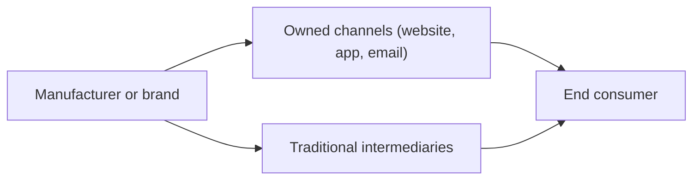

---
aliases:
  - DTC
  - direct-to-consumer
  - D2C
date_created: 2026-06-03
date_modified: 2026-06-03
cf_last_run: "2026-06-03T07:38:08.249Z"
cf_last_run_model: "Perplexity sonar-pro"
for_clients:
  - Parslee
  - Param
  - Reach-U
tags: [GTM-Strategies, Management-Strategies, Market-Maps, Investment-Categories]
site_uuid: d7c7ce54-2d0e-456d-b12d-6646e33159c8
publish: true
title: Direct‑to‑Consumer
slug: direct-to-consumer
at_semantic_version: 0.0.1.1
---

# Defining and Describing Direct‑to‑Consumer

_“Direct‑to‑consumer” describes businesses that sell or market straight to end users, cutting out traditional intermediaries like wholesalers, distributors, or retailers._

In contemporary business, **direct‑to‑consumer (DTC or D2C)** usually refers to brands that own the relationship with the end customer and transact with them directly, often via e‑commerce, rather than primarily through third‑party retail channels. [^udnz10] It is also used in regulated contexts such as **direct‑to‑consumer prescription drug advertising**, where pharmaceutical manufacturers promote medications directly to patients through media, bypassing healthcare professionals as gatekeepers in the marketing chain (though not in the prescribing chain). [^aka9mc] The concept matters because it shifts who controls pricing, data, branding, and customer relationships, and has become central to digital‑first commerce models and policy debates around advertising and consumer protection. [^aka9mc] [^udnz10]

If we focus on DTC as a **go‑to‑market structure**, the value chain can be summarized as:

Here, DTC emphasizes the **A → B → C** path, minimizing or bypassing **D**.

---

## Uses in Context

- In **e‑commerce and retail strategy**, “direct‑to‑consumer” or “D2C” describes brands that “sell their products directly to consumers, bypassing third‑party retailers, wholesalers, or other middlemen,” typically via their own online stores. [^udnz10]

- In **market size and forecasting**, analysts talk about the “D2C e‑commerce market” as a distinct segment; for example, the U.S. D2C e‑commerce market was estimated to be worth nearly 200 billion U.S. dollars in 2024, highlighting DTC as a measurable economic category. [^udnz10]

- In **pharmaceutical regulation and policy**, “direct‑to‑consumer advertising” (DTC advertising) refers to “any promotional communication targeting consumers, including through television, radio, print media, digital platforms, and social media, for purposes of marketing such a drug,” as defined in proposed U.S. legislation. [^aka9mc]

- In **privacy and data regulation**, lawmakers and regulators sometimes distinguish businesses that have a “direct relationship with a consumer” (e.g., online services that collect data directly from users) from those that operate via intermediaries, using the phrase to clarify obligations under laws like the California Consumer Privacy Act. [^v57acr]

- In **marketing and identity data practices**, DTC brands rely heavily on techniques like identity resolution to connect “consumer data from a variety of sources to an individual or household,” which allows them to personalize marketing across their own direct channels without depending on retailer‑controlled data. [^sw6ces]

---

## History of Use

### Origins

- The **business/retail sense** of “direct‑to‑consumer” grew out of earlier **mail‑order and catalog** models in the 19th and 20th centuries, where manufacturers and merchants used postal catalogs to sell straight to households without physical retail intermediaries. [^udnz10] While those earlier businesses were not always labeled “DTC” at the time, contemporary analysts identify them as predecessors of modern D2C e‑commerce. [^udnz10]

- The term “direct‑to‑consumer advertising” gained prominence in the **pharmaceutical industry in the late 20th century**, especially in the United States when the Food and Drug Administration relaxed certain broadcast advertising rules in the 1990s, allowing manufacturers to promote prescription drugs directly to consumers via mass media. [^aka9mc] Legal and policy analyses now consistently use “direct‑to‑consumer (DTC) advertising” as a formal category in discussing such promotions. [^aka9mc]

### Evolution

- **1990s–2000s (Pharma advertising liberalization):** As U.S. regulators clarified guidelines, pharmaceutical companies increasingly invested in DTC advertising, making “ask your doctor” TV commercials a commonplace example of direct‑to‑consumer messaging and sparking debates over its influence on prescribing and healthcare costs. [^aka9mc]

- **2010s (Digital‑native brands and D2C e‑commerce):** The rise of internet retail and social media enabled brands to launch as **digital‑native direct‑to‑consumer companies**, building their own websites and subscription models instead of relying on traditional retail, leading analysts to track “D2C e‑commerce” as a distinct market. [^udnz10]

- **2020s (Data, privacy, and regulatory focus):** Growth of DTC channels has coincided with stronger privacy laws; regulations like the California Consumer Privacy Act explicitly call out businesses with a “direct relationship with a consumer from whom [they collect] personal information,” shaping how DTC firms manage consent, data sharing, and advertising. [^v57acr] At the same time, proposed laws like the End Prescription Drug Ads Now Act seek to prohibit direct‑to‑consumer advertising of certain prescription drugs, underscoring ongoing policy scrutiny. [^aka9mc]

---

## Best Real‑World Examples

- **[Warby Parker](https://www.warbyparker.com/)** – Often cited as a modern DTC pioneer in eyewear, selling glasses directly through its website and branded stores instead of relying primarily on third‑party optical retailers, exemplifying the D2C e‑commerce model tracked in market statistics. [^udnz10]

- **[Dollar Shave Club](https://www.dollarshaveclub.com/)** – A subscription razor and grooming brand that built its business on direct online subscriptions rather than traditional retail shelf space, fitting the pattern of digital‑native DTC brands contributing to the D2C e‑commerce segment. [^udnz10]

- **[Glossier](https://www.glossier.com/)** – A beauty brand that started online and focused on selling directly through its own website and limited physical spaces, using direct relationships and community feedback instead of department‑store distribution, aligning with D2C market dynamics. [^udnz10]

- **[Peloton](https://www.onepeloton.com/)** – Sells fitness equipment and subscriptions directly to consumers via its website and showrooms, bundling hardware and digital services in a controlled DTC ecosystem, rather than relying on third‑party sporting goods retailers. [^udnz10]

- **[Pfizer – DTC drug campaigns](https://www.pfizer.com/)** – While not the originator of the concept, Pfizer and other major pharmaceutical firms are frequently discussed in legal and policy analyses as users of “direct‑to‑consumer advertising” to promote prescription drugs through television and digital media. [^aka9mc]

- **[Identity‑driven DTC marketers using LiveRamp](https://liveramp.com/blog/what-is-identity-resolution)** – Brands that implement identity resolution platforms to “connect consumer data from a variety of sources to an individual or household” illustrate how DTC companies operationalize consumer data to personalize direct marketing at scale. [^sw6ces]

---

## Case Studies

### Case Study 1: Digital‑Native DTC E‑commerce and Market Growth

In the 2010s, a wave of digital‑first brands in categories like apparel, eyewear, personal care, and home goods began to sidestep traditional retail channels and sell directly to consumers via their own websites and apps. [^udnz10] Analysts grouped these into the “D2C e‑commerce market,” which in the United States was estimated to approach nearly 200 billion U.S. dollars in value by 2024. [^udnz10] This growth shows how the direct‑to‑consumer model allows relatively young companies to compete with incumbents by owning customer data, customer service, and pricing, while using online advertising and social media to reach audiences without relying on big‑box retailers. [^udnz10] [^sw6ces] It also illustrates why data practices such as identity resolution—linking customer interactions across devices and channels to a single individual or household—have become strategically important to DTC brands seeking to personalize and optimize their marketing. [^sw6ces]

### Case Study 2: Direct‑to‑Consumer Prescription Drug Advertising and Regulatory Pushback

In U.S. healthcare, pharmaceutical manufacturers have used direct‑to‑consumer advertising to promote prescription drugs and biologics through television, radio, print, and digital media, targeting patients directly rather than only informing healthcare professionals. [^aka9mc] Legal analyses explain that proposed legislation such as the End Prescription Drug Ads Now Act would amend the Federal Food, Drug, and Cosmetic Act to **prohibit direct‑to‑consumer advertising of approved prescription pharmaceuticals and biologics**, defining DTC advertising as “any promotional communication targeting consumers, including through television, radio, print media, digital platforms, and social media, for purposes of marketing such a drug.”[^aka9mc] Sponsors argue this would “align the United States with virtually every other country on earth by establishing a ban on direct-to-consumer prescription advertising,” reflecting concerns about how such marketing may affect demand, prescribing, and healthcare spending. [^aka9mc] This case shows how the same direct‑to‑consumer concept that empowers brands in retail can, in a regulated sector like pharmaceuticals, raise questions about consumer protection, information quality, and the appropriate limits of marketing.

### Case Study 3: Direct Relationships, Privacy Law, and Online‑Only Businesses

Modern privacy regulations distinguish businesses that collect data via intermediaries from those that interact and collect data directly from consumers. Guidance on the California Consumer Privacy Act notes that a “business that operates exclusively online and has a direct relationship with a consumer from whom it collects personal information” faces specific requirements but is only obligated to provide certain mechanisms, like an email address, for consumer requests, instead of multiple offline methods. [^v57acr] This carve‑out underscores that the law recognizes a class of **online‑only, direct‑to‑consumer operators** whose customer interactions and data flows are more straightforward than those of complex, multi‑channel enterprises. [^v57acr] For such DTC businesses, the direct nature of the relationship simplifies some compliance logistics but also concentrates responsibility because they alone control how personal information is collected, used, and shared. [^v57acr]

***

# Sources

[1]: [Real-Time Customer Profile Overview | Adobe Experience Platform](https://experienceleague.adobe.com/en/docs/experience-platform/profile/home)
[^aka9mc]: [Senators Introduce Legislation to Restrict Direct-to-Consumer Drug ...](https://www.lw.com/en/insights/senators-introduce-legislation-to-restrict-direct-to-consumer-drug-advertising)
[^udnz10]: [D2C e-commerce in the United States - statistics and facts - Statista](https://www.statista.com/topics/12158/d2c-e-commerce-in-the-united-states/)
[^sw6ces]: [Identity Resolution: What It Is, How It Works, Why It Matters | LiveRamp](https://liveramp.com/blog/what-is-identity-resolution)
[^v57acr]: [Navigating the California Consumer Privacy Act: 30+ Essential FAQs ...](https://www.jacksonlewis.com/insights/navigating-california-consumer-privacy-act-30-essential-faqs-covered-businesses-including-clarifying-regulations-effective-1126)
[6]: [Depository Trust Company Member Directories - DTCC](https://www.dtcc.com/client-center/dtc-directories)
[7]: [How to identify your ideal customer profile (ICP) - Planio](https://plan.io/blog/identify-your-ideal-customer-profile/)
