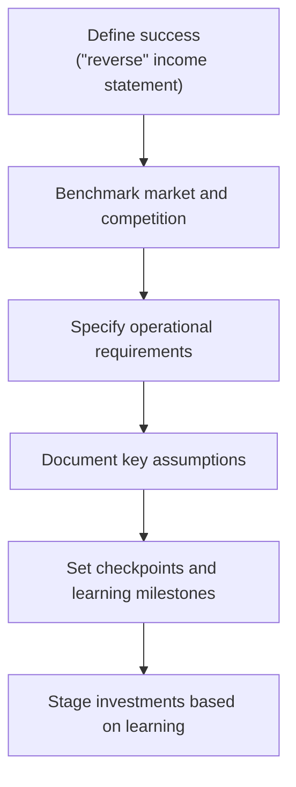

# Defining and Describing Discovery-Driven Planning

_Instead of betting on a detailed forecast, discovery‑driven planning treats a new venture as a series of cheap tests that systematically turn risky assumptions into hard facts._

**Discovery‑driven planning** is a planning technique for high‑uncertainty initiatives that starts not from detailed predictions, but from clearly defining what success would look like and then working backward through explicit assumptions, milestones, and learning steps. [^e53av5] It was first introduced by strategy scholars **Rita Gunther McGrath** and **Ian C. MacMillan** in a 1995 *Harvard Business Review* article as a way to “plan” highly uncertain new ventures with the discipline of traditional planning but the flexibility of experimentation. [^e53av5] The approach is most relevant for new products, new business models, and innovation projects where reliable historical data is scarce and the biggest risks lie in unknown customer, technical, or economic assumptions. [^e53av5] It matters because it helps organizations avoid large, one‑shot bets and instead structure investment so that **resources are committed incrementally as learning reduces uncertainty and invalid assumptions are surfaced early**. [^e53av5]

A discovery‑driven plan is typically built around five main disciplines or elements: [^e53av5]

1. **Definition of success**, including a **“reverse” income statement** that specifies the profit and performance outcomes required for the initiative to be worthwhile, then works backward to what would have to be true to achieve them. [^e53av5]  
2. **Benchmarking against market and competitive parameters**, to anchor assumptions in external realities such as prices, market size, and competitor performance. [^e53av5]  
3. **Specification of operational requirements**, detailing what capabilities, processes, and resources will be needed if the initiative scales. [^e53av5]  
4. **Documentation of assumptions**, making explicit the many uncertain beliefs that would otherwise be left implicit in a traditional business plan. [^e53av5]  
5. **Specification of key checkpoints**, where progress, learning, and new information are reviewed to decide whether to continue, pivot, or stop. [^e53av5]  

When applied rigorously, discovery‑driven planning “keeps you experimental and adaptive,” emphasizing staged commitments, fast learning, and disciplined stopping rules over static, up‑front plans. [^botz5i]

# Uses in Context

- Strategy writers describe **discovery‑driven planning** as a classic that “keeps you experimental and adaptive,” advising leaders to “score projects for risk as well as value” and explicitly differentiate between “assumptions and knowledge.”[^botz5i]  
- In innovation and venture building, practitioners present it as “one of the original foundations of systematic innovation,” using it to structure growth initiatives so that they move from “big, vague ideas” into sequenced experiments and milestones. [^f76ip9]  
- In management education and executive training, McGrath’s refresher pieces in *Harvard Business Review* reintroduce managers to the method as a way to “plan for learning” in uncertain markets rather than rely on “false precision” in financial forecasts. [^e53av5] [^cg2dmq]  
- In discussions of *[[Sources/Books/The Innovator's Dilemma|The Innovator's Dilemma]]*, educators and consultants use discovery‑driven planning to operationalize how incumbents can explore disruptive opportunities with “small, low‑cost bets” instead of large, rigid projects. [^9lc7a2]  
- Corporate strategy blogs and decision‑support vendors reference discovery‑driven planning as a complementary discipline to portfolio prioritization, recommending that risky projects incorporate “assumption logs” and “stage‑gate checkpoints” aligned with discovery‑driven principles. [^botz5i]  

# History of Use

## Origins

- The term **“discovery‑driven planning”** was first introduced by **Rita Gunther McGrath** and **Ian C. MacMillan** in their 1995 article “Discovery‑Driven Planning” in *[[Sources/Media/Harvard Business Review|Harvard Business Review]]*. [^e53av5]  
- McGrath and MacMillan coined the concept in the context of **new venture and corporate entrepreneurship projects**, arguing that conventional planning tools—developed for relatively predictable, stable environments—were ill‑suited to initiatives “where little is known and less is certain.”[^e53av5]  
- The original article set out both the **five disciplines of discovery‑driven planning** and practical tools such as the reverse income statement and staged resource commitments, explicitly contrasting this with traditional ROI‑based capital budgeting. [^e53av5]  

## Evolution

- **1990s–early 2000s – Integration into corporate entrepreneurship and growth frameworks.** McGrath and MacMillan expanded the ideas from the 1995 article into broader work on entrepreneurial strategy and corporate venturing, emphasizing discovery‑driven approaches as core to managing high‑uncertainty growth. [^e53av5]  
- **2009 – “Discovery‑Driven Growth”.** McGrath and MacMillan published the book *Discovery‑Driven Growth*, which extended the planning concept into a full growth framework, positioning discovery‑driven disciplines as a systematic way for companies to identify, test, and scale new businesses. [^f76ip9]  
- **2010s – Refresher and re‑application.** In 2017, *Harvard Business Review* published “A Refresher on Discovery‑Driven Planning” by McGrath, re‑introducing the framework to a new generation of managers grappling with digital disruption and emphasizing its relevance for today’s rapidly changing markets. [^cg2dmq]  
- **Ongoing – Adoption in innovation, lean, and strategy toolkits.** Strategy and innovation educators increasingly reference discovery‑driven planning alongside lean startup and experimentation‑driven methods, positioning it as a complementary, finance‑savvy discipline for dealing with uncertainty. [^9lc7a2] [^botz5i]  

# Best Real-World Examples

- **[Clayton Christensen Institute](https://www.christenseninstitute.org)** – Uses discovery‑driven planning concepts in teaching how incumbents can explore disruptive innovations through staged, learning‑oriented investments, including in discussions of *[[Sources/Books/The Innovator's Dilemma|The Innovator's Dilemma]]*. [^9lc7a2]  
- **[Cameron & Associates](https://www.cameronusa.com/works/discovery-driven-growth-interview)** – A consulting firm applying discovery‑driven growth and planning to help clients build new ventures using systematic experimentation and checkpoints. [^f76ip9]  
- **[Harvard Business Review executive education](https://www.ritamcgrath.com/press/)** – Incorporates discovery‑driven planning into courses and articles that train managers to manage high‑uncertainty projects via explicit assumptions and reverse income statements. [^e53av5] [^cg2dmq]  
- **[TransparentChoice](https://www.transparentchoice.com/blog/10-strategy-classics-every-leader-should-know)** – A strategy decision‑support tool that highlights discovery‑driven planning as a “strategy classic,” recommending that leaders integrate its risk and assumption focus into project prioritization. [^botz5i]  
- **[Rita McGrath’s advisory practice](https://www.ritamcgrath.com/press/)** – McGrath’s own speaking and consulting work frequently uses discovery‑driven planning with corporate clients to shape innovation portfolios and de‑risk strategic bets. [^cg2dmq]  
- **[University and MBA programs using McGrath/MacMillan materials](https://en.wikipedia.org/wiki/Discovery-driven_planning)** – Business schools adopt the original HBR article and related cases to teach planning under uncertainty, often having students build discovery‑driven plans as coursework. [^e53av5]  

# Case Studies

**1. Applying discovery‑driven planning to disruptive opportunities (Christensen teaching context)**  
In teaching the dynamics of [[Vocabulary/Disruptive Innovation|Disruptive Innovation]], educators affiliated with the legacy of [[Sources/People/Clayton Christensen|Clayton Christensen]] often emphasize that incumbents cannot rely on traditional forecasting when exploring new, uncertain markets. [^9lc7a2] In these contexts, they introduce discovery‑driven planning as a practical way for managers to structure disruptive experiments: define what success would look like in a new market, make explicit the assumptions about customers, costs, and volumes, and then commit resources in small stages while testing those assumptions. [^9lc7a2] [^e53av5] This approach shows how discovery‑driven planning complements the theory of disruption by giving incumbents a **process** to explore new business models without committing full‑scale resources before the opportunity is understood. [^9lc7a2] [^e53av5] It illustrates the concept’s core strength: avoiding “big bet” failures by forcing learning and decision checkpoints into the heart of the planning process. [^e53av5]  

**2. Consulting practice using discovery‑driven growth and planning (Cameron & Associates)**  
Innovation‑focused consultancies such as Cameron & Associates highlight discovery‑driven growth, grounded in discovery‑driven planning, as “one of the original foundations of systematic innovation.”[^f76ip9] In interviews about their work with clients, they describe helping companies take ambitious growth ideas and convert them into discovery‑driven plans that specify desired outcomes, key assumptions, operational requirements, and staged checkpoints, rather than large, fixed five‑year plans. [^f76ip9] [^e53av5] As clients move through these plans, investment is released only when assumptions are validated at each checkpoint, allowing them to shut down or pivot struggling initiatives before they consume excessive resources. [^e53av5] [^f76ip9] This case demonstrates how discovery‑driven planning can be embedded in consulting engagements as a **repeatable discipline** for venture building, especially in organizations that historically favored big, up‑front commitments.  

**3. Strategy tooling and portfolio decision‑making (TransparentChoice and similar tools)**  
Vendors of strategy and portfolio‑management tools, such as TransparentChoice, explicitly reference discovery‑driven planning when advising leaders on how to choose and manage strategic projects. [^botz5i] They recommend that project portfolios not only be scored on expected value but also on **risk and the number of untested assumptions**, encouraging users to adopt discovery‑driven practices such as identifying the riskiest assumptions and planning early experiments to test them. [^botz5i] [^e53av5] By integrating these ideas, such tools help organizations move from static business cases to living, discovery‑driven plans that evolve as assumptions are confirmed or disproven. [^botz5i] This case shows how discovery‑driven planning is being operationalized in everyday decision‑making infrastructure, extending its reach beyond academic articles into the practical mechanisms by which organizations allocate capital and attention.

***

# Sources

[^e53av5]: [Discovery-driven planning - Wikipedia](https://en.wikipedia.org/wiki/Discovery-driven_planning)
[2]: [Strategic Planning Framework Opens Next Phase of Member-Driven ...](https://www.crl.edu/strategic-planning-framework-opens-next-phase-member-driven-planning-crl)
[^9lc7a2]: [Discovery-Driven Planning with Rita Gunther McGrath The Clayton ...](https://www.youtube.com/watch?v=_rnC3-IqDYI)
[^f76ip9]: [Discovery Driven Planning w/Ron Pierantozzi - My Framer Site](https://www.cameronusa.com/works/discovery-driven-growth-interview)
[5]: [Discovery Driven Planning PART 1 - YouTube](https://www.youtube.com/watch?v=InQX0KndIJ0)
[^botz5i]: [10 Strategy Classics Every Leader Should Know (and why they still ...](https://www.transparentchoice.com/blog/10-strategy-classics-every-leader-should-know)
[^cg2dmq]: [Press - Rita McGrath](https://www.ritamcgrath.com/press/)
