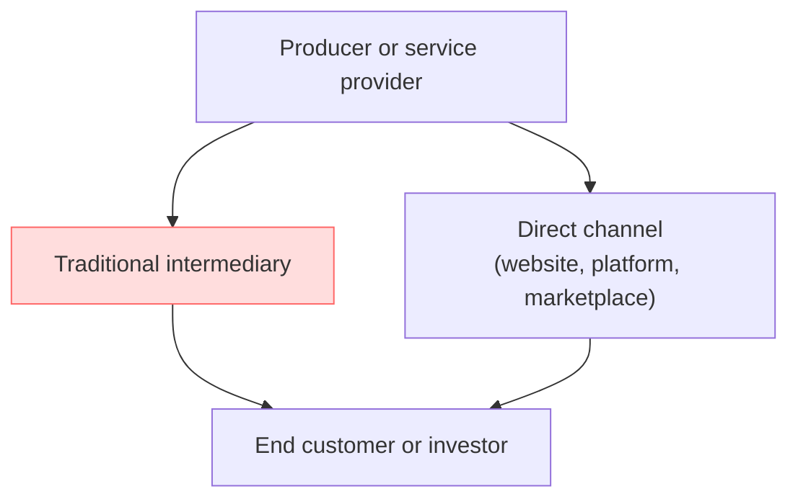

# Defining and Describing Disintermediation

_*Disintermediation is the deliberate act of cutting out middlemen so producers and customers can deal directly with each other.*_

In business and finance, **disintermediation** is the removal or bypassing of intermediaries—such as wholesalers, distributors, retailers, or financial institutions—so that producers or service providers interact directly with end customers or investors. [^9ba0qj] [^8t7boj] [^4k6kgn] It appears in **supply chains** (direct-to-consumer brands), **financial markets** (investors lending or investing without banks or funds), and **digital platforms** (creators reaching audiences without traditional publishers). [^9ba0qj] [^8t7boj] [^4k6kgn] The concept matters because it can lower costs, increase margins, and deepen customer relationships, but it also shifts operational, marketing, and risk-management burdens onto the producer or investor. [^9ba0qj] [^8t7boj]  

# Uses in Context

- In **commerce and supply chains**, disintermediation is defined as *“the practice of cutting out middlemen—such as wholesalers, distributors, or retailers—so you can sell directly to your customers.”*[^9ba0qj] It is closely associated with direct‑to‑consumer (DTC) brands that manufacture, market, and fulfill orders themselves via e‑commerce. [^9ba0qj] [^8t7boj]

- In **supply-chain theory**, it is described as *“the elimination of intermediaries from the supply chain, enabling direct interactions between producers and consumers,”* driven especially by digital technologies and e‑commerce platforms. [^8t7boj]

- In **finance**, the term “financial disintermediation” is used when funds flow directly via financial markets instead of through banks and similar institutions. [^4k6kgn] A standard definition notes that *“when the money is lent directly via the financial markets, eliminating the financial intermediary, the converse process of financial disintermediation occurs.”*[^4k6kgn]

- In **banking industry analysis**, ratings agencies talk about *“the disintermediation of traditional banking”*, where private credit funds and neo‑banks take business away from conventional banks by connecting savers and borrowers more directly. [^ilqz41]

- In **insurance and asset–liability management**, supervisors discuss “disintermediation risk” when policyholders or investors move money away from traditional intermediaries (like life insurers or banks) into direct market instruments or alternative platforms, potentially destabilising incumbent balance sheets. [^ur7gr6]

- In **digital platforms and reintermediation debates**, analysts contrast disintermediation (removing classic intermediaries) with **reintermediation**, the rise of *new* intermediaries—such as online marketplaces or logistics platforms—that reinsert themselves into the value chain in different forms. [^8t7boj]  

# History of Use

## Origins

- The underlying idea of bypassing intermediaries in **finance** emerged as disintermediation of bank deposits in the 1960s–1970s, when savers moved funds out of regulated bank accounts into higher‑yielding securities like money market instruments. [^4k6kgn] [^ur7gr6] Financial literature describes this as funds flowing directly via securities markets “eliminating the financial intermediary,” labeled **financial disintermediation**. [^4k6kgn]

- The **word “disintermediation”** appears in economic and financial writing by the 1970s to describe this shift away from traditional financial intermediaries; later, the term was generalized from finance into broader business and supply‑chain discussions, especially with the rise of the internet and e‑commerce. [^8t7boj] [^ur7gr6]

## Evolution

- **1970s–1980s – Financial disintermediation in banking and insurance.** As interest‑rate deregulation and capital‑market innovations progressed, households and firms increasingly obtained credit and investment products directly from markets rather than exclusively through banks and insurers. [^4k6kgn] [^ur7gr6] Supervisors began monitoring “disintermediation” as a structural shift affecting funding stability and asset–liability management. [^ur7gr6]

- **1990s–2000s – Internet and early e‑commerce.** With the commercial internet, the term expanded from finance to **general commerce**, as online sellers and platforms allowed producers to bypass wholesalers and retailers and sell directly to consumers worldwide. [^8t7boj] Analysts linked disintermediation to lower transaction costs, reduced information asymmetries, and the restructuring of traditional distribution channels. [^8t7boj] [^ur7gr6]

- **2010s–2020s – Platform economies, neo‑banks, and hybrid models.** Digital-native brands and platforms operationalized disintermediation at scale, while industry observers also emphasized **reintermediation**: the creation of new digital intermediaries (marketplaces, fintech platforms, logistics networks) that re‑aggregate demand and services. [^8t7boj] [^ilqz41] Banking and insurance commentary now routinely discusses ongoing “disintermediation of traditional banking” by private credit funds and neo‑banks, alongside regulatory concern about the long‑term implications. [^ur7gr6] [^ilqz41]

# Best Real-World Examples

- [Shopify](https://www.shopify.com/blog/disintermediation) – E‑commerce infrastructure provider whose educational materials explicitly frame **direct‑to‑consumer brands** using its platform as practicing disintermediation by selling directly online instead of via wholesalers or retailers. [^9ba0qj]

- [A typical direct‑to‑consumer skincare brand on Shopify](https://www.shopify.com/blog/disintermediation) – Used by Shopify as an example of a producer selling “straight to individual consumers online” instead of through multibrand retailers like Sephora, illustrating product‑level disintermediation. [^9ba0qj]

- [A generic e‑commerce supply‑chain model](https://www.uniwriter.ai/business/how-the-concepts-of-disintermediation-and-reintermediation-apply-to-the-supply-chain/) – Described in supply‑chain analysis where manufacturers use online storefronts and digital marketing to interact directly with end customers, cutting out traditional wholesalers and physical retailers. [^8t7boj]

- [Financial markets used for direct lending](https://en.wikipedia.org/wiki/Financial_intermediary) – When borrowers issue bonds or other securities directly purchased by investors, bypassing bank loans, economists classify this as **financial disintermediation**. [^4k6kgn]

- [Private credit funds and neo‑banks](https://www.moodys.com/web/en/us/insights/banking/banking-industry-2025-round-up.html) – Moody’s banking‑industry review notes that *“the disintermediation of traditional banking continues apace, with private credit funds and neo‑banks taking share from conventional players,”* exemplifying how new entities partially replace banks as intermediaries between savers and borrowers. [^ilqz41]

- [Life insurance products shifting toward market‑based savings](https://www.iais.org/uploads/2025/11/Issues-Paper-on-structural-shifts-in-the-life-insurance-sector.pdf) – Supervisory papers describe policyholders moving from traditional guaranteed products to unit‑linked or market‑linked instruments, reflecting a form of disintermediation as savings flow closer to capital markets and away from heavily intermediated balance sheets. [^ur7gr6]

# Case Studies

## Direct‑to‑Consumer Brand Using E‑Commerce to Bypass Retailers

A typical **[[concepts/Direct‑to‑Consumer]] (DTC) brand** illustrates commercial disintermediation by producing its own goods, marketing them digitally, and selling via its own website rather than relying on wholesale distribution or placement in third‑party retail chains. [^9ba0qj] [^8t7boj] Shopify’s explanation explicitly defines disintermediation as “servicing customers directly without middlemen like wholesalers, distributors, or retailers,” and uses the example of “a skin care brand” selling straight to individual consumers online instead of through a multibrand beauty retailer such as Sephora. [^9ba0qj] In this model, the brand undertakes manufacturing, establishes a direct sales channel (its online store), manages fulfillment and delivery, and engages directly with the customer for support and retention. [^9ba0qj] The case shows how disintermediation can increase control over brand story and customer data, but it also forces the producer to develop capabilities in logistics, customer service, and inventory management that traditional intermediaries previously handled. [^9ba0qj] [^8t7boj]

## Financial Disintermediation via Capital Markets

In **financial disintermediation**, firms and households source funding or place savings directly in capital markets instead of through banks or other financial intermediaries. [^4k6kgn] [^ur7gr6] A classic case is a corporation that issues bonds purchased by institutional or retail investors, rather than taking a loan from a commercial bank; here, funds are “lent directly via the financial markets,” which reference material explicitly calls the converse process of intermediation—“financial disintermediation.”[^4k6kgn] Supervisory reports on the life‑insurance and banking sectors note that such shifts, including households investing directly in market instruments or market‑linked insurance products, reduce the role of traditional balance‑sheet intermediaries and can alter funding stability and risk transmission. [^ur7gr6] This case demonstrates that disintermediation can improve investor choice and potentially reduce costs but may also transfer risk management and due‑diligence responsibilities from regulated intermediaries to end investors and issuers. [^4k6kgn] [^ur7gr6]

## Disintermediation of Traditional Banking by Private Credit and Neo‑Banks

Recent banking‑industry analyses describe an ongoing **disintermediation of traditional banking** as private credit funds and neo‑banks take market share from conventional banks in lending and payments. [^ilqz41] Moody’s 2025 banking round‑up states that *“the disintermediation of traditional banking continues apace, with private credit funds and neo‑banks taking share from conventional players,”* highlighting how borrowers and depositors increasingly engage with these newer entities instead of legacy banks. [^ilqz41] Private credit funds often connect institutional investors directly with corporate borrowers outside the traditional syndicated loan market, while neo‑banks provide app‑based deposit and payment services that can sit between customers and the classic banking system. [^ilqz41] This case shows disintermediation not as a complete removal of intermediaries but as a **reconfiguration**: established intermediaries lose some roles while new, more specialized intermediaries emerge, illustrating the interplay between disintermediation and reintermediation in modern financial systems. [^8t7boj] [^ilqz41]

***

# Sources

[^9ba0qj]: [What Is Disintermediation? How Disintermediation Works - Shopify](https://www.shopify.com/blog/disintermediation)
[^8t7boj]: [How the Concepts of Disintermediation and Reintermediation Apply ...](https://www.uniwriter.ai/business/how-the-concepts-of-disintermediation-and-reintermediation-apply-to-the-supply-chain/)
[^4k6kgn]: [Financial intermediary - Wikipedia](https://en.wikipedia.org/wiki/Financial_intermediary)
[4]: [What You Should Know About the CFTC, Part 1: The Regulatory ...](https://www.paulhastings.com/insights/derivatives-download/what-you-should-know-about-the-cftc-part-1-the-regulatory-basics)
[^ur7gr6]: [[PDF] Issues Paper on structural shifts in the life insurance sector ...](https://www.iais.org/uploads/2025/11/Issues-Paper-on-structural-shifts-in-the-life-insurance-sector.pdf)
[6]: [[PDF] CRS-related Frequently Asked Questions - OECD](https://www.oecd.org/content/dam/oecd/en/topics/policy-issues/tax-transparency-and-international-co-operation/crs-related-faqs.pdf)
[^ilqz41]: [2025 Banking industry round-up - Moody's](https://www.moodys.com/web/en/us/insights/banking/banking-industry-2025-round-up.html)
