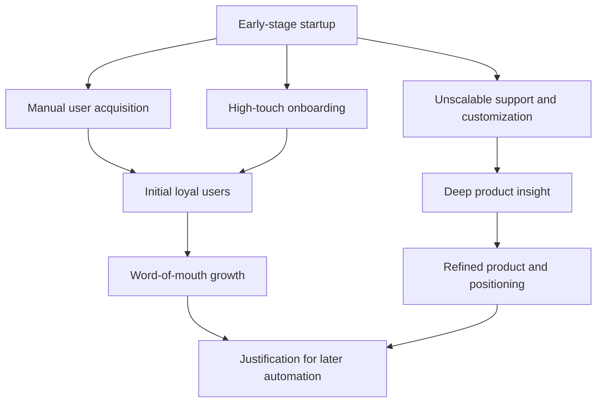

[[Sources/People/Influencers/Paul Graham|Paul Graham]]
[[Sources/Books/The Lean Startup|Lean Startup]]
[[concepts/Founder-Market Fit|Founder-Market Fit]]

# Defining and Describing Do Things that Don’t Scale

_“Do things that don’t scale” is the idea that early-stage teams should deliberately do labor-intensive, un-automated work to win and delight their first users, even though those tactics can’t be used at massive scale._

In startup culture, **“Do Things that Don’t Scale”** refers to a strategy of manually hustling for early customers, support, and product insight instead of waiting until processes are fully automated or “scalable.” Paul Graham of Y Combinator popularized the phrase in a 2013 essay advising founders to “do things that don’t scale” like hand‑recruiting users, personally onboarding them, and providing fanatical support. [^ent28z] These non-scalable efforts matter because they help new ventures overcome the cold-start problem, build a core of loyal users, and deeply understand product–market fit before investing in infrastructure and automation. [^ent28z] [^w0j22v] The concept is now widely cited in startup playbooks, growth handbooks, and founder talks as a counter‑argument to prematurely optimizing for scale. [^ent28z] [^46m9oi]

# Uses in Context

- Founders use the phrase to justify **manual, high-touch customer work** in the early days, as in Paul Graham’s advice that startups should “do things that don’t scale” like “recruit users manually” and “go out and get users” one by one. [^ent28z]  
- Growth and product teams invoke it as a warning against **premature scaling**, echoing Graham’s point that focusing on scalable acquisition channels too early can be fatal because “you need to get a small number of users to love you” before worrying about reaching everyone. [^ent28z] [^w0j22v]  
- Startup advisors use it to encourage **concierge-style validation**: instead of building full systems, founders run unscalable experiments (e.g., manually fulfilling a service) to validate demand and learn, similar to “concierge MVPs” discussed in Lean Startup circles. [^w0j22v]  
- In discussions of **customer success and support**, the term is applied to practices like personally answering every support email or doing one-on-one onboarding calls, which are praised as “things that don’t scale” but create strong loyalty early on. [^ent28z] [^46m9oi]  
- Venture capital blogs and accelerator programs reference it when explaining why **early-stage metrics and processes look messy**, framing high-touch sales and founder-led service as a rational, temporary phase rather than a failure to be “efficient.”[^w0j22v] [^46m9oi]  

# History of Use

## Origins

- The phrase **“Do Things that Don’t Scale”** is widely attributed to [[Sources/People/Influencers/Paul Graham|Paul Graham]]’s 2013 essay of the same name, published on his personal site while he was president of Y Combinator. [^ent28z] In that essay he explicitly argues that “a lot of would-be founders believe that startups either take off or don’t,” but in reality “almost all startups have to do things that don’t scale at first.”[^ent28z]  
- Graham introduced the concept in the context of advising very early-stage software startups to **personally recruit users**, handhold them through onboarding, and provide intense, unscalable support, using examples from companies that went through [[vertical-toolkits/Venture-Capital-Firms/Y Combinator|Y Combinator]]. [^ent28z]  
- The essay quickly spread through startup blogs, hacker forums, and founder talks, becoming a canonical part of the YC-style startup playbook and frequently referenced alongside concepts like “make something people want.”[^ent28z] [^w0j22v]  

## Evolution

- **2013–2015 – Integration into [[Sources/Books/The Lean Startup|Lean Startup]] and [[concepts/Minimum Viable Product|MVP]] discourse:** After Graham’s essay, the phrase began appearing in Lean Startup–influenced blogs and talks as a label for concierge MVPs and manual validation, reinforcing the idea that non-scalable experiments are a legitimate way to test hypotheses. [^w0j22v]  
- **Mid–2010s – Expansion to growth and customer success:** As SaaS and [[concepts/Product-Led Growth|Product-Led Growth]] models matured, “do things that don’t scale” was increasingly used to describe early **customer success**, white-glove onboarding, and manual sales processes before automation and self-serve flows are built. [^46m9oi]  
- **Late 2010s onward – Generalized business advice:** The term migrated from pure tech startups into broader entrepreneurship literature, HR, and operations writing, where authors use it to encourage leaders to invest in **relationship-heavy, bespoke work** (e.g., recruiting, culture-building) before turning to scalable systems. [^w0j22v] [^46m9oi]  

# Best Real-World Examples

- [Stripe](https://stripe.com) — [[organizations/Stripe|Stripe]] — Early on, the founders personally installed the payments integration for users (“collocating” laptops with customers), an oft-cited “do things that don’t scale” example that helped them win initial developers. [^ent28z] [^w0j22v]  
- [Airbnb](https://www.airbnb.com) — [[organizations/AirBnB|AirBnB]] — The founders manually photographed hosts’ apartments in New York to improve listings and flew to meet users, a non-scalable tactic that boosted trust and conversions. [^ent28z] [^w0j22v]  
- [Wufoo](https://www.wufoo.com) — The team wrote hand-written thank-you notes to customers, an intensely unscalable practice that built remarkable customer loyalty in the early days. [^ent28z]  
- [DoorDash](https://www.doordash.com) — In the very early phase, founders manually took orders and made deliveries themselves to understand customer needs and restaurant workflows, embodying the principle in a local-service context. [^w0j22v]  
- [Zenefits](https://www.zenefits.com) — [[Zenefits]] — Early teams manually handled back-office benefits and compliance work for customers to learn the complexity before building scalable automation.  
- [Superhuman](https://superhuman.com) — [[Tooling/Productivity/Personal Cloud/Superhuman|Superhuman]] — The company became known for its founder-led, high-touch onboarding calls with each early user, a classic “doesn’t scale” practice used to refine product and positioning. [^46m9oi]  

# Case Studies

## Stripe: Founder-Installed Integrations

Stripe, founded in 2010 by [[Patrick Collison]] and John Collison, faced the classic cold‑start problem of convincing developers to switch payments providers in a complex, regulated domain. [^ent28z] [^w0j22v] Rather than relying on scalable marketing or self-serve docs, the founders famously offered to come to a developer’s office and “integrate Stripe for you right now,” sometimes literally opening their laptops alongside the customer and writing the integration code themselves. [^ent28z] [^w0j22v] This intensely manual onboarding gave Stripe immediate feedback on integration pain points, let them watch how real developers used their API, and removed friction for early adopters. It illustrates how “doing things that don’t scale” can compress sales cycles, uncover product issues, and create enthusiastic early users who later drive word-of-mouth growth. [^ent28z] [^w0j22v]  

## Airbnb: Manual Photography and Host Coaching

In [[organizations/AirBnB|AirBnB]]’s early years, the team struggled with low booking rates because many listings had poor photos and unclear descriptions, undermining trust. [^ent28z] [^w0j22v] To fix this, the founders went door to door in New York City, personally photographing hosts’ apartments with professional-grade cameras and helping them rewrite listing descriptions—an unscalable but highly impactful intervention. [^ent28z] [^w0j22v] This hands-on work immediately improved listing quality and booking conversions, while also giving the team deep insight into host concerns and guest expectations. The case is frequently cited by founders and investors as proof that non-scalable, in-person work can unlock growth that pure product tweaks or online ads cannot. [^ent28z] [^w0j22v]  

## Superhuman: High-Touch Onboarding as Product Discovery

[[Tooling/Productivity/Personal Cloud/Superhuman|Superhuman]], an email client aimed at power users, became known for requiring a one-on-one onboarding call with the team (often with the founder) for every early user, instead of letting people simply sign up and explore. [^46m9oi] During these sessions, the team would ask detailed questions about the user’s workflow, configure shortcuts live, and watch where people got stuck, treating onboarding as a structured user research interview rather than a simple tutorial. [^46m9oi] Although this approach clearly “does not scale” to millions of users, it helped Superhuman refine its product, messaging, and ideal customer profile before investing in broader acquisition. The case shows how deliberate non-scalable work can be used not just for acquisition, but as a powerful engine for continuous product discovery. [^46m9oi]

***

# Sources

[^ent28z]: [How to scale a business: 8 strategies and tips - Oyster HR](https://www.oysterhr.com/library/how-to-scale-a-business)
[^w0j22v]: [Creating a pan-European legal entity, the right way | Andreas Klinger](https://klinger.io/posts/eu-inc)
[^46m9oi]: [Growth vs scaling: What's the difference and why does it matter?](https://www.spendesk.com/blog/growth-vs-scaling/)
