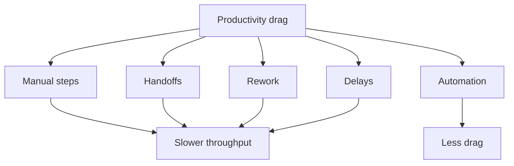

_“Drag” is a productivity drain caused by friction, handoffs, and wasted motion — the small inefficiencies that make work feel slower than it should._ [^a1vo25] [^128vpj]

In business and operations, **drag** refers to anything that reduces throughput or slows execution, especially when repeated manual steps can be replaced with automation or simplified workflows. [^a1vo25] [^128vpj] The concept matters because drag compounds: even minor delays, extra approvals, and repetitive logins can consume time, increase costs, and reduce efficiency at scale. [^a1vo25] [^128vpj]

Relates to [[concepts/Cognitive, Collaborative Tooling|Cognitive, Collaborative Tooling]]. 
### The Drag of Knowledge Workers
In 2022, a survey of over a thousand professionals found that the average American spends an average of 2 hours a day, or 25% of their work week, looking for documents, information or people to do their jobs. And 26% spend 5 hours a day searching for information they need.  26% have recently created a work item that they later discovered already existed. 24% are guilty of asking colleagues for documents and information rather than finding it for themselves. And, 18% get interrupted by colleagues at least 5 times an hour. [^81rc3j]

## AI Explains [[concepts/Drag (on Productivity)|Drag (on Productivity)]]
According to [[Poe AI]]:

[!Ai explains Drag]
In today’s fast-paced, technology-driven work environment, organizations face several challenges that hinder productivity. These challenges often stem from inefficient workplace practices, misaligned priorities, and the complexities of collaboration across teams. Below are the **common themes contributing to productivity loss** in modern offices, along with examples and insights into their impact.

---

### **1. Frequent Interruptions and Context Switching**

#### **The Problem:**

- Employees are constantly interrupted by notifications, emails, instant messages, and impromptu questions, disrupting their focus.
- **Context switching**, or moving between tasks and tools, decreases productivity as it takes time for employees to regain focus after an interruption.

#### **Impact:**

- Studies show it can take **23 minutes or more** to resume focus after an interruption.
- Productivity and quality of work suffer due to fragmented attention.

#### **Examples:**

- Slack or Teams notifications popping up during deep work.
- A colleague stopping by for a "quick question" that derails progress on a key deliverable.

#### **Solution Ideas:**

- Introduce "focus time" or "no-interruption zones."
- Use asynchronous communication for non-urgent matters.

---

### **2. Meeting Overload and Fatigue**

#### **The Problem:**

- The prevalence of **too many meetings**, often poorly planned or unnecessary, leads to "meeting fatigue."
- Employees spend excessive time in discussions that lack clear agendas, outcomes, or relevance to their role.

#### **Impact:**

- Employees feel exhausted and have less time for deep, productive work.
- Time spent in ineffective meetings leads to opportunity cost and lower morale.

#### **Examples:**

- A 1-hour brainstorming session with no actionable conclusions.
- Back-to-back virtual meetings leaving no time for preparation or follow-up.

#### **Solution Ideas:**

- Enforce strict meeting guidelines (e.g., clear agendas, time limits, and attendee relevance).
- Consider alternatives to meetings, such as collaborative documents or recorded updates.

---

### **3. Miscommunication and Information Silos**

#### **The Problem:**

- Poor communication, unclear instructions, or inconsistent messaging leads to **misaligned expectations** and wasted effort.
- **Information silos** occur when teams or departments don’t share critical data, causing duplication of work or delayed decision-making.

#### **Impact:**

- Tasks are delayed or executed incorrectly due to lack of clarity or access to information.
- Collaboration suffers, leading to frustration and inefficiency.

#### **Examples:**

- A project team having outdated information due to poor cross-department coordination.
- Employees wasting time searching for a document buried in a poorly organized file system.

#### **Solution Ideas:**

- Use centralized communication tools (e.g., Confluence, Notion).
- Encourage cross-functional collaboration and knowledge sharing.

---

### **4. Poor Task Prioritization and Goal Misalignment**

#### **The Problem:**

- Employees often juggle conflicting priorities, unclear goals, or unrealistic deadlines, leading to wasted effort on low-value tasks.
- Lack of alignment between individual tasks and organizational objectives reduces focus on impactful work.

#### **Impact:**

- Critical initiatives are delayed while time is spent on less important tasks.
- Employees feel demotivated when their work lacks direction or significance.

#### **Examples:**

- Employees spending hours perfecting a report that isn’t mission-critical.
- Teams working on overlapping or redundant projects due to misaligned goals.

#### **Solution Ideas:**

- Implement frameworks like **OKRs (Objectives and Key Results)** to align tasks with organizational goals.
- Train managers to help employees prioritize work effectively.

---

### **5. Over-Reliance on Tools and Technology**

#### **The Problem:**

- While tools are meant to simplify work, an overabundance of platforms can lead to **tool fatigue** and inefficiencies.
- Employees spend more time navigating tools or duplicating data across systems than focusing on meaningful work.

#### **Impact:**

- Technology overload leads to frustration and wasted time.
- Tools fail to deliver value when not integrated properly.

#### **Examples:**

- Jumping between project management tools like Asana, Trello, and Monday.com for the same project.
- Overusing collaboration platforms like Slack, leading to "noise" and missed important updates.

#### **Solution Ideas:**

- Audit and consolidate tools to reduce redundancy.
- Provide training to ensure employees use tools effectively and consistently.

---

### **6. Inefficient Processes and Bureaucracy**

#### **The Problem:**

- Outdated or overly complex workflows slow down productivity and frustrate employees.
- Excessive approvals, redundant steps, or unclear ownership of tasks create bottlenecks.

#### **Impact:**

- Delays in project completion.
- Lower employee morale due to unnecessary bureaucracy.

#### **Examples:**

- A simple request requiring multiple levels of approval.
- Confusion over which team or individual is responsible for a task.

#### **Solution Ideas:**

- Map and streamline workflows to eliminate redundancies.
- Empower employees to make decisions within their scope of work.

---

### **7. Lack of Focus on Employee Well-Being**

#### **The Problem:**

- Burnout, fatigue, and lack of work-life balance negatively impact employee productivity and creativity.
- Unrealistic expectations and lack of mental health support exacerbate the issue.

#### **Impact:**

- Reduced productivity, increased absenteeism, and higher employee turnover.
- Emotional exhaustion leads to lower-quality work and disengagement.

#### **Examples:**

- Employees working long hours due to unclear boundaries in remote work setups.
- Lack of recognition or support for employees dealing with stress.

#### **Solution Ideas:**

- Promote mental health programs and flexible work arrangements.
- Encourage managers to recognize efforts and ensure reasonable workloads.

---

### **8. Disengagement and Low Motivation**

#### **The Problem:**

- Employees disengaged from their work or the company’s mission are less productive.
- Lack of growth opportunities, unclear career paths, or insufficient feedback contribute to demotivation.

#### **Impact:**

- Lower effort, creativity, and commitment to tasks.
- Higher likelihood of turnover, resulting in knowledge loss and onboarding costs.

#### **Examples:**

- Employees feeling their contributions aren’t valued.
- Lack of feedback or recognition for well-executed work.

#### **Solution Ideas:**

- Provide regular feedback and recognition programs.
- Offer career development opportunities and clear growth paths.

---

### **9. Remote Work Challenges**

#### **The Problem:**

- Remote or hybrid work environments create issues like isolation, difficulty in collaboration, and lack of visibility into team progress.
- Misalignment in time zones and communication habits leads to inefficiencies.

#### **Impact:**

- Teams experience delays due to asynchronous communication struggles.
- Employees feel disconnected from their teams and company culture.

#### **Examples:**

- Delayed responses in global teams due to time zone differences.
- Employees missing important updates because they weren’t included in a virtual meeting.

#### **Solution Ideas:**

- Foster team cohesion with regular virtual check-ins.
- Use asynchronous tools like Loom or recorded updates to improve communication.

---

### **10. Poor Knowledge Management**

#### **The Problem:**

- Difficulty in finding or accessing information wastes employee time and slows down decision-making.
- A lack of structured documentation leads to repeated mistakes or inefficiencies.

#### **Impact:**

- Employees spend hours searching for files, processes, or answers.
- Teams repeat past mistakes due to lack of lessons learned documentation.

#### **Examples:**

- Onboarding new employees taking longer due to disorganized training materials.
- Employees duplicating work because they couldn’t find previous efforts.

#### **Solution Ideas:**

- Implement and maintain a centralized knowledge base.
- Foster a culture of documentation and sharing best practices.

---

### **Conclusion**

Modern offices face productivity loss due to a combination of **interpersonal, technological, and procedural inefficiencies**. Themes like interruptions, meeting fatigue, miscommunication, poor prioritization, and tool overload are common culprits. Addressing these challenges requires a combination of cultural changes (e.g., fostering focus and well-being), process improvements (e.g., streamlining workflows), and better use of tools (e.g., consolidating platforms and improving knowledge management). By tackling these pain points, organizations can create more efficient, engaged, and productive workplaces.

# Footnotes
*** 
[^81rc3j]: [[2022_Glean Hybrid Workplace Infographic.pdf|Hybrid workplace habits & hangups]]. Report, [[Glean]]. Accessed at https://www.glean.com/resources/guides/hybrid-workplace-habits-hangups

# Defining and Describing Drag (on Productivity)
- 

## Uses in Context
- In business process discussions, drag is used to describe inefficiency that can be reduced through rationalization, because legal entity rationalization is said to “reduce risk, cut costs and improve efficiency.”[^a1vo25]
- In automation contexts, drag can mean routine work that operators no longer need to do manually, as when the Navy describes a system “designed and developed to eliminate the need for personnel to manually log into a computer, visually identify requests, and execute automations.”[^128vpj]
- In UI and software workflows, drag-and-drop is also used more literally to describe moving items by dragging, as Drupal’s documentation says items “can be moved via drag-and-drop.”[^s7vv96]
- In interface and interaction design, “drag” commonly refers to pointer-based manipulation, as Bevy’s picking system includes events such as `DragStart`, `Drag`, `DragOver`, and `DragDrop`. [^1u16h1]
- In public policy and culture, “drag” can also refer to drag performances, as South Carolina’s bill defines “drag show” and “drag story hour.”[^fre8px]

## History of Use

### Origins
- The productivity sense of **drag** is an ordinary English metaphor rather than a formally coined technical term, and the sources here show it being used descriptively to signal slowdown, inefficiency, and manual burden in operations and automation contexts. [^a1vo25] [^128vpj]
- The closest explicit operational framing in the provided sources appears in business and enterprise automation writing, where reducing drag is tied to “reduce risk, cut costs and improve efficiency” and to eliminating manual login and execution steps. [^a1vo25] [^128vpj]

### Evolution
- **2025-2026:** The term is used in policy language around cultural programming, where South Carolina’s bill defines “drag story hour” and “drag show” in legal terms. [^fre8px]
- **2020s:** In software and game engines, “drag” appears as a standard interaction primitive, with Bevy documenting a drag lifecycle built from `DragStart`, `Drag`, `DragOver`, `DragDrop`, and `DragEnd` events. [^1u16h1]
- **2020s:** In enterprise automation, “drag” is increasingly implied by systems meant to remove manual work, such as the Navy’s automation project that avoids repeated human login and request execution. [^128vpj]

## Best Real-World Examples
- [RSM US](https://rsmus.com/insights/services/business-tax/5-signs-legal-entity-rationalization.html) — legal entity rationalization presented as a way to “reduce risk, cut costs and improve efficiency.”[^a1vo25]
- [U.S. Navy](https://www.navy.mil/Press-Office/News-Stories/display-news/Article/4441218/non-person-entity-accelerates-enterprise-automations/) — an automation system built to eliminate manual login and request handling. [^128vpj]
- [Drupal Node/Entity Ordering](https://www.drupal.org/docs/7/extend/comparison-of-contributed-modules/comparison-of-nodeentity-ordering-modules) — content ordering via items that can be moved with drag-and-drop. [^s7vv96]
- [Bevy Picking](https://taintedcoders.com/bevy/picking) — interaction events such as `DragStart`, `Drag`, and `DragDrop` in a pointer-based system. [^1u16h1]
- [South Carolina Bill 733](https://www.scstatehouse.gov/sess126_2025-2026/bills/733.htm) — legal use of “drag story hour” and “drag show” as defined terms. [^fre8px]

## Case Studies
The U.S. Navy’s “Non-Person Entity” automation effort shows drag as operational friction rather than a visual metaphor: the project was “designed and developed to eliminate the need for personnel to manually log into a computer, visually identify requests, and execute automations.”[^128vpj] That language makes drag measurable in terms of time spent on repetitive steps, and it shows how automation targets the smallest recurring inefficiencies because those are what accumulate into broad productivity losses. [^128vpj]

RSM’s legal entity rationalization example shows drag at the organizational level. [^a1vo25] By framing rationalization as a way to “reduce risk, cut costs and improve efficiency,” the source treats excess complexity, duplicated entities, and administrative overhead as sources of drag on business performance. [^a1vo25] This illustrates a common productivity pattern: drag often hides inside structure, not just inside individual tasks. [^a1vo25]

Bevy’s picking documentation shows how software systems formalize drag as an interaction state machine. [^1u16h1] Instead of treating drag as a vague gesture, it breaks the behavior into events like `DragStart`, `Drag`, `DragOver`, and `DragDrop`, which makes the interaction predictable for developers and users. [^1u16h1] That demonstrates a broader point about productivity drag in digital systems: clear event models reduce friction because they turn ambiguous behavior into explicit workflow steps. [^1u16h1]

***

# Sources

[^1u16h1]: [Bevy Picking | Tainted Coders](https://taintedcoders.com/bevy/picking)
[2]: [Create a diagram with crow's foot database notation](https://support.microsoft.com/lt-lt/visio/create-a-diagram-with-crow-s-foot-database-notation)
[^fre8px]: [2025-2026 Bill 733: Children - South Carolina Legislature Online](https://www.scstatehouse.gov/sess126_2025-2026/bills/733.htm)
[^s7vv96]: [Comparison of Node/Entity Ordering Modules - Drupal](https://www.drupal.org/docs/7/extend/comparison-of-contributed-modules/comparison-of-nodeentity-ordering-modules)
[^a1vo25]: [5 signs your business may benefit from legal entity rationalization](https://rsmus.com/insights/services/business-tax/5-signs-legal-entity-rationalization.html)
[^128vpj]: [Non-Person Entity Accelerates Enterprise Automations - Navy.mil](https://www.navy.mil/Press-Office/News-Stories/display-news/Article/4441218/non-person-entity-accelerates-enterprise-automations/)
