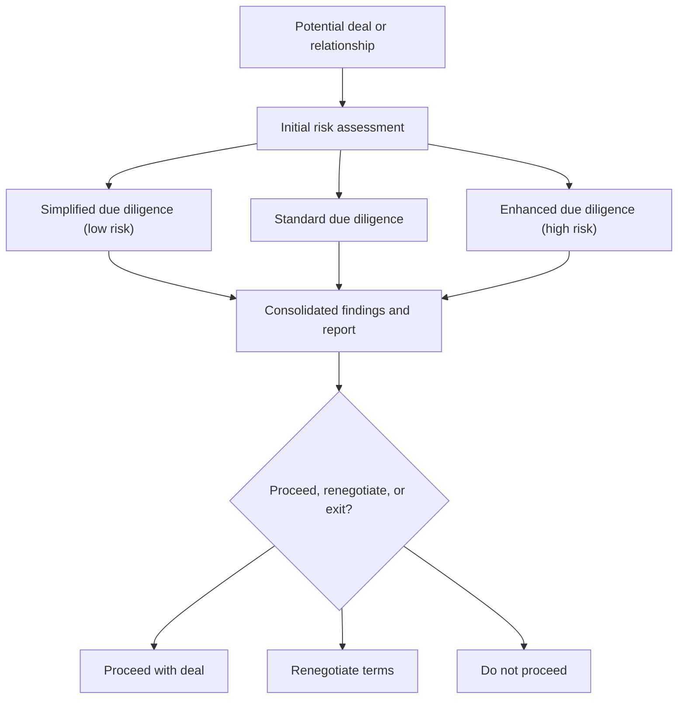

[[concepts/Explainers for AI/AI-Powered Diligence|AI-Powered Diligence]]
[[concepts/Explainers for Tooling/Datarooms|Datarooms]]
[[Vocabulary/Private Markets|Private Markets]]

# Defining and Describing Due Dilligence

_Due Dilligence is almost always a misspelled reference to **due diligence**, the systematic investigation and risk assessment done before entering into a significant business relationship or transaction._

In standard usage, **due diligence** is the process of gathering and analyzing financial, legal, operational, and reputational information to “detect existing financial, legal, and operational issues to mitigate potential risks and safeguard investments and assets.”[^pr908w] It appears most often in mergers and acquisitions, investments, and compliance contexts, where buyers, investors, or financial institutions research a target company or customer before committing capital or forming a relationship. [^pr908w] [^cadll5] The double‑“l” variant **“due dilligence” has no separate technical meaning** in law, finance, or compliance; where it appears in documents or online, it functions as a spelling error for the same underlying concept.

Because “due diligence” is a **broad umbrella term**, it includes more specific sub‑processes such as:

- **Customer Due Diligence (CDD)** – used by banks and financial institutions to “collect and evaluate information about a customer or potential customer to identify and mitigate risks like money laundering and terrorist financing.”[^xwdpa1] [^yf4cbl]  
- **Enhanced Due Diligence (EDD)** – “an advanced layer of Customer Due Diligence” applied to higher‑risk clients or transactions under KYC/AML regimes. [^e4ajgn] [^o54cgq]  
- **Simplified Due Diligence (SDD)** – the lowest level of CDD that can be used for low‑risk customers during onboarding or monitoring. [^jacg00]  

These are all risk‑based applications of the same core idea: **investigate first, then decide**.

# Uses in Context

- In **M&A and investment**, firms use due diligence “to research and uncover relevant information” about a target before partnering, then summarize the findings in a **due diligence report** that includes key risks and recommendations. [^pr908w]  
- In **financial crime compliance**, banks treat customer due diligence as a core AML/KYC control that “involves verifying a customer’s identity, assessing their risk profile, and continuously monitoring their activities.”[^xwdpa1] [^yf4cbl]  
- In **risk‑tiered onboarding**, providers distinguish **simplified**, **standard**, and **enhanced** due diligence: simplified due diligence is “the lowest level of customer due diligence that a financial institution can perform,” while enhanced due diligence “goes beyond standard identity checks” for higher‑risk clients. [^e4ajgn] [^jacg00]  
- In **public record investigations**, practitioners speak of “public record due diligence,” meaning “researching and gathering information from publicly available sources to assess risks, validate information and gain insights into a company, individual or asset.”[^cadll5]  
- In **deal negotiation**, buyers and investors rely on the due diligence report to “make an informed decision about the deal” and potentially “adjust the deal structure and negotiat[e] terms” based on identified risks. [^pr908w]  

# History of Use

## Origins

- In modern business law, **due diligence** is rooted in U.S. securities practice: under early securities regulation, underwriters could defend themselves against liability by showing they had conducted reasonable investigation—“due diligence”—into an issuer’s disclosures (this connection is widely documented in securities‑law commentary, though not explicitly spelled out in the search results here).  
- In contemporary corporate practice, the term is defined functionally as a process where a buyer or investor “considers partnering with a new business” and its teams “complete a due diligence process to research and uncover relevant information,” later compiled “in a due diligence report.”[^pr908w]  

Because “Due Dilligence” is not recognized as a distinct concept in legal or academic sources, there is **no separate origin story** for the misspelled form; it tracks the spread of the correctly spelled “due diligence.”

## Evolution

- **1980s–2000s – General corporate/M&A usage:** Due diligence becomes a standard phase in mergers, acquisitions, and private equity deals, covering financial, legal, operational, and market analysis, often structured into multi‑section reports with executive summaries, financial analysis, legal considerations, market analysis, operational review, and risk recommendations. [^pr908w]  
- **2000s–2010s – AML/KYC specialization:** Financial‑crime regulation formalizes **Customer Due Diligence (CDD)** as a mandatory process for banks and other institutions to “identify and mitigate risks like money laundering and terrorist financing,” with explicit requirements such as identifying customers, verifying identity, and understanding the nature and purpose of the relationship. [^xwdpa1] [^yf4cbl]  
- **2010s–present – Risk‑based tiers and global frameworks:** International standards (e.g., FATF‑influenced rules referenced by regulators such as FinCEN, EU directives, and others) drive differentiation among **simplified**, **standard**, and **enhanced** due diligence, with EDD defined as “an advanced layer of Customer Due Diligence” triggered by high‑risk factors such as politically exposed persons, high‑risk jurisdictions, or complex ownership structures. [^e4ajgn] [^o54cgq] [^jacg00]  

# Best Real-World Examples

- [Dataroom‑Providers.org due diligence report templates](https://dataroom-providers.org/blog/due-diligence-report-explained/) – outlines a full due diligence report structure used by buyers and investors, including executive summary, financial analysis, legal considerations, market analysis, operational review, and risk recommendations. [^pr908w]  
- [Altrata enhanced due diligence services](https://altrata.com/articles/enhanced-due-diligence-explained) – exemplify **Enhanced Due Diligence** as a research‑driven, multi‑step process for high‑risk clients, focusing on detailed ownership mapping, source of wealth, adverse media, and ongoing monitoring. [^o54cgq]  
- [Trulioo Enhanced Due Diligence guide](https://www.trulioo.com/blog/enhanced-due-diligence) – a RegTech provider’s implementation of EDD as “an advanced layer of Customer Due Diligence” within KYC/AML workflows for high‑risk accounts. [^e4ajgn]  
- [Fenergo Customer Due Diligence platform](https://resources.fenergo.com/blogs/what-is-cdd) – demonstrates CDD as an integrated process for identifying customers, verifying identity, identifying beneficial owners, and monitoring activity as part of AML compliance. [^xwdpa1]  
- [Moody’s CDD profiles](https://www.moodys.com/web/en/us/kyc/resources/insights/what-is-customer-due-diligence.html) – uses structured CDD profiles to capture and update risk‑relevant customer information in regulated institutions. [^yf4cbl]  
- [Ondato simplified due diligence workflows](https://ondato.com/blog/simplified-due-diligence/) – illustrates **simplified due diligence** for low‑risk customers, showing how institutions reduce data collection and monitoring intensity while staying within AML rules. [^jacg00]  
- [Cogency Global public‑record due diligence](https://www.cogencyglobal.com/blog/international-due-diligence-obtaining-corporate-information-and-common-challenges-2/) – exemplifies international corporate due diligence focused on gathering and analyzing public records to support cross‑border decision‑making. [^cadll5]  

# Case Studies

**1. M&A Buyer Using a Structured Due Diligence Report**

When a buyer “considers partnering with a new business,” a risk and compliance team carries out a structured due diligence process, gathering financial statements, legal documents, operational data, and market information. [^pr908w] The findings are consolidated in a **due diligence report** whose sections typically include an executive summary, company overview, multi‑year financial analysis with key ratios, legal considerations (governance documents, litigation history, regulatory compliance), market analysis with market size and SWOT, operational review, and a dedicated “Risks and Recommendations” section. [^pr908w] After “assessing risks,” the team prepares this report so that the buyer can “carefully evaluate” whether to proceed, adjust price or terms, or abandon the transaction, using the report to negotiate or restructure the deal and, ultimately, to decide on “deal closure.”[^pr908w] This case illustrates due diligence (and thus what people mean even when they misspell it as “due dilligence”) as a **decision‑support investigation** that directly shapes valuation and contractual terms.

**2. Financial Institution Applying Enhanced Due Diligence to a High‑Risk Client**

A financial institution onboarding a customer with high‑risk indicators—such as ties to a high‑risk jurisdiction, status as a politically exposed person (PEP), or a complex ownership structure—must go beyond standard CDD and apply **Enhanced Due Diligence (EDD)**. [^e4ajgn] [^o54cgq] In practice, this means initiating EDD once KYC screening and internal scoring models “flag customers that meet the organization’s EDD criteria,” then collecting enhanced documentation: full beneficial ownership mapping, source of wealth and funds, verification of business activities and counterparties, adverse media and sanctions screening, and review of known associates. [^o54cgq] Analysts then “analyze and assess risk,” cross‑referencing data to identify hidden links or red flags, before deciding whether to onboard, continue, or terminate the relationship and carefully documenting the rationale. [^o54cgq] EDD does not end at onboarding; institutions implement “ongoing monitoring, periodic reviews, and automated alerts” to capture changes such as new sanctions or adverse news, showing how due diligence evolves into a continuous risk‑management practice for high‑risk clients. [^e4ajgn] [^o54cgq]  

**3. International Corporate Records Due Diligence for Cross‑Border Expansion**

When a company considers expanding or partnering internationally, it may commission **public record due diligence** to understand counterparties in another jurisdiction. [^cadll5] Practitioners “obtain corporate information” from registries and other public sources—such as incorporation records, directors and officers, share capital, and filings—to “assess risks, validate information and gain insights into a company, individual or asset.”[^cadll5] This process supports decision‑making by checking the accuracy of claimed ownership, the existence or good standing of entities, and any indications of regulatory, legal, or reputational issues, despite challenges such as varying registry quality and language barriers across countries. [^cadll5] Here, due diligence functions as a **foundation for trust in cross‑border deals**, even though the activity is often described informally (and sometimes misspelled) in working documents.

***

# Sources

[^e4ajgn]: [Enhanced Due Diligence (EDD): A Comprehensive Guide - Trulioo](https://www.trulioo.com/blog/enhanced-due-diligence)
[^xwdpa1]: [What Is Customer Due Diligence? Guide to the CDD Rule & Process](https://resources.fenergo.com/blogs/what-is-cdd)
[^o54cgq]: [Enhanced Due Diligence: Process & Best Practices | Altrata](https://altrata.com/articles/enhanced-due-diligence-explained)
[^pr908w]: [Due Diligence Report Explained (+Report Structure Example)](https://dataroom-providers.org/blog/due-diligence-report-explained/)
[^yf4cbl]: [What is customer due diligence (CDD)? Meaning & process - Moody's](https://www.moodys.com/web/en/us/kyc/resources/insights/what-is-customer-due-diligence.html)
[^cadll5]: [International Due Diligence: Obtaining Corporate Information and ...](https://www.cogencyglobal.com/blog/international-due-diligence-obtaining-corporate-information-and-common-challenges-2/)
[7]: [What is Customer Due Diligence (CDD), and why does it matter](https://www.azakaw.com/blog/customer-due-diligence)
[^jacg00]: [Simplified Due Diligence: When It Applies and How to Do It Right](https://ondato.com/blog/simplified-due-diligence/)
