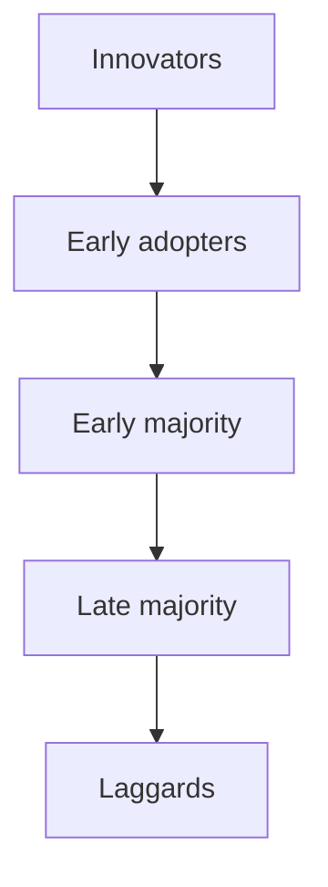

[[Sources/Books/The Lean Startup|Lean Startup]]
[[Sources/Books/Crossing the Chasm|Crossing the Chasm]]
[[Sources/Books/Diffusion of Innovations|Diffusion of Innovations]]
[[Vocabulary/Disruptive Innovation|Disruptive Innovation]]

# Defining and Describing Early Adopters

*Early adopters are the adventurous minority who embrace new ideas and technologies just after the pioneers, shaping what eventually becomes mainstream.*

In innovation theory, **early adopters** are individuals or organizations that decide to use a new idea, technology, product, or practice shortly after it is introduced, but before it is widely accepted by the majority of users. [^wmc53b] [^kmr0vx] They sit just after **innovators** and before the **early majority** in Everett Rogers’ classic diffusion-of-innovations curve. [^kmr0vx] Because they are relatively more willing to take calculated risks and often act as opinion leaders, early adopters play a critical role in validating, refining, and socially legitimizing innovations for broader audiences. [^wmc53b] [^kmr0vx] The concept matters in business, policy, education, and technology because the behavior of early adopters significantly influences whether an innovation stalls, spreads slowly, or scales rapidly. [^wmc53b] [^kmr0vx]

Conceptually, an **early adopter** is “an individual, organization, or institution that embraces a new idea, technology, product, or practice before it reaches mainstream acceptance.”[^wmc53b] In Rogers’ framework, adopter categories (innovators, early adopters, early majority, late majority, laggards) are defined by their relative time of adoption compared to others in a social system, with early adopters typically comprising about 13–14% of the population. [^kmr0vx] Early adopters tend to be more socially integrated than innovators and often act as **“role models”** whose choices reduce uncertainty for later adopters. [^kmr0vx] In applied settings—such as education systems, accounting firms, or tourism destinations—“early adopter programs” are often deliberately used to pilot new standards or systems, gather feedback, and refine implementation before full-scale rollout. [^a2xqs0] [^wmc53b] [^dy6lxb]

# Uses in Context

- In **innovation and diffusion theory**, early adopters are one of five standard adopter categories—“innovators, early adopters, early majority, late majority and laggards”—used to describe how new ideas and technologies spread through a social system. [^kmr0vx] Rogers describes early adopters as more **“discreet in adoption choices”** and key to influencing later categories. [^kmr0vx]

- In the **learn-and-work ecosystem** (education, workforce, credentials), early adopters are framed as institutions that “embrace a new idea, technology, product, or practice before it reaches mainstream acceptance,” often to pilot new learning and credentialing models and share practices with followers. [^wmc53b]

- In **organizational change and compliance**, professional bodies encourage early adoption of new standards so firms can “optimize” systems before full enforcement; for example, accounting firms that adopted quality management standard SQMS No. 1 early gained time to refine their quality management systems prior to peer review. [^a2xqs0]

- In **HR and SaaS implementations**, product teams sometimes designate specific users as “early adopters” during setup to test new features, workflows, or platforms before they are rolled out to the entire organization; for instance, Employment Hero guides admins to “Add Early Adopters while your account is in setup mode” to trial the platform with a subset of employees. [^u11s9f]

- In **sustainability and tourism policy**, early adopter programs invite destinations and businesses to implement new sustainability standards ahead of broad adoption, using their experience to “implement and refine the GSTC’s new sustainability standards” and inform future guidance. [^dy6lxb]

- In **library and metadata initiatives**, professional consortia organize “Early Adopters Phase” cohorts—such as the PCC EMCO Early Adopters Phase—to develop organizational infrastructure and communities of practice around new cataloging or metadata frameworks before they are broadly mandated. [^atd6ta]

# History of Use

## Origins

- The widely recognized and systematically defined use of **“early adopters”** comes from Everett M. Rogers’ book **_Diffusion of Innovations_**, first published in 1962. [^kmr0vx] In this work, Rogers introduced a taxonomy of adopter categories—innovators, early adopters, early majority, late majority, laggards—based on the timing of adoption relative to others in a social system. [^kmr0vx]

- Rogers drew on earlier rural sociology studies of hybrid corn adoption in the 1940s and 1950s, but his 1962 book synthesized these findings into the now-standard model in which early adopters are more integrated into the local social system than innovators and serve as respected opinion leaders who reduce uncertainty about innovations for others. [^kmr0vx]

## Evolution

- **1960s–1980s – Formalization in diffusion research:** Following Rogers’ 1962 publication, the early adopter category became a standard analytical unit in sociology, communication studies, and marketing research, used to model adoption curves and to segment audiences for agricultural innovations, health behaviors, and technologies. [^kmr0vx]

- **1990s–2000s – Popularization in marketing and technology culture:** As personal computing and the internet spread, the notion of “early adopters” migrated into popular business and tech discourse to describe tech-savvy consumers who buy new devices or software ahead of the mainstream, often targeted deliberately by marketers as influencers of later adopters. [^kmr0vx]

- **2010s–present – Institutional and policy framing:** The term increasingly appears in structured “early adopter programs” run by professional associations, standards bodies, and platforms—such as quality management standards in accounting, sustainability standards in tourism, and metadata frameworks in libraries—where select organizations pilot innovations and help define best practices before larger-scale adoption. [^a2xqs0] [^atd6ta] [^dy6lxb]

# Best Real-World Examples

- [Learn & Work Ecosystem Early Adopters](https://learnworkecosystemlibrary.com/topics/early-adopters-early-adoption-practices-in-learn-and-work-ecosystem/) – A network of institutions and organizations in the learn-and-work ecosystem that adopt new practices, tools, or standards ahead of mainstream acceptance to help shape emerging models for skills, credentials, and pathways. [^wmc53b]

- [PCC EMCO Early Adopters Phase](https://connect.ala.org/acrl/discussion/call-for-2nd-cohort-pcc-emco-early-adopters-phase-1) – A cohort of libraries and related organizations that served as early adopters of the PCC’s Entity Management in Cataloging Operations (EMCO) initiative, developing infrastructure and founding “registry communities of practice” before broader community uptake. [^atd6ta]

- [GSTC Early Adopter Programs](https://www.gstc.org/gstc-early-adopter-programs/) – Tourism destinations and businesses that agree to implement the Global Sustainable Tourism Council’s new sustainability standards early, using their experiences to refine criteria, indicators, and implementation guidance. [^dy6lxb]

- [Accounting firms adopting SQMS No. 1 early](https://www.journalofaccountancy.com/issues/2025/nov/qm-is-here-advice-from-early-adopters/) – Public accounting firms that chose to adopt the AICPA’s quality management standard (SQMS No. 1) before the mandatory deadline, allowing them to “optimize” their quality management systems, document processes, and address risks ahead of peer review. [^a2xqs0]

- [Employment Hero early-adopter employees](https://help.employmenthero.com/hc/en-gb/articles/7887442619407-Add-Early-Adopters-while-your-account-is-in-setup-mode) – Organizations using Employment Hero’s HR platform that onboard a subset of employees as “Early Adopters” during setup mode to test and refine workflows prior to a full organizational rollout. [^u11s9f]

- [GSTC business and destination pilots](https://www.gstc.org/gstc-early-adopter-programs/) – Individual hotels, tour operators, and tourism boards that volunteer as early adopters of new sustainability criteria, generating case material and performance data that inform future global guidance. [^dy6lxb]

# Case Studies

**Case Study 1: Accounting Firms as Early Adopters of Quality Management Standards**

When the AICPA introduced **Statement on Quality Management Standards (SQMS) No. 1**, firms were given until December 15, 2025, to implement the new quality management (QM) system, with an additional year for internal evaluation. [^a2xqs0] Some firms chose to be **early adopters**, implementing SQMS No. 1 ahead of the required date to allow more time to design, test, and refine their QM systems before peer reviewers began scrutinizing implementation. [^a2xqs0] According to the Journal of Accountancy, early adoption “gave the firm time to optimize its QM system before peer reviewers started scrutinizing its implementation and operation,” including documenting objectives, risks, and responses in line with the standard’s requirements. [^a2xqs0] This case illustrates a typical early-adopter pattern in professional services: organizations accept short-term implementation risk in exchange for learning advantages, process improvements, and greater readiness when compliance becomes mandatory. [^a2xqs0]

**Case Study 2: Early Adopters in the Learn-and-Work Ecosystem**

The **Learn & Work Ecosystem Library** describes early adopters as institutions that “embrace a new idea, technology, product, or practice before it reaches mainstream acceptance” and often participate in early adoption practices to shape system-level change in education and workforce development. [^wmc53b] In this ecosystem, early adopters might pilot new credential frameworks, interoperability standards, or data-sharing practices that later become models for wider networks of colleges, employers, and intermediaries. [^wmc53b] By documenting and sharing their practices, these organizations function as **proof points** that de-risk innovation for the broader field—demonstrating, for example, how new credentials can be aligned with labor-market needs or integrated into institutional systems. [^wmc53b] This case highlights how early adopters not only try innovations earlier but also play an active **field-building** role by generating examples, guidance, and social legitimacy that enable subsequent adoption by mainstream institutions. [^wmc53b]

**Case Study 3: Tourism Destinations Piloting Sustainability Standards**

The **Global Sustainable Tourism Council (GSTC)** created **Early Adopter Programs** to support destinations, businesses, and tourism organizations in implementing its new sustainability standards before they were widely adopted. [^dy6lxb] Participants in these programs commit to applying the GSTC criteria, monitoring performance, and providing feedback so that the standards and implementation frameworks can be refined. [^dy6lxb] GSTC notes that these programs “serve as a platform for destinations, businesses, and tourism organizations to implement and refine the GSTC’s new sustainability standards,” effectively turning early adopters into co-designers of globally relevant sustainability guidance. [^dy6lxb] This example shows early adopters functioning as **testbeds** for complex policy and standards innovations, where their practical experience informs revisions, capacity-building materials, and ultimately smoother diffusion across the global tourism sector. [^dy6lxb]

***

# Sources

[^a2xqs0]: [QM is here: Advice from early adopters - Journal of Accountancy](https://www.journalofaccountancy.com/issues/2025/nov/qm-is-here-advice-from-early-adopters/)
[^u11s9f]: [Add Early Adopters while your account is in setup mode](https://help.employmenthero.com/hc/en-gb/articles/7887442619407-Add-Early-Adopters-while-your-account-is-in-setup-mode)
[^wmc53b]: [Early Adopters & Early Adoption Practices in Learn-and-Work ...](https://learnworkecosystemlibrary.com/topics/early-adopters-early-adoption-practices-in-learn-and-work-ecosystem/)
[^atd6ta]: [PCC EMCO Early Adopters Phase | Technical Services Interest Group](https://connect.ala.org/acrl/discussion/call-for-2nd-cohort-pcc-emco-early-adopters-phase-1)
[^kmr0vx]: [Diffusion of innovations - Wikipedia](https://en.wikipedia.org/wiki/Diffusion_of_innovations)
[^dy6lxb]: [GSTC Early Adopter Programs](https://www.gstc.org/gstc-early-adopter-programs/)
