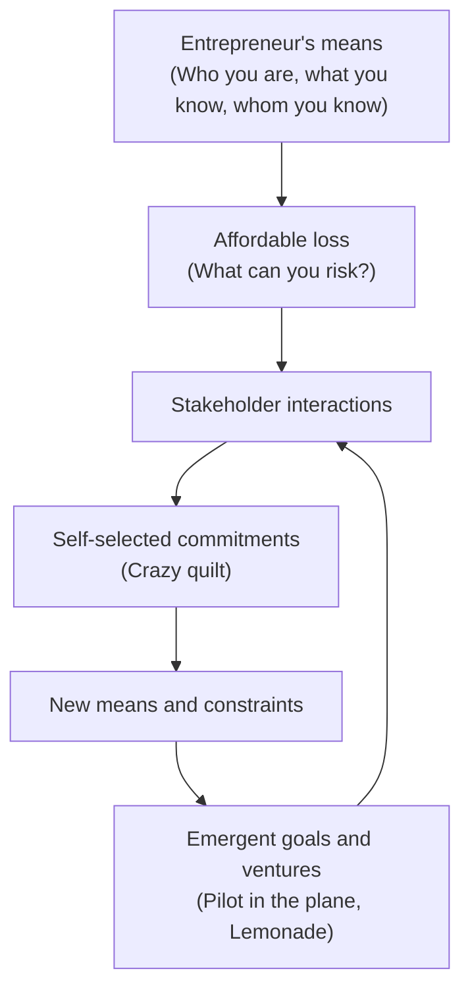

https://www.amazon.com/Effectuation-Elements-Entrepreneurial-Expertise-Entrepreneurship/dp/1839102594?sr=8-1

# Defining and Describing Effectuation

_Entrepreneurial **effectuation** is a way of creating the future by starting from who you are and what you have, rather than predicting what will happen and then planning backward._

In entrepreneurship and innovation studies, **effectuation** is a theory of decision-making under uncertainty developed by Saras D. Sarasvathy to explain how expert entrepreneurs create new firms, markets, and products when the future is fundamentally unknowable. It contrasts with more traditional **causation** or predictive logics that begin from a given goal and focus on planning and market research. Effectuation matters because it offers a practical toolkit for founders, intrapreneurs, and innovators to act in high-uncertainty environments—such as startups, new markets, and technological discontinuities—where reliable forecasts and optimized business plans are not feasible.

At its core, Sarasvathy distilled effectuation into five interrelated principles describing how expert entrepreneurs think and act in such settings:

- **Bird-in-hand**: Start with your **means**—*who you are, what you know, and whom you know*—rather than waiting for the “perfect” opportunity.  
- **Affordable loss**: Decide based on what you can **afford to lose**, not expected returns, limiting downside instead of optimizing upside.  
- **Crazy quilt**: Form partnerships and stakeholder commitments early, creating a patchwork (“quilt”) of self-selected stakeholders who co-create the venture.  
- **Lemonade**: Embrace surprises and contingencies as inputs to be leveraged (“make lemonade out of lemons”), not as deviations from plan.  
- **Pilot-in-the-plane**: Focus on controllable actions and stakeholder commitments; the future is **made** rather than **predicted**, so the entrepreneur acts as the “pilot in the plane” instead of a passenger.

These principles together define **effectual logic**—a way of reasoning that starts from means and control, iterates through stakeholder interaction, and *allows goals themselves to emerge over time*.

Effectuation is conceptually distinct from the more generic verb “to effectuate” (to bring about or put into effect), which appears in legal, policy, and administrative contexts; Sarasvathy’s theory borrows the same linguistic root but denotes a specific **entrepreneurial decision-making framework**.[4][5]

# Uses in Context

- In entrepreneurship research and education, **effectuation** is invoked as a central alternative to predictive planning; Sarasvathy describes it as a logic in which “*control over the future is possible through non-predictive strategies*.”  
- Founders and innovation practitioners use the term to describe **acting with limited resources**, emphasizing starting from means and affordable loss: one summary notes that effectuation “*begins with a given set of means and focuses on selecting between possible effects that can be created with that set of means*.”  
- In corporate innovation and design thinking circles, effectuation is cited to legitimize **iterative, stakeholder-driven experimentation** and partnership-building, using phrases like “*effectual reasoning processes used by expert entrepreneurs*” to frame non-linear innovation practices.  
- Policy and entrepreneurship-support programs reference effectuation when designing training for **nascent entrepreneurs**, contrasting it with traditional business-plan competitions and teaching “*effectual principles such as affordable loss and strategic partnerships*.”  
- Outside the entrepreneurial-theory sense, the broader verb “effectuating” appears in domains such as **crypto-asset regulation** and financial services—e.g., the OECD defines a “Reporting Crypto-Asset Service Provider” as an entity that “*provides a service effectuating Exchange Transactions for or on behalf of customers*,” illustrating the everyday legal-administrative use of the root term.[4]  

# History of Use

## Origins

- The entrepreneurial concept of **Effectuation** was first articulated systematically by **Saras D. Sarasvathy** in her 2001 doctoral dissertation at Carnegie Mellon University, later summarized in the widely cited paper “Causation and Effectuation: Toward a Theoretical Shift from Economic Inevitability to Entrepreneurial Contingency.”  
- In that work, Sarasvathy contrasted **causation**, which “*takes a particular effect as given and focuses on selecting between means to create that effect*,” with **effectuation**, which “*takes a set of means as given and focuses on selecting between possible effects that can be created with that set of means*.”  
- She empirically grounded the theory using **think-aloud protocols** with expert entrepreneurs, analyzing how they made decisions in simulated startup problems under high uncertainty and finding that they predominantly used effectual rather than causal logic.  
- Sarasvathy later popularized the concept beyond academia with the book *Effectuation: Elements of Entrepreneurial Expertise* (Edward Elgar, 2008), which elaborated the five principles and framed effectuation as a generalizable logic of action under uncertainty.  

## Evolution

- **2001–2008 – Foundational formulation**: Publication of the causation vs. effectuation article and the 2008 book established effectuation as a distinct theoretical lens in entrepreneurship research, introducing the five core principles as elements of entrepreneurial expertise.  
- **2010s – Empirical expansion and pedagogy**: During the 2010s, researchers tested and extended effectuation across contexts (nascent entrepreneurs, corporate entrepreneurship, social entrepreneurship) and geographies, while business schools and entrepreneurship programs incorporated effectuation into curricula, using it to design experiential courses and venture labs.  
- **Late 2010s–2020s – Integration and critique**: More recent work has integrated effectuation with lean startup, design thinking, and bricolage, and examined its boundary conditions, asking when effectual vs. causal logic is more effective and exploring hybrid “effectual-causal” strategies in practice.  

# Best Real-World Examples

- **[Effectuation.org](https://www.effectuation.org)** – The official hub created around Sarasvathy’s work, providing resources, case examples, teaching materials, and practitioner stories illustrating effectual principles in action.  
- **[Nexea Entrepreneur Programs](https://www.nexea.co)** – A startup accelerator and education provider that explicitly teaches effectuation, emphasizing starting with means, affordable loss, and co-creating ventures with stakeholders in early-stage startups.  
- **[Darden School of Business Entrepreneurship Courses](https://www.darden.virginia.edu)** – University of Virginia’s Darden School, where Sarasvathy teaches, uses effectuation in its entrepreneurship curriculum and executive education, making it a reference point for pedagogy based on effectual logic.  
- **[Lean Startup Circle–style early-stage ventures](https://en.wikipedia.org/wiki/Lean_startup)** – Many early-stage software and tech startups adopt effectual-like behaviors (affordable loss experiments, stakeholder co-creation) even when framed as “lean startup,” exemplifying effectuation’s logic in practice.  
- **[Social enterprise incubators such as UnLtd](https://www.unltd.org.uk)** – Social entrepreneurship programs often stress working with existing community assets and partners, mirroring bird-in-hand and crazy-quilt principles in resource-constrained social ventures.  
- **[Design thinking–based innovation labs](https://en.wikipedia.org/wiki/Design_thinking)** – Corporate and public-sector innovation labs that emphasize iterative prototyping, stakeholder engagement, and leveraging emergent insights illustrate effectual reasoning in non-startup contexts.  

# Case Studies

## Case Study 1: Expert Entrepreneurs in Sarasvathy’s Decision Experiments

Sarasvathy’s foundational empirical work used **think-aloud experiments** with expert founders to reveal effectuation in action. She recruited experienced entrepreneurs (with multiple ventures, including successes and failures) and asked them to work through a 17-page problem set describing an unstructured new-market opportunity (for example, launching a hypothetical product in an unfamiliar market), verbalizing their reasoning while making decisions about what to do. Rather than first trying to predict market size, write a detailed plan, or optimize an expected-return calculation, these entrepreneurs repeatedly **started from their existing means**—their own skills, prior knowledge, and contacts—and asked whom they could talk to, what partnerships they could form, and what small, affordable-loss steps they could take next. They embraced surprises in the scenarios, reframed constraints as opportunities, and allowed potential goals to evolve as they imagined interacting with stakeholders, exemplifying all five effectual principles. This study showed that even highly successful entrepreneurs often do *not* rely on predictive planning in nascent, uncertain contexts; instead, they use effectual logic to co-create both ventures and markets with others.  

## Case Study 2: Teaching Nascent Founders to Start from Means

Entrepreneurship educators have applied effectuation to reshape how **nascent entrepreneurs** are trained, shifting away from business-plan-centric models. In effectuation-based courses and accelerator programs, participants are asked to inventory their **bird-in-hand means** (who they are, what they know, whom they know) and to design small experiments they can pursue using only those means and what they can afford to lose, rather than writing speculative five-year financial projections. Programs inspired by Sarasvathy’s work report that this approach helps founders move from analysis paralysis to action, because they no longer need “permission” in the form of a polished plan or large investments; instead, they begin by talking to potential partners and customers, forming a “crazy quilt” of stakeholders who shape the evolving venture. By treating surprises—such as unexpected customer feedback or partner interest—as “lemons” to turn into “lemonade,” participants learn to reframe setbacks as new possibilities, embodying the lemonade principle. These educational implementations illustrate how effectuation can be translated into concrete pedagogical practices that change how entrepreneurs behave in the earliest, most uncertain stages of venture creation.  

## Case Study 3: Effectual Logic in Social Entrepreneurship

Social entrepreneurs often operate in **resource-constrained, uncertain environments**, which makes effectuation a natural fit for their work. Case studies in social enterprise programs show founders starting from existing community relationships and local knowledge (bird-in-hand), committing only resources they can afford to lose (affordable loss), and building coalitions of NGOs, local governments, and citizen groups that collectively co-create the intervention (crazy quilt). As projects unfold, unexpected events—policy changes, donor shifts, or community crises—are treated as opportunities to reconfigure programs rather than reasons to abandon them, reflecting the lemonade principle. Because many social problems lack clear, stable market structures, these entrepreneurs cannot rely on predictive models or conventional business plans; instead, they act as “pilots in the plane,” focusing on what they and their stakeholders can control and iteratively shaping new forms of value and organization. This pattern underscores that effectuation is not limited to high-growth tech startups but is a general logic of action under uncertainty that applies across commercial and social domains.

***

# Sources

[1]: [[PDF] Coverage: Effectuations, Reporting Changes, and Ending Enrollment](https://www.cms.gov/marketplace/eligibility-enrollment-resources/coverage-effectuation-webinar)
[2]: [FAQs 1226 - 1235 - Office of Foreign Assets Control](https://ofac.treasury.gov/faqs/added/2026-02-06)
[3]: [[PDF] WEST VIRGINIA CODE CHAPTER 33 ARTICLE 51 - WV Legislature](https://code.wvlegislature.gov/pdf/33-51/)
[4]: [[PDF] FAQs: Crypto-Asset Reporting Framework (CARF) - OECD](https://www.oecd.org/content/dam/oecd/en/topics/policy-issues/tax-transparency-and-international-co-operation/faqs-crypto-asset-reporting-framework.pdf)
[5]: [Title 30-A, §5158: Powers and duties generally - Maine Legislature](https://legislature.maine.gov/statutes/30-a/title30-Asec5158.html)
[6]: [CMS Issues Final Guidance on IPAY 2028 Drug Price Negotiation ...](https://www.hoganlovells.com/en/publications/cms-issues-final-guidance-on-ipay-2028-drug-price-negotiation-program-202628-mfp-effectuation)
[7]: [340B Drug Pricing Program - HRSA](https://www.hrsa.gov/opa)
[8]: [Operational and Policy Considerations in the Effectuation of ...](https://schaeffer.usc.edu/research/medicare-drug-prices-mfp-effectuation/)
