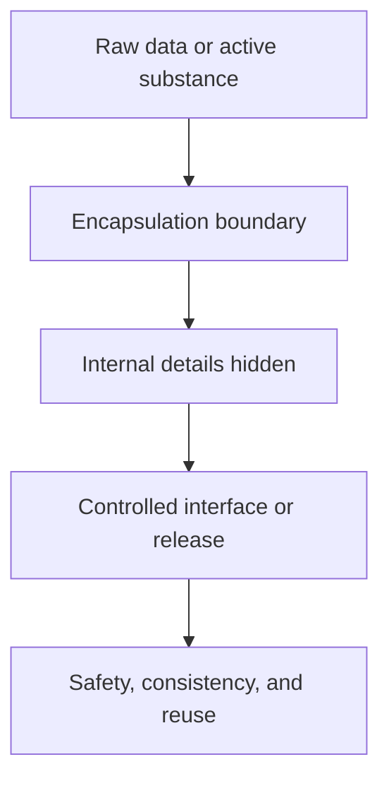

# Defining and Describing Encapsulation

_Encapsulation is about wrapping something valuable in a protective shell so others can use it without poking directly at its guts._  

In technology and science, **encapsulation** most commonly refers to the practice of **bundling data together with the operations that act on it, while restricting direct access to that data**. [^00parp] [^s7c9jx] [^0tygsj] In object‑oriented software, this means hiding an object’s internal state and forcing all interaction through well‑defined methods, which improves safety and maintainability. [^00parp] [^s7c9jx] [^0tygsj] In fields like food, pharma, and cosmetics, encapsulation means physically enclosing active ingredients in a carrier or coating to protect them, control their release, or mask undesirable properties. [^53cll8] Across domains, the core idea is the same: a boundary that protects internals, exposes a controlled interface, and enables more reliable behavior.

---

## Uses in Context

- In **object‑oriented design**, encapsulation is defined as *“the practice of grouping data (variables) and behavior (methods) into a single unit (class or object) and controlling access to that data”*. [^0tygsj] This is often called **data hiding**, because internal details are kept private. [^00parp] [^s7c9jx] [^0tygsj]  
- In **Java programming**, encapsulation is described as a principle that *“binds data and methods into a single unit, typically a class”* and *“restricts direct access to data by hiding implementation details”*, achieved with private fields and public getters/setters. [^s7c9jx]  
- In **data modeling**, encapsulation *“restricts direct access to an object's internal data, requiring interactions through well-defined methods only”*, which *“helps protect sensitive data from being altered unintentionally and ensures consistent behavior across systems.”*[^00parp]  
- In **microencapsulation for food, cosmetic, and pharma**, encapsulation is defined as enclosing active ingredients in a barrier material so they can be protected, have off‑flavors masked, or be released in a controlled way; microencapsulation is explicitly described as a technique that *“protects active compounds”* and *“controls their release”*. [^53cll8]  
- In **backend application architecture** (for example, Spring Boot projects), practitioners talk about encapsulation in *entity classes, DTOs, and service layers* as a way to keep invariants inside each layer and expose only necessary operations, improving maintainability and testability. [^eqd9if]  

---

## History of Use

### Origins

- The *software* meaning of encapsulation emerged with early **[[Vocabulary/Object‑Oriented Orogramming]]** research in the 1960s–1970s, especially around languages like Simula and Smalltalk, which introduced the idea of objects that combine state and behavior with controlled access; later textbooks and standards codified encapsulation as one of the four core OO principles (with inheritance, polymorphism, and abstraction). [^0tygsj]  
- In contemporary descriptions of object‑oriented design, resources such as AlgoMaster describe encapsulation as *“one of the four foundational principles of object-oriented design”* focused on grouping data and behavior and controlling access; this reflects the mainstream OOP view that matured through academic and industry literature in the 1980s–1990s. [^0tygsj]  
- In **microencapsulation**, industrial and research practice in food, cosmetics, and pharmaceuticals defined encapsulation as surrounding a “core” active ingredient with a coating or matrix; organizations working in applied research for these sectors describe encapsulation as a technique to protect and control the delivery of actives, particularly in response to stability and release challenges in processed foods and formulations. [^53cll8]  

### Evolution

- **1980s–1990s – Formalizing encapsulation in OO languages.** As languages like C++ and later Java became dominant, encapsulation was encoded directly in language features such as `private`, `protected`, and `public` access modifiers, and described in teaching materials as a way to hide implementation details and enforce invariants. [^s7c9jx] [^0tygsj]  
- **2000s–2010s – Encapsulation in layered architectures and data models.** With widespread use of multi‑tier applications and complex data pipelines, encapsulation principles were extended from individual objects to service layers, domain models, and data modeling patterns that *“enforce strict boundaries between data and access logic”* and *“ensure consistent behavior across systems.”*[^00parp] [^eqd9if]  
- **2000s onward – Expanding technical encapsulation in microencapsulation.** In applied sciences, encapsulation techniques diversified—spray‑drying, coacervation, liposomes, and other microencapsulation approaches—to address specific needs like flavor masking, controlled release, and enhanced stability in food, cosmetic, and pharma products, with encapsulation framed as a key innovation driver in those industries. [^53cll8]  

---

## Best Real-World Examples

- **[AlgoMaster LLD Encapsulation tutorial](https://algomaster.io/learn/lld/encapsulation)** – An independent low‑level design resource that teaches encapsulation as a foundational OO principle with practical class and method design examples. [^0tygsj]  
- **[GeeksforGeeks “Encapsulation in Java” guide](https://www.geeksforgeeks.org/java/encapsulation-in-java/)** – A widely used educational article demonstrating Java encapsulation using private fields and public getters/setters, emphasizing data security and maintainability. [^s7c9jx]  
- **[OWOX data modeling glossary on encapsulation](https://www.owox.com/glossary/encapsulation-in-data-modeling)** – A data‑analytics‑oriented explanation showing how encapsulation is applied in object‑oriented data models to protect sensitive data and standardize access in analytics systems. [^00parp]  
- **[Ainia’s “Definition for Encapsulation: Encapsulation vs Microencapsulation”](https://www.ainia.com/en/ainia-news/definition-for-encapsulation-what-is-microencapsulation-used-for/)** – An applied research example explaining how encapsulation and microencapsulation are used in food, cosmetics, and pharma to protect actives and control release. [^53cll8]  
- **[Spring Boot encapsulation explainer on YouTube](https://www.youtube.com/shorts/RvAHGKX6MeY)** – A practitioner video describing how encapsulation is used in real backend projects for entities, DTOs, and services to keep business rules and data consistent. [^eqd9if]  

---

## Case Studies

### 1. Encapsulation in Java: Educational Patterns that Shape Everyday Code

In Java education and professional practice, encapsulation is often introduced through a simple pattern: declare class fields as `private` and provide `public` getter and setter methods to access them. [^s7c9jx] Tutorials emphasize that encapsulation *“restricts direct access to data by hiding implementation details”* and that access modifiers are central: **private data members** combined with **public methods**. [^s7c9jx] This pattern lets developers validate or transform inputs in setters before changing the internal state, which improves data integrity and security in real applications. [^s7c9jx] Over time, these conventions have shaped how millions of Java developers design business entities and domain models, reinforcing encapsulation as a default design habit rather than an optional abstraction. [^s7c9jx] [^eqd9if]  

### 2. Encapsulation in Data Modeling for Analytics Platforms

In analytics and data‑driven systems, encapsulation has been adopted within **object‑oriented data models** to protect sensitive fields and keep behavior consistent across services. [^00parp] OWOX describes encapsulation in data modeling as a principle that *“restricts direct access to an object's internal data, requiring interactions through well-defined methods only,”* which *“helps protect sensitive data from being altered unintentionally and ensures consistent behavior across systems.”*[^00parp] For example, instead of allowing every part of a reporting system to modify user or transaction records directly, a data model might expose controlled operations (like `addTransaction` or `anonymizeUser`) that encapsulate validation and logging rules. [^00parp] This case shows how encapsulation moves beyond programming language theory into concrete data‑governance practices, helping analytics teams reduce errors and maintain consistent logic as systems evolve. [^00parp]  

### 3. Microencapsulation in Food, Cosmetic, and Pharma Innovation

In applied research labs serving **food, cosmetic, and pharmaceutical** industries, encapsulation is used physically rather than just logically: active compounds are enclosed in coatings or matrices that shield them from the environment. [^53cll8] Ainia explains that encapsulation and microencapsulation are used to *“protect active compounds”*, *“improve stability”*, and *“control their release”* in products such as functional foods or cosmetic formulations. [^53cll8] For instance, a heat‑sensitive vitamin can be encapsulated to survive processing and be released later in the digestive tract, or a strong‑tasting ingredient can be encapsulated to mask flavor until use. [^53cll8] This case demonstrates the same conceptual core—protection and controlled interaction—but applied to physical materials, showing how the encapsulation idea travels across domains while preserving its essential logic. [^53cll8]

***

# Sources

[^00parp]: [Encapsulation in Data Modeling — Concept & Use | OWOX](https://www.owox.com/glossary/encapsulation-in-data-modeling)
[^s7c9jx]: [Encapsulation in Java - GeeksforGeeks](https://www.geeksforgeeks.org/java/encapsulation-in-java/)
[^eqd9if]: [Where Encapsulation is Used in Real Spring Boot Projects - YouTube](https://www.youtube.com/shorts/RvAHGKX6MeY)
[^0tygsj]: [Encapsulation | LLD - AlgoMaster.io](https://algomaster.io/learn/lld/encapsulation)
[^53cll8]: [Definition for Encapsulation: Encapsulation vs Microencapsulation](https://www.ainia.com/en/ainia-news/definition-for-encapsulation-what-is-microencapsulation-used-for/)
