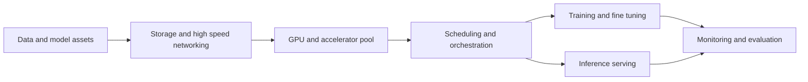

[[Tooling/AI-Toolkit/AI Infrastructure/Vast.ai|Vast.ai]]
[[Tooling/Software Development/Cloud Infrastructure/Lambda Labs|Lambda Labs]]
[[Tooling/AI-Toolkit/AI Infrastructure/Modal|Modal]]
[[SiliconCloud]]
[[SiliconFlow]]

# Defining and Describing AI Cloud Infrastructure

- _AI cloud infrastructure is the specialized computing foundation that turns scarce accelerator capacity into usable AI services._
- It combines cloud compute, accelerators, high-speed networking, storage, orchestration, model-management tools, and observability for workloads across the AI lifecycle. [^jyilw5]
- The concept applies when organizations must train, fine-tune, evaluate, and serve models at scale rather than run isolated experiments on individual machines. [^jyilw5]
- Unlike general-purpose cloud infrastructure, AI cloud infrastructure is optimized for accelerator-intensive workloads, including distributed training and high-volume inference. [^9rshu6] [^5ksjlw]
- A contemporary implementation may use Kubernetes, Slurm, virtual machines, on-premises systems, or several clouds through a unified control plane. [^03gs7u] [^qdko53]

# Uses in Context

- In cloud-computing discussions, the term describes infrastructure purpose-built for **AI training and inference**, rather than generic virtual machines. [^9rshu6] [^5ksjlw]
- In platform engineering, it refers to a unified layer that provisions clusters, allocates accelerators, and manages workloads across Kubernetes, Slurm, virtual machines, and on-premises resources. [^03gs7u] [^qdko53]
- In operations, it describes an “[[content-areas/AI-Factories-Datacenters/Concepts/AI Factories|AI Factory]]”: a shared pool of GPUs used concurrently for fine-tuning, inference, evaluation, and other lifecycle stages. [^jyilw5]
- In startup and investor language, it often denotes an **AI infrastructure-as-a-service** provider offering on-demand access to high-end GPUs. [^5ksjlw]
- In production engineering, the phrase emphasizes the full lifecycle—from data preparation through training, fine-tuning, and high-volume inference—rather than model development alone. [^jyilw5]

# History of Use

## Origins

The search results do not establish a definitive first appearance of the exact phrase **“AI cloud infrastructure.”** They instead document the emergence of the underlying category: specialized cloud providers began offering infrastructure designed around GPU-intensive AI training and inference, while open-source tooling developed abstractions for operating heterogeneous accelerator fleets. [^jyilw5] [^5ksjlw]

- The modern category is associated with specialized providers, often called **neoclouds**, that emerged to supply GPUs and related resources for AI workloads. [^5ksjlw]
- Open-source and platform projects helped define the operational model: SkyPilot presents a unified interface across Kubernetes, Slurm, virtual machines, on-premises systems, and multiple clouds. [^qdko53]
- Kubernetes-based orchestration became a central implementation pattern for large AI clusters and shared accelerator pools. [^wce0hr] [^jyilw5]

## Evolution

- **Early cloud machine-learning platforms:** Managed services such as [[SageMaker]] consolidated model building, training, and deployment into a managed infrastructure workflow, making AI infrastructure accessible without operating every underlying system directly. [^vyhwv3]
- **Multi-cloud and heterogeneous infrastructure:** Platforms such as SkyPilot expanded the concept beyond a single provider by coordinating AI workloads across clouds, on-premises systems, Kubernetes, Slurm, and virtual machines. [^03gs7u] [^qdko53]
- **AI factories and neoclouds:** The category broadened into shared, lifecycle-wide accelerator infrastructure, with specialized providers offering on-demand GPU clusters and Kubernetes-based resource management for training and inference. [^jyilw5] [^5ksjlw]

# Best Real-World Examples

- [SkyPilot](https://skypilot.ai/) — an open platform for running the AI lifecycle across Kubernetes, Slurm, virtual machines, on-premises systems, and multiple clouds. [^qdko53]
- [CoreWeave](https://www.coreweave.com/) — [[Tooling/AI-Toolkit/AI Infrastructure/CoreWeave|CoreWeave]] — a specialized GPU cloud providing Kubernetes-native infrastructure for AI training and inference. [^aley6p]
- [Lambda](https://lambdal.com/) — a GPU-cloud provider emphasizing simplified provisioning, including interconnected “1-Click Clusters” for research teams and AI startups. [^aley6p]
- [GMI Cloud](https://www.gmicloud.ai/) — an AI infrastructure-as-a-service provider offering on-demand GPU clusters and a Kubernetes-based Cluster Engine. [^5ksjlw]
- [CNCF AI factory architecture](https://www.cncf.io/) — an operating model for sharing GPU pools across training, fine-tuning, evaluation, and inference workloads. [^jyilw5]
- [Kubernetes GPU orchestration](https://kubernetes.io/) — the orchestration pattern used for very large accelerator fleets and multi-tenant AI workloads. [^wce0hr] [^jyilw5]
- [AWS Trainium and Inferentia](https://aws.amazon.com/machine-learning/trainium/) — cloud accelerator infrastructure used for model training and inference, including Splash’s HummingLM workload. [^e0dhm8]

# Case Studies

**TwelveLabs.** TwelveLabs required infrastructure for the complete lifecycle of multimodal video models: training, inference over petabytes of video, and globally deployed customer services. [^9rshu6] Its Marengo and Pegasus models created simultaneous demands for intensive training and high-volume inference. [^9rshu6] The company consolidated model training, inference, and customer-facing services in a unified production environment on AWS. [^9rshu6] This illustrates how AI cloud infrastructure differs from a simple GPU rental: the infrastructure must connect data-intensive workloads, model operations, reliability, and user-facing serving in one system.

**Splash Music.** Splash migrated its HummingLM workload to AWS Trainium, an accelerator designed for training and inference. [^e0dhm8] The case study reports that the migration reduced training time and costs by 50%. [^e0dhm8] For inference, Splash deployed models from Amazon S3 onto EC2 Inf2 instances; AWS reports higher accelerator memory, throughput, and performance for that deployment. [^e0dhm8] The example shows the importance of matching infrastructure to workload phase: training and inference may require different accelerators and deployment patterns.

**China Merchants Bank.** China Merchants Bank built a unified Kubernetes control plane for nearly 10,000 heterogeneous accelerator cards, allowing training, fine-tuning, and online inference to share infrastructure. [^7revd7] Its architecture combined Kueue for training admission, KEDA and Prometheus for demand-based inference scaling, HAMi for fine-grained accelerator allocation, and Fluid for faster access to datasets, weights, and checkpoints. [^7revd7] The design demonstrates the operational challenge at the heart of AI cloud infrastructure: multiple teams and workload types must share expensive accelerators without allowing one workload to starve the others.

***

# Sources

[^e0dhm8]: [Reducing training time and costs by 50% using AWS Trainium with ...](https://aws.amazon.com/solutions/case-studies/splash-music-case-study/)
[^9rshu6]: [TwelveLabs Case Study](https://aws.amazon.com/solutions/case-studies/twelvelabs-case-study/)
[^vyhwv3]: [Forethought Technologies Case Study](https://aws.amazon.com/solutions/case-studies/forethought-technologies-case-study/?_sm_nck=1)
[4]: [GPU efficiency: which startup is ahead?](https://newmarketpitch.com/blogs/news/ai-infrastructure-gpu-efficiency-startup)
[5]: [AI-Native Startups Are Leaving Hyperscalers for ...](https://investors.digitalocean.com/news/news-details/2026/AI-Native-Startups-Are-Leaving-Hyperscalers-for-DigitalOceans-Agentic-Inference-Cloud/default.aspx)
[6]: [Best Kubernetes Tools for AI Cloud Providers](https://www.vcluster.com/blog/best-kubernetes-tools-ai-clouds)
[^wce0hr]: [Kubernetes for GPU Orchestration | Introl Blog](https://introl.com/blog/kubernetes-gpu-orchestration-multi-thousand-clusters)
[8]: [AI Infrastructure Costs and Predictability | Steve Bloemer posted on ...](https://www.linkedin.com/posts/steve-bloemer-71624b284_how-a-dedicated-gpu-server-helped-an-ai-startup-activity-7459624865893957632-50dE)
[^7revd7]: [China Merchants Bank Wins CNCF End User Case Study Contest ...](https://finance.yahoo.com/technology/ai/articles/china-merchants-bank-wins-cncf-010000869.html)
[10]: [10 AI Inference Platforms for Production Workloads in 2026](https://www.digitalocean.com/resources/articles/ai-inference-platforms)
[^03gs7u]: [SkyPilot Blog](https://skypilot.ai/case-studies)
[^jyilw5]: [Building an AI factory on Kubernetes | CNCF](https://www.cncf.io/blog/2026/08/27/building-an-ai-factory-on-kubernetes/)
[^5ksjlw]: [On-demand GPU infrastructure startup GMI Cloud raises ...](https://siliconangle.com/2026/09/30/on-demand-gpu-infrastructure-startup-gmi-cloud-raises-263m-to-fuel-global-expansion/)
[^qdko53]: [SkyPilot | The AI Compute Platform](https://skypilot.ai/)
[^aley6p]: [Top 7 Crusoe alternatives in 2026 | Blog - Northflank](https://northflank.com/blog/crusoe-alternatives)
