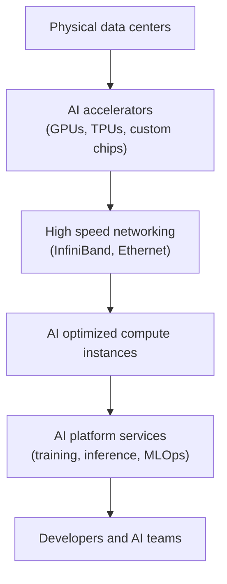

---
aliases:
  - GPU Cloud Provider
  - GP Cloud Providers
date_created: 2026-06-09
date_modified: 2026-06-09
tags: [AI-Compute-Cloud-Providers, AI-Toolkit, Agent-Cloud-Providers]
cf_last_run: "2026-06-09T01:12:08.331Z"
cf_last_run_model: "Perplexity sonar-pro"
site_uuid: f81208cb-92d9-4773-8651-61786f39983e
publish: true
title: "AI Compute Cloud Providers"
slug: ai-compute-cloud-providers
at_semantic_version: 0.0.1.1
---

# Defining and Describing AI Compute Cloud Providers

_An AI compute cloud provider is any cloud platform that rents out large-scale GPU and accelerator infrastructure specifically optimized for training and running AI models, instead of expecting organizations to buy and operate that hardware themselves. [^1p6qsx] [^edn7y6] [^ald7vp]_

In practice, **AI compute cloud providers** are public or managed cloud services that expose clusters of GPUs, TPUs, and other accelerators, along with networking, storage, and AI tooling, as on‑demand infrastructure for machine learning training and inference. [^1p6qsx] [^edn7y6] [^ald7vp] They matter because state‑of‑the‑art AI—especially large language models and generative models—requires enormous parallel compute capacity, specialized chips (e.g., NVIDIA H100/H200, AMD Instinct, Google TPU), and high‑bandwidth interconnects that are too capital‑intensive for most organizations to build and operate alone. [^w5zz1d] [^1p6qsx] [^edn7y6] The category spans hyperscalers that have rebuilt core cloud platforms around “AI‑native” workloads, as well as newer GPU‑cloud startups offering lower‑cost, more flexible, or less vendor‑locked alternatives. [^xo19kf] [^xgx2de] [^lv3c8i] [^edn7y6]

# Uses in Context

- Industry articles describe “**AI cloud providers**” as vendors that bundle GPU compute, storage, and higher‑level AI services to “build, train, and deploy machine learning models in the cloud,” including both [[Hyperscale Cloud Providers|Hyperscalers]] and specialized [[Vocabulary/Graphics Processing Units|GPU]] clouds. [^xo19kf] [^lv3c8i] [^q95m4g] [^ald7vp]  
- Developer‑focused lists talk about “**leading AI cloud providers for developers**” as platforms offering APIs and managed infrastructure for “LLM inference, fine‑tuning, and model hosting” on pay‑as‑you‑go terms. [^lv3c8i] [^edn7y6] [^ald7vp]  
- GPU‑centric vendors describe themselves as “**the essential cloud for AI**,” emphasizing large GPU clusters, fast spin‑up times, and “industry‑leading performance and efficiency” for training and inference workloads. [^1p6qsx] [^edn7y6]  
- Commentary on the “AI native cloud trap” uses the term to highlight how major cloud platforms are “being redesigned from the ground up around generative AI workloads,” prioritizing GPUs, proprietary models, and integrated AI services over generic compute. [^xgx2de]  
- Policy and governance research refers to “AI compute data centres” and “cloud providers” when analyzing national “compute sovereignty,” i.e., which countries and companies control the physical AI compute infrastructure that powers cloud AI platforms. [^w5zz1d]  

# History of Use

## Origins

- The underlying idea of renting remote compute for AI traces back to early *cloud computing* and *utility computing* research in the 2000s and the emergence of “infrastructure as a service” (IaaS), which allowed researchers to offload machine learning workloads to public clouds. [^q95m4g] [^ald7vp]  
- As GPU‑accelerated deep learning took off in the 2010s, cloud platforms began exposing GPU instances that could be rented by the hour, effectively becoming early **AI compute clouds** even if that specific label was not yet standardized. [^q95m4g] [^ald7vp]  
- The specific phrase “AI cloud computing” and “AI cloud providers” appears in industry guides and vendor material describing “artificial intelligence powered by the cloud’s limitless storage and processing resources” and listing “top AI cloud providers” offering GPU‑backed services. [^lv3c8i] [^q95m4g] [^ald7vp]  

Because this is an industry term rather than a formal academic concept, it appears to have crystallized gradually across blogs, vendor documentation, and analyst lists rather than debuting in a single canonical paper or book. [^lv3c8i] [^q95m4g] [^ald7vp]

## Evolution

- **2010s – General [[Vocabulary/Cloud Infrastructure|Cloud Infrastructure]] with optional GPUs:** Public cloud platforms primarily sold generic compute, storage, and databases, with GPUs added as specialized instance types that AI teams could rent for training or inference. [^q95m4g] [^ald7vp]  
- **Late 2010s–early 2020s – AI platforms on top of compute:** Managed machine learning and MLOps services (e.g., model training, deployment, monitoring) emerged on top of GPU infrastructure, making AI‑specific cloud offerings a distinct category in analyst reports and vendor positioning. [^xo19kf] [^lv3c8i] [^q95m4g] [^ald7vp]  
- **2023 onward – “AI‑native” and GPU‑first clouds:** Commentary notes that major clouds are “re‑engineering their platform to be an AI‑first platform,” with core services “rebuilt and extended to include deeply integrated AI capabilities” and massive capital expenditure on GPUs and AI accelerators; at the same time, specialized GPU‑cloud startups position themselves as lower‑lock‑in alternatives. [^xo19kf] [^xgx2de] [^w5zz1d] [^1p6qsx] [^lv3c8i] [^edn7y6]  

# Best Real-World Examples

- [CoreWeave](https://www.coreweave.com) — [[Tooling/AI-Toolkit/AI Infrastructure/CoreWeave|CoreWeave]] — Specialized “essential cloud for AI” offering large‑scale NVIDIA GPU clusters, fast inference spin‑up, and high “cluster goodput” for AI training and inference workloads. [^1p6qsx]  
- [RunPod](https://www.runpod.io) — [[Tooling/AI-Toolkit/AI Infrastructure/RunPod|RunPod]] — GPU cloud platform focused on developers, providing on‑demand and serverless GPU instances tailored for AI training, inference, and hosted endpoints. [^lv3c8i]  
- [Lambda Cloud](https://lambdalabs.com) — [[Tooling/Software Development/Cloud Infrastructure/Lambda Labs|Lambda Labs]] — GPU cloud from Lambda Labs, renting out NVIDIA GPU instances and clusters optimized for deep learning workloads such as LLM and vision model training. [^lv3c8i]  
- [GMI Cloud](https://www.gmicloud.ai) — GPU cloud provider offering on‑demand NVIDIA H100 and H200 instances for “high‑performance, scalable AI training and inference at the lowest cost.”[^edn7y6]  
- [Northflank](https://northflank.com) — Full‑stack platform that orchestrates GPU workloads, APIs, and multi‑service deployments for “production‑grade” AI applications, supporting bring‑your‑own‑cloud models. [^xo19kf]  
- [DigitalOcean](https://www.digitalocean.com) — [[Tooling/Software Development/Cloud Infrastructure/DigitalOcean|DigitalOcean]] — Developer‑focused cloud that now positions itself among “leading AI cloud providers,” offering AI‑ready infrastructure and integrations for model hosting and inference. [^lv3c8i]  
- [AWS (with SageMaker and Bedrock)](https://aws.amazon.com) — A major cloud adopter that has rebuilt large parts of its stack around AI, offering GPU instances and managed AI platforms (e.g., SageMaker, Bedrock) as part of its AI‑native cloud strategy. [^xo19kf] [^xgx2de] [^lv3c8i]  

# Case Studies

## CoreWeave: From Niche GPU Rentals to “Essential Cloud for AI”

CoreWeave started as a specialized infrastructure provider focused on GPU‑accelerated workloads, positioning itself explicitly as “the essential cloud for AI.”[^1p6qsx] Instead of offering a broad menu of generic compute services, it concentrated on large NVIDIA GPU clusters, high‑speed networking, and scheduling tuned for training and inference, advertising “10x faster inference spin‑up times” and “96% cluster goodput” for AI workloads. [^1p6qsx] This specialization allowed smaller AI startups and research teams to access dense GPU capacity that was either unavailable or more expensive on hyperscaler platforms, demonstrating how focused AI compute cloud providers can out‑compete larger adopters on performance, cost, or flexibility for specific AI use cases. [^1p6qsx] [^lv3c8i] [^edn7y6] The CoreWeave story illustrates how startups can lead in GPU‑first cloud design while larger clouds later adopt similar patterns.

## AI‑Native Cloud and Lock‑In: Hyperscalers Rebuild Around Generative AI

Industry analysis of the “AI native cloud trap” documents how major cloud platforms such as AWS, Azure, and Google Cloud are “being redesigned from the ground up around generative AI workloads, not just traditional applications and storage.”[^xgx2de] The commentary highlights that these providers are reporting “massive capital expenditures on GPUs and AI accelerators” in earnings calls, tying this spend directly to generative AI demand, and rebuilding core services, databases, and developer tools to include “deeply integrated AI capabilities by default.”[^xgx2de] As a result, organizations increasingly consume AI as part of tightly integrated stacks that bundle GPUs, proprietary models, vector databases, and MLOps, raising the risk of “AI platform lock in where your data, models, and tooling become so tightly coupled to one vendor that switching becomes nearly impossible.”[^xgx2de] This case shows how AI compute cloud providers at hyperscale use integrated AI services on top of compute to deepen dependency, contrasting with more modular, open‑stack GPU clouds.

## Compute Sovereignty and National Dependence on AI Clouds

Research on “AI compute sovereignty” or [[concepts/Explainers for AI/Sovereign AI|Sovereign AI]] examines how control over AI compute infrastructure is distributed across countries and cloud providers. [^w5zz1d] The study breaks sovereignty into three levels: “how much AI compute a country has on its territory,” “what is the nationality of the companies who own the AI compute data centres,” and “what is the nationality of the accelerator vendors whose chips power the AI compute data centres.”[^w5zz1d] It analyzes nine leading public cloud providers’ AI data centers and finds that possession of “compute sovereignty” varies significantly between countries, implying that many states depend on foreign cloud providers and chip vendors for the AI compute underlying their public and private AI services. [^w5zz1d] This case underscores that AI compute cloud providers are not only technical utilities but also strategic infrastructure whose ownership and geography shape national AI capabilities and policy debates.

***

# Sources

[^xo19kf]: [7 Best AI cloud providers for full-stack AI/ML apps | Blog - Northflank](https://northflank.com/blog/7-best-ai-cloud-providers)
[^xgx2de]: [The AI Native Cloud Trap: How AWS, Azure & Google Lock You In](https://www.youtube.com/watch?v=dchjvlxra50)
[^w5zz1d]: [AI Compute Sovereignty: Infrastructure Control Across Territories ...](https://papers.ssrn.com/sol3/papers.cfm?abstract_id=5312977)
[4]: [Top 10: AI Cloud Companies | Data Centre Magazine](https://datacentremagazine.com/top10/top-10-ai-cloud-companies)
[^1p6qsx]: [CoreWeave: The Essential Cloud for AI](https://www.coreweave.com)
[^lv3c8i]: [10 Leading AI Cloud Providers for Developers in 2026 - DigitalOcean](https://www.digitalocean.com/resources/articles/leading-ai-cloud-providers)
[^q95m4g]: [AI in Cloud Computing: How AI Is Revolutionizing the Landscape](https://www.akamai.com/blog/cloud/ai-cloud-computing-revolutionizing-landscape)
[^edn7y6]: [Top 10 GPU Cloud Providers for AI Workloads 2025](https://www.gmicloud.ai/en/blog/top-10-providers-for-ai-in-2026)
[^ald7vp]: [What Is AI Cloud Computing? A Beginner-Friendly Guide](https://tensorwave.com/blog/what-is-ai-cloud-computing)
